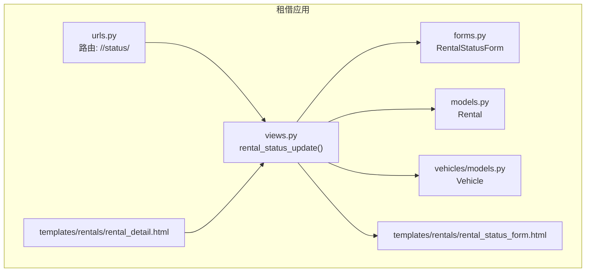
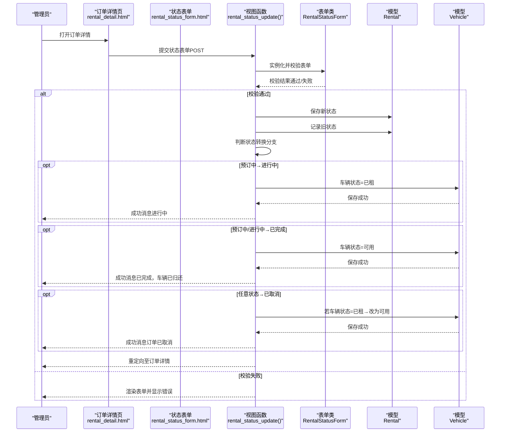
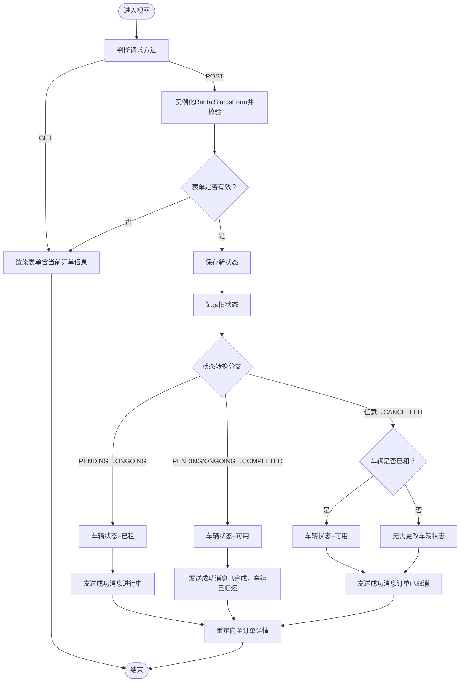
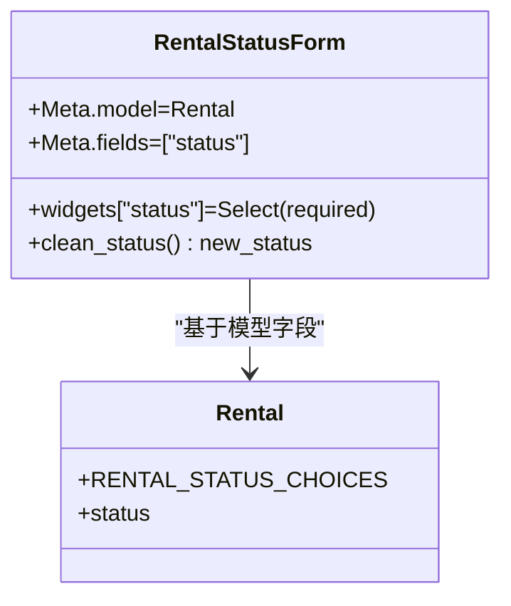
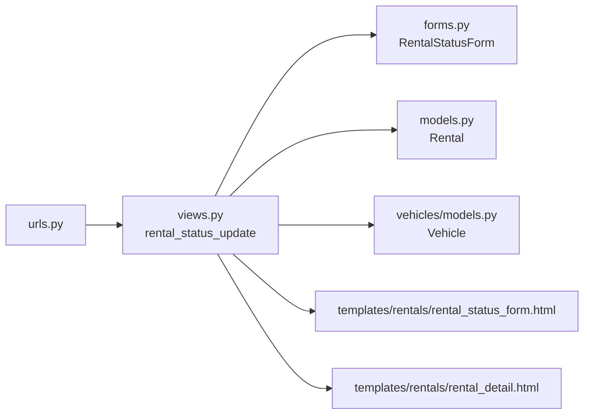

# 手动状态更新

<cite>
**本文引用的文件**
- [views.py](file://code/car_rental_system/rentals/views.py)
- [forms.py](file://code/car_rental_system/rentals/forms.py)
- [models.py](file://code/car_rental_system/rentals/models.py)
- [urls.py](file://code/car_rental_system/rentals/urls.py)
- [rental_status_form.html](file://code/car_rental_system/templates/rentals/rental_status_form.html)
- [rental_detail.html](file://code/car_rental_system/templates/rentals/rental_detail.html)
- [vehicles/models.py](file://code/car_rental_system/vehicles/models.py)
</cite>

## 目录
1. [简介](#简介)
2. [项目结构](#项目结构)
3. [核心组件](#核心组件)
4. [架构总览](#架构总览)
5. [组件详解](#组件详解)
6. [依赖关系分析](#依赖关系分析)
7. [性能考量](#性能考量)
8. [故障排查指南](#故障排查指南)
9. [结论](#结论)

## 简介
本文件围绕“手动状态更新”功能展开，系统性说明管理员如何通过 rental_status_update 视图函数接收并处理手动状态变更请求。内容涵盖：
- 视图如何处理 POST 请求、校验表单数据；
- 表单 RentalStatusForm 的状态转换规则与错误提示；
- 不同状态转换（预订中→进行中、进行中→已完成、任意状态→已取消）触发的业务逻辑与用户反馈；
- 前端模板渲染方式与用户体验设计。

## 项目结构
与“手动状态更新”直接相关的模块与文件如下：
- 视图层：rentals/views.py 中的 rental_status_update
- 表单层：rentals/forms.py 中的 RentalStatusForm
- 模型层：rentals/models.py 中的 Rental 状态常量与辅助方法；vehicles/models.py 中的 Vehicle 状态常量
- URL 映射：rentals/urls.py 中的 /<int:pk>/status/ 路由
- 模板层：templates/rentals/rental_status_form.html（独立表单页面）、templates/rentals/rental_detail.html（详情页内嵌表单）

图表来源
- [views.py](file://code/car_rental_system/rentals/views.py#L234-L276)
- [forms.py](file://code/car_rental_system/rentals/forms.py#L277-L309)
- [models.py](file://code/car_rental_system/rentals/models.py#L12-L19)
- [urls.py](file://code/car_rental_system/rentals/urls.py#L9-L17)
- [rental_status_form.html](file://code/car_rental_system/templates/rentals/rental_status_form.html#L1-L96)
- [rental_detail.html](file://code/car_rental_system/templates/rentals/rental_detail.html#L330-L346)
- [vehicles/models.py](file://code/car_rental_system/vehicles/models.py#L6-L12)

章节来源
- [views.py](file://code/car_rental_system/rentals/views.py#L234-L276)
- [forms.py](file://code/car_rental_system/rentals/forms.py#L277-L309)
- [models.py](file://code/car_rental_system/rentals/models.py#L12-L19)
- [urls.py](file://code/car_rental_system/rentals/urls.py#L9-L17)
- [rental_status_form.html](file://code/car_rental_system/templates/rentals/rental_status_form.html#L1-L96)
- [rental_detail.html](file://code/car_rental_system/templates/rentals/rental_detail.html#L330-L346)
- [vehicles/models.py](file://code/car_rental_system/vehicles/models.py#L6-L12)

## 核心组件
- 视图函数 rental_status_update：负责接收管理员提交的状态变更请求，校验表单，执行状态转换与联动业务（如更新车辆状态），并返回用户反馈。
- 表单类 RentalStatusForm：限制状态转换方向，提供清晰的错误提示。
- 模型 Rental：定义订单状态枚举与显示名称，提供自动状态更新能力。
- 模型 Vehicle：定义车辆状态枚举，与订单状态联动影响。
- URL 路由：将 /<int:pk>/status/ 映射到 rental_status_update。
- 模板 rental_status_form.html：独立表单页面，展示订单信息、当前状态与可选目标状态，并提供取消与提交按钮。
- 模板 rental_detail.html：在订单详情页内嵌一个状态表单，便于快速切换。

章节来源
- [views.py](file://code/car_rental_system/rentals/views.py#L234-L276)
- [forms.py](file://code/car_rental_system/rentals/forms.py#L277-L309)
- [models.py](file://code/car_rental_system/rentals/models.py#L12-L19)
- [vehicles/models.py](file://code/car_rental_system/vehicles/models.py#L6-L12)
- [urls.py](file://code/car_rental_system/rentals/urls.py#L9-L17)
- [rental_status_form.html](file://code/car_rental_system/templates/rentals/rental_status_form.html#L1-L96)
- [rental_detail.html](file://code/car_rental_system/templates/rentals/rental_detail.html#L330-L346)

## 架构总览
下面的序列图展示了管理员在订单详情页或独立表单页发起“手动状态更新”的完整流程。

图表来源
- [views.py](file://code/car_rental_system/rentals/views.py#L234-L276)
- [forms.py](file://code/car_rental_system/rentals/forms.py#L277-L309)
- [rental_status_form.html](file://code/car_rental_system/templates/rentals/rental_status_form.html#L34-L57)
- [rental_detail.html](file://code/car_rental_system/templates/rentals/rental_detail.html#L330-L346)
- [models.py](file://code/car_rental_system/rentals/models.py#L12-L19)
- [vehicles/models.py](file://code/car_rental_system/vehicles/models.py#L6-L12)

## 组件详解

### 视图函数：rental_status_update
职责与流程要点：
- 接收 GET/POST 请求，GET 时渲染表单；POST 时校验并保存。
- 使用事务包裹状态变更与车辆状态联动，保证一致性。
- 根据旧状态与新状态判断具体分支，分别更新车辆状态并发送用户反馈消息。
- 支持三种主要分支：
  - 预订中 → 进行中：将对应车辆状态置为“已租”，并提示“订单状态已更新为进行中”。
  - 预订中/进行中 → 已完成：将对应车辆状态置为“可用”，并提示“订单已完成，车辆已归还”。
  - 任意状态 → 已取消：若车辆处于“已租”，将其置为“可用”，并提示“订单已取消”。

图表来源
- [views.py](file://code/car_rental_system/rentals/views.py#L234-L276)

章节来源
- [views.py](file://code/car_rental_system/rentals/views.py#L234-L276)

### 表单类：RentalStatusForm
职责与规则要点：
- 字段仅包含 status，使用下拉选择控件，必填。
- clean_status 方法限制状态转换方向：
  - 预订中 → 只能转为“进行中”或“已取消”
  - 进行中 → 只能转为“已完成”或“已取消”
  - 已完成/已取消 → 不允许再转换
- 若非法转换，抛出验证错误，阻止保存。

图表来源
- [forms.py](file://code/car_rental_system/rentals/forms.py#L277-L309)
- [models.py](file://code/car_rental_system/rentals/models.py#L12-L19)

章节来源
- [forms.py](file://code/car_rental_system/rentals/forms.py#L277-L309)
- [models.py](file://code/car_rental_system/rentals/models.py#L12-L19)

### 模型：Rental 与 Vehicle
- Rental 定义订单状态枚举与显示名称，提供自动状态更新能力（如预订中→进行中、进行中→已超时未归还）。
- Vehicle 定义车辆状态枚举，与订单状态联动影响（如订单进行中时车辆应为“已租”，完成后应为“可用”）。

章节来源
- [models.py](file://code/car_rental_system/rentals/models.py#L12-L19)
- [vehicles/models.py](file://code/car_rental_system/vehicles/models.py#L6-L12)

### URL 与模板
- URL：/rentals/<int:pk>/status/ 映射到 rental_status_update，支持管理员在订单详情页或独立表单页发起状态变更。
- 模板 rental_status_form.html：独立页面，展示订单号、客户、车辆、当前状态，并提供状态选择与提交按钮。
- 模板 rental_detail.html：在详情页内嵌状态表单，便于快速切换。

章节来源
- [urls.py](file://code/car_rental_system/rentals/urls.py#L9-L17)
- [rental_status_form.html](file://code/car_rental_system/templates/rentals/rental_status_form.html#L1-L96)
- [rental_detail.html](file://code/car_rental_system/templates/rentals/rental_detail.html#L330-L346)

## 依赖关系分析
- 视图依赖表单类进行数据校验，依赖模型进行状态持久化，依赖车辆模型进行状态联动。
- URL 将前端请求路由到视图函数。
- 模板负责渲染表单与用户反馈，包含状态转换规则说明，提升易用性。

图表来源
- [urls.py](file://code/car_rental_system/rentals/urls.py#L9-L17)
- [views.py](file://code/car_rental_system/rentals/views.py#L234-L276)
- [forms.py](file://code/car_rental_system/rentals/forms.py#L277-L309)
- [models.py](file://code/car_rental_system/rentals/models.py#L12-L19)
- [vehicles/models.py](file://code/car_rental_system/vehicles/models.py#L6-L12)
- [rental_status_form.html](file://code/car_rental_system/templates/rentals/rental_status_form.html#L1-L96)
- [rental_detail.html](file://code/car_rental_system/templates/rentals/rental_detail.html#L330-L346)

章节来源
- [urls.py](file://code/car_rental_system/rentals/urls.py#L9-L17)
- [views.py](file://code/car_rental_system/rentals/views.py#L234-L276)
- [forms.py](file://code/car_rental_system/rentals/forms.py#L277-L309)
- [models.py](file://code/car_rental_system/rentals/models.py#L12-L19)
- [vehicles/models.py](file://code/car_rental_system/vehicles/models.py#L6-L12)
- [rental_status_form.html](file://code/car_rental_system/templates/rentals/rental_status_form.html#L1-L96)
- [rental_detail.html](file://code/car_rental_system/templates/rentals/rental_detail.html#L330-L346)

## 性能考量
- 视图使用事务包裹状态变更与车辆状态更新，确保原子性，避免并发场景下的不一致。
- 表单 clean_status 在数据库外进行转换规则校验，减少无效写入。
- 模板层仅渲染必要信息，无复杂计算，前端交互友好。

[本节为通用建议，不直接分析具体文件]

## 故障排查指南
- 表单校验失败
  - 现象：提交后返回表单并显示错误信息。
  - 可能原因：尝试进行非法状态转换（如已完成→预订中）。
  - 处理：根据错误提示选择合法的目标状态。
  - 参考路径：[forms.py](file://code/car_rental_system/rentals/forms.py#L290-L309)
- 无法更新车辆状态
  - 现象：订单状态已变，但车辆状态未同步。
  - 可能原因：事务异常或并发写入导致保存失败。
  - 处理：确认事务是否成功提交；检查车辆状态是否被其他流程覆盖。
  - 参考路径：[views.py](file://code/car_rental_system/rentals/views.py#L244-L266)
- 用户反馈消息缺失
  - 现象：提交后未看到成功提示。
  - 可能原因：消息中间件未配置或会话问题。
  - 处理：检查消息存储与前端展示逻辑。
  - 参考路径：[views.py](file://code/car_rental_system/rentals/views.py#L244-L266)

章节来源
- [forms.py](file://code/car_rental_system/rentals/forms.py#L290-L309)
- [views.py](file://code/car_rental_system/rentals/views.py#L244-L266)

## 结论
“手动状态更新”通过严格的表单校验与明确的状态转换规则，确保管理员能够安全、可控地变更订单状态。视图在事务中执行状态与车辆状态的联动更新，并通过用户反馈消息与模板说明提升操作透明度。前端模板提供了直观的状态转换规则提示，有助于降低误操作风险。