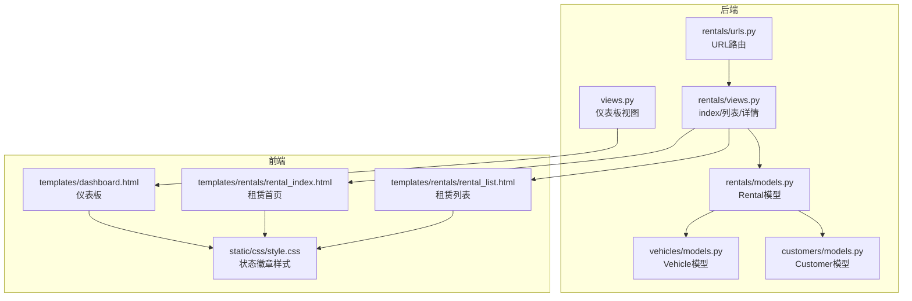
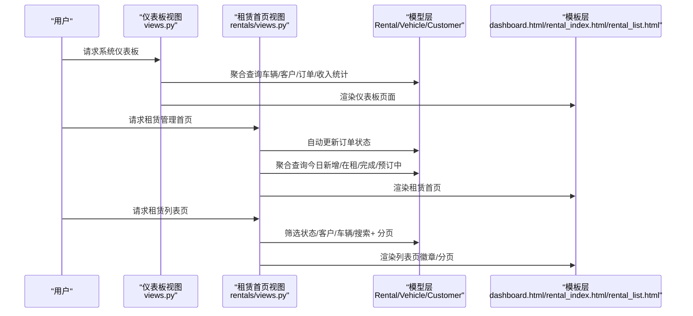
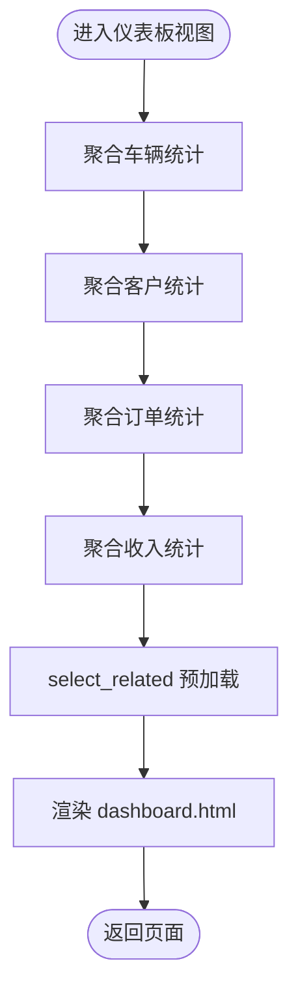
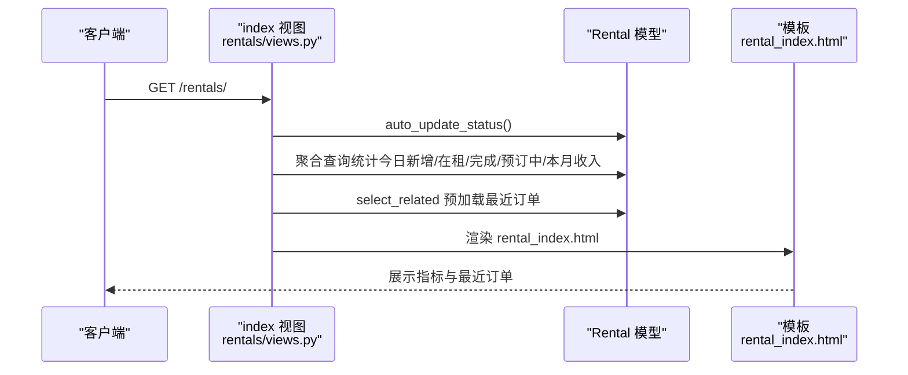
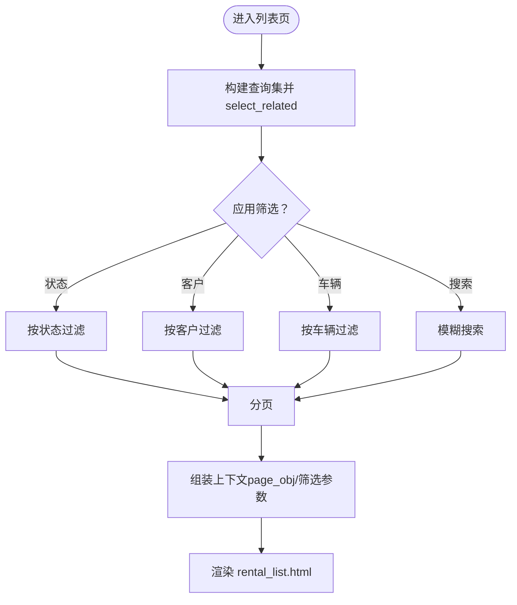
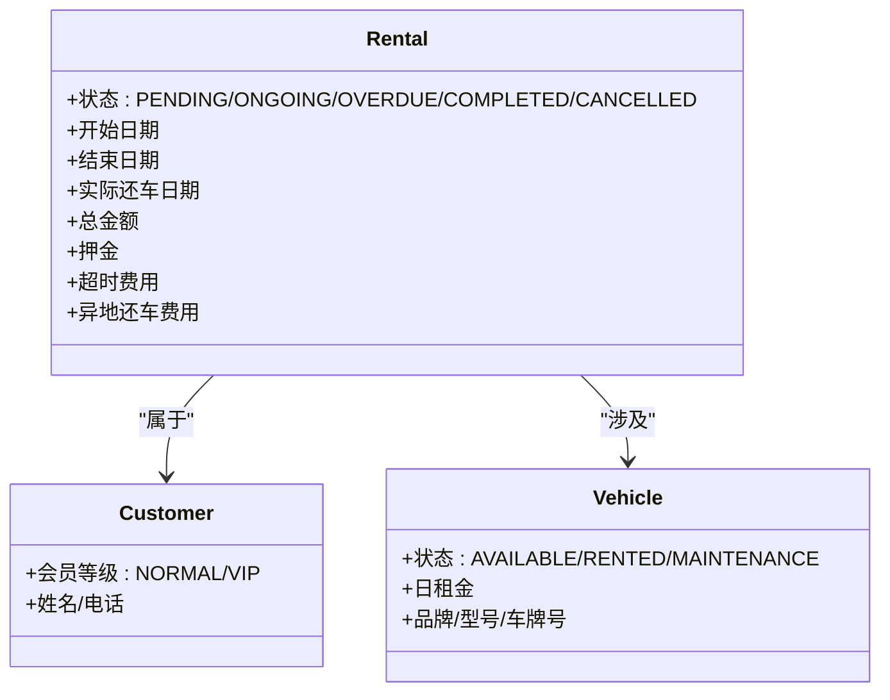
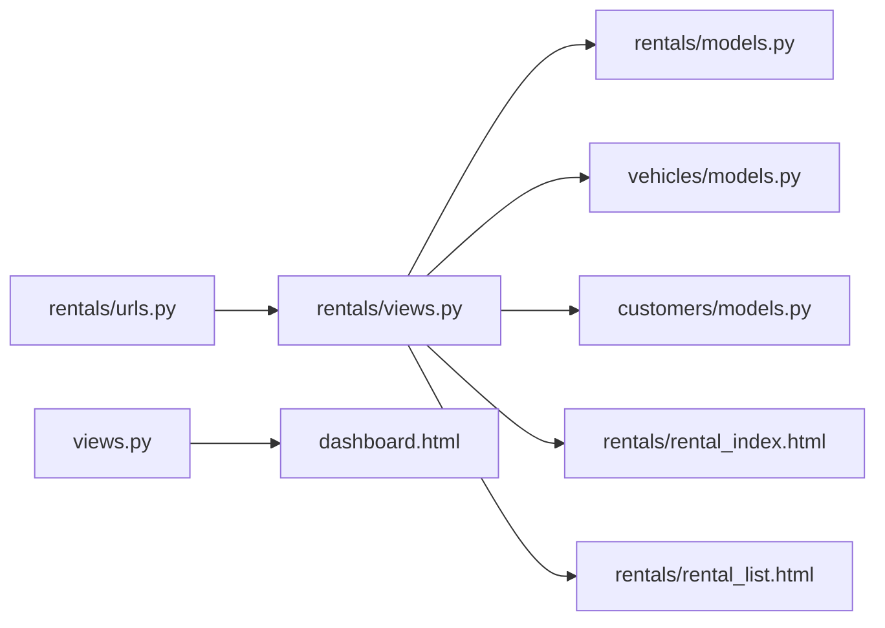

# 状态展示与统计

<cite>
**本文引用的文件**
- [views.py](file://code/car_rental_system/views.py)
- [dashboard.html](file://code/car_rental_system/templates/dashboard.html)
- [rentals/views.py](file://code/car_rental_system/rentals/views.py)
- [rentals/models.py](file://code/car_rental_system/rentals/models.py)
- [rentals/urls.py](file://code/car_rental_system/rentals/urls.py)
- [rentals/rental_list.html](file://code/car_rental_system/templates/rentals/rental_list.html)
- [rentals/rental_index.html](file://code/car_rental_system/templates/rentals/rental_index.html)
- [vehicles/models.py](file://code/car_rental_system/vehicles/models.py)
- [customers/models.py](file://code/car_rental_system/customers/models.py)
- [static/css/style.css](file://code/car_rental_system/static/css/style.css)
</cite>

## 目录
1. [简介](#简介)
2. [项目结构](#项目结构)
3. [核心组件](#核心组件)
4. [架构总览](#架构总览)
5. [详细组件分析](#详细组件分析)
6. [依赖关系分析](#依赖关系分析)
7. [性能考量](#性能考量)
8. [故障排查指南](#故障排查指南)
9. [结论](#结论)

## 简介
本文件聚焦“进行中订单”在系统各页面的展示逻辑，重点说明：
- index 视图如何通过聚合查询计算今日新增订单、在租车辆数量等关键指标；
- rental_list 视图的分页与筛选机制如何帮助管理员高效管理进行中订单；
- 前端模板如何可视化展示统计数据，包括使用徽章（badge）显示订单状态、时间线展示订单生命周期等 UI 设计；
- 数据查询的优化策略，如使用 select_related 减少数据库查询次数。

## 项目结构
围绕“状态展示与统计”的关键文件组织如下：
- 后端视图层：主页面仪表板与租赁管理首页、列表页
- 模型层：订单模型的状态枚举与自动状态更新
- 前端模板：仪表板、租赁首页、租赁列表页
- 样式层：状态徽章样式与通用布局

图表来源
- [views.py](file://code/car_rental_system/views.py#L21-L116)
- [rentals/views.py](file://code/car_rental_system/rentals/views.py#L17-L126)
- [rentals/models.py](file://code/car_rental_system/rentals/models.py#L12-L169)
- [vehicles/models.py](file://code/car_rental_system/vehicles/models.py#L1-L85)
- [customers/models.py](file://code/car_rental_system/customers/models.py#L1-L160)
- [rentals/urls.py](file://code/car_rental_system/rentals/urls.py#L1-L22)
- [dashboard.html](file://code/car_rental_system/templates/dashboard.html#L1-L336)
- [rentals/rental_index.html](file://code/car_rental_system/templates/rentals/rental_index.html#L1-L161)
- [rentals/rental_list.html](file://code/car_rental_system/templates/rentals/rental_list.html#L1-L247)
- [static/css/style.css](file://code/car_rental_system/static/css/style.css#L1-L200)

章节来源
- [views.py](file://code/car_rental_system/views.py#L21-L116)
- [rentals/views.py](file://code/car_rental_system/rentals/views.py#L17-L126)
- [rentals/models.py](file://code/car_rental_system/rentals/models.py#L12-L169)
- [rentals/urls.py](file://code/car_rental_system/rentals/urls.py#L1-L22)
- [dashboard.html](file://code/car_rental_system/templates/dashboard.html#L1-L336)
- [rentals/rental_index.html](file://code/car_rental_system/templates/rentals/rental_index.html#L1-L161)
- [rentals/rental_list.html](file://code/car_rental_system/templates/rentals/rental_list.html#L1-L247)
- [static/css/style.css](file://code/car_rental_system/static/css/style.css#L1-L200)

## 核心组件
- 仪表板视图（views.py）：聚合车辆、客户、订单、收入统计，最近订单与车辆状态概览，使用 select_related 避免 N+1 查询。
- 租赁首页视图（rentals/views.py）：自动更新订单状态，聚合今日新增、在租、完成、预订中等指标，最近订单。
- 租赁列表视图（rentals/views.py）：支持按状态、客户、车辆、关键词搜索的筛选；分页；筛选下拉框使用缓存优化。
- 前端模板：dashboard.html、rentals/rental_index.html、rentals/rental_list.html 使用徽章展示订单状态；dashboard.html 展示最近订单与车辆状态概览。
- 模型与索引：Rental/ Vehicle/ Customer 模型提供状态字段与索引，支持高效查询与自动状态更新。

章节来源
- [views.py](file://code/car_rental_system/views.py#L21-L116)
- [rentals/views.py](file://code/car_rental_system/rentals/views.py#L17-L126)
- [rentals/models.py](file://code/car_rental_system/rentals/models.py#L12-L169)
- [dashboard.html](file://code/car_rental_system/templates/dashboard.html#L1-L336)
- [rentals/rental_index.html](file://code/car_rental_system/templates/rentals/rental_index.html#L1-L161)
- [rentals/rental_list.html](file://code/car_rental_system/templates/rentals/rental_list.html#L1-L247)

## 架构总览
系统通过后端聚合查询与前端徽章展示相结合的方式，实现对“进行中订单”的高效统计与可视化呈现。

图表来源
- [views.py](file://code/car_rental_system/views.py#L21-L116)
- [rentals/views.py](file://code/car_rental_system/rentals/views.py#L17-L126)
- [dashboard.html](file://code/car_rental_system/templates/dashboard.html#L1-L336)
- [rentals/rental_index.html](file://code/car_rental_system/templates/rentals/rental_index.html#L1-L161)
- [rentals/rental_list.html](file://code/car_rental_system/templates/rentals/rental_list.html#L1-L247)

## 详细组件分析

### 仪表板视图（views.py）与 dashboard.html
- 关键指标聚合
  - 车辆统计：总数量、可用、在租、维修，使用聚合查询一次性返回。
  - 客户统计：总数量、普通、VIP，使用聚合查询一次性返回。
  - 订单统计：总数量、进行中（预订中+进行中）、完成、取消，使用聚合查询一次性返回。
  - 收入统计：总金额、本月、今日，基于完成状态订单聚合。
- 最近订单与车辆状态概览
  - 使用 select_related 预加载 customer 与 vehicle，避免 N+1 查询。
  - dashboard.html 使用徽章展示订单状态，使用“最近订单”表格与“车辆状态概览”表格直观呈现。
- 错误兜底
  - try/except 包裹，出现异常时返回空数据并渲染页面，保证稳定性。

图表来源
- [views.py](file://code/car_rental_system/views.py#L21-L116)
- [dashboard.html](file://code/car_rental_system/templates/dashboard.html#L1-L336)

章节来源
- [views.py](file://code/car_rental_system/views.py#L21-L116)
- [dashboard.html](file://code/car_rental_system/templates/dashboard.html#L1-L336)

### 租赁首页视图（rentals/views.py）与 rental_index.html
- 自动状态更新
  - 调用 Rental.auto_update_status()，将“预订中”激活为“进行中”，将“进行中”过期更新为“已超时未归还”，并缓存更新结果以降低频率。
- 指标聚合
  - total/pending/ongoing/completed/today，this_month_revenue 基于聚合查询一次性返回。
- 最近订单
  - 使用 select_related 预加载 customer 与 vehicle，限制最近订单数量。
- 前端展示
  - rental_index.html 使用卡片展示各类指标，徽章展示状态，最近订单列表采用简洁卡片布局。

图表来源
- [rentals/views.py](file://code/car_rental_system/rentals/views.py#L17-L58)
- [rentals/rental_index.html](file://code/car_rental_system/templates/rentals/rental_index.html#L1-L161)

章节来源
- [rentals/views.py](file://code/car_rental_system/rentals/views.py#L17-L58)
- [rentals/rental_index.html](file://code/car_rental_system/templates/rentals/rental_index.html#L1-L161)

### 租赁列表视图（rentals/views.py）与 rental_list.html
- 筛选机制
  - 状态筛选：PENDING/ONGOING/COMPLETED/CANCELLED。
  - 客户筛选：按客户 ID。
  - 车辆筛选：按车辆 ID。
  - 搜索：支持订单号、客户姓名、车牌号模糊搜索。
- 分页
  - 每页固定条目，按创建时间倒序，提供首页/上一页/下一页/末页导航。
- 性能优化
  - select_related 预加载 customer 与 vehicle。
  - 筛选下拉选项使用缓存（客户、车辆列表），避免每次请求重复查询。
- 前端展示
  - rental_list.html 使用徽章展示订单状态，包含“查看详情/编辑/归还/取消”等操作按钮，便于管理员快速处理进行中订单。

图表来源
- [rentals/views.py](file://code/car_rental_system/rentals/views.py#L61-L126)
- [rentals/rental_list.html](file://code/car_rental_system/templates/rentals/rental_list.html#L1-L247)

章节来源
- [rentals/views.py](file://code/car_rental_system/rentals/views.py#L61-L126)
- [rentals/rental_list.html](file://code/car_rental_system/templates/rentals/rental_list.html#L1-L247)

### 订单状态与生命周期可视化（UI 设计）
- 徽章（badge）展示
  - dashboard.html：最近订单表格中使用状态徽章展示“进行中/已超时未归还/已完成/已取消/预订中”等状态。
  - rental_index.html：卡片与最近订单列表中使用状态徽章展示“预订中/进行中/已完成/已取消”等状态。
  - rental_list.html：列表中使用徽章展示“预订中/进行中/已超时未归还/已完成/已取消”等状态。
- 时间线展示
  - dashboard.html 的“最近订单”表格与“车辆状态概览”表格，配合日期字段，形成订单生命周期的简单时间线视图（开始日期、结束日期、实际还车日期）。
- 状态样式
  - static/css/style.css 定义了状态徽章的颜色与样式，区分可用、在租、维修、成功、警告、危险、主要、次级等视觉语义。

图表来源
- [rentals/models.py](file://code/car_rental_system/rentals/models.py#L12-L169)
- [vehicles/models.py](file://code/car_rental_system/vehicles/models.py#L1-L85)
- [customers/models.py](file://code/car_rental_system/customers/models.py#L1-L160)

章节来源
- [dashboard.html](file://code/car_rental_system/templates/dashboard.html#L1-L336)
- [rentals/rental_index.html](file://code/car_rental_system/templates/rentals/rental_index.html#L1-L161)
- [rentals/rental_list.html](file://code/car_rental_system/templates/rentals/rental_list.html#L1-L247)
- [static/css/style.css](file://code/car_rental_system/static/css/style.css#L1-L200)

### 数据查询优化策略
- 使用 select_related
  - 仪表板与租赁首页/列表均使用 select_related 预加载外键对象，避免 N+1 查询，显著提升渲染性能。
- 使用聚合查询
  - 仪表板与租赁首页通过聚合查询一次性返回多类统计指标，减少多次数据库往返。
- 使用缓存
  - 租赁列表页对筛选下拉选项（客户、车辆）使用缓存，降低高频查询压力。
- 自动状态更新缓存
  - 租赁首页调用自动状态更新时使用缓存，避免频繁更新导致的性能问题。

章节来源
- [views.py](file://code/car_rental_system/views.py#L84-L90)
- [rentals/views.py](file://code/car_rental_system/rentals/views.py#L17-L58)
- [rentals/views.py](file://code/car_rental_system/rentals/views.py#L61-L126)
- [rentals/models.py](file://code/car_rental_system/rentals/models.py#L171-L229)

## 依赖关系分析
- 视图与模板
  - 仪表板视图渲染 dashboard.html；租赁首页视图渲染 rental_index.html；租赁列表视图渲染 rental_list.html。
- 视图与模型
  - 仪表板与租赁首页均依赖 Rental/Vehicle/Customer 模型进行聚合统计与预加载。
  - 租赁首页依赖 Rental.auto_update_status() 实现自动状态更新。
- URL 与路由
  - 租赁应用的 URL 路由映射到对应视图函数，支持 index/list/create/detail 等路径。

图表来源
- [rentals/urls.py](file://code/car_rental_system/rentals/urls.py#L1-L22)
- [views.py](file://code/car_rental_system/views.py#L21-L116)
- [rentals/views.py](file://code/car_rental_system/rentals/views.py#L17-L126)
- [rentals/models.py](file://code/car_rental_system/rentals/models.py#L12-L169)
- [vehicles/models.py](file://code/car_rental_system/vehicles/models.py#L1-L85)
- [customers/models.py](file://code/car_rental_system/customers/models.py#L1-L160)
- [dashboard.html](file://code/car_rental_system/templates/dashboard.html#L1-L336)
- [rentals/rental_index.html](file://code/car_rental_system/templates/rentals/rental_index.html#L1-L161)
- [rentals/rental_list.html](file://code/car_rental_system/templates/rentals/rental_list.html#L1-L247)

章节来源
- [rentals/urls.py](file://code/car_rental_system/rentals/urls.py#L1-L22)
- [views.py](file://code/car_rental_system/views.py#L21-L116)
- [rentals/views.py](file://code/car_rental_system/rentals/views.py#L17-L126)

## 性能考量
- 聚合查询：在仪表板与租赁首页使用聚合查询一次性返回多类统计指标，减少数据库往返。
- 预加载：使用 select_related 预加载外键对象，避免 N+1 查询。
- 缓存：对筛选下拉选项与自动状态更新进行缓存，降低查询压力。
- 分页：列表页使用分页，控制单页数据量，提升渲染性能。
- 索引：模型层定义了常用字段索引（如 status、start_date、end_date 等），有助于查询加速。

章节来源
- [views.py](file://code/car_rental_system/views.py#L21-L116)
- [rentals/views.py](file://code/car_rental_system/rentals/views.py#L61-L126)
- [rentals/models.py](file://code/car_rental_system/rentals/models.py#L158-L169)
- [vehicles/models.py](file://code/car_rental_system/vehicles/models.py#L68-L78)
- [customers/models.py](file://code/car_rental_system/customers/models.py#L89-L100)

## 故障排查指南
- 页面空白或异常
  - 仪表板视图包含 try/except 捕获异常并回退为空数据，检查后端日志定位具体错误。
- 订单状态未及时更新
  - 确认 Rental.auto_update_status() 是否被调用；检查缓存是否生效；确认数据库中订单日期与状态是否正确。
- 列表页筛选无效
  - 检查筛选参数是否传入（status/customer/vehicle/search）；确认缓存键是否存在；确认 select_related 是否正确。
- 性能问题
  - 检查是否遗漏 select_related；确认聚合查询是否覆盖所需字段；评估分页大小与缓存命中率。

章节来源
- [views.py](file://code/car_rental_system/views.py#L103-L116)
- [rentals/views.py](file://code/car_rental_system/rentals/views.py#L17-L58)
- [rentals/views.py](file://code/car_rental_system/rentals/views.py#L61-L126)

## 结论
本系统通过后端聚合查询与前端徽章展示相结合的方式，实现了对“进行中订单”的高效统计与可视化呈现。仪表板与租赁首页提供关键指标概览，租赁列表页提供灵活的筛选与分页能力，使管理员能够快速定位并处理进行中订单。同时，select_related、聚合查询、缓存与索引等优化策略有效提升了整体性能与用户体验。