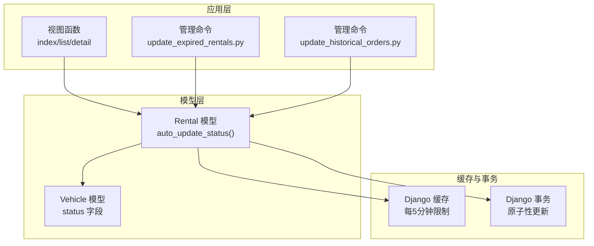
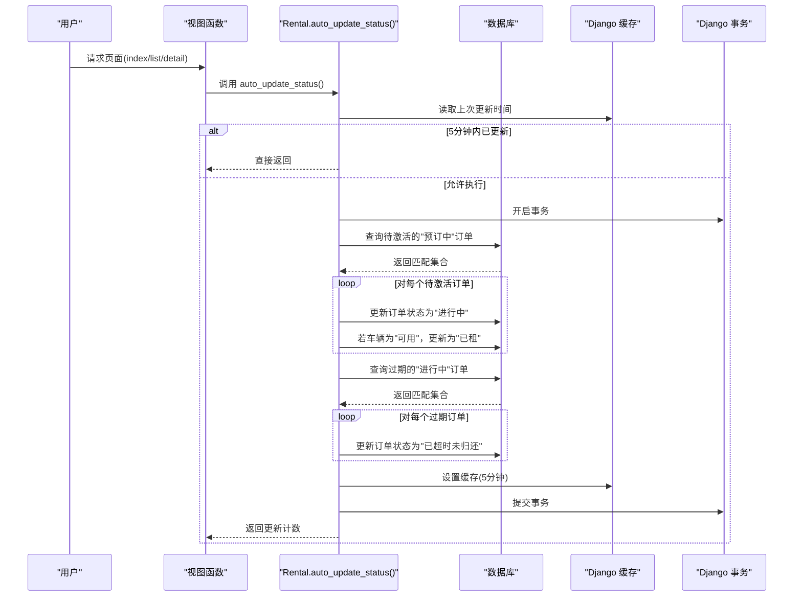
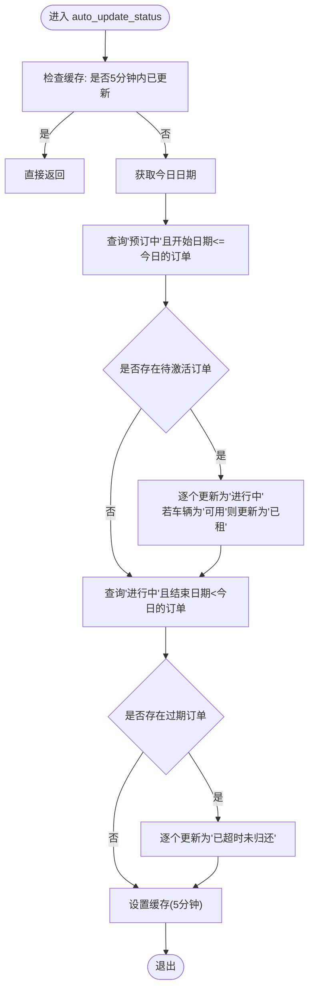
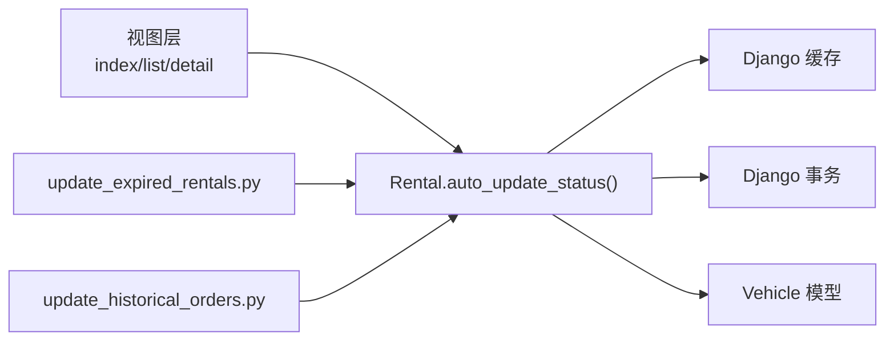

# 自动状态更新

<cite>
**本文引用的文件**
- [models.py](file://code/car_rental_system/rentals/models.py)
- [views.py](file://code/car_rental_system/rentals/views.py)
- [vehicles/models.py](file://code/car_rental_system/vehicles/models.py)
- [management/commands/update_expired_rentals.py](file://code/car_rental_system/rentals/management/commands/update_expired_rentals.py)
- [management/commands/update_historical_orders.py](file://code/car_rental_system/rentals/management/commands/update_historical_orders.py)
- [orders_auto_update_guide.md](file://code/car_rental_system/订单自动更新使用说明.md)
- [test_auto_update.py](file://code/car_rental_system/test_auto_update.py)
</cite>

## 目录
1. [简介](#简介)
2. [项目结构](#项目结构)
3. [核心组件](#核心组件)
4. [架构总览](#架构总览)
5. [详细组件分析](#详细组件分析)
6. [依赖关系分析](#依赖关系分析)
7. [性能考量](#性能考量)
8. [故障排查指南](#故障排查指南)
9. [结论](#结论)

## 简介
本文件系统化文档化 Rental 模型的 auto_update_status 类方法，重点说明其如何通过每日定时任务自动将“预订中”订单升级为“进行中”，以及将“进行中”订单升级为“已超时未归还”。文档详细解释方法内部的缓存机制（每5分钟最多执行一次）如何防止重复更新，以及事务处理如何确保数据一致性。同时，说明该方法在视图层的调用时机（index、list、detail等页面加载时），并给出性能优化策略与实际代码示例路径，帮助读者理解状态转换逻辑与车辆状态的联动更新。

## 项目结构
围绕自动状态更新功能的关键文件与职责如下：
- rentals/models.py：定义 Rental 模型及 auto_update_status 类方法，负责状态自动转换与缓存控制。
- rentals/views.py：在首页、列表页、详情页等视图中调用 auto_update_status，确保页面展示的数据是最新的。
- vehicles/models.py：定义 Vehicle 模型，提供车辆状态字段，供订单状态变更时联动更新。
- rentals/management/commands/update_expired_rentals.py：管理命令，提供每日定时任务入口，批量更新过期订单与车辆状态。
- rentals/management/commands/update_historical_orders.py：管理命令，提供批量历史订单状态更新能力，包含与 auto_update_status 相同的转换逻辑。
- 订单自动更新使用说明.md：说明文档，介绍命令执行方式、更新规则、定时任务配置等。
- test_auto_update.py：测试脚本，演示如何构造测试数据并验证状态转换与车辆状态联动。

图表来源
- [models.py](file://code/car_rental_system/rentals/models.py#L171-L229)
- [views.py](file://code/car_rental_system/rentals/views.py#L17-L58)
- [vehicles/models.py](file://code/car_rental_system/vehicles/models.py#L1-L85)
- [management/commands/update_expired_rentals.py](file://code/car_rental_system/rentals/management/commands/update_expired_rentals.py#L1-L191)
- [management/commands/update_historical_orders.py](file://code/car_rental_system/rentals/management/commands/update_historical_orders.py#L96-L149)

章节来源
- [models.py](file://code/car_rental_system/rentals/models.py#L171-L229)
- [views.py](file://code/car_rental_system/rentals/views.py#L17-L58)
- [vehicles/models.py](file://code/car_rental_system/vehicles/models.py#L1-L85)
- [management/commands/update_expired_rentals.py](file://code/car_rental_system/rentals/management/commands/update_expired_rentals.py#L1-L191)
- [management/commands/update_historical_orders.py](file://code/car_rental_system/rentals/management/commands/update_historical_orders.py#L96-L149)

## 核心组件
- auto_update_status 类方法：在 rentals/models.py 中，负责每日自动状态转换，并通过缓存与事务保证幂等与一致性。
- 视图层调用：在 rentals/views.py 的 index、rental_list、rental_detail 等视图中，每次请求都会触发 auto_update_status，确保页面数据实时反映最新状态。
- 车辆状态联动：当订单状态从“预订中”变为“进行中”时，若车辆当前为“可用”，则联动更新为“已租”。

章节来源
- [models.py](file://code/car_rental_system/rentals/models.py#L171-L229)
- [views.py](file://code/car_rental_system/rentals/views.py#L17-L58)
- [vehicles/models.py](file://code/car_rental_system/vehicles/models.py#L1-L85)

## 架构总览
自动状态更新的整体流程如下：
- 视图层在每次请求时调用 auto_update_status，检查缓存是否允许执行。
- 若允许，进入事务块，先将“预订中”且开始日期已到的订单更新为“进行中”，并联动更新车辆状态。
- 再将“进行中”且结束日期已过的订单更新为“已超时未归还”。
- 成功后设置缓存，5分钟内不再重复执行；失败则记录日志，不影响正常流程。

图表来源
- [models.py](file://code/car_rental_system/rentals/models.py#L171-L229)
- [views.py](file://code/car_rental_system/rentals/views.py#L17-L58)

## 详细组件分析

### auto_update_status 方法详解
- 功能目标
  - “预订中”→“进行中”：当到达开始日期时激活订单。
  - “进行中”→“已超时未归还”：当超过结束日期时标记超时。
  - 防重复：每5分钟最多执行一次。
  - 一致性：使用事务包裹，保证原子性。
- 关键实现要点
  - 缓存控制：使用缓存键“rental_status_auto_update”存储上次更新时间，若存在则直接返回，避免重复执行。
  - 事务包裹：使用原子事务，确保状态更新与车辆状态联动更新要么全部成功，要么全部回滚。
  - 查询优化：对“预订中”订单使用 select_related 预加载车辆，减少 N+1 查询。
  - 错误处理：捕获异常并记录日志，不影响后续请求。
- 状态转换与车辆联动
  - “预订中”→“进行中”：订单状态更新后，若车辆状态为“可用”，则更新为“已租”。
  - “进行中”→“已超时未归还”：仅更新订单状态，不改变车辆状态（由归还流程统一处理）。

图表来源
- [models.py](file://code/car_rental_system/rentals/models.py#L171-L229)

章节来源
- [models.py](file://code/car_rental_system/rentals/models.py#L171-L229)

### 视图层调用时机与性能优化
- 调用时机
  - index：首页统计与最近订单展示前调用，确保首页数据准确。
  - rental_list：列表页筛选、分页与最近订单展示前调用，确保列表状态正确。
  - rental_detail：详情页渲染前调用，确保详情页状态与车辆状态一致。
- 性能优化策略
  - auto_update_status 内部使用缓存限制执行频率（每5分钟），避免高并发下的重复更新。
  - 对“预订中”订单使用 select_related 预加载车辆，减少数据库查询次数。
  - 列表页使用缓存缓存筛选选项（客户、车辆），降低查询压力。
  - 页面渲染使用聚合查询与分页，避免一次性加载大量数据。

章节来源
- [views.py](file://code/car_rental_system/rentals/views.py#L17-L58)
- [views.py](file://code/car_rental_system/rentals/views.py#L61-L126)

### 事务处理与数据一致性
- 事务包裹
  - auto_update_status 使用事务包裹整个更新过程，确保“预订中”激活与“进行中”过期更新的原子性。
  - 管理命令 update_expired_rentals 也采用事务包裹，保证批量更新的一致性。
- 幂等性
  - 通过缓存键“rental_status_auto_update”实现幂等，多次调用不会重复更新。
  - 管理命令支持预览模式与幂等更新，避免重复执行导致的数据不一致。

章节来源
- [models.py](file://code/car_rental_system/rentals/models.py#L171-L229)
- [management/commands/update_expired_rentals.py](file://code/car_rental_system/rentals/management/commands/update_expired_rentals.py#L46-L142)

### 管理命令与定时任务
- 管理命令 update_expired_rentals
  - 提供每日定时任务入口，支持激活“预订中”订单为“进行中”，并更新车辆状态为“已租”。
  - 对“进行中”过期订单更新为“已超时未归还”，并输出执行摘要。
- 管理命令 update_historical_orders
  - 提供批量历史订单状态更新能力，包含与 auto_update_status 相同的转换逻辑。
- 定时任务配置
  - 文档提供 Windows 任务计划程序与 Linux/Mac Cron 的配置示例，建议每天凌晨执行一次。

章节来源
- [management/commands/update_expired_rentals.py](file://code/car_rental_system/rentals/management/commands/update_expired_rentals.py#L1-L191)
- [management/commands/update_historical_orders.py](file://code/car_rental_system/rentals/management/commands/update_historical_orders.py#L96-L149)
- [orders_auto_update_guide.md](file://code/car_rental_system/订单自动更新使用说明.md#L1-L157)

### 实际代码示例路径
- auto_update_status 方法实现位置
  - [Rental.auto_update_status](file://code/car_rental_system/rentals/models.py#L171-L229)
- 视图层调用位置
  - [index 视图调用](file://code/car_rental_system/rentals/views.py#L17-L58)
  - [rental_list 视图调用](file://code/car_rental_system/rentals/views.py#L61-L126)
  - [rental_detail 视图调用](file://code/car_rental_system/rentals/views.py#L129-L151)
- 车辆状态字段定义
  - [Vehicle.status 字段](file://code/car_rental_system/vehicles/models.py#L1-L85)
- 管理命令实现
  - [update_expired_rentals 命令](file://code/car_rental_system/rentals/management/commands/update_expired_rentals.py#L1-L191)
  - [update_historical_orders 命令](file://code/car_rental_system/rentals/management/commands/update_historical_orders.py#L96-L149)
- 测试脚本
  - [test_auto_update.py](file://code/car_rental_system/test_auto_update.py#L99-L223)

## 依赖关系分析
- auto_update_status 依赖
  - Django 缓存：用于限制执行频率。
  - Django 事务：用于保证原子性。
  - Vehicle 模型：用于状态联动更新。
- 视图层依赖
  - auto_update_status 在多个视图中被调用，确保页面数据一致性。
- 管理命令依赖
  - 与 auto_update_status 共享相同的转换逻辑，便于统一维护。

图表来源
- [models.py](file://code/car_rental_system/rentals/models.py#L171-L229)
- [views.py](file://code/car_rental_system/rentals/views.py#L17-L58)
- [vehicles/models.py](file://code/car_rental_system/vehicles/models.py#L1-L85)
- [management/commands/update_expired_rentals.py](file://code/car_rental_system/rentals/management/commands/update_expired_rentals.py#L1-L191)
- [management/commands/update_historical_orders.py](file://code/car_rental_system/rentals/management/commands/update_historical_orders.py#L96-L149)

## 性能考量
- 缓存限制：auto_update_status 每5分钟最多执行一次，避免高频重复更新带来的数据库压力。
- 预加载优化：对“预订中”订单使用 select_related 预加载车辆，减少查询次数。
- 列表页缓存：列表页对筛选选项使用缓存，降低查询成本。
- 事务粒度：将状态更新与车辆状态联动放在同一事务中，减少锁竞争与回滚风险。
- 建议
  - 生产环境建议配合管理命令的定时任务，避免每次请求都触发更新。
  - 对于高并发场景，可结合数据库索引与分批处理进一步优化。

[本节为通用性能讨论，无需列出具体文件来源]

## 故障排查指南
- 现象：页面状态未更新
  - 检查 auto_update_status 是否被调用（index/list/detail 视图均调用）。
  - 检查缓存是否生效（缓存键“rental_status_auto_update”）。
- 现象：状态更新后车辆状态未联动
  - 确认订单状态是否从“预订中”变为“进行中”，且车辆状态为“可用”。
  - 检查事务是否提交成功，避免异常导致回滚。
- 现象：管理命令执行失败
  - 查看命令输出与日志，确认查询条件与事务包裹是否正确。
  - 使用预览模式（dry-run）验证逻辑无误后再执行实际更新。
- 现象：定时任务未执行
  - 检查任务计划程序或 Cron 配置是否正确。
  - 确认命令路径与工作目录设置正确。

章节来源
- [models.py](file://code/car_rental_system/rentals/models.py#L171-L229)
- [views.py](file://code/car_rental_system/rentals/views.py#L17-L58)
- [orders_auto_update_guide.md](file://code/car_rental_system/订单自动更新使用说明.md#L1-L157)

## 结论
Rental.auto_update_status 方法通过缓存与事务双重保障，实现了“预订中→进行中”和“进行中→已超时未归还”的自动化状态转换，并在订单激活时联动更新车辆状态。视图层在关键页面中调用该方法，确保用户看到的始终是最新的状态。管理命令提供了稳定的定时任务入口，建议生产环境结合定时任务使用，以减轻请求时的更新压力。整体设计兼顾了数据一致性、性能与可维护性。