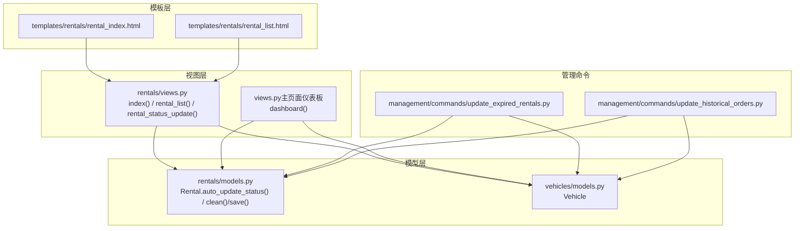
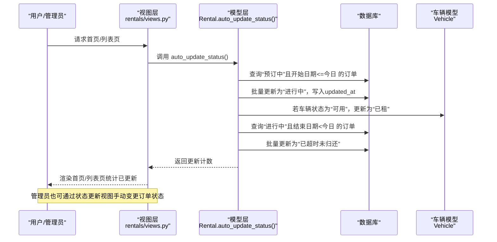
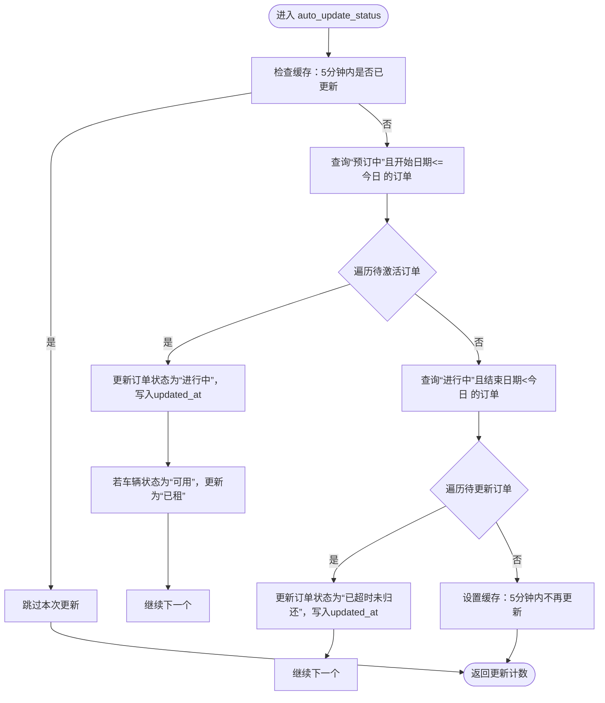
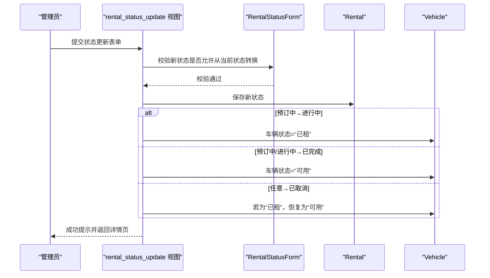
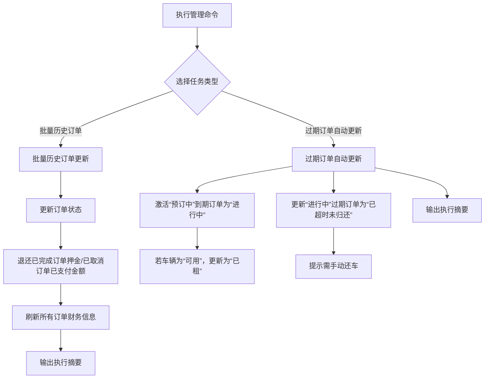
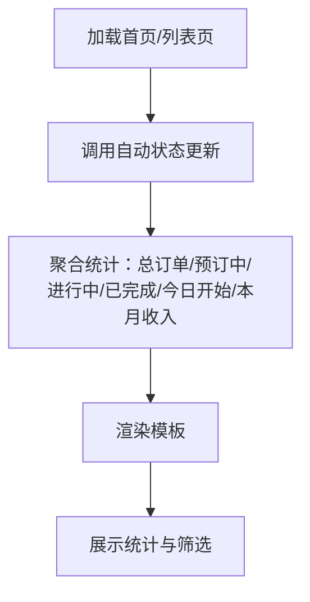
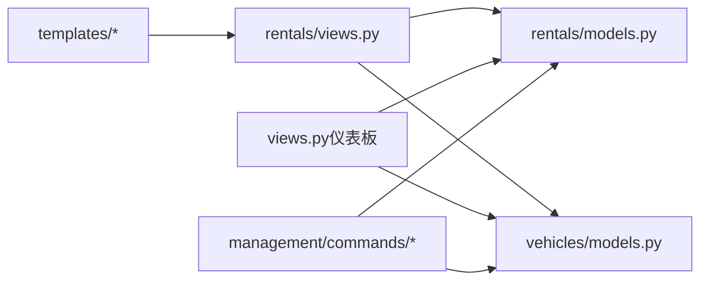

# 进行中订单管理

<cite>
**本文引用的文件**
- [models.py](file://code/car_rental_system/rentals/models.py)
- [views.py](file://code/car_rental_system/rentals/views.py)
- [update_expired_rentals.py](file://code/car_rental_system/rentals/management/commands/update_expired_rentals.py)
- [update_historical_orders.py](file://code/car_rental_system/rentals/management/commands/update_historical_orders.py)
- [rental_index.html](file://code/car_rental_system/templates/rentals/rental_index.html)
- [rental_list.html](file://code/car_rental_system/templates/rentals/rental_list.html)
- [vehicles/models.py](file://code/car_rental_system/vehicles/models.py)
- [views.py（主页面仪表板）](file://code/car_rental_system/views.py)
- [forms.py](file://code/car_rental_system/rentals/forms.py)
</cite>

## 目录
1. [简介](#简介)
2. [项目结构](#项目结构)
3. [核心组件](#核心组件)
4. [架构总览](#架构总览)
5. [详细组件分析](#详细组件分析)
6. [依赖关系分析](#依赖关系分析)
7. [性能考量](#性能考量)
8. [故障排查指南](#故障排查指南)
9. [结论](#结论)

## 简介
本文件系统性地文档化“进行中订单”的管理机制，涵盖自动状态更新与手动干预两大路径：
- 自动状态更新：通过每日定时任务将“预订中”订单在到达开始日期时升级为“进行中”，并在超过结束日期时升级为“已超时未归还”。同时联动车辆状态，确保“进行中”订单对应车辆为“已租”。
- 手动干预：管理员通过状态更新视图对订单进行强制状态变更，并在状态变更时同步更新车辆状态，保证数据一致性。
- 统计展示：系统首页与列表页对“进行中订单”进行统计展示，包括今日新增订单与在租车辆数量的计算方法。

## 项目结构
围绕“进行中订单管理”的关键代码分布在以下模块：
- 模型层：订单模型提供自动状态更新方法与状态转换逻辑
- 视图层：首页与列表页在每次请求时触发自动状态更新；状态更新视图支持管理员手动变更
- 管理命令：提供批量历史订单更新与过期订单自动更新的后台任务
- 模板层：首页与列表页展示统计与筛选
- 车辆模型：维护车辆状态并与订单状态联动

图表来源
- [views.py](file://code/car_rental_system/rentals/views.py#L17-L126)
- [models.py](file://code/car_rental_system/rentals/models.py#L171-L229)
- [update_expired_rentals.py](file://code/car_rental_system/rentals/management/commands/update_expired_rentals.py#L12-L143)
- [update_historical_orders.py](file://code/car_rental_system/rentals/management/commands/update_historical_orders.py#L10-L165)
- [rental_index.html](file://code/car_rental_system/templates/rentals/rental_index.html#L1-L161)
- [rental_list.html](file://code/car_rental_system/templates/rentals/rental_list.html#L1-L247)
- [vehicles/models.py](file://code/car_rental_system/vehicles/models.py#L1-L85)

章节来源
- [views.py](file://code/car_rental_system/rentals/views.py#L17-L126)
- [models.py](file://code/car_rental_system/rentals/models.py#L171-L229)
- [update_expired_rentals.py](file://code/car_rental_system/rentals/management/commands/update_expired_rentals.py#L12-L143)
- [update_historical_orders.py](file://code/car_rental_system/rentals/management/commands/update_historical_orders.py#L10-L165)
- [rental_index.html](file://code/car_rental_system/templates/rentals/rental_index.html#L1-L161)
- [rental_list.html](file://code/car_rental_system/templates/rentals/rental_list.html#L1-L247)
- [vehicles/models.py](file://code/car_rental_system/vehicles/models.py#L1-L85)

## 核心组件
- 订单模型（Rental）
  - 提供自动状态更新方法，按日期规则将“预订中”升级为“进行中”，并将“进行中”超过结束日期的订单升级为“已超时未归还”
  - 在状态变更时联动更新车辆状态，确保一致性
  - 提供状态转换规则校验与保存时的金额、押金、异地还车费用等计算
- 视图层
  - 首页与列表页在每次请求时调用自动状态更新，保证展示数据的实时性
  - 状态更新视图支持管理员手动变更订单状态，并同步更新车辆状态
- 管理命令
  - 提供批量历史订单更新与过期订单自动更新的后台任务，支持预览模式
- 模板层
  - 首页与列表页展示“进行中订单”相关统计与筛选入口
- 车辆模型（Vehicle）
  - 维护车辆状态枚举与索引，与订单状态联动

章节来源
- [models.py](file://code/car_rental_system/rentals/models.py#L171-L229)
- [views.py](file://code/car_rental_system/rentals/views.py#L17-L126)
- [update_expired_rentals.py](file://code/car_rental_system/rentals/management/commands/update_expired_rentals.py#L12-L143)
- [rental_index.html](file://code/car_rental_system/templates/rentals/rental_index.html#L1-L161)
- [rental_list.html](file://code/car_rental_system/templates/rentals/rental_list.html#L1-L247)
- [vehicles/models.py](file://code/car_rental_system/vehicles/models.py#L1-L85)

## 架构总览
自动状态更新与手动干预两条路径共同作用于“进行中订单”的生命周期管理，确保系统状态与业务事实一致。

图表来源
- [views.py](file://code/car_rental_system/rentals/views.py#L17-L126)
- [models.py](file://code/car_rental_system/rentals/models.py#L171-L229)
- [vehicles/models.py](file://code/car_rental_system/vehicles/models.py#L1-L85)

## 详细组件分析

### 自动状态更新：Rental.auto_update_status()
- 触发时机
  - 首页与列表页视图在每次请求时调用自动状态更新，确保展示数据与真实状态一致
- 更新策略
  - “预订中”→“进行中”：当订单开始日期到达或已过时，批量更新为“进行中”，并联动车辆状态为“已租”
  - “进行中”→“已超时未归还”：当订单结束日期已过时，批量更新为“已超时未归还”
- 一致性保障
  - 使用事务包裹更新，避免部分更新导致的不一致
  - 使用缓存限制更新频率（每5分钟最多执行一次），降低数据库压力
  - 更新时同时写入updated_at，便于审计与排序
- 异常处理
  - 捕获异常并记录日志，不影响正常流程

图表来源
- [models.py](file://code/car_rental_system/rentals/models.py#L171-L229)

章节来源
- [models.py](file://code/car_rental_system/rentals/models.py#L171-L229)
- [views.py](file://code/car_rental_system/rentals/views.py#L17-L126)

### 手动干预：管理员通过rental_status_update视图进行状态变更
- 触发时机
  - 管理员在订单详情页提交状态更新表单
- 状态变更规则
  - 预订中 → 进行中：联动车辆状态为“已租”
  - 预订中/进行中 → 已完成：联动车辆状态为“可用”
  - 任何状态 → 已取消：若车辆为“已租”，联动恢复为“可用”
- 事务与一致性
  - 使用事务包裹状态变更与车辆状态更新，确保原子性
  - 成功后返回订单详情页并提示
- 表单校验
  - 状态转换规则由表单进行约束，防止非法转换

图表来源
- [views.py](file://code/car_rental_system/rentals/views.py#L234-L276)
- [forms.py](file://code/car_rental_system/rentals/forms.py#L277-L310)
- [models.py](file://code/car_rental_system/rentals/models.py#L171-L229)
- [vehicles/models.py](file://code/car_rental_system/vehicles/models.py#L1-L85)

章节来源
- [views.py](file://code/car_rental_system/rentals/views.py#L234-L276)
- [forms.py](file://code/car_rental_system/rentals/forms.py#L277-L310)
- [models.py](file://code/car_rental_system/rentals/models.py#L171-L229)
- [vehicles/models.py](file://code/car_rental_system/vehicles/models.py#L1-L85)

### 后台命令：批量历史订单与过期订单更新
- 批量历史订单更新
  - 支持预览模式，逐步执行状态更新、押金退还、财务信息刷新
  - 对“已完成”与“已取消”订单分别处理
- 过期订单自动更新
  - 将“预订中”到期订单激活为“进行中”，并更新车辆状态
  - 将“进行中”过期订单更新为“已超时未归还”，提示需手动还车

图表来源
- [update_historical_orders.py](file://code/car_rental_system/rentals/management/commands/update_historical_orders.py#L10-L165)
- [update_expired_rentals.py](file://code/car_rental_system/rentals/management/commands/update_expired_rentals.py#L12-L143)

章节来源
- [update_historical_orders.py](file://code/car_rental_system/rentals/management/commands/update_historical_orders.py#L10-L165)
- [update_expired_rentals.py](file://code/car_rental_system/rentals/management/commands/update_expired_rentals.py#L12-L143)

### 统计展示：首页与列表页的“进行中订单”统计
- 首页统计
  - 总订单数、预订中、进行中、已完成、今日开始订单、本月收入
  - 今日开始订单：基于订单开始日期等于今日的聚合
  - 本月收入：基于订单完成且结束日期在当月范围内的聚合
- 列表页统计
  - 支持按状态、客户、车辆、关键词搜索与分页
  - 展示“进行中”订单数量与筛选入口
- 在租车辆数量
  - 仪表板视图中对车辆状态进行聚合统计，其中“进行中”订单对应的车辆即为在租车辆

图表来源
- [views.py（首页/列表）](file://code/car_rental_system/rentals/views.py#L17-L126)
- [views.py（主页面仪表板）](file://code/car_rental_system/views.py#L21-L115)
- [rental_index.html](file://code/car_rental_system/templates/rentals/rental_index.html#L1-L161)
- [rental_list.html](file://code/car_rental_system/templates/rentals/rental_list.html#L1-L247)

章节来源
- [views.py（首页/列表）](file://code/car_rental_system/rentals/views.py#L17-L126)
- [views.py（主页面仪表板）](file://code/car_rental_system/views.py#L21-L115)
- [rental_index.html](file://code/car_rental_system/templates/rentals/rental_index.html#L1-L161)
- [rental_list.html](file://code/car_rental_system/templates/rentals/rental_list.html#L1-L247)

## 依赖关系分析
- 模块耦合
  - 视图层依赖模型层的自动状态更新方法与状态转换逻辑
  - 管理命令直接依赖模型层与车辆模型，实现批量更新
  - 模板层依赖视图层提供的上下文数据
- 外部依赖
  - Django ORM、缓存框架、事务控制
- 循环依赖规避
  - 模型内部通过延迟导入避免循环引用（如财务刷新中导入支付模型）

图表来源
- [views.py](file://code/car_rental_system/rentals/views.py#L17-L126)
- [models.py](file://code/car_rental_system/rentals/models.py#L171-L229)
- [views.py（主页面仪表板）](file://code/car_rental_system/views.py#L21-L115)
- [update_expired_rentals.py](file://code/car_rental_system/rentals/management/commands/update_expired_rentals.py#L12-L143)
- [update_historical_orders.py](file://code/car_rental_system/rentals/management/commands/update_historical_orders.py#L10-L165)
- [vehicles/models.py](file://code/car_rental_system/vehicles/models.py#L1-L85)

章节来源
- [views.py](file://code/car_rental_system/rentals/views.py#L17-L126)
- [models.py](file://code/car_rental_system/rentals/models.py#L171-L229)
- [views.py（主页面仪表板）](file://code/car_rental_system/views.py#L21-L115)
- [update_expired_rentals.py](file://code/car_rental_system/rentals/management/commands/update_expired_rentals.py#L12-L143)
- [update_historical_orders.py](file://code/car_rental_system/rentals/management/commands/update_historical_orders.py#L10-L165)
- [vehicles/models.py](file://code/car_rental_system/vehicles/models.py#L1-L85)

## 性能考量
- 自动状态更新的缓存限制
  - 使用缓存键限制每5分钟最多执行一次，避免高频更新带来的数据库压力
- 聚合查询优化
  - 首页与列表页使用聚合查询一次性统计多项指标，减少多次查询
  - 仪表板视图对车辆、客户、订单、收入分别使用单次聚合查询
- 事务与批量更新
  - 自动状态更新与管理命令均采用事务包裹，批量更新以减少锁竞争与往返开销
- 前端筛选与分页
  - 列表页支持多维筛选与分页，减轻一次性渲染压力

章节来源
- [models.py](file://code/car_rental_system/rentals/models.py#L171-L229)
- [views.py（首页/列表）](file://code/car_rental_system/rentals/views.py#L17-L126)
- [views.py（主页面仪表板）](file://code/car_rental_system/views.py#L21-L115)
- [rental_list.html](file://code/car_rental_system/templates/rentals/rental_list.html#L1-L247)

## 故障排查指南
- 自动状态未更新
  - 检查缓存是否生效（每5分钟限制一次）
  - 确认请求是否触发了自动状态更新（首页/列表页视图会调用）
  - 查看日志中自动更新失败的异常信息
- 状态转换失败
  - 确认新状态是否符合表单校验规则（仅允许特定转换）
  - 检查是否存在并发更新导致的冲突
- 车辆状态不一致
  - 确认状态变更是否在事务中执行
  - 检查是否存在后台命令与手动变更的冲突
- 统计不准确
  - 首页/列表页统计依赖聚合查询，确认数据库中订单与车辆状态是否正确
  - 仪表板视图对“进行中”订单的统计依赖订单状态字段

章节来源
- [models.py](file://code/car_rental_system/rentals/models.py#L171-L229)
- [views.py](file://code/car_rental_system/rentals/views.py#L17-L126)
- [forms.py](file://code/car_rental_system/rentals/forms.py#L277-L310)
- [views.py（主页面仪表板）](file://code/car_rental_system/views.py#L21-L115)

## 结论
系统通过“自动状态更新 + 手动干预 + 统计展示”的组合，实现了对“进行中订单”的高效、可靠管理：
- 自动更新确保业务规则在时间点上得到严格执行，减少人工疏漏
- 手动干预提供灵活的运维手段，满足特殊场景下的状态调整需求
- 统计展示帮助管理者快速掌握“进行中订单”规模与在租车辆状况
- 事务与缓存等机制保障了数据一致性与系统性能