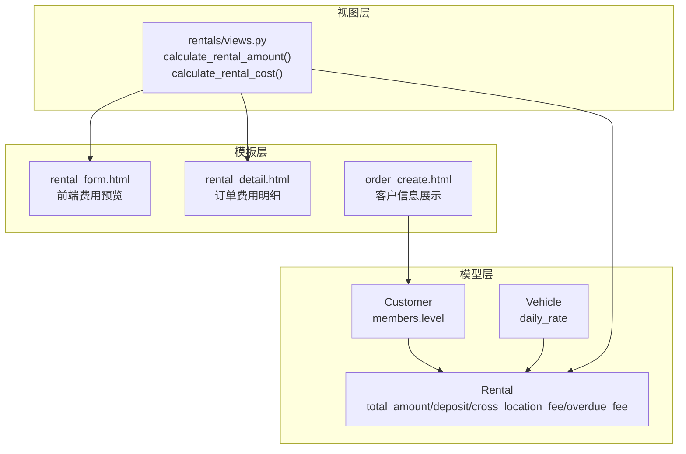
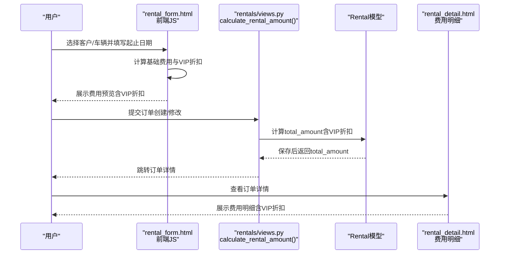
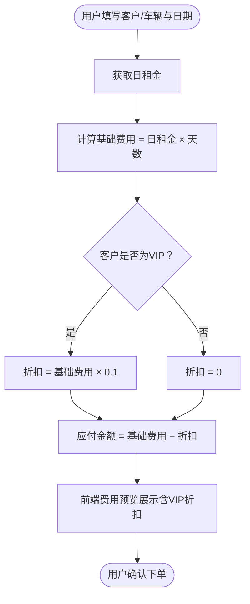
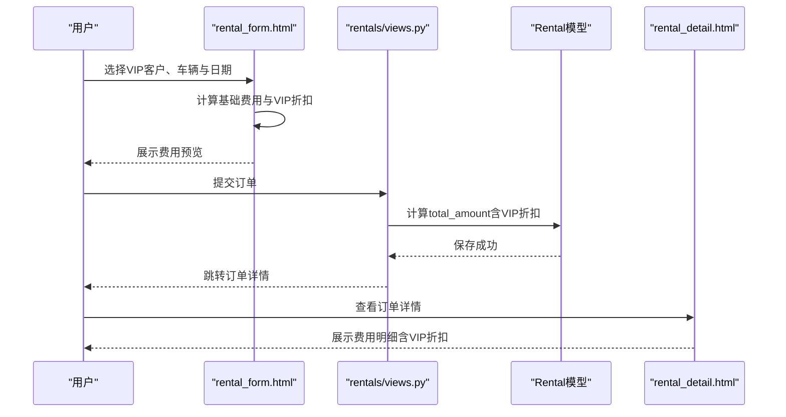
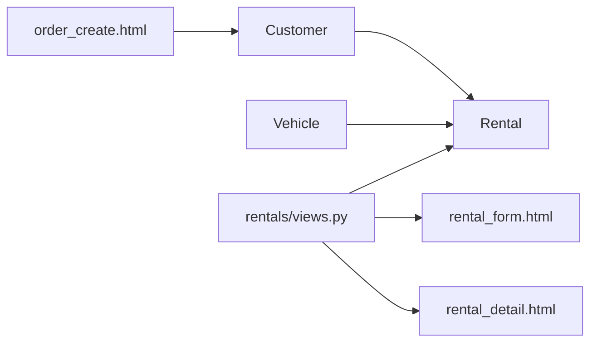

# VIP折扣

<cite>
**本文引用的文件**
- [customers/models.py](file://code/car_rental_system/customers/models.py)
- [rentals/models.py](file://code/car_rental_system/rentals/models.py)
- [rentals/views.py](file://code/car_rental_system/rentals/views.py)
- [templates/rentals/rental_form.html](file://code/car_rental_system/templates/rentals/rental_form.html)
- [templates/rentals/rental_detail.html](file://code/car_rental_system/templates/rentals/rental_detail.html)
- [templates/accounts/order_create.html](file://code/car_rental_system/templates/accounts/order_create.html)
- [vehicles/models.py](file://code/car_rental_system/vehicles/models.py)
</cite>

## 目录
1. [简介](#简介)
2. [项目结构](#项目结构)
3. [核心组件](#核心组件)
4. [架构总览](#架构总览)
5. [详细组件分析](#详细组件分析)
6. [依赖关系分析](#依赖关系分析)
7. [性能考量](#性能考量)
8. [故障排查指南](#故障排查指南)
9. [结论](#结论)
10. [附录](#附录)

## 简介
本文件围绕“VIP会员10%折扣”的实现机制展开，系统性梳理了以下内容：
- Rental模型中customer.member_level字段与折扣计算的关联
- views.py中calculate_rental_amount与calculate_rental_cost函数如何依据客户会员等级应用折扣
- 关键折扣计算逻辑discount = base_amount × Decimal('0.10')的来源与影响范围
- 前端模板中的费用预览功能，展示VIP折扣在用户界面的实时计算与显示
- VIP折扣应用的完整业务流程示例，覆盖折扣计算、费用减免与界面展示

## 项目结构
本项目采用Django分层架构，VIP折扣涉及的关键模块如下：
- 模型层：customers.models.Customer、vehicles.models.Vehicle、rentals.models.Rental
- 视图层：rentals.views（包含折扣计算函数与订单管理）
- 模板层：rentals/rental_form.html（前端费用预览）、rentals/rental_detail.html（订单详情展示）

图表来源
- [customers/models.py](file://code/car_rental_system/customers/models.py#L73-L79)
- [vehicles/models.py](file://code/car_rental_system/vehicles/models.py#L45-L51)
- [rentals/models.py](file://code/car_rental_system/rentals/models.py#L27-L38)
- [rentals/views.py](file://code/car_rental_system/rentals/views.py#L469-L485)
- [templates/rentals/rental_form.html](file://code/car_rental_system/templates/rentals/rental_form.html#L223-L305)
- [templates/rentals/rental_detail.html](file://code/car_rental_system/templates/rentals/rental_detail.html#L266-L326)
- [templates/accounts/order_create.html](file://code/car_rental_system/templates/accounts/order_create.html#L261-L296)

章节来源
- [customers/models.py](file://code/car_rental_system/customers/models.py#L73-L79)
- [vehicles/models.py](file://code/car_rental_system/vehicles/models.py#L45-L51)
- [rentals/models.py](file://code/car_rental_system/rentals/models.py#L27-L38)
- [rentals/views.py](file://code/car_rental_system/rentals/views.py#L469-L485)
- [templates/rentals/rental_form.html](file://code/car_rental_system/templates/rentals/rental_form.html#L223-L305)
- [templates/rentals/rental_detail.html](file://code/car_rental_system/templates/rentals/rental_detail.html#L266-L326)
- [templates/accounts/order_create.html](file://code/car_rental_system/templates/accounts/order_create.html#L261-L296)

## 核心组件
- Customer模型的member_level字段：定义了普通会员与VIP会员两种等级，并在索引中单独建立索引以支持高效查询。
- Vehicle模型的daily_rate字段：作为基础日租金，用于计算基础费用与折扣。
- Rental模型的total_amount字段：最终订单应付金额，受折扣影响；同时包含deposit、cross_location_fee、overdue_fee等附加费用。
- 视图函数calculate_rental_amount：在创建/修改订单时，依据客户会员等级计算折扣后的应付金额。
- 视图函数calculate_rental_cost：在订单详情页渲染费用明细，包含基础费用、VIP折扣、超期费用、异地还车费用等。
- 前端模板：
  - rental_form.html：在用户填写日期与选择客户/车辆后，实时计算并展示费用预览，包含VIP折扣。
  - rental_detail.html：在订单详情页展示费用明细，包含VIP折扣条目。
  - order_create.html：展示客户会员等级，便于用户了解自身权益。

章节来源
- [customers/models.py](file://code/car_rental_system/customers/models.py#L73-L79)
- [vehicles/models.py](file://code/car_rental_system/vehicles/models.py#L45-L51)
- [rentals/models.py](file://code/car_rental_system/rentals/models.py#L68-L74)
- [rentals/views.py](file://code/car_rental_system/rentals/views.py#L469-L485)
- [templates/rentals/rental_form.html](file://code/car_rental_system/templates/rentals/rental_form.html#L223-L305)
- [templates/rentals/rental_detail.html](file://code/car_rental_system/templates/rentals/rental_detail.html#L266-L326)
- [templates/accounts/order_create.html](file://code/car_rental_system/templates/accounts/order_create.html#L261-L296)

## 架构总览
VIP折扣贯穿“前端预览—后端计算—数据库落库—页面展示”的闭环流程，具体交互如下：

图表来源
- [templates/rentals/rental_form.html](file://code/car_rental_system/templates/rentals/rental_form.html#L223-L305)
- [rentals/views.py](file://code/car_rental_system/rentals/views.py#L469-L485)
- [rentals/models.py](file://code/car_rental_system/rentals/models.py#L246-L271)
- [templates/rentals/rental_detail.html](file://code/car_rental_system/templates/rentals/rental_detail.html#L266-L326)

## 详细组件分析

### 1) Customer与会员等级
- 字段定义：member_level为字符型字段，枚举值包含“普通会员”和“VIP会员”，默认为普通会员。
- 索引优化：对member_level建立索引，便于按会员等级筛选与统计。
- 作用：决定是否应用VIP折扣以及在前端展示会员等级。

章节来源
- [customers/models.py](file://code/car_rental_system/customers/models.py#L73-L79)
- [customers/models.py](file://code/car_rental_system/customers/models.py#L94-L99)

### 2) Vehicle与基础费用
- 字段定义：daily_rate为十进制金额，表示日租金。
- 作用：作为计算基础费用的基础单价，参与折扣计算。

章节来源
- [vehicles/models.py](file://code/car_rental_system/vehicles/models.py#L45-L51)

### 3) Rental与最终应付金额
- 字段定义：total_amount为订单应付总金额，受折扣影响；同时包含deposit、cross_location_fee、overdue_fee等附加费用。
- 保存逻辑：在save()中计算基础费用与押金，并根据客户会员等级设置VIP押金为0。
- 作用：承载折扣后的最终应付金额，供前端展示与后续结算使用。

章节来源
- [rentals/models.py](file://code/car_rental_system/rentals/models.py#L68-L74)
- [rentals/models.py](file://code/car_rental_system/rentals/models.py#L246-L271)

### 4) 视图函数：calculate_rental_amount
- 功能：计算订单应付金额，核心逻辑为：
  - 基础费用base_amount = 日租金 × 租赁天数
  - 若客户为VIP：折扣discount = base_amount × Decimal('0.10')
  - 最终应付金额total_amount = base_amount − discount
- 影响范围：用于创建/修改订单时的金额计算，确保total_amount准确反映VIP折扣。

章节来源
- [rentals/views.py](file://code/car_rental_system/rentals/views.py#L469-L485)

### 5) 视图函数：calculate_rental_cost
- 功能：在订单详情页渲染费用明细，包含：
  - 基础费用base_amount
  - VIP折扣discount（当客户为VIP时计算）
  - 超期费用overdue_fee与额外天数extra_days
  - 异地还车费用cross_location_fee
  - 总金额total_amount（基础−折扣+超期+异地）
- 影响范围：用于订单详情页的费用明细展示，直观体现VIP折扣带来的减免。

章节来源
- [rentals/views.py](file://code/car_rental_system/rentals/views.py#L487-L534)

### 6) 前端模板：费用预览与展示
- rental_form.html：
  - 在用户选择客户/车辆并填写起止日期后，前端JS实时计算基础费用与VIP折扣，并以卡片形式展示。
  - 当客户为VIP时，展示“VIP折扣”条目与“10%优惠”说明。
- rental_detail.html：
  - 展示费用明细卡片，包含“VIP折扣”条目与总金额。
- order_create.html：
  - 展示客户会员等级，便于用户了解自身权益。

图表来源
- [templates/rentals/rental_form.html](file://code/car_rental_system/templates/rentals/rental_form.html#L223-L305)
- [templates/rentals/rental_detail.html](file://code/car_rental_system/templates/rentals/rental_detail.html#L266-L326)
- [templates/accounts/order_create.html](file://code/car_rental_system/templates/accounts/order_create.html#L261-L296)

章节来源
- [templates/rentals/rental_form.html](file://code/car_rental_system/templates/rentals/rental_form.html#L223-L305)
- [templates/rentals/rental_detail.html](file://code/car_rental_system/templates/rentals/rental_detail.html#L266-L326)
- [templates/accounts/order_create.html](file://code/car_rental_system/templates/accounts/order_create.html#L261-L296)

### 7) 折扣计算逻辑详解：discount = base_amount × Decimal('0.10')
- 计算来源：
  - 视图函数calculate_rental_amount中明确使用Decimal('0.10')计算VIP折扣。
  - 视图函数calculate_rental_cost中同样使用Decimal('0.10')计算VIP折扣。
- 作用范围：
  - 订单创建/修改时，total_amount按VIP折扣计算。
  - 订单详情页，费用明细中展示VIP折扣条目。
- 与Rental.save()的关系：
  - Rental.save()中对VIP客户的押金设置为0，与折扣计算共同体现VIP权益。

章节来源
- [rentals/views.py](file://code/car_rental_system/rentals/views.py#L469-L485)
- [rentals/views.py](file://code/car_rental_system/rentals/views.py#L487-L534)
- [rentals/models.py](file://code/car_rental_system/rentals/models.py#L246-L271)

### 8) 完整业务流程示例（折扣计算、费用减免与界面展示）
- 场景：用户选择VIP客户、某日租金为X元的车辆，租赁天数为N天。
- 步骤：
  1) 前端费用预览：基础费用 = X × N；VIP折扣 = (X × N) × 0.1；应付金额 = 基础费用 − VIP折扣。
  2) 提交订单：后端调用calculate_rental_amount，设置Rental.total_amount为应付金额。
  3) 订单详情：后端调用calculate_rental_cost，渲染费用明细，包含VIP折扣条目。
  4) 结果：用户在页面看到“VIP折扣”与“应付金额”的实时计算结果。

图表来源
- [templates/rentals/rental_form.html](file://code/car_rental_system/templates/rentals/rental_form.html#L223-L305)
- [rentals/views.py](file://code/car_rental_system/rentals/views.py#L469-L485)
- [templates/rentals/rental_detail.html](file://code/car_rental_system/templates/rentals/rental_detail.html#L266-L326)

## 依赖关系分析
- 模型依赖：
  - Rental.customer → Customer(member_level)
  - Rental.vehicle → Vehicle(daily_rate)
- 视图依赖：
  - rentals/views.py依赖Customer、Vehicle、Rental模型进行折扣计算与费用明细渲染。
- 模板依赖：
  - rental_form.html依赖前端JS进行实时费用预览；
  - rental_detail.html依赖后端传入的cost_details进行费用明细展示；
  - order_create.html展示客户member_level，辅助用户理解VIP权益。

图表来源
- [customers/models.py](file://code/car_rental_system/customers/models.py#L73-L79)
- [vehicles/models.py](file://code/car_rental_system/vehicles/models.py#L45-L51)
- [rentals/models.py](file://code/car_rental_system/rentals/models.py#L27-L38)
- [rentals/views.py](file://code/car_rental_system/rentals/views.py#L469-L485)
- [templates/rentals/rental_form.html](file://code/car_rental_system/templates/rentals/rental_form.html#L223-L305)
- [templates/rentals/rental_detail.html](file://code/car_rental_system/templates/rentals/rental_detail.html#L266-L326)
- [templates/accounts/order_create.html](file://code/car_rental_system/templates/accounts/order_create.html#L261-L296)

章节来源
- [customers/models.py](file://code/car_rental_system/customers/models.py#L73-L79)
- [vehicles/models.py](file://code/car_rental_system/vehicles/models.py#L45-L51)
- [rentals/models.py](file://code/car_rental_system/rentals/models.py#L27-L38)
- [rentals/views.py](file://code/car_rental_system/rentals/views.py#L469-L485)
- [templates/rentals/rental_form.html](file://code/car_rental_system/templates/rentals/rental_form.html#L223-L305)
- [templates/rentals/rental_detail.html](file://code/car_rental_system/templates/rentals/rental_detail.html#L266-L326)
- [templates/accounts/order_create.html](file://code/car_rental_system/templates/accounts/order_create.html#L261-L296)

## 性能考量
- Decimal使用：折扣与费用计算均使用Decimal，避免浮点误差，保证财务准确性。
- 前端预览：rental_form.html在用户输入时即时计算，减少后端压力；但需注意避免频繁触发计算导致的UI抖动。
- 索引优化：Customer与Rental模型对member_level、status等字段建立索引，有助于筛选与统计。
- 保存逻辑：Rental.save()中仅在必要时计算total_amount与押金，避免重复计算。

[本节为通用指导，不直接分析具体文件]

## 故障排查指南
- 折扣未生效
  - 检查Customer.member_level是否为“VIP”，且前端是否正确识别VIP客户。
  - 检查calculate_rental_amount与calculate_rental_cost是否被调用。
- 前端预览异常
  - 检查rental_form.html中JS是否正确提取日租金与客户等级，计算逻辑是否执行。
- 订单金额不一致
  - 检查Rental.save()中total_amount赋值逻辑与calculate_rental_amount是否一致。
  - 检查订单详情页calculate_rental_cost中是否包含超期费用、异地还车费用等附加项。

章节来源
- [templates/rentals/rental_form.html](file://code/car_rental_system/templates/rentals/rental_form.html#L223-L305)
- [rentals/views.py](file://code/car_rental_system/rentals/views.py#L469-L485)
- [rentals/views.py](file://code/car_rental_system/rentals/views.py#L487-L534)
- [rentals/models.py](file://code/car_rental_system/rentals/models.py#L246-L271)

## 结论
VIP会员10%折扣在本系统中通过“前端费用预览—后端折扣计算—数据库落库—页面展示”形成闭环：
- Customer.member_level是折扣生效的关键字段
- 视图函数calculate_rental_amount与calculate_rental_cost分别负责创建/修改订单与订单详情的折扣计算
- 前端模板rental_form.html与rental_detail.html直观展示VIP折扣，提升用户体验
- Rental.save()中对VIP押金的处理进一步体现VIP权益

该机制在保证财务精度的同时，实现了良好的用户感知与业务闭环。

[本节为总结性内容，不直接分析具体文件]

## 附录
- 关键代码路径参考：
  - [calculate_rental_amount](file://code/car_rental_system/rentals/views.py#L469-L485)
  - [calculate_rental_cost](file://code/car_rental_system/rentals/views.py#L487-L534)
  - [Customer.member_level](file://code/car_rental_system/customers/models.py#L73-L79)
  - [Vehicle.daily_rate](file://code/car_rental_system/vehicles/models.py#L45-L51)
  - [Rental.total_amount/save逻辑](file://code/car_rental_system/rentals/models.py#L68-L74)
  - [Rental.save()折扣相关逻辑](file://code/car_rental_system/rentals/models.py#L246-L271)
  - [前端费用预览（rental_form.html）](file://code/car_rental_system/templates/rentals/rental_form.html#L223-L305)
  - [订单费用明细（rental_detail.html）](file://code/car_rental_system/templates/rentals/rental_detail.html#L266-L326)
  - [客户信息展示（order_create.html）](file://code/car_rental_system/templates/accounts/order_create.html#L261-L296)