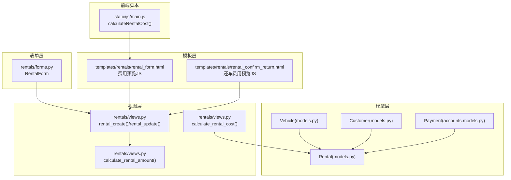
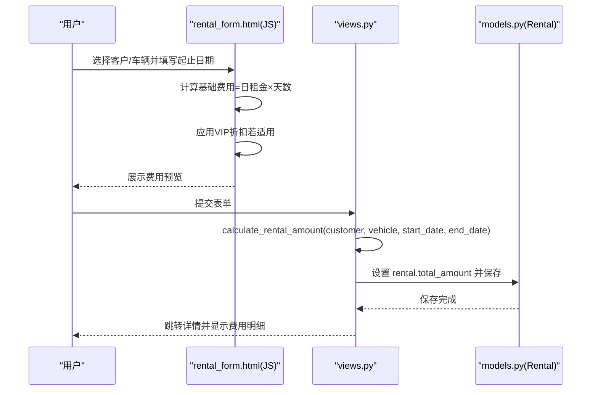
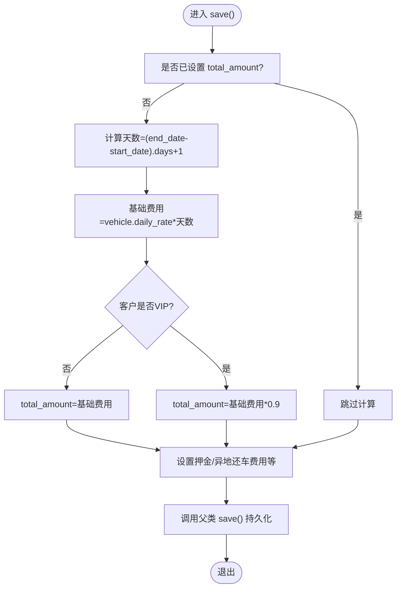
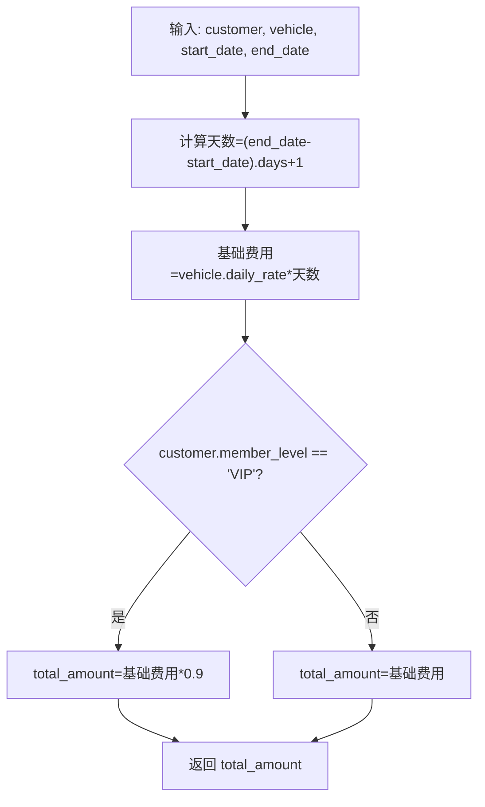
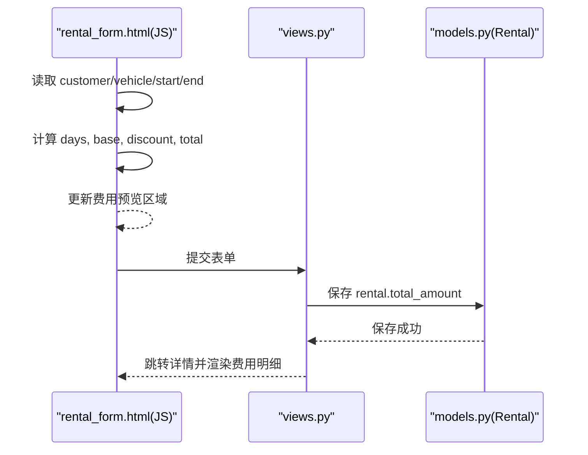
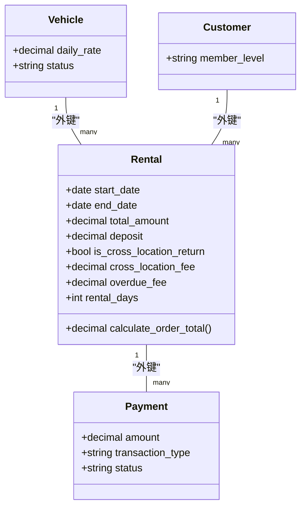
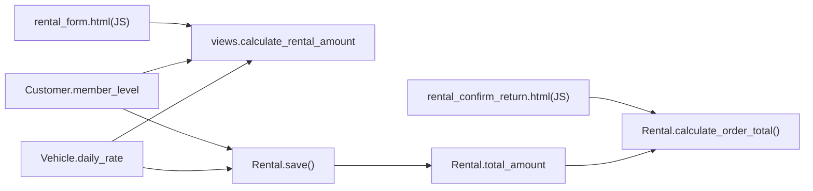

# 基础费用

<cite>
**本文引用的文件**
- [rentals/models.py](file://code/car_rental_system/rentals/models.py)
- [rentals/views.py](file://code/car_rental_system/rentals/views.py)
- [rentals/forms.py](file://code/car_rental_system/rentals/forms.py)
- [vehicles/models.py](file://code/car_rental_system/vehicles/models.py)
- [customers/models.py](file://code/car_rental_system/customers/models.py)
- [accounts/models.py](file://code/car_rental_system/accounts/models.py)
- [templates/rentals/rental_form.html](file://code/car_rental_system/templates/rentals/rental_form.html)
- [templates/rentals/rental_confirm_return.html](file://code/car_rental_system/templates/rentals/rental_confirm_return.html)
- [static/js/main.js](file://code/car_rental_system/static/js/main.js)
</cite>

## 目录
1. [简介](#简介)
2. [项目结构](#项目结构)
3. [核心组件](#核心组件)
4. [架构总览](#架构总览)
5. [详细组件分析](#详细组件分析)
6. [依赖关系分析](#依赖关系分析)
7. [性能考量](#性能考量)
8. [故障排查指南](#故障排查指南)
9. [结论](#结论)
10. [附录](#附录)

## 简介
本文件聚焦“租赁订单的基础费用计算机制”，围绕 Rental 模型中 total_amount 字段的计算逻辑展开，详细说明：
- 基础费用 = 日租金 × 租赁天数（(end_date - start_date).days + 1）
- 后端 views.py 中 calculate_rental_amount 函数的实现细节
- 前端模板通过 JavaScript 实时预览基础费用与 VIP 折扣
- 订单创建与编辑时的动态费用更新流程
- 业务场景示例与伪代码

## 项目结构
本系统采用 Django 分层架构，涉及租赁、车辆、客户、账户等子应用。与基础费用直接相关的关键模块如下：
- 模型层：Rental、Vehicle、Customer
- 视图层：rentals/views.py（包含费用计算函数与订单 CRUD）
- 表单层：rentals/forms.py（包含字段校验与默认值）
- 模板层：rentals/rental_form.html、rentals/rental_confirm_return.html（前端费用预览）
- 前端脚本：static/js/main.js（通用工具与成本计算辅助）

图表来源
- [rentals/models.py](file://code/car_rental_system/rentals/models.py#L1-L120)
- [vehicles/models.py](file://code/car_rental_system/vehicles/models.py#L1-L85)
- [customers/models.py](file://code/car_rental_system/customers/models.py#L1-L160)
- [accounts/models.py](file://code/car_rental_system/accounts/models.py#L147-L200)
- [rentals/views.py](file://code/car_rental_system/rentals/views.py#L469-L533)
- [rentals/forms.py](file://code/car_rental_system/rentals/forms.py#L1-L120)
- [templates/rentals/rental_form.html](file://code/car_rental_system/templates/rentals/rental_form.html#L190-L336)
- [templates/rentals/rental_confirm_return.html](file://code/car_rental_system/templates/rentals/rental_confirm_return.html#L233-L312)
- [static/js/main.js](file://code/car_rental_system/static/js/main.js#L500-L520)

章节来源
- [rentals/models.py](file://code/car_rental_system/rentals/models.py#L1-L120)
- [rentals/views.py](file://code/car_rental_system/rentals/views.py#L469-L533)
- [rentals/forms.py](file://code/car_rental_system/rentals/forms.py#L1-L120)
- [templates/rentals/rental_form.html](file://code/car_rental_system/templates/rentals/rental_form.html#L190-L336)
- [templates/rentals/rental_confirm_return.html](file://code/car_rental_system/templates/rentals/rental_confirm_return.html#L233-L312)
- [static/js/main.js](file://code/car_rental_system/static/js/main.js#L500-L520)

## 核心组件
- Rental 模型
  - total_amount 字段：存储基础总金额（由日租金×天数计算）
  - save() 方法：在创建/更新时自动计算 total_amount，并设置押金、异地还车费用等
  - rental_days 属性：返回 (end_date - start_date).days + 1
  - calculate_order_total()：计算订单总额（基础+押金+异地+超时）
- calculate_rental_amount 函数
  - 输入：customer、vehicle、start_date、end_date
  - 输出：基础费用（含 VIP 折扣）
- 前端费用预览
  - rental_form.html：实时计算并展示基础费用、VIP 折扣、总金额
  - rental_confirm_return.html：还车时的费用明细与动态更新
  - static/js/main.js：提供通用成本计算辅助函数

章节来源
- [rentals/models.py](file://code/car_rental_system/rentals/models.py#L246-L271)
- [rentals/models.py](file://code/car_rental_system/rentals/models.py#L279-L295)
- [rentals/views.py](file://code/car_rental_system/rentals/views.py#L469-L485)
- [templates/rentals/rental_form.html](file://code/car_rental_system/templates/rentals/rental_form.html#L222-L305)
- [templates/rentals/rental_confirm_return.html](file://code/car_rental_system/templates/rentals/rental_confirm_return.html#L233-L312)
- [static/js/main.js](file://code/car_rental_system/static/js/main.js#L500-L520)

## 架构总览
后端通过 views.py 的 calculate_rental_amount 计算基础费用；Rental.save() 在保存时再次计算并持久化 total_amount；前端模板通过 JavaScript 实时预览基础费用与 VIP 折扣，确保用户体验与数据一致性。

图表来源
- [templates/rentals/rental_form.html](file://code/car_rental_system/templates/rentals/rental_form.html#L222-L305)
- [rentals/views.py](file://code/car_rental_system/rentals/views.py#L469-L485)
- [rentals/models.py](file://code/car_rental_system/rentals/models.py#L246-L271)

## 详细组件分析

### 后端：Rental 模型与 total_amount 计算
- 计算逻辑
  - 天数：(end_date - start_date).days + 1
  - 基础费用：vehicle.daily_rate × 天数
  - VIP 折扣：customer.member_level == 'VIP' 时，total_amount = 基础费用 × 0.9
  - 保存时自动设置押金、异地还车费用等
- 关键点
  - total_amount 仅反映基础费用，不包含押金、异地还车费用、超时费用
  - calculate_order_total() 才是订单最终应付金额的汇总

图表来源
- [rentals/models.py](file://code/car_rental_system/rentals/models.py#L246-L271)

章节来源
- [rentals/models.py](file://code/car_rental_system/rentals/models.py#L246-L271)
- [rentals/models.py](file://code/car_rental_system/rentals/models.py#L279-L295)

### 后端：views.py 中的费用计算函数
- calculate_rental_amount(customer, vehicle, start_date, end_date)
  - 步骤
    - 计算天数
    - 基础费用 = 日租金 × 天数
    - 若客户为 VIP，折扣 10%
    - 返回 total_amount
- calculate_rental_cost(rental)
  - 用于订单详情页展示完整费用明细（基础、折扣、押金、超时、异地还车）

图表来源
- [rentals/views.py](file://code/car_rental_system/rentals/views.py#L469-L485)

章节来源
- [rentals/views.py](file://code/car_rental_system/rentals/views.py#L469-L485)
- [rentals/views.py](file://code/car_rental_system/rentals/views.py#L487-L533)

### 前端：模板中的实时费用预览
- rental_form.html
  - 监听客户、车辆、起止日期变化，实时计算并展示：
    - 租赁天数
    - 日租金
    - 基础费用
    - VIP 折扣（若有）
    - 订单总金额
- rental_confirm_return.html
  - 还车时根据实际还车日期、还车地点动态计算超时费用与异地还车费用

图表来源
- [templates/rentals/rental_form.html](file://code/car_rental_system/templates/rentals/rental_form.html#L222-L305)
- [rentals/views.py](file://code/car_rental_system/rentals/views.py#L154-L187)
- [rentals/views.py](file://code/car_rental_system/rentals/views.py#L190-L231)
- [rentals/models.py](file://code/car_rental_system/rentals/models.py#L246-L271)

章节来源
- [templates/rentals/rental_form.html](file://code/car_rental_system/templates/rentals/rental_form.html#L190-L336)
- [templates/rentals/rental_confirm_return.html](file://code/car_rental_system/templates/rentals/rental_confirm_return.html#L233-L312)
- [static/js/main.js](file://code/car_rental_system/static/js/main.js#L500-L520)

### 表单与校验：RentalForm
- 字段与默认值
  - start_date、end_date 默认今日
  - status 默认 PENDING
  - pickup_location 默认 '门店'
  - deposit、cross_location_fee 默认 0，且 HiddenInput
- 校验要点
  - 开始日期不得早于今日
  - 结束日期不得早于开始日期
  - 车辆状态必须为 AVAILABLE（除非更新当前订单）
  - 异地还车时需填写还车地点且与取车地点不同

章节来源
- [rentals/forms.py](file://code/car_rental_system/rentals/forms.py#L88-L121)
- [rentals/forms.py](file://code/car_rental_system/rentals/forms.py#L148-L167)
- [rentals/forms.py](file://code/car_rental_system/rentals/forms.py#L212-L275)

### 模型依赖与关系
- Vehicle 与 Rental：一对一外键，提供 daily_rate
- Customer 与 Rental：一对一外键，提供 member_level（影响 VIP 折扣）
- Payment 与 Rental：一对多，用于统计 amount_paid、amount_refunded、结算状态

图表来源
- [vehicles/models.py](file://code/car_rental_system/vehicles/models.py#L45-L51)
- [customers/models.py](file://code/car_rental_system/customers/models.py#L73-L79)
- [rentals/models.py](file://code/car_rental_system/rentals/models.py#L286-L295)
- [accounts/models.py](file://code/car_rental_system/accounts/models.py#L147-L200)

## 依赖关系分析
- 后端依赖
  - views.calculate_rental_amount 依赖 Vehicle.daily_rate 与 Customer.member_level
  - models.Rental.save 依赖 Vehicle.daily_rate 与 Customer.member_level
  - calculate_rental_cost 依赖 Rental 的现有字段（total_amount、deposit、overdue_fee、cross_location_fee）
- 前端依赖
  - rental_form.html 依赖 vehicle 下拉文本中的日租金信息（正则提取）
  - rental_confirm_return.html 依赖模板上下文中的 rental.vehicle.daily_rate、rental.customer.member_level 等

图表来源
- [rentals/views.py](file://code/car_rental_system/rentals/views.py#L469-L485)
- [rentals/models.py](file://code/car_rental_system/rentals/models.py#L246-L271)
- [templates/rentals/rental_form.html](file://code/car_rental_system/templates/rentals/rental_form.html#L222-L305)
- [templates/rentals/rental_confirm_return.html](file://code/car_rental_system/templates/rentals/rental_confirm_return.html#L233-L312)

章节来源
- [rentals/views.py](file://code/car_rental_system/rentals/views.py#L469-L485)
- [rentals/models.py](file://code/car_rental_system/rentals/models.py#L246-L271)
- [templates/rentals/rental_form.html](file://code/car_rental_system/templates/rentals/rental_form.html#L222-L305)
- [templates/rentals/rental_confirm_return.html](file://code/car_rental_system/templates/rentals/rental_confirm_return.html#L233-L312)

## 性能考量
- 后端
  - 计算复杂度低，O(1)，主要瓶颈在数据库 I/O（保存对象、查询支付）
  - 通过 Decimal 精确计算，避免浮点误差
- 前端
  - JS 计算轻量，建议在用户输入时节流/防抖（当前模板已具备变更监听）
  - 模板中字符串解析日租金存在潜在性能开销，建议通过 AJAX 获取日租金或在表单初始化时注入

[本节为通用指导，无需列出具体文件来源]

## 故障排查指南
- 常见问题
  - total_amount 未更新：确认是否在保存前调用了 calculate_rental_amount 或依赖模型 save() 自动计算
  - VIP 折扣未生效：检查 customer.member_level 是否为 'VIP'
  - 费用预览不一致：核对前端 JS 与后端计算逻辑是否一致（天数计算、折扣比例）
- 排查步骤
  - 在 rental_create/rental_update 中断点或日志输出 total_amount
  - 在模板中打印 vehicle.daily_rate 与 customer.member_level
  - 检查表单 clean_* 逻辑是否拦截了异常输入

章节来源
- [rentals/views.py](file://code/car_rental_system/rentals/views.py#L154-L187)
- [rentals/views.py](file://code/car_rental_system/rentals/views.py#L190-L231)
- [templates/rentals/rental_form.html](file://code/car_rental_system/templates/rentals/rental_form.html#L222-L305)

## 结论
- 基础费用计算遵循“日租金 × 租赁天数”的简单而稳健的规则
- 后端与前端分别实现了相同的计算逻辑，确保用户在创建/编辑订单时即可获得准确的费用预览
- VIP 折扣在后端与前端均体现，保证一致性
- 建议在前端引入 AJAX 获取日租金，减少字符串解析与模板耦合，进一步提升稳定性与可维护性

[本节为总结性内容，无需列出具体文件来源]

## 附录

### 业务场景示例
- 场景一：普通客户预订 3 天，日租金 200 元
  - 基础费用 = 200 × 3 = 600 元
  - VIP 客户：600 × 0.9 = 540 元
- 场景二：VIP 客户预订 5 天，日租金 300 元
  - 基础费用 = 300 × 5 = 1500 元
  - VIP 折扣后 = 1500 × 0.9 = 1350 元
- 场景三：还车超期 2 天，日租金 200 元
  - 超时费用 = 200 × 2 = 400 元
  - 异地还车费用 = 200 × 0.5 = 100 元（默认）

[本节为示例说明，无需列出具体文件来源]

### 伪代码
- 后端计算（views.py）
  - 输入：customer, vehicle, start_date, end_date
  - 天数 = (end_date - start_date).days + 1
  - 基础费用 = vehicle.daily_rate × 天数
  - 若 customer.member_level == 'VIP'：total_amount = 基础费用 × 0.9
  - 否则：total_amount = 基础费用
  - 返回 total_amount
- 前端计算（模板 JS）
  - 读取 vehicleText 中的日租金（正则提取）
  - 天数 = ceil((end - start)/1000/3600/24) + 1
  - 基础费用 = 日租金 × 天数
  - 若客户为 VIP：折扣 = 基础费用 × 0.1；总金额 = 基础费用 - 折扣
  - 更新费用预览区域

章节来源
- [rentals/views.py](file://code/car_rental_system/rentals/views.py#L469-L485)
- [templates/rentals/rental_form.html](file://code/car_rental_system/templates/rentals/rental_form.html#L222-L305)