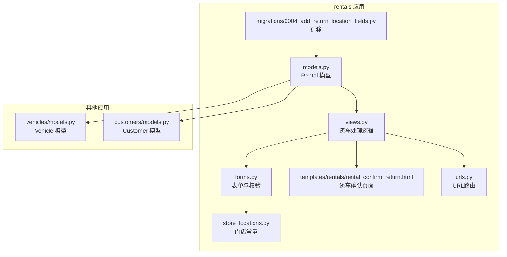
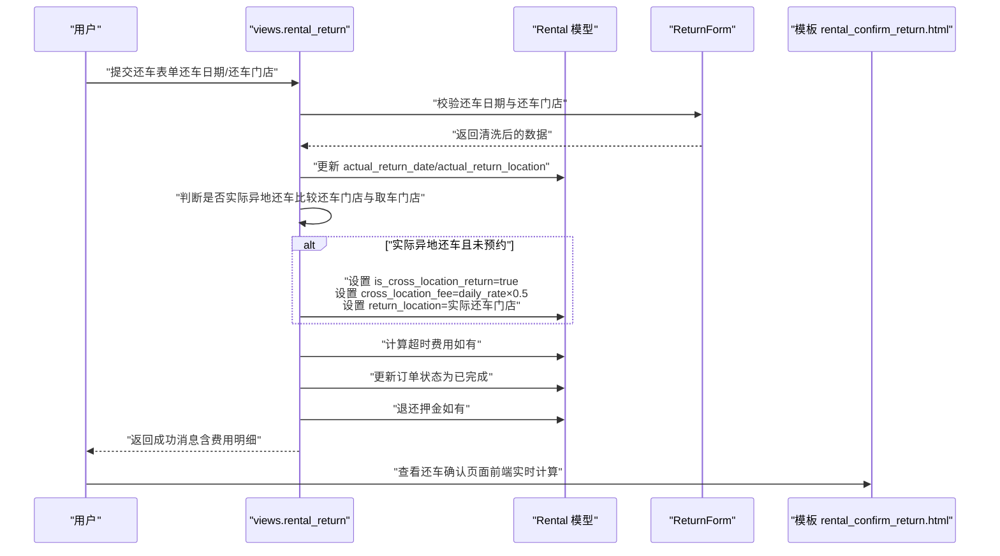
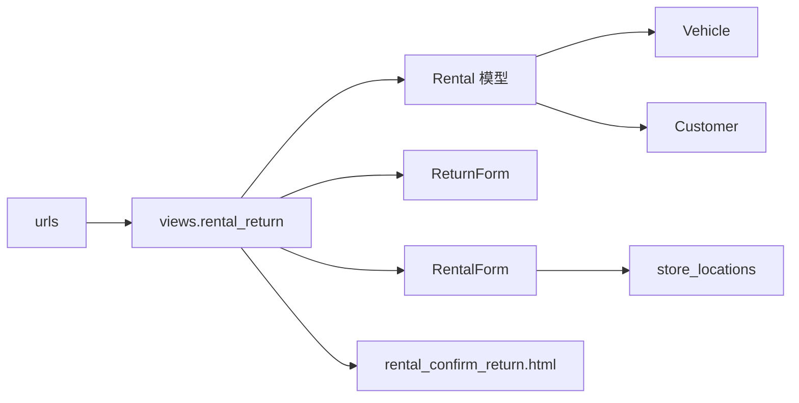
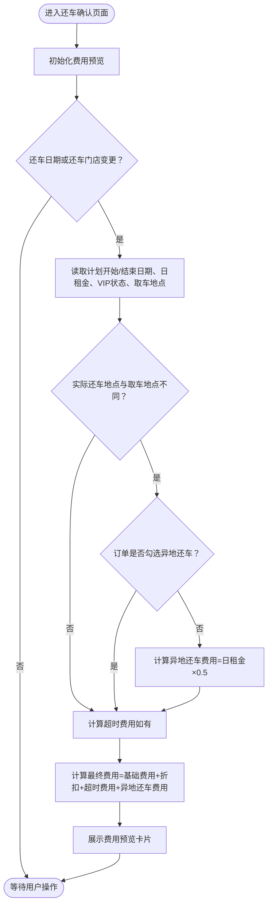

# 异地还车费用

<cite>
**本文引用的文件**
- [models.py](file://code/car_rental_system/rentals/models.py)
- [views.py](file://code/car_rental_system/rentals/views.py)
- [forms.py](file://code/car_rental_system/rentals/forms.py)
- [urls.py](file://code/car_rental_system/rentals/urls.py)
- [rental_confirm_return.html](file://code/car_rental_system/templates/rentals/rental_confirm_return.html)
- [store_locations.py](file://code/car_rental_system/accounts/store_locations.py)
- [vehicles/models.py](file://code/car_rental_system/vehicles/models.py)
- [customers/models.py](file://code/car_rental_system/customers/models.py)
- [0004_add_return_location_fields.py](file://code/car_rental_system/rentals/migrations/0004_add_return_location_fields.py)
- [还车逻辑修改说明.md](file://code/car_rental_system/还车逻辑修改说明.md)
</cite>

## 目录
1. [简介](#简介)
2. [项目结构](#项目结构)
3. [核心组件](#核心组件)
4. [架构总览](#架构总览)
5. [详细组件分析](#详细组件分析)
6. [依赖关系分析](#依赖关系分析)
7. [性能考量](#性能考量)
8. [故障排查指南](#故障排查指南)
9. [结论](#结论)
10. [附录](#附录)

## 简介
本文件聚焦“异地还车费用”的业务规则与实现逻辑，围绕以下目标展开：
- 明确“只有在租车时未预约但实际异地还车的情况下才收取异地还车费用”的规则；
- 解析 Rental 模型中 is_cross_location_return、return_location、cross_location_fee 字段的作用；
- 说明 views.py 中如何通过比较 actual_return_location 与 pickup_location 判断是否异地还车；
- 解释 cross_location_fee = daily_rate × 0.5 的计算规则；
- 结合还车确认页面的前端逻辑，展示费用的实时计算与提示信息；
- 提供完整的业务场景示例，帮助理解从下单到还车的全流程。

## 项目结构
围绕异地还车费用的关键代码分布在 rentals 应用中，包括模型、视图、表单、模板与迁移文件；同时涉及车辆与客户模型、门店常量等辅助模块。

图表来源
- [models.py](file://code/car_rental_system/rentals/models.py#L1-L120)
- [views.py](file://code/car_rental_system/rentals/views.py#L279-L392)
- [forms.py](file://code/car_rental_system/rentals/forms.py#L1-L120)
- [rental_confirm_return.html](file://code/car_rental_system/templates/rentals/rental_confirm_return.html#L1-L120)
- [urls.py](file://code/car_rental_system/rentals/urls.py#L1-L22)
- [store_locations.py](file://code/car_rental_system/accounts/store_locations.py#L1-L79)
- [vehicles/models.py](file://code/car_rental_system/vehicles/models.py#L1-L85)
- [customers/models.py](file://code/car_rental_system/customers/models.py#L1-L160)
- [0004_add_return_location_fields.py](file://code/car_rental_system/rentals/migrations/0004_add_return_location_fields.py#L1-L42)

章节来源
- [models.py](file://code/car_rental_system/rentals/models.py#L1-L120)
- [views.py](file://code/car_rental_system/rentals/views.py#L279-L392)
- [forms.py](file://code/car_rental_system/rentals/forms.py#L1-L120)
- [rental_confirm_return.html](file://code/car_rental_system/templates/rentals/rental_confirm_return.html#L1-L120)
- [urls.py](file://code/car_rental_system/rentals/urls.py#L1-L22)
- [store_locations.py](file://code/car_rental_system/accounts/store_locations.py#L1-L79)
- [vehicles/models.py](file://code/car_rental_system/vehicles/models.py#L1-L85)
- [customers/models.py](file://code/car_rental_system/customers/models.py#L1-L160)
- [0004_add_return_location_fields.py](file://code/car_rental_system/rentals/migrations/0004_add_return_location_fields.py#L1-L42)

## 核心组件
- Rental 模型：存储订单、取车/还车地点、是否异地还车、异地还车费用、超时费用、总金额、押金等关键字段，并在保存时计算默认异地还车费用。
- views.py 的 rental_return 视图：负责还车处理，判断实际还车是否异地还车，计算并追加异地还车费用，更新订单状态与车辆状态。
- 表单 forms.py：ReturnForm 提供还车日期与还车门店的输入校验；RentalForm 对异地还车的预约与费用计算进行约束。
- 模板 rental_confirm_return.html：前端实时计算基础费用、超时费用与异地还车费用，并给出提示信息。
- 门店常量 store_locations.py：提供服务门店列表，用于还车地点的选择与校验。
- 迁移 0004：新增 actual_return_location 与 overdue_fee 字段，支撑还车确认与超时费用计算。

章节来源
- [models.py](file://code/car_rental_system/rentals/models.py#L83-L108)
- [views.py](file://code/car_rental_system/rentals/views.py#L279-L392)
- [forms.py](file://code/car_rental_system/rentals/forms.py#L312-L351)
- [rental_confirm_return.html](file://code/car_rental_system/templates/rentals/rental_confirm_return.html#L150-L230)
- [store_locations.py](file://code/car_rental_system/accounts/store_locations.py#L1-L79)
- [0004_add_return_location_fields.py](file://code/car_rental_system/rentals/migrations/0004_add_return_location_fields.py#L1-L42)

## 架构总览
下面的序列图展示了“还车确认”到“费用计算与订单完成”的端到端流程，映射到具体源码位置。

图表来源
- [views.py](file://code/car_rental_system/rentals/views.py#L279-L392)
- [models.py](file://code/car_rental_system/rentals/models.py#L246-L271)
- [rental_confirm_return.html](file://code/car_rental_system/templates/rentals/rental_confirm_return.html#L233-L312)

## 详细组件分析

### 1) Rental 模型中的异地还车字段与默认行为
- 字段作用
  - is_cross_location_return：是否异地还车（布尔），用于区分“已预约异地还车”与“未预约但实际异地还车”两种情形。
  - return_location：还车地点（字符串，可能为空），当 is_cross_location_return 为真时记录实际还车门店。
  - cross_location_fee：异地还车费用（数值），保存时若未设置且满足条件会自动计算。
- 默认计算逻辑
  - 当 is_cross_location_return 为真且 return_location 为空时，系统会回填取车地点；
  - 当 is_cross_location_return 为真且 cross_location_fee 为 0 时，系统会按 daily_rate × 0.5 设置默认费用；
  - 在 calculate_order_total 中，若订单未标记为异地还车，则不会计入 cross_location_fee。

章节来源
- [models.py](file://code/car_rental_system/rentals/models.py#L83-L108)
- [models.py](file://code/car_rental_system/rentals/models.py#L246-L271)
- [models.py](file://code/car_rental_system/rentals/models.py#L286-L295)

### 2) views.py 中的还车判断与费用追加
- 还车入口与状态限制
  - 仅当订单状态为“进行中”或“已超时未归还”时允许还车。
- 实际异地还车判断
  - 通过比较 actual_return_location 与 pickup_location 是否不同来判定；
  - 若实际异地还车且订单未勾选“异地还车”，则追加费用：cross_location_fee = daily_rate × 0.5，并同步更新 is_cross_location_return 与 return_location。
- 超时还车费用
  - 若实际还车日期晚于结束日期，则按“超时天数 × 日租金”计算超时费用并写入 overdue_fee。
- 订单与车辆状态更新
  - 将订单状态置为“已完成”，并尝试将车辆状态置为“可用”。

章节来源
- [views.py](file://code/car_rental_system/rentals/views.py#L279-L392)
- [views.py](file://code/car_rental_system/rentals/views.py#L306-L334)

### 3) 表单层的约束与校验
- ReturnForm
  - 校验还车日期不得晚于今天；
  - 还车门店可为空，为空时使用取车地点。
- RentalForm（创建/编辑订单时）
  - 若勾选“异地还车”，必须填写还车地点且不得与取车地点相同；
  - 若还车地点不在服务门店列表，系统会按“日租金 × 0.5 × 1.5”的规则自动提升异地还车费用；
  - 若未勾选异地还车，系统会清空还车地点与费用字段。

章节来源
- [forms.py](file://code/car_rental_system/rentals/forms.py#L312-L351)
- [forms.py](file://code/car_rental_system/rentals/forms.py#L1-L120)
- [forms.py](file://code/car_rental_system/rentals/forms.py#L227-L275)
- [store_locations.py](file://code/car_rental_system/accounts/store_locations.py#L1-L79)

### 4) 前端模板中的实时费用计算与提示
- 页面初始化与事件绑定
  - 页面加载后调用 updateCostPreview()；
  - 当还车日期或还车门店发生变化时重新计算。
- 计算逻辑要点
  - 基础费用：计划天数 × 日租金，VIP 享受 10% 折扣；
  - 超时费用：若实际还车日期晚于结束日期，按“超时天数 × 日租金”计算；
  - 异地还车费用：若实际还车门店与取车门店不同且订单未勾选异地还车，则增加“日租金 × 0.5”；
  - 展示“费用预览”卡片，包含基础费用、折扣、超时费用、异地还车费用与最终合计。
- 提示信息
  - 页面明确说明“如果还车门店与取车门店不同，且租车时未预约异地还车，将增加异地还车费用”。

章节来源
- [rental_confirm_return.html](file://code/car_rental_system/templates/rentals/rental_confirm_return.html#L150-L230)
- [rental_confirm_return.html](file://code/car_rental_system/templates/rentals/rental_confirm_return.html#L233-L312)

### 5) 业务场景示例：完整流程
- 场景一：未预约异地还车，实际异地还车
  - 步骤：创建订单时未勾选“异地还车”，取车地点为“杭州门店”，还车地点为“北京门店”；
  - 结果：还车时系统检测到实际还车门店与取车门店不同，且订单未勾选异地还车，追加异地还车费用（日租金 × 0.5），订单标记为异地还车并记录还车地点。
- 场景二：已预约异地还车，实际还车地点与预约一致
  - 步骤：创建订单时勾选“异地还车”，还车地点为“北京门店”；
  - 结果：还车时系统识别为已预约异地还车，费用已包含在订单中，不重复收费。
- 场景三：已预约异地还车，但实际还车地点与预约不同
  - 步骤：创建订单时勾选“异地还车”，但实际还车地点为“上海门店”；
  - 结果：系统仍视为已预约异地还车，但可能触发额外的“不诚信还车”规则（见客户模型的 VIP 升级校验逻辑）。
- 场景四：未预约异地还车，实际还车地点与取车地点相同
  - 步骤：创建订单时未勾选“异地还车”，实际还车地点也为“杭州门店”；
  - 结果：不产生异地还车费用，订单按常规流程完成。

章节来源
- [views.py](file://code/car_rental_system/rentals/views.py#L306-L334)
- [models.py](file://code/car_rental_system/rentals/models.py#L246-L271)
- [customers/models.py](file://code/car_rental_system/customers/models.py#L101-L146)
- [还车逻辑修改说明.md](file://code/car_rental_system/还车逻辑修改说明.md#L120-L153)

## 依赖关系分析
- 模块耦合
  - views.rental_return 依赖 Rental 模型的字段与方法（如 calculate_order_total、refund_deposit）；
  - 表单层 ReturnForm/ RentalForm 依赖 Vehicle 的 daily_rate 与 Customer 的会员等级；
  - 模板依赖 store_locations 的门店列表进行还车地点选择与校验。
- 外部依赖
  - 还车确认页面使用 jQuery 进行前端实时计算；
  - URL 路由将还车处理映射到 views.rental_return。

图表来源
- [views.py](file://code/car_rental_system/rentals/views.py#L279-L392)
- [models.py](file://code/car_rental_system/rentals/models.py#L1-L120)
- [forms.py](file://code/car_rental_system/rentals/forms.py#L1-L120)
- [store_locations.py](file://code/car_rental_system/accounts/store_locations.py#L1-L79)
- [urls.py](file://code/car_rental_system/rentals/urls.py#L1-L22)

章节来源
- [views.py](file://code/car_rental_system/rentals/views.py#L279-L392)
- [models.py](file://code/car_rental_system/rentals/models.py#L1-L120)
- [forms.py](file://code/car_rental_system/rentals/forms.py#L1-L120)
- [store_locations.py](file://code/car_rental_system/accounts/store_locations.py#L1-L79)
- [urls.py](file://code/car_rental_system/rentals/urls.py#L1-L22)

## 性能考量
- 前端实时计算：还车确认页面通过 jQuery 在客户端实时计算基础费用、超时费用与异地还车费用，减少不必要的请求与服务器压力。
- 服务器端计算：views.rental_return 仅在提交还车时进行必要的字段更新与状态切换，避免复杂查询。
- 数据库字段：迁移文件新增 actual_return_location 与 overdue_fee，便于后续统计与报表分析。

章节来源
- [rental_confirm_return.html](file://code/car_rental_system/templates/rentals/rental_confirm_return.html#L233-L312)
- [0004_add_return_location_fields.py](file://code/car_rental_system/rentals/migrations/0004_add_return_location_fields.py#L1-L42)

## 故障排查指南
- 常见问题
  - “未预约但实际异地还车”未收费：检查 views.rental_return 是否正确比较 actual_return_location 与 pickup_location，确认 is_cross_location_return 未被提前设置。
  - “已预约异地还车”仍收费：确认订单创建时是否正确填写 return_location 且未被清空；检查表单层对异地还车的校验逻辑。
  - “还车日期晚于结束日期”未产生超时费用：确认 views.rental_return 中 overdue_fee 的计算分支是否被执行。
  - 前端费用预览不更新：检查页面事件绑定与 updateCostPreview() 的调用时机。
- 关键定位点
  - views.rental_return 的还车判断与费用追加逻辑；
  - 表单层 ReturnForm 的还车日期校验；
  - 模板中 jQuery 的实时计算逻辑。

章节来源
- [views.py](file://code/car_rental_system/rentals/views.py#L279-L392)
- [forms.py](file://code/car_rental_system/rentals/forms.py#L312-L351)
- [rental_confirm_return.html](file://code/car_rental_system/templates/rentals/rental_confirm_return.html#L233-L312)

## 结论
- 规则核心：仅当“租车时未预约但实际异地还车”时才收取异地还车费用，费用标准为“日租金 × 0.5”；
- 实现要点：Rental 模型负责字段与默认值，views.rental_return 负责判断与追加费用，表单与模板分别承担校验与前端实时计算；
- 业务保障：通过“已预约/未预约”的双重维度，既保证了规则清晰，又为后续扩展（如费用比例可配置）留有余地。

## 附录

### A. 字段与规则对照表
- 字段
  - is_cross_location_return：是否异地还车（布尔）
  - return_location：还车地点（字符串）
  - cross_location_fee：异地还车费用（数值）
- 规则
  - 未预约但实际异地还车：cross_location_fee = daily_rate × 0.5，并设置 is_cross_location_return 与 return_location；
  - 已预约异地还车：费用已包含在订单中，不重复收费；
  - 超时还车：按“超时天数 × 日租金”计算并记录 overdue_fee。

章节来源
- [models.py](file://code/car_rental_system/rentals/models.py#L83-L108)
- [models.py](file://code/car_rental_system/rentals/models.py#L246-L271)
- [views.py](file://code/car_rental_system/rentals/views.py#L306-L334)

### B. 前端算法流程图

图表来源
- [rental_confirm_return.html](file://code/car_rental_system/templates/rentals/rental_confirm_return.html#L233-L312)