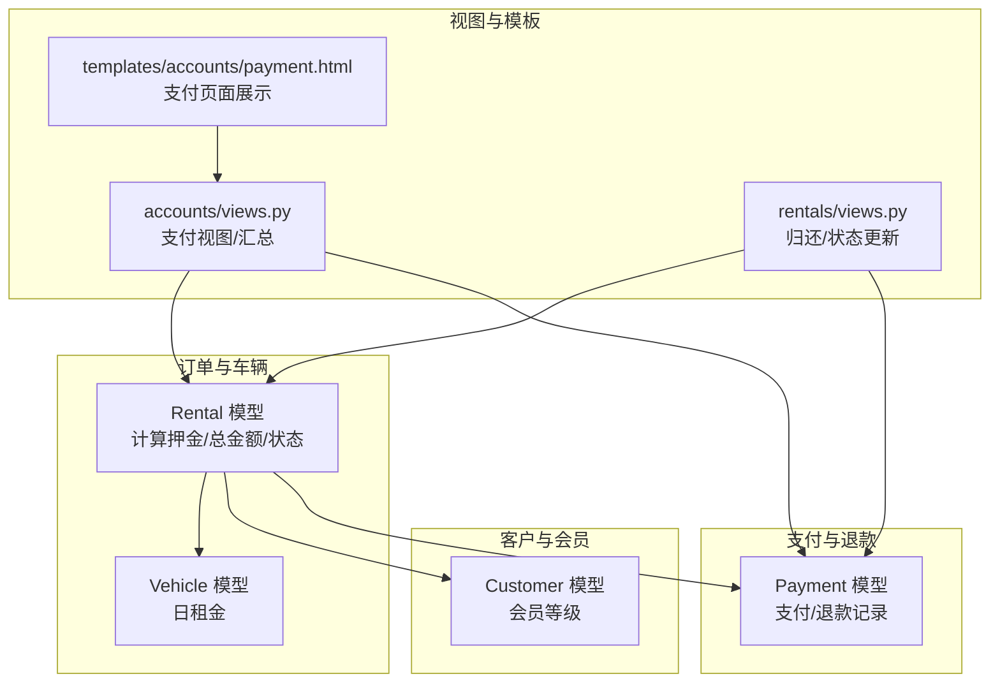
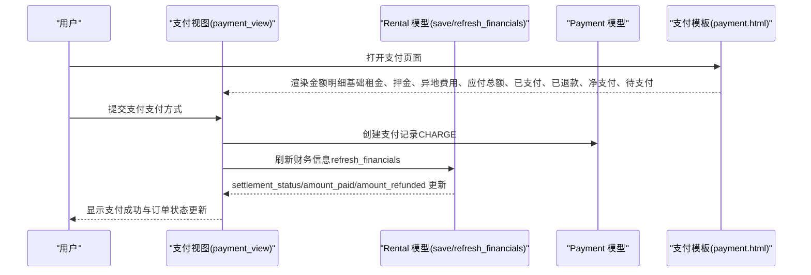
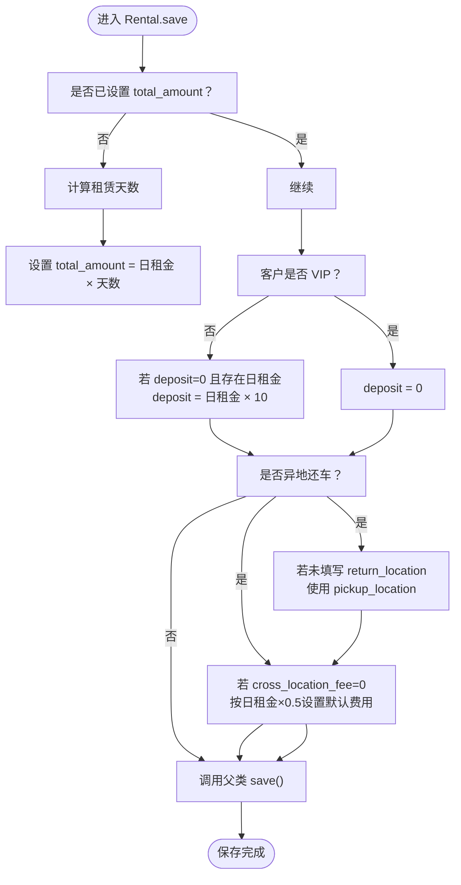
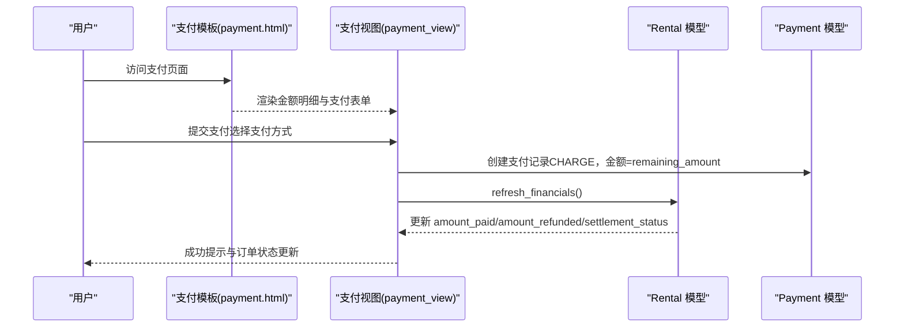
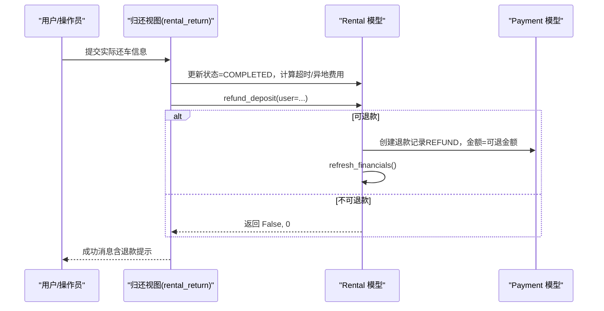
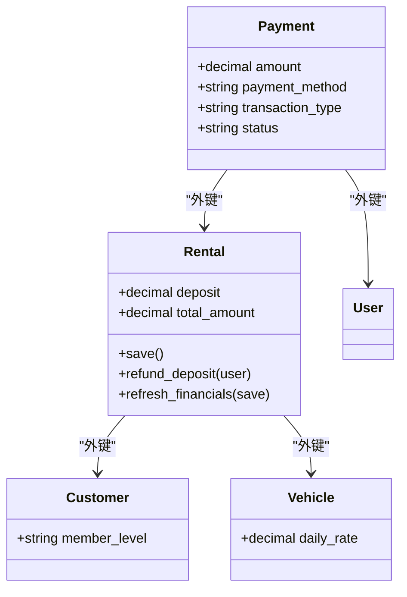

# 押金

<cite>
**本文引用的文件**
- [rentals/models.py](file://code/car_rental_system/rentals/models.py)
- [accounts/models.py](file://code/car_rental_system/accounts/models.py)
- [templates/accounts/payment.html](file://code/car_rental_system/templates/accounts/payment.html)
- [accounts/views.py](file://code/car_rental_system/accounts/views.py)
- [customers/models.py](file://code/car_rental_system/customers/models.py)
- [rentals/views.py](file://code/car_rental_system/rentals/views.py)
- [rentals/forms.py](file://code/car_rental_system/rentals/forms.py)
- [rentals/management/commands/update_historical_orders.py](file://code/car_rental_system/rentals/management/commands/update_historical_orders.py)
- [退款信息显示说明.md](file://code/car_rental_system/退款信息显示说明.md)
</cite>

## 目录
1. [简介](#简介)
2. [项目结构](#项目结构)
3. [核心组件](#核心组件)
4. [架构总览](#架构总览)
5. [详细组件分析](#详细组件分析)
6. [依赖关系分析](#依赖关系分析)
7. [性能考量](#性能考量)
8. [故障排查指南](#故障排查指南)
9. [结论](#结论)
10. [附录](#附录)

## 简介
本文件全面解析押金系统的实现机制，围绕 Rental 模型中 deposit 字段的计算规则展开：VIP 用户押金为 0，普通用户押金为日租金的 10 倍。文档详细说明 models.py 中 save 方法如何在保存订单时自动设置押金金额；结合支付系统，说明押金在 payment.html 模板中的显示与处理流程；阐述订单完成后押金自动退还的机制，包括 refund_deposit 方法的调用与退款记录的创建；最后提供押金计算、收取与退还的完整生命周期示例。

## 项目结构
押金系统涉及以下关键模块：
- 订单模型与业务逻辑：rentals/models.py
- 支付与退款记录：accounts/models.py
- 支付页面与汇总：accounts/views.py、templates/accounts/payment.html
- 客户会员等级：customers/models.py
- 归还与状态流转：rentals/views.py
- 表单与自动计算：rentals/forms.py
- 历史订单批量处理：rentals/management/commands/update_historical_orders.py
- 历史遗留问题说明：退款信息显示说明.md

图表来源
- [rentals/models.py](file://code/car_rental_system/rentals/models.py#L246-L271)
- [accounts/models.py](file://code/car_rental_system/accounts/models.py#L147-L251)
- [accounts/views.py](file://code/car_rental_system/accounts/views.py#L1291-L1360)
- [templates/accounts/payment.html](file://code/car_rental_system/templates/accounts/payment.html#L1-L147)
- [rentals/views.py](file://code/car_rental_system/rentals/views.py#L279-L392)

章节来源
- [rentals/models.py](file://code/car_rental_system/rentals/models.py#L12-L169)
- [accounts/models.py](file://code/car_rental_system/accounts/models.py#L147-L251)
- [templates/accounts/payment.html](file://code/car_rental_system/templates/accounts/payment.html#L1-L147)
- [accounts/views.py](file://code/car_rental_system/accounts/views.py#L1291-L1360)
- [customers/models.py](file://code/car_rental_system/customers/models.py#L7-20)
- [rentals/views.py](file://code/car_rental_system/rentals/views.py#L279-L392)

## 核心组件
- Rental 模型
  - deposit 字段：存储订单押金金额
  - save 方法：在保存时自动计算 total_amount、deposit，并处理异地还车与费用
  - refund_deposit 方法：订单完成后自动退还押金并创建退款记录
  - refresh_financials 方法：基于支付记录刷新 amount_paid/amount_refunded/settlement_status
- Payment 模型
  - 存储支付与退款记录，包含金额、方式、类型、状态等
- Customer 模型
  - member_level：决定 VIP/普通会员，影响押金规则
- 视图与模板
  - accounts/views.py 的 payment_view：负责支付页面渲染与支付记录创建
  - templates/accounts/payment.html：展示金额明细、支付方式与支付记录

章节来源
- [rentals/models.py](file://code/car_rental_system/rentals/models.py#L246-L271)
- [rentals/models.py](file://code/car_rental_system/rentals/models.py#L334-L394)
- [accounts/models.py](file://code/car_rental_system/accounts/models.py#L147-L251)
- [customers/models.py](file://code/car_rental_system/customers/models.py#L7-20)
- [accounts/views.py](file://code/car_rental_system/accounts/views.py#L1291-L1360)
- [templates/accounts/payment.html](file://code/car_rental_system/templates/accounts/payment.html#L1-L147)

## 架构总览
押金系统的关键交互如下：
- 订单创建/更新时，Rental.save 自动设置押金（VIP=0，普通=日租金×10）
- 用户在支付页面支付“应付总额（含押金）”
- 订单完成时，系统自动退还押金并创建退款记录
- 支付页面与订单详情页通过 get_payment_summary 展示已支付、已退款、净支付与待支付金额

图表来源
- [accounts/views.py](file://code/car_rental_system/accounts/views.py#L1291-L1360)
- [accounts/views.py](file://code/car_rental_system/accounts/views.py#L243-L268)
- [rentals/models.py](file://code/car_rental_system/rentals/models.py#L246-L271)
- [rentals/models.py](file://code/car_rental_system/rentals/models.py#L296-L333)
- [templates/accounts/payment.html](file://code/car_rental_system/templates/accounts/payment.html#L1-L147)

## 详细组件分析

### 押金计算规则与保存逻辑（Rental.save）
- 计算基础租金：租赁天数 × 日租金
- VIP 用户押金为 0；普通用户押金为日租金 × 10
- 异地还车逻辑：若勾选异地还车但未填写还车地点，默认使用取车地点；若异地还车费用为 0，默认按日租金的 0.5 计算
- 保存前自动设置 deposit 与 total_amount，避免重复计算

图表来源
- [rentals/models.py](file://code/car_rental_system/rentals/models.py#L246-L271)

章节来源
- [rentals/models.py](file://code/car_rental_system/rentals/models.py#L246-L271)

### 支付页面展示与处理（payment.html 与 payment_view）
- 模板展示：
  - 订单基本信息（车辆、起止日期、天数）
  - 金额明细：基础租金、押金、异地还车费用、应付总额、已支付、已退款、净支付、待支付
  - 支付说明与支付记录列表
- 视图逻辑：
  - 校验订单归属与状态（仅 PENDING/ONGOING 可支付）
  - 计算 remaining_amount（应付总额 - 已支付）
  - 提交时创建 CHARGE 类型支付记录，金额为 remaining_amount
  - 调用 refresh_financials 刷新结算状态

图表来源
- [templates/accounts/payment.html](file://code/car_rental_system/templates/accounts/payment.html#L1-L147)
- [accounts/views.py](file://code/car_rental_system/accounts/views.py#L1291-L1360)
- [accounts/views.py](file://code/car_rental_system/accounts/views.py#L243-L268)
- [rentals/models.py](file://code/car_rental_system/rentals/models.py#L296-L333)

章节来源
- [templates/accounts/payment.html](file://code/car_rental_system/templates/accounts/payment.html#L1-L147)
- [accounts/views.py](file://code/car_rental_system/accounts/views.py#L1291-L1360)
- [accounts/views.py](file://code/car_rental_system/accounts/views.py#L243-L268)
- [rentals/models.py](file://code/car_rental_system/rentals/models.py#L296-L333)

### 订单完成后的自动退款（refund_deposit 与归还流程）
- 归还流程：
  - rental_return 视图将订单状态更新为 COMPLETED，并计算超时还车费用与异地还车费用
  - 调用 rental.refund_deposit(user=...) 自动退还押金
  - 刷新财务信息，更新 settlement_status
- refund_deposit 逻辑：
  - 若押金为 0 或已全部退款，直接返回
  - 否则计算可退金额（押金 - 已退款），优先从支付记录中获取退款用户，否则使用客户关联用户
  - 创建 REFUND 类型支付记录，状态为 REFUNDED
  - 调用 refresh_financials 刷新累计支付/退款

图表来源
- [rentals/views.py](file://code/car_rental_system/rentals/views.py#L279-L392)
- [rentals/models.py](file://code/car_rental_system/rentals/models.py#L334-L394)

章节来源
- [rentals/views.py](file://code/car_rental_system/rentals/views.py#L279-L392)
- [rentals/models.py](file://code/car_rental_system/rentals/models.py#L334-L394)

### 历史订单批量处理与退款显示
- 历史订单命令：
  - update_historical_orders：为已完成订单退还押金并刷新财务信息
  - update_expired_rentals：自动结算已完成订单的押金/财务数据
- 退款信息显示说明：
  - 若历史订单未显示退款，可通过批量命令刷新；或在查看订单详情/消费明细时自动刷新

章节来源
- [rentals/management/commands/update_historical_orders.py](file://code/car_rental_system/rentals/management/commands/update_historical_orders.py#L65-L211)
- [rentals/management/commands/update_historical_orders.py](file://code/car_rental_system/rentals/management/commands/update_historical_orders.py#L213-L270)
- [退款信息显示说明.md](file://code/car_rental_system/退款信息显示说明.md#L1-L124)

## 依赖关系分析
- Rental 依赖 Customer 与 Vehicle（通过外键）
- Payment 依赖 Rental 与 User（通过外键）
- 支付视图依赖 Payment 模型与 get_payment_summary
- 归还视图依赖 Rental 与 Payment，并调用 refund_deposit

图表来源
- [rentals/models.py](file://code/car_rental_system/rentals/models.py#L12-L169)
- [accounts/models.py](file://code/car_rental_system/accounts/models.py#L147-L251)
- [customers/models.py](file://code/car_rental_system/customers/models.py#L7-20)

章节来源
- [rentals/models.py](file://code/car_rental_system/rentals/models.py#L12-L169)
- [accounts/models.py](file://code/car_rental_system/accounts/models.py#L147-L251)
- [customers/models.py](file://code/car_rental_system/customers/models.py#L7-20)

## 性能考量
- 自动状态更新使用缓存（每 5 分钟最多更新一次），避免频繁数据库写入
- 订单列表与筛选使用 select_related 与缓存，减少查询次数
- refresh_financials 使用聚合查询一次性统计支付/退款，降低多次查询成本

章节来源
- [rentals/models.py](file://code/car_rental_system/rentals/models.py#L171-L229)
- [rentals/views.py](file://code/car_rental_system/rentals/views.py#L61-L126)
- [rentals/models.py](file://code/car_rental_system/rentals/models.py#L296-L333)

## 故障排查指南
- 支付页面未显示退款
  - 执行批量更新命令为历史订单创建退款记录或刷新财务信息
  - 查看订单详情/消费明细时系统会自动刷新财务信息
- 退款金额不正确
  - 退款金额 = 订单押金 - 已退款金额；若订单无用户账号关联，无法创建退款记录
- 历史订单无退款记录
  - 订单状态需为已完成且有押金；或执行批量更新命令

章节来源
- [退款信息显示说明.md](file://code/car_rental_system/退款信息显示说明.md#L1-L124)
- [rentals/management/commands/update_historical_orders.py](file://code/car_rental_system/rentals/management/commands/update_historical_orders.py#L65-L211)

## 结论
押金系统通过 Rental.save 自动计算 VIP/普通用户的押金，结合 Payment 模型记录支付与退款，最终在订单完成时自动退还押金并刷新财务状态。支付页面清晰展示金额构成与支付记录，配合批量命令与自动刷新机制，确保历史订单的退款信息准确显示。整体设计在保证业务正确性的同时，兼顾了性能与可维护性。

## 附录

### 押金生命周期示例（从创建到退还）
- 创建订单
  - 选择客户与车辆，系统根据日租金与天数计算基础租金
  - VIP 客户：deposit=0；普通客户：deposit=日租金×10
- 支付阶段
  - 用户在支付页面支付应付总额（含押金）
  - 系统创建 CHARGE 记录，refresh_financials 更新累计支付与结算状态
- 归还与完成
  - 实际还车后，系统计算超时/异地费用并更新状态为 COMPLETED
  - 自动调用 refund_deposit，创建 REFUND 记录并刷新财务信息
- 退款显示
  - 支付记录中出现 REFUND 类型记录；订单详情/消费明细显示已退款金额

章节来源
- [rentals/models.py](file://code/car_rental_system/rentals/models.py#L246-L271)
- [rentals/models.py](file://code/car_rental_system/rentals/models.py#L334-L394)
- [accounts/views.py](file://code/car_rental_system/accounts/views.py#L1291-L1360)
- [templates/accounts/payment.html](file://code/car_rental_system/templates/accounts/payment.html#L1-L147)
- [rentals/views.py](file://code/car_rental_system/rentals/views.py#L279-L392)