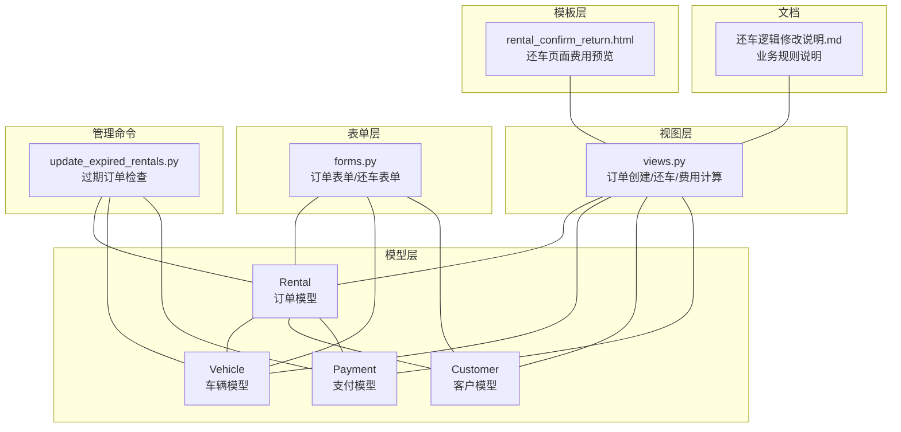
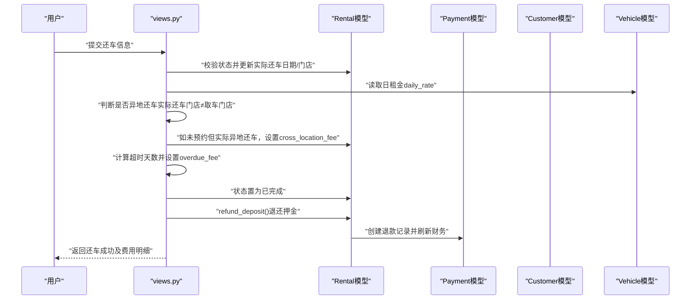
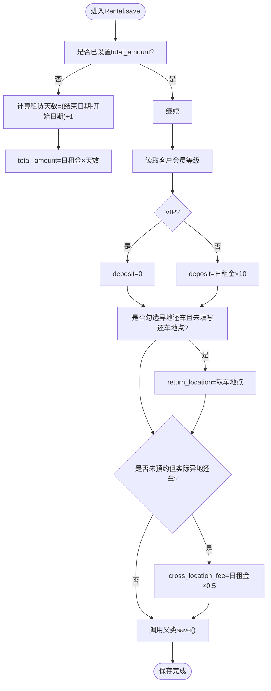
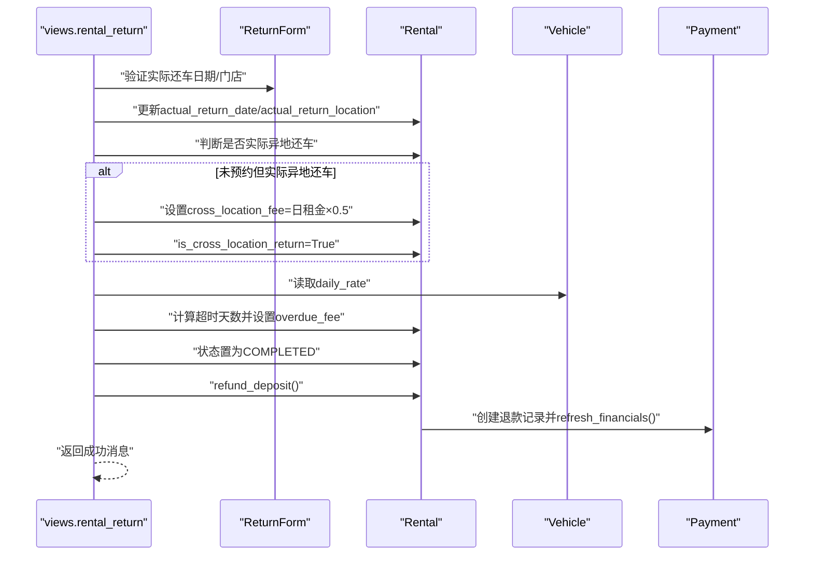
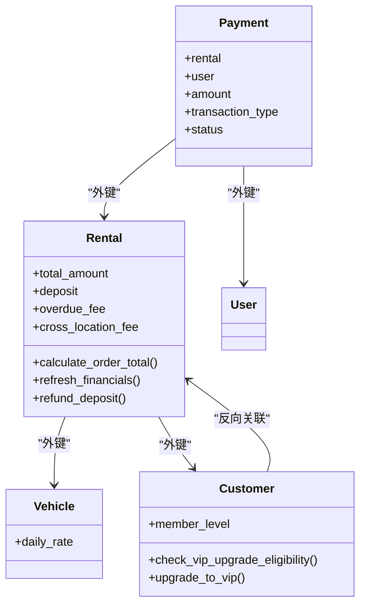

# 费用计算逻辑

<cite>
**本文引用的文件**
- [rentals/models.py](file://code/car_rental_system/rentals/models.py)
- [rentals/views.py](file://code/car_rental_system/rentals/views.py)
- [rentals/forms.py](file://code/car_rental_system/rentals/forms.py)
- [vehicles/models.py](file://code/car_rental_system/vehicles/models.py)
- [customers/models.py](file://code/car_rental_system/customers/models.py)
- [accounts/models.py](file://code/car_rental_system/accounts/models.py)
- [rentals/management/commands/update_expired_rentals.py](file://code/car_rental_system/rentals/management/commands/update_expired_rentals.py)
- [templates/rentals/rental_confirm_return.html](file://code/car_rental_system/templates/rentals/rental_confirm_return.html)
- [还车逻辑修改说明.md](file://code/car_rental_system/还车逻辑修改说明.md)
</cite>

## 目录
1. [简介](#简介)
2. [项目结构](#项目结构)
3. [核心组件](#核心组件)
4. [架构概览](#架构概览)
5. [详细组件分析](#详细组件分析)
6. [依赖关系分析](#依赖关系分析)
7. [性能考量](#性能考量)
8. [故障排查指南](#故障排查指南)
9. [结论](#结论)
10. [附录](#附录)

## 简介
本文件围绕“租赁订单的费用计算体系”展开，覆盖基础租金、VIP折扣、押金、异地还车费用和超时还车费用五大组成部分，并深入解析Rental模型的save方法如何在保存时自动计算total_amount与deposit；详解views.py中的calculate_rental_amount与calculate_rental_cost函数，解释VIP会员10%折扣的实现逻辑；结合还车逻辑修改说明，阐述超时还车费用与异地还车费用的计算规则；最后提供费用计算的伪代码与业务场景示例，帮助读者快速掌握系统收费机制。

## 项目结构
围绕费用计算的关键模块与文件如下：
- 模型层：Rental（订单）、Vehicle（车辆）、Customer（客户）、Payment（支付）
- 视图层：rentals/views.py（订单创建、还车、费用计算）
- 表单层：rentals/forms.py（订单表单、还车表单）
- 模板层：templates/rentals/rental_confirm_return.html（还车页面费用预览）
- 管理命令：rentals/management/commands/update_expired_rentals.py（过期订单检查）
- 文档：还车逻辑修改说明.md（业务规则说明）

图表来源
- [rentals/models.py](file://code/car_rental_system/rentals/models.py#L1-L120)
- [vehicles/models.py](file://code/car_rental_system/vehicles/models.py#L1-L85)
- [customers/models.py](file://code/car_rental_system/customers/models.py#L1-L160)
- [accounts/models.py](file://code/car_rental_system/accounts/models.py#L147-L251)
- [rentals/views.py](file://code/car_rental_system/rentals/views.py#L469-L534)
- [rentals/forms.py](file://code/car_rental_system/rentals/forms.py#L1-L120)
- [templates/rentals/rental_confirm_return.html](file://code/car_rental_system/templates/rentals/rental_confirm_return.html#L1-L120)
- [rentals/management/commands/update_expired_rentals.py](file://code/car_rental_system/rentals/management/commands/update_expired_rentals.py#L1-L191)
- [还车逻辑修改说明.md](file://code/car_rental_system/还车逻辑修改说明.md#L1-L229)

章节来源
- [rentals/models.py](file://code/car_rental_system/rentals/models.py#L1-L120)
- [rentals/views.py](file://code/car_rental_system/rentals/views.py#L469-L534)
- [rentals/forms.py](file://code/car_rental_system/rentals/forms.py#L1-L120)
- [templates/rentals/rental_confirm_return.html](file://code/car_rental_system/templates/rentals/rental_confirm_return.html#L1-L120)
- [rentals/management/commands/update_expired_rentals.py](file://code/car_rental_system/rentals/management/commands/update_expired_rentals.py#L1-L191)
- [还车逻辑修改说明.md](file://code/car_rental_system/还车逻辑修改说明.md#L1-L229)

## 核心组件
- Rental模型：负责订单的费用字段维护（total_amount、deposit、overdue_fee、cross_location_fee），以及订单总额计算与财务刷新。
- Vehicle模型：提供日租金daily_rate，作为费用计算的基础单价。
- Customer模型：提供会员等级member_level，决定VIP折扣。
- Payment模型：记录支付与退款流水，支持订单完成后的押金退还与财务刷新。
- 视图函数：calculate_rental_amount（创建/更新订单时计算基础费用+VIP折扣）、calculate_rental_cost（展示费用明细）、rental_return（还车时计算超时与异地还车费用并完成订单）。
- 表单：ReturnForm（还车表单，校验还车日期与还车门店）。
- 模板：rental_confirm_return.html（还车页面实时费用预览）。
- 管理命令：update_expired_rentals.py（检查过期订单，不自动完成，仅提醒）。

章节来源
- [rentals/models.py](file://code/car_rental_system/rentals/models.py#L1-L120)
- [vehicles/models.py](file://code/car_rental_system/vehicles/models.py#L1-L85)
- [customers/models.py](file://code/car_rental_system/customers/models.py#L1-L160)
- [accounts/models.py](file://code/car_rental_system/accounts/models.py#L147-L251)
- [rentals/views.py](file://code/car_rental_system/rentals/views.py#L469-L534)
- [rentals/forms.py](file://code/car_rental_system/rentals/forms.py#L312-L364)
- [templates/rentals/rental_confirm_return.html](file://code/car_rental_system/templates/rentals/rental_confirm_return.html#L1-L120)
- [rentals/management/commands/update_expired_rentals.py](file://code/car_rental_system/rentals/management/commands/update_expired_rentals.py#L1-L191)

## 架构概览
费用计算贯穿“订单创建/更新—还车—结算”的全流程，关键交互如下：
- 订单创建/更新：views.calculate_rental_amount基于日租金与天数计算基础费用，并按VIP等级应用10%折扣，结果写入Rental.total_amount。
- 订单保存：Rental.save在未设置total_amount时自动计算total_amount，并按会员等级设置deposit（VIP为0，普通用户为日租金的10倍）。
- 还车处理：views.rental_return根据实际还车日期与取车/还车门店，计算超时还车费用与异地还车费用，更新订单状态为已完成，并退还押金。
- 费用展示：views.calculate_rental_cost汇总基础费用、折扣、押金、超时费用、异地还车费用，供详情页展示。
- 页面预览：模板rental_confirm_return.html在前端实时计算并展示超时费用与异地还车费用。

图表来源
- [rentals/views.py](file://code/car_rental_system/rentals/views.py#L279-L392)
- [rentals/models.py](file://code/car_rental_system/rentals/models.py#L246-L333)
- [accounts/models.py](file://code/car_rental_system/accounts/models.py#L147-L251)
- [customers/models.py](file://code/car_rental_system/customers/models.py#L101-L160)
- [vehicles/models.py](file://code/car_rental_system/vehicles/models.py#L45-L51)

章节来源
- [rentals/views.py](file://code/car_rental_system/rentals/views.py#L279-L392)
- [rentals/models.py](file://code/car_rental_system/rentals/models.py#L246-L333)
- [accounts/models.py](file://code/car_rental_system/accounts/models.py#L147-L251)
- [customers/models.py](file://code/car_rental_system/customers/models.py#L101-L160)
- [vehicles/models.py](file://code/car_rental_system/vehicles/models.py#L45-L51)

## 详细组件分析

### Rental模型：费用字段与自动计算
- 总金额total_amount：在未设置时由Rental.save根据日租金与租赁天数自动计算。
- 押金deposit：若客户为VIP则为0，否则为日租金的10倍；若未设置则按上述规则补全。
- 异地还车字段：is_cross_location_return、return_location、cross_location_fee；若勾选异地还车但未填写还车地点，则回填取车地点；若未预约但实际异地还车，默认异地还车费用为日租金的50%。
- 订单总额calculate_order_total：返回基础租金+押金+异地还车费用+超时还车费用（若未预约异地还车则异地费用为0）。
- 财务刷新refresh_financials：根据支付记录聚合累计支付与退款，更新结算状态与结算时间。
- 押金退还refund_deposit：在订单完成后按可退额度创建退款记录并刷新财务。

图表来源
- [rentals/models.py](file://code/car_rental_system/rentals/models.py#L246-L271)

章节来源
- [rentals/models.py](file://code/car_rental_system/rentals/models.py#L246-L333)

### 视图函数：费用计算与还车逻辑
- calculate_rental_amount：计算基础费用（日租金×天数），若客户为VIP则再打9折（即折扣10%）。
- calculate_rental_cost：汇总基础费用、VIP折扣、押金、超时费用（overdue_fee或根据实际还车日期推导）、异地还车费用（cross_location_fee），并计算总费用。
- rental_return：还车时的主流程，包括：
  - 校验状态（仅进行中/已超时未归还）
  - 计算实际还车门店与是否异地还车
  - 若未预约但实际异地还车，设置异地还车费用（日租金×0.5）
  - 若超期还车，计算超时费用（日租金×超时天数）
  - 状态置为已完成，退还押金，刷新财务，检查VIP升级条件，返回成功消息。

图表来源
- [rentals/views.py](file://code/car_rental_system/rentals/views.py#L279-L392)
- [rentals/forms.py](file://code/car_rental_system/rentals/forms.py#L312-L364)
- [vehicles/models.py](file://code/car_rental_system/vehicles/models.py#L45-L51)
- [accounts/models.py](file://code/car_rental_system/accounts/models.py#L147-L251)

章节来源
- [rentals/views.py](file://code/car_rental_system/rentals/views.py#L469-L534)
- [rentals/views.py](file://code/car_rental_system/rentals/views.py#L279-L392)
- [rentals/forms.py](file://code/car_rental_system/rentals/forms.py#L312-L364)
- [vehicles/models.py](file://code/car_rental_system/vehicles/models.py#L45-L51)
- [accounts/models.py](file://code/car_rental_system/accounts/models.py#L147-L251)

### 表单与模板：还车输入与费用预览
- ReturnForm：校验实际还车日期不得晚于今天，还车门店可选，默认使用取车门店。
- rental_confirm_return.html：前端实时计算并展示基础费用、VIP折扣、超时费用、异地还车费用与最终费用，区分已预约与未预约异地还车场景。

章节来源
- [rentals/forms.py](file://code/car_rental_system/rentals/forms.py#L312-L364)
- [templates/rentals/rental_confirm_return.html](file://code/car_rental_system/templates/rentals/rental_confirm_return.html#L198-L312)

### 管理命令与业务规则
- update_expired_rentals.py：检查过期订单并更新为“已超时未归还”，不自动完成订单，仅提醒客户还车。
- 还车逻辑修改说明.md：明确基础费用=日租金×天数，VIP享受10%折扣；异地还车费用=日租金×0.5（未预约但实际异地还车）；超时还车费用=超时天数×日租金；押金默认=日租金×10，订单完成后退还。

章节来源
- [rentals/management/commands/update_expired_rentals.py](file://code/car_rental_system/rentals/management/commands/update_expired_rentals.py#L1-L191)
- [还车逻辑修改说明.md](file://code/car_rental_system/还车逻辑修改说明.md#L140-L157)

## 依赖关系分析
- 模型间依赖：Rental外键Customer与Vehicle；Payment外键Rental与User；Customer通过Rental参与VIP升级逻辑。
- 视图依赖：views.rental_return依赖ReturnForm、Rental、Vehicle、Payment；views.calculate_rental_amount/calculate_rental_cost依赖Rental、Customer、Vehicle。
- 模板依赖：rental_confirm_return.html依赖Rental、Vehicle、Customer，前端脚本实时计算费用。

图表来源
- [rentals/models.py](file://code/car_rental_system/rentals/models.py#L1-L120)
- [vehicles/models.py](file://code/car_rental_system/vehicles/models.py#L1-L85)
- [customers/models.py](file://code/car_rental_system/customers/models.py#L1-L160)
- [accounts/models.py](file://code/car_rental_system/accounts/models.py#L147-L251)

章节来源
- [rentals/models.py](file://code/car_rental_system/rentals/models.py#L1-L120)
- [vehicles/models.py](file://code/car_rental_system/vehicles/models.py#L1-L85)
- [customers/models.py](file://code/car_rental_system/customers/models.py#L1-L160)
- [accounts/models.py](file://code/car_rental_system/accounts/models.py#L147-L251)

## 性能考量
- 订单状态自动更新采用缓存控制频率，避免频繁更新。
- 费用计算涉及聚合查询与事务，建议在批量操作时合并更新，减少数据库往返。
- 前端费用预览使用JavaScript实时计算，减轻服务器压力，但需注意精度与边界值处理。

[本节为通用指导，无需特定文件来源]

## 故障排查指南
- VIP折扣未生效：检查Customer.member_level是否为VIP，确认views.calculate_rental_amount在创建/更新时被调用。
- 异地还车费用异常：确认ReturnForm是否正确传入actual_return_location，rental_return是否检测到实际还车门店与取车门店不同。
- 超时还车费用未计算：确认actual_return_date是否超过end_date，且rental_return是否计算了超时天数并设置overdue_fee。
- 押金未退还：检查Rental.refund_deposit是否被调用，Payment退款记录是否创建，refresh_financials是否刷新。
- 订单状态异常：确认update_expired_rentals.py仅更新为“已超时未归还”，不自动完成，需用户还车后才完成。

章节来源
- [rentals/views.py](file://code/car_rental_system/rentals/views.py#L279-L392)
- [rentals/models.py](file://code/car_rental_system/rentals/models.py#L246-L333)
- [accounts/models.py](file://code/car_rental_system/accounts/models.py#L147-L251)
- [rentals/management/commands/update_expired_rentals.py](file://code/car_rental_system/rentals/management/commands/update_expired_rentals.py#L1-L191)

## 结论
系统通过Rental.save与views函数协同实现了完整的费用计算闭环：基础租金×天数、VIP10%折扣、押金（VIP为0、普通用户为日租金10倍）、异地还车费用（未预约但实际异地还车按日租金50%收取）、超时还车费用（按日租金计算）。还车逻辑强调“还车后完成订单”，并通过模板与管理命令提升用户体验与运营效率。

[本节为总结性内容，无需特定文件来源]

## 附录

### 费用计算伪代码
- 基础费用
  - 天数 = 结束日期 - 开始日期 + 1
  - 基础费用 = 日租金 × 天数
  - 若客户为VIP：折扣 = 基础费用 × 0.1；最终基础费用 = 基础费用 - 折扣
- 押金
  - 若客户为VIP：押金 = 0
  - 否则：押金 = 日租金 × 10
- 异地还车费用
  - 若实际还车门店 ≠ 取车门店且未预约异地还车：异地还车费用 = 日租金 × 0.5
- 超时还车费用
  - 若实际还车日期 > 结束日期：超时天数 = 实际还车日期 - 结束日期；超时还车费用 = 日租金 × 超时天数
- 订单总额
  - 订单总额 = 基础费用 + 押金 + 异地还车费用 + 超时还车费用

### 业务场景示例
- 场景A：普通会员预订3天，日租金100元
  - 基础费用 = 100 × 3 = 300元；VIP折扣 = 0；押金 = 100 × 10 = 1000元；异地还车费用 = 0；超时还车费用 = 0；订单总额 = 1300元
- 场景B：VIP会员预订5天，日租金120元，异地还车（未预约但实际异地还车）
  - 基础费用 = 120 × 5 = 600元；VIP折扣 = 60元；最终基础费用 = 540元；押金 = 0；异地还车费用 = 120 × 0.5 = 60元；超时还车费用 = 0；订单总额 = 600元
- 场景C：普通会员超时2天还车（日租金150元）
  - 基础费用 = 150 × 4 = 600元；VIP折扣 = 0；押金 = 1500元；异地还车费用 = 0；超时还车费用 = 150 × 2 = 300元；订单总额 = 2400元

[本节为概念性说明，无需特定文件来源]