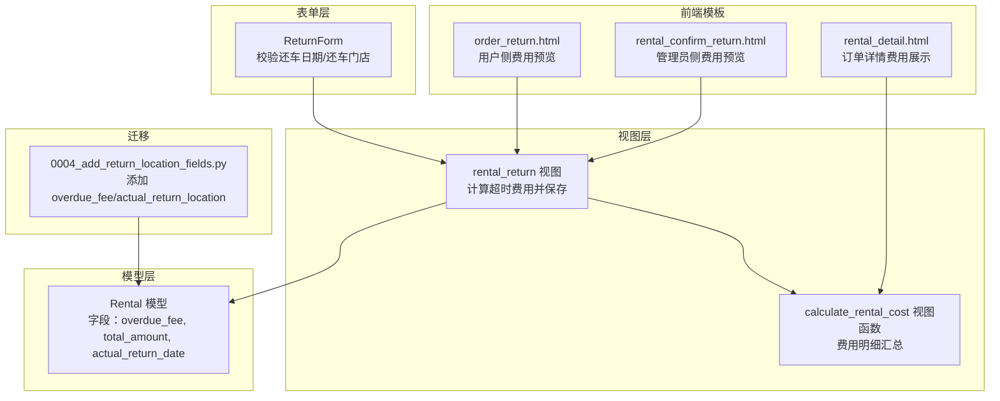

# 超时还车费用

<cite>
**本文引用的文件**
- [models.py](file://code/car_rental_system/rentals/models.py)
- [views.py](file://code/car_rental_system/rentals/views.py)
- [forms.py](file://code/car_rental_system/rentals/forms.py)
- [order_return.html](file://code/car_rental_system/templates/accounts/order_return.html)
- [rental_confirm_return.html](file://code/car_rental_system/templates/rentals/rental_confirm_return.html)
- [rental_detail.html](file://code/car_rental_system/templates/rentals/rental_detail.html)
- [0004_add_return_location_fields.py](file://code/car_rental_system/rentals/migrations/0004_add_return_location_fields.py)
</cite>

## 目录
1. [简介](#简介)
2. [项目结构](#项目结构)
3. [核心组件](#核心组件)
4. [架构概览](#架构概览)
5. [详细组件分析](#详细组件分析)
6. [依赖关系分析](#依赖关系分析)
7. [性能考量](#性能考量)
8. [故障排查指南](#故障排查指南)
9. [结论](#结论)
10. [附录](#附录)

## 简介
本文件聚焦“超时还车费用”的完整业务流程与实现细节，围绕 Rental 模型中的 overdue_fee 字段展开，系统性说明：
- 超时费用的计算公式：超时天数 × 日租金（extra_days × daily_rate）
- views.py 中 rental_return 视图在实际还车日期超过计划结束日期时如何计算超时天数与费用
- 前端模板中的费用预览功能如何实时计算并展示超时费用
- overdue_fee 字段在订单保存时的更新机制及其对订单总额的影响
- 提供完整的业务流程示例，帮助读者快速理解从还车到结算的全过程

## 项目结构
围绕“超时还车费用”相关的关键模块与文件如下：
- 模型层：Rental 模型（包含 overdue_fee、total_amount、actual_return_date 等字段）
- 视图层：rental_return 视图负责还车处理、费用计算与订单状态更新
- 表单层：ReturnForm 用于校验还车日期与还车门店
- 前端模板：用户侧还车页面与管理员侧还车确认页面均包含费用预览逻辑
- 迁移：新增 overdue_fee 与 actual_return_location 字段

图表来源
- [models.py](file://code/car_rental_system/rentals/models.py#L1-L120)
- [views.py](file://code/car_rental_system/rentals/views.py#L279-L392)
- [forms.py](file://code/car_rental_system/rentals/forms.py#L312-L351)
- [order_return.html](file://code/car_rental_system/templates/accounts/order_return.html#L538-L734)
- [rental_confirm_return.html](file://code/car_rental_system/templates/rentals/rental_confirm_return.html#L233-L312)
- [rental_detail.html](file://code/car_rental_system/templates/rentals/rental_detail.html#L299-L319)
- [0004_add_return_location_fields.py](file://code/car_rental_system/rentals/migrations/0004_add_return_location_fields.py#L1-L40)

章节来源
- [models.py](file://code/car_rental_system/rentals/models.py#L1-L120)
- [views.py](file://code/car_rental_system/rentals/views.py#L279-L392)
- [forms.py](file://code/car_rental_system/rentals/forms.py#L312-L351)
- [order_return.html](file://code/car_rental_system/templates/accounts/order_return.html#L538-L734)
- [rental_confirm_return.html](file://code/car_rental_system/templates/rentals/rental_confirm_return.html#L233-L312)
- [rental_detail.html](file://code/car_rental_system/templates/rentals/rental_detail.html#L299-L319)
- [0004_add_return_location_fields.py](file://code/car_rental_system/rentals/migrations/0004_add_return_location_fields.py#L1-L40)

## 核心组件
- Rental 模型
  - overdue_fee：超时还车费用，decimal 字段，最小值 0
  - total_amount：订单总金额（基础租金 + 押金 + 异地还车费用 + 超时费用）
  - actual_return_date：实际还车日期
  - calculate_order_total：计算订单总额（包含 overdue_fee）
- 视图函数
  - rental_return：还车处理主流程，计算超时费用并保存
  - calculate_rental_cost：费用明细汇总（含超时费用）
- 表单
  - ReturnForm：校验还车日期不得晚于今日；还车门店可选
- 前端模板
  - 用户侧 order_return.html：实时计算并展示超时费用
  - 管理员侧 rental_confirm_return.html：实时计算并展示超时费用
  - rental_detail.html：展示订单详情中的超时费用

章节来源
- [models.py](file://code/car_rental_system/rentals/models.py#L60-L74)
- [models.py](file://code/car_rental_system/rentals/models.py#L286-L295)
- [views.py](file://code/car_rental_system/rentals/views.py#L279-L392)
- [views.py](file://code/car_rental_system/rentals/views.py#L487-L533)
- [forms.py](file://code/car_rental_system/rentals/forms.py#L312-L351)
- [order_return.html](file://code/car_rental_system/templates/accounts/order_return.html#L538-L734)
- [rental_confirm_return.html](file://code/car_rental_system/templates/rentals/rental_confirm_return.html#L233-L312)
- [rental_detail.html](file://code/car_rental_system/templates/rentals/rental_detail.html#L299-L319)

## 架构概览
超时还车费用的端到端流程如下：
- 用户在 order_return.html 页面输入实际还车日期与还车门店，前端实时计算超时费用与异地还车费用，并展示“费用预览”
- 管理员在 rental_confirm_return.html 页面确认还车信息，前端同样实时计算并展示费用预览
- 提交后，rental_return 视图执行以下步骤：
  - 校验订单状态（仅进行中或已超时未归还）
  - 解析 ReturnForm 数据，设置 actual_return_date 与 actual_return_location
  - 若实际还车门店与取车门店不同，且未预约异地还车，则追加异地还车费用
  - 若实际还车日期晚于计划结束日期，计算超时天数并生成 overdue_fee
  - 将订单状态更新为已完成，退还押金，刷新财务信息
  - 展示包含超时费用在内的订单总额

图表来源
- [views.py](file://code/car_rental_system/rentals/views.py#L279-L392)
- [order_return.html](file://code/car_rental_system/templates/accounts/order_return.html#L538-L734)
- [rental_confirm_return.html](file://code/car_rental_system/templates/rentals/rental_confirm_return.html#L233-L312)
- [models.py](file://code/car_rental_system/rentals/models.py#L334-L394)

## 详细组件分析

### Rental 模型：overdue_fee 字段与订单总额
- 字段定义
  - overdue_fee：decimal，最小值 0，用于存储超时还车费用
  - total_amount：decimal，订单总金额（基础租金 + 押金 + 异地还车费用 + 超时费用）
- 订单总额计算
  - calculate_order_total：返回基础租金 + 押金 + 异地还车费用 + overdue_fee
- 保存时的总金额与押金
  - save：在未设置 total_amount 时，按 end_date - start_date + 1 计算基础租金；根据会员等级设置押金
- 财务刷新
  - refresh_financials：根据支付记录刷新 amount_paid/amount_refunded/settlement_status

章节来源
- [models.py](file://code/car_rental_system/rentals/models.py#L60-L74)
- [models.py](file://code/car_rental_system/rentals/models.py#L286-L295)
- [models.py](file://code/car_rental_system/rentals/models.py#L246-L271)
- [models.py](file://code/car_rental_system/rentals/models.py#L296-L333)

### views.py：rental_return 视图的超时费用计算
- 订单状态校验
  - 仅允许进行中或已超时未归还的订单执行还车
- 实际还车信息写入
  - actual_return_date、actual_return_location（未填写则回退到取车门店）
- 异地还车费用
  - 若实际还车门店不同于取车门店且未预约异地还车，则追加异地还车费用（默认日租金的 50%）
- 超时还车费用
  - 当 actual_return_date > end_date 时，计算 extra_days = actual_return_date - end_date，并设置 overdue_fee = daily_rate × extra_days
- 状态与车辆状态更新
  - 订单状态置为已完成；若无其他进行中订单，车辆状态置为 AVAILABLE
- 退款与财务刷新
  - refund_deposit：退还押金并创建退款记录
  - refresh_financials：刷新 amount_paid/amount_refunded/settlement_status

图表来源
- [views.py](file://code/car_rental_system/rentals/views.py#L279-L392)

章节来源
- [views.py](file://code/car_rental_system/rentals/views.py#L279-L392)

### views.py：calculate_rental_cost 的费用明细
- 计算逻辑要点
  - 基础信息：计划天数、基础费用、VIP 折扣
  - 超时费用：若 overdue_fee 存在，直接使用；否则在 actual_return_date > end_date 时计算 overdue_fee = daily_rate × extra_days
  - 异地还车费用：若 is_cross_location_return 为真，累加 cross_location_fee
  - 总额：total_amount += overdue_fee（若存在）

章节来源
- [views.py](file://code/car_rental_system/rentals/views.py#L487-L533)

### 前端模板：费用预览与实时计算
- 用户侧 order_return.html
  - 前端 JS：监听还车日期与还车门店变化，实时计算超时天数与费用，并展示“费用预览”
  - 超时费用计算：extra_days = Math.floor((returnDate - endDate) / (1000×60×60×24))；overdueAmount = extraDays × dailyRate
- 管理员侧 rental_confirm_return.html
  - 前端 JS：逻辑与用户侧一致，用于后台确认还车时的费用预览
- 订单详情 rental_detail.html
  - 展示超时费用与额外天数，便于核对

章节来源
- [order_return.html](file://code/car_rental_system/templates/accounts/order_return.html#L538-L734)
- [rental_confirm_return.html](file://code/car_rental_system/templates/rentals/rental_confirm_return.html#L233-L312)
- [rental_detail.html](file://code/car_rental_system/templates/rentals/rental_detail.html#L299-L319)

### 表单层：ReturnForm 的校验
- actual_return_date：不得晚于今日
- actual_return_location：可选，未填写则默认取车门店
- 作用：保证还车日期与还车门店的合法性，减少后端异常

章节来源
- [forms.py](file://code/car_rental_system/rentals/forms.py#L312-L351)

### 迁移：overdue_fee 与 actual_return_location 的引入
- 迁移文件新增 overdue_fee 与 actual_return_location 字段，支持超时还车费用与还车门店记录

章节来源
- [0004_add_return_location_fields.py](file://code/car_rental_system/rentals/migrations/0004_add_return_location_fields.py#L1-L40)

## 依赖关系分析
- 模型依赖
  - Rental 依赖 Vehicle（daily_rate）、Customer（member_level）
  - 订单总额依赖 overdue_fee、cross_location_fee、deposit、total_amount
- 视图依赖
  - rental_return 依赖 ReturnForm、Vehicle.daily_rate、Rental.save/refund_deposit/refresh_financials
  - calculate_rental_cost 依赖 Rental 的字段与属性
- 前端依赖
  - order_return.html 与 rental_confirm_return.html 依赖模板变量（start_date、end_date、daily_rate、member_level、pickup_location、is_cross_location_return 等）

图表来源
- [models.py](file://code/car_rental_system/rentals/models.py#L1-L120)
- [views.py](file://code/car_rental_system/rentals/views.py#L279-L392)
- [forms.py](file://code/car_rental_system/rentals/forms.py#L312-L351)
- [order_return.html](file://code/car_rental_system/templates/accounts/order_return.html#L538-L734)
- [rental_confirm_return.html](file://code/car_rental_system/templates/rentals/rental_confirm_return.html#L233-L312)
- [rental_detail.html](file://code/car_rental_system/templates/rentals/rental_detail.html#L299-L319)

## 性能考量
- 前端预览采用纯 JS 计算，避免不必要的网络请求，提升交互体验
- 视图层使用事务包裹还车处理，确保数据一致性
- 模型 save 中仅在必要时计算 total_amount，避免重复计算
- auto_update_status 使用缓存控制更新频率，降低数据库压力

[本节为通用建议，无需特定文件引用]

## 故障排查指南
- 超时费用未显示
  - 检查前端模板是否正确传入 start_date、end_date、daily_rate、member_level 等变量
  - 确认还车日期晚于计划结束日期，否则不会触发超时费用计算
- 超时费用未计入订单总额
  - 确认 rental_return 是否成功设置 overdue_fee 并保存订单
  - 检查 calculate_order_total 是否被调用或模板是否读取 overdue_fee
- 异地还车费用未追加
  - 确认实际还车门店与取车门店不同，且订单未预约异地还车
  - 确认视图逻辑已执行 cross_location_fee 追加
- 押金未退还
  - 检查 refund_deposit 是否被调用，以及 Payment 退款记录是否创建成功
  - 确认 refresh_financials 已刷新 amount_paid/amount_refunded/settlement_status

章节来源
- [views.py](file://code/car_rental_system/rentals/views.py#L279-L392)
- [models.py](file://code/car_rental_system/rentals/models.py#L296-L394)
- [order_return.html](file://code/car_rental_system/templates/accounts/order_return.html#L538-L734)
- [rental_confirm_return.html](file://code/car_rental_system/templates/rentals/rental_confirm_return.html#L233-L312)

## 结论
- 超时还车费用的计算遵循“超时天数 × 日租金”的简单而明确的规则
- views.py 的 rental_return 视图在还车时完成超时费用的计算与保存，并联动异地还车费用、押金退还与财务刷新
- 前端模板提供费用预览，使用户与管理员在提交前即可了解超时费用与最终订单总额
- overdue_fee 字段与 calculate_order_total 的配合，确保订单总额准确反映所有费用构成

[本节为总结性内容，无需特定文件引用]

## 附录

### 业务流程示例（完整版）
- 场景：某订单计划结束日期为 2025-06-10，日租金为 200 元
- 实际还车日期为 2025-06-13（超期 3 天）
- 实际还车门店与取车门店不同，且未预约异地还车
- 步骤：
  1) 用户在 order_return.html 输入实际还车日期与还车门店，前端预览显示超时费用 600 元（3 天 × 200 元/天），并追加异地还车费用 100 元（默认日租金 50%）
  2) 管理员在 rental_confirm_return.html 确认还车信息，前端再次预览费用明细
  3) 提交后，rental_return 视图：
     - 计算 extra_days = 3，overdue_fee = 600 元
     - 判断实际异地还车，追加 cross_location_fee = 100 元
     - 订单状态置为已完成，车辆状态置为 AVAILABLE
     - 退还押金并刷新财务信息
  4) 返回订单详情，显示订单总额为“基础费用 + 押金 + 异地还车费用 + 超时费用”

章节来源
- [views.py](file://code/car_rental_system/rentals/views.py#L279-L392)
- [order_return.html](file://code/car_rental_system/templates/accounts/order_return.html#L538-L734)
- [rental_confirm_return.html](file://code/car_rental_system/templates/rentals/rental_confirm_return.html#L233-L312)
- [rental_detail.html](file://code/car_rental_system/templates/rentals/rental_detail.html#L299-L319)