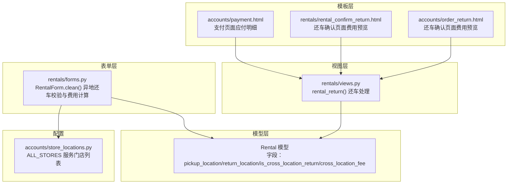
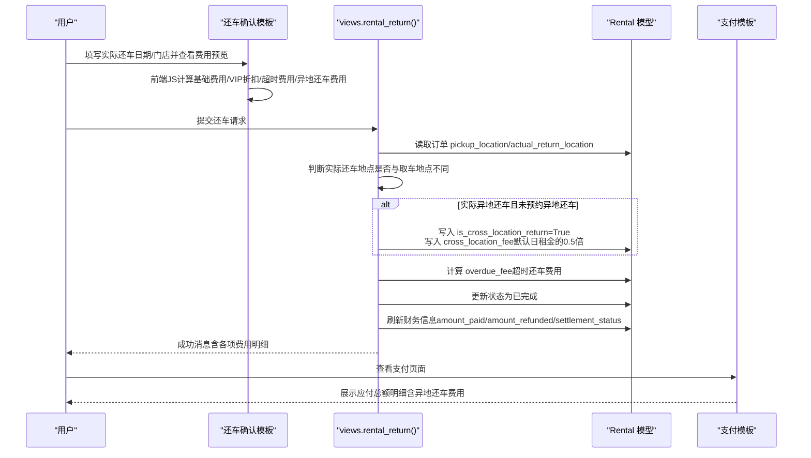
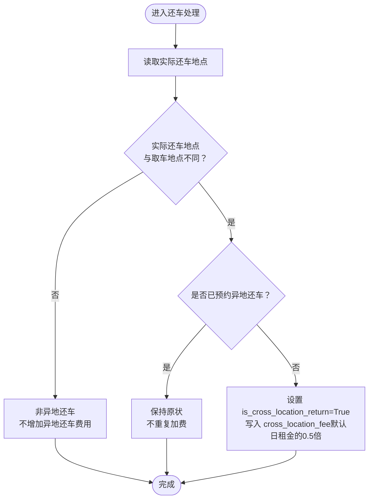
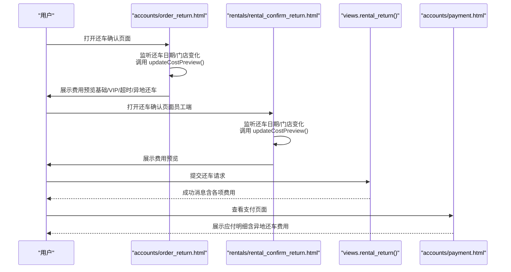
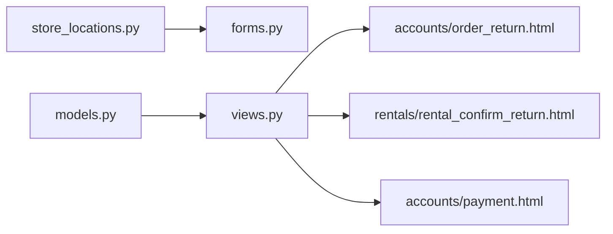

# 异地还车处理

<cite>
**本文引用的文件**
- [models.py](file://code/car_rental_system/rentals/models.py)
- [views.py](file://code/car_rental_system/rentals/views.py)
- [forms.py](file://code/car_rental_system/rentals/forms.py)
- [order_return.html](file://code/car_rental_system/templates/accounts/order_return.html)
- [payment.html](file://code/car_rental_system/templates/accounts/payment.html)
- [store_locations.py](file://code/car_rental_system/accounts/store_locations.py)
- [rental_confirm_return.html](file://code/car_rental_system/templates/rentals/rental_confirm_return.html)
</cite>

## 目录
1. [简介](#简介)
2. [项目结构](#项目结构)
3. [核心组件](#核心组件)
4. [架构总览](#架构总览)
5. [详细组件分析](#详细组件分析)
6. [依赖关系分析](#依赖关系分析)
7. [性能考量](#性能考量)
8. [故障排查指南](#故障排查指南)
9. [结论](#结论)

## 简介
本文件聚焦“异地还车（Cross-Location Return）”的判断逻辑与费用计算机制，系统通过比较订单的取车地点与用户提交的实际还车地点是否不同来判定异地还车情形；并基于此实现异地还车费用的计算与展示，最终写入订单结算信息。文档同时结合前端模板中的交互逻辑，说明用户在还车确认页面的费用预览与交互流程。

## 项目结构
围绕异地还车的关键代码分布在以下模块：
- 模型层：订单模型包含取车/还车地点、是否异地还车标志、异地还车费用等字段
- 视图层：还车处理视图负责判断实际还车地点差异、计算并写入异地还车费用
- 表单层：创建/更新订单时对异地还车逻辑进行校验与费用计算
- 模板层：还车确认页面提供费用预览与交互；支付页面展示最终应付金额明细
- 门店配置：提供服务门店列表，用于区分是否为服务门店范围内的还车

图表来源
- [models.py](file://code/car_rental_system/rentals/models.py#L83-L108)
- [views.py](file://code/car_rental_system/rentals/views.py#L279-L392)
- [forms.py](file://code/car_rental_system/rentals/forms.py#L11-121)
- [order_return.html](file://code/car_rental_system/templates/accounts/order_return.html#L388-L466)
- [rental_confirm_return.html](file://code/car_rental_system/templates/rentals/rental_confirm_return.html#L148-L216)
- [payment.html](file://code/car_rental_system/templates/accounts/payment.html#L56-L101)
- [store_locations.py](file://code/car_rental_system/accounts/store_locations.py#L61-L79)

章节来源
- [models.py](file://code/car_rental_system/rentals/models.py#L83-L108)
- [views.py](file://code/car_rental_system/rentals/views.py#L279-L392)
- [forms.py](file://code/car_rental_system/rentals/forms.py#L11-121)
- [order_return.html](file://code/car_rental_system/templates/accounts/order_return.html#L388-L466)
- [rental_confirm_return.html](file://code/car_rental_system/templates/rentals/rental_confirm_return.html#L148-L216)
- [payment.html](file://code/car_rental_system/templates/accounts/payment.html#L56-L101)
- [store_locations.py](file://code/car_rental_system/accounts/store_locations.py#L61-L79)

## 核心组件
- 订单模型字段
  - 取车地点：pickup_location
  - 实际还车地点：actual_return_location（保存在还车处理中）
  - 计划还车地点：return_location（仅在创建/更新订单时填写，用于标识是否预约异地还车）
  - 是否异地还车：is_cross_location_return（用于标识是否产生异地还车费用）
  - 异地还车费用：cross_location_fee（用于存储异地还车费用）

- 还车处理视图
  - 判断实际还车地点与取车地点是否不同，决定是否产生异地还车费用
  - 若租车时未勾选异地还车但实际异地还车，自动设置 is_cross_location_return 并写入 cross_location_fee
  - 计算超时还车费用并写入 overdue_fee
  - 更新订单状态为已完成并刷新财务信息

- 表单校验与费用计算
  - 创建/更新订单时，若勾选异地还车，校验还车地点与取车地点不同且在服务门店范围内
  - 若还车地点不在服务门店范围内，异地还车费用按默认日租金的1.5倍计算
  - 若在服务门店范围内，异地还车费用按默认日租金的0.5倍计算

- 前端模板
  - 还车确认页面提供费用预览，实时计算基础费用、VIP折扣、超时费用与异地还车费用
  - 支付页面展示应付总额明细，包含异地还车费用（当存在时）

章节来源
- [models.py](file://code/car_rental_system/rentals/models.py#L83-L108)
- [views.py](file://code/car_rental_system/rentals/views.py#L279-L392)
- [forms.py](file://code/car_rental_system/rentals/forms.py#L208-L259)
- [order_return.html](file://code/car_rental_system/templates/accounts/order_return.html#L524-L735)
- [rental_confirm_return.html](file://code/car_rental_system/templates/rentals/rental_confirm_return.html#L233-L312)
- [payment.html](file://code/car_rental_system/templates/accounts/payment.html#L56-L101)

## 架构总览
系统采用“模型-视图-模板”的分层架构，异地还车逻辑贯穿创建/更新订单阶段（表单校验与费用计算）与还车确认阶段（实际还车地点判断与费用写入），并在支付页面展示最终应付明细。

图表来源
- [views.py](file://code/car_rental_system/rentals/views.py#L279-L392)
- [models.py](file://code/car_rental_system/rentals/models.py#L286-L333)
- [order_return.html](file://code/car_rental_system/templates/accounts/order_return.html#L524-L735)
- [rental_confirm_return.html](file://code/car_rental_system/templates/rentals/rental_confirm_return.html#L233-L312)
- [payment.html](file://code/car_rental_system/templates/accounts/payment.html#L56-L101)

## 详细组件分析

### 判断逻辑：取车地点 vs 实际还车地点
- 判断依据
  - 若实际还车地点存在且与取车地点不同，则认定为“实际异地还车”
  - 若订单在创建/更新时已勾选“异地还车”，则视为“预约异地还车”
- 影响
  - 若为“实际异地还车”但未“预约异地还车”，系统会自动增加异地还车费用并标记为异地还车
  - 若为“预约异地还车”，则在还车时不再重复加收异地还车费用

图表来源
- [views.py](file://code/car_rental_system/rentals/views.py#L306-L322)

章节来源
- [views.py](file://code/car_rental_system/rentals/views.py#L306-L322)

### 费用计算规则
- 基础费用
  - 计划天数 × 日租金
  - VIP客户享受10%折扣
- 超时还车费用
  - 实际还车日期超过结束日期时，按“超期天数 × 日租金”计算
- 异地还车费用
  - 预约异地还车：若还车地点在服务门店范围内，费用默认为日租金的0.5倍；若不在服务门店范围内，费用为日租金的0.5倍的1.5倍（即日租金的0.75倍）
  - 实际异地还车（未预约）：系统自动设置费用为日租金的0.5倍
- 应付总额
  - 基础费用 ± VIP折扣 + 押金 + 超时费用 + 异地还车费用

章节来源
- [forms.py](file://code/car_rental_system/rentals/forms.py#L208-L259)
- [views.py](file://code/car_rental_system/rentals/views.py#L312-L331)
- [models.py](file://code/car_rental_system/rentals/models.py#L286-L295)

### 前端交互与费用预览
- 还车确认页面（用户端）
  - 用户填写实际还车日期与还车门店，前端JS实时计算并展示费用预览
  - 当还车门店与取车地点不同时，若未预约异地还车，会提示将增加异地还车费用
- 还车确认页面（员工端）
  - 同样提供费用预览，便于操作员核对
- 支付页面
  - 展示应付总额明细，包含异地还车费用（当存在时）

图表来源
- [order_return.html](file://code/car_rental_system/templates/accounts/order_return.html#L524-L735)
- [rental_confirm_return.html](file://code/car_rental_system/templates/rentals/rental_confirm_return.html#L233-L312)
- [views.py](file://code/car_rental_system/rentals/views.py#L279-L392)
- [payment.html](file://code/car_rental_system/templates/accounts/payment.html#L56-L101)

章节来源
- [order_return.html](file://code/car_rental_system/templates/accounts/order_return.html#L388-L466)
- [order_return.html](file://code/car_rental_system/templates/accounts/order_return.html#L524-L735)
- [rental_confirm_return.html](file://code/car_rental_system/templates/rentals/rental_confirm_return.html#L148-L216)
- [rental_confirm_return.html](file://code/car_rental_system/templates/rentals/rental_confirm_return.html#L233-L312)
- [payment.html](file://code/car_rental_system/templates/accounts/payment.html#L56-L101)

### 服务门店范围与费用差异
- 服务门店列表由配置文件提供
- 若还车地点在服务门店范围内：异地还车费用默认为日租金的0.5倍
- 若不在服务门店范围内：异地还车费用为日租金的0.75倍（默认0.5倍的1.5倍）

章节来源
- [store_locations.py](file://code/car_rental_system/accounts/store_locations.py#L61-L79)
- [forms.py](file://code/car_rental_system/rentals/forms.py#L235-L251)

## 依赖关系分析
- 模型依赖
  - 订单模型包含取车/还车地点、是否异地还车、异地还车费用等字段，供视图与模板使用
- 视图依赖
  - 还车处理视图依赖模型字段进行判断与写入
  - 计算费用详情的辅助函数依赖模型字段与车辆日租金
- 表单依赖
  - 表单校验依赖服务门店列表，以判断还车地点是否在服务范围内
- 模板依赖
  - 前端JS依赖模板上下文中的取车地点、还车地点、日租金、VIP状态等变量
  - 支付页面依赖视图传入的应付明细

图表来源
- [store_locations.py](file://code/car_rental_system/accounts/store_locations.py#L61-L79)
- [forms.py](file://code/car_rental_system/rentals/forms.py#L208-L259)
- [models.py](file://code/car_rental_system/rentals/models.py#L83-L108)
- [views.py](file://code/car_rental_system/rentals/views.py#L279-L392)
- [order_return.html](file://code/car_rental_system/templates/accounts/order_return.html#L388-L466)
- [rental_confirm_return.html](file://code/car_rental_system/templates/rentals/rental_confirm_return.html#L148-L216)
- [payment.html](file://code/car_rental_system/templates/accounts/payment.html#L56-L101)

章节来源
- [store_locations.py](file://code/car_rental_system/accounts/store_locations.py#L61-L79)
- [forms.py](file://code/car_rental_system/rentals/forms.py#L208-L259)
- [models.py](file://code/car_rental_system/rentals/models.py#L83-L108)
- [views.py](file://code/car_rental_system/rentals/views.py#L279-L392)
- [order_return.html](file://code/car_rental_system/templates/accounts/order_return.html#L388-L466)
- [rental_confirm_return.html](file://code/car_rental_system/templates/rentals/rental_confirm_return.html#L148-L216)
- [payment.html](file://code/car_rental_system/templates/accounts/payment.html#L56-L101)

## 性能考量
- 前端费用预览采用本地JS计算，减少不必要的网络请求
- 还车处理涉及数据库事务与状态更新，建议在高并发场景下关注锁竞争与缓存策略
- 订单财务刷新（累计支付/退款）使用聚合查询，注意索引与查询复杂度

## 故障排查指南
- 异地还车费用未正确计算
  - 检查还车确认页面是否正确识别实际还车地点与取车地点不同
  - 确认是否预约了异地还车，以及还车地点是否在服务门店范围内
- 超时还车费用未计入
  - 检查实际还车日期是否超过结束日期
  - 确认视图中是否正确计算并写入 overdue_fee
- 支付页面未显示异地还车费用
  - 确认订单中 cross_location_fee 是否已写入
  - 检查支付页面模板是否包含 has_cross_location_fee 上下文

章节来源
- [views.py](file://code/car_rental_system/rentals/views.py#L312-L331)
- [models.py](file://code/car_rental_system/rentals/models.py#L286-L333)
- [payment.html](file://code/car_rental_system/templates/accounts/payment.html#L56-L101)

## 结论
系统通过“取车地点 vs 实际还车地点”的简单而明确的判断，实现了异地还车的自动化处理：未预约但实际异地还车时自动追加费用，预约异地还车时按服务门店范围确定费用标准。前端费用预览与后端结算信息一致，确保用户体验与账务准确性。建议在后续迭代中引入更灵活的距离阶梯计费规则，并在表单与视图中统一实现该规则，以提升业务适配能力。