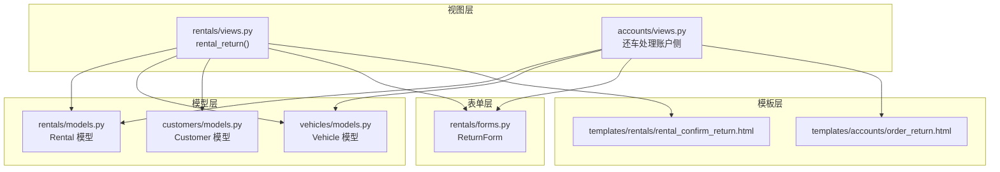
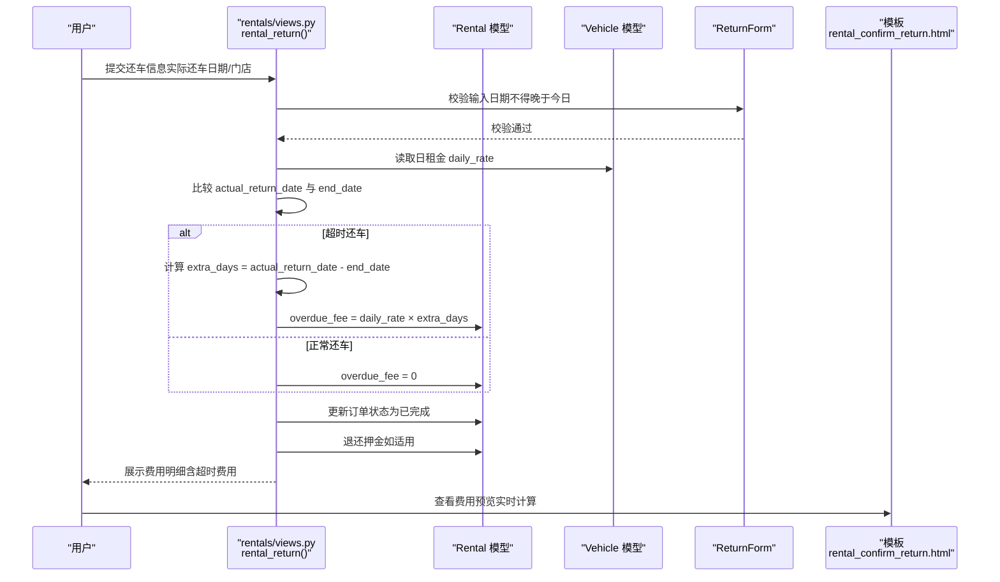
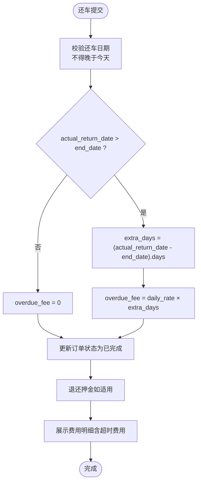
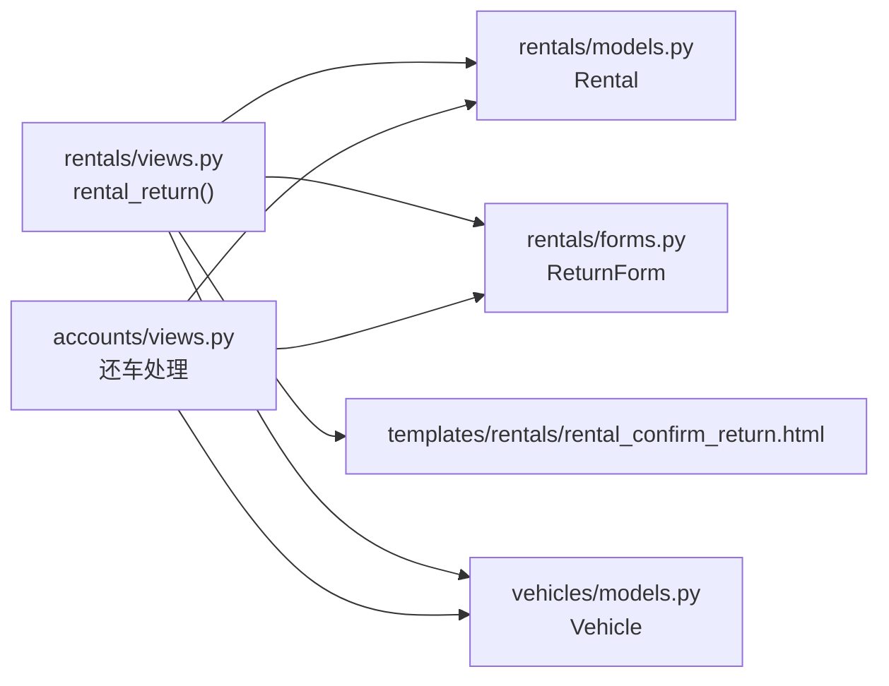

# 超时费用计算

<cite>
**本文引用的文件**
- [还车逻辑修改说明.md](file://code/car_rental_system/还车逻辑修改说明.md)
- [rentals/models.py](file://code/car_rental_system/rentals/models.py)
- [rentals/views.py](file://code/car_rental_system/rentals/views.py)
- [rentals/forms.py](file://code/car_rental_system/rentals/forms.py)
- [vehicles/models.py](file://code/car_rental_system/vehicles/models.py)
- [customers/models.py](file://code/car_rental_system/customers/models.py)
- [templates/rentals/rental_confirm_return.html](file://code/car_rental_system/templates/rentals/rental_confirm_return.html)
- [templates/accounts/order_return.html](file://code/car_rental_system/templates/accounts/order_return.html)
- [accounts/views.py](file://code/car_rental_system/accounts/views.py)
</cite>

## 目录
1. [简介](#简介)
2. [项目结构](#项目结构)
3. [核心组件](#核心组件)
4. [架构总览](#架构总览)
5. [详细组件分析](#详细组件分析)
6. [依赖关系分析](#依赖关系分析)
7. [性能考量](#性能考量)
8. [故障排查指南](#故障排查指南)
9. [结论](#结论)
10. [附录](#附录)

## 简介
本文件围绕“超时还车费用”的计算逻辑进行全面文档化，重点解释系统如何比较实际还车时间（actual_return_date）与计划结束时间（end_date），据此判断是否产生超时费用，并按“超时天数 × 日租金”累加 overdue_fee。文档同时说明费用计算的精度控制（不足一天按一天计）、上限设置策略以及与旧版固定罚款模式的差异，突出改进后的公平性与灵活性。最后提供关键代码片段路径，帮助定位实现细节。

## 项目结构
围绕超时还车费用的关键模块包括：
- 视图层：处理还车请求、计算费用、更新订单状态与车辆状态
- 模型层：存储订单、日租金、超时费用、异地还车费用等字段
- 表单层：约束还车日期与还车门店输入
- 模板层：前端费用预览与交互
- 客户与车辆模型：提供日租金与会员等级等上下文

图表来源
- [rentals/views.py](file://code/car_rental_system/rentals/views.py#L279-L392)
- [accounts/views.py](file://code/car_rental_system/accounts/views.py#L1178-L1203)
- [rentals/models.py](file://code/car_rental_system/rentals/models.py#L1-L160)
- [vehicles/models.py](file://code/car_rental_system/vehicles/models.py#L1-L85)
- [customers/models.py](file://code/car_rental_system/customers/models.py#L1-L160)
- [rentals/forms.py](file://code/car_rental_system/rentals/forms.py#L312-L351)
- [templates/rentals/rental_confirm_return.html](file://code/car_rental_system/templates/rentals/rental_confirm_return.html#L233-L288)
- [templates/accounts/order_return.html](file://code/car_rental_system/templates/accounts/order_return.html#L556-L588)

章节来源
- [rentals/views.py](file://code/car_rental_system/rentals/views.py#L279-L392)
- [rentals/models.py](file://code/car_rental_system/rentals/models.py#L1-L160)
- [vehicles/models.py](file://code/car_rental_system/vehicles/models.py#L1-L85)
- [customers/models.py](file://code/car_rental_system/customers/models.py#L1-L160)
- [rentals/forms.py](file://code/car_rental_system/rentals/forms.py#L312-L351)
- [templates/rentals/rental_confirm_return.html](file://code/car_rental_system/templates/rentals/rental_confirm_return.html#L233-L288)
- [templates/accounts/order_return.html](file://code/car_rental_system/templates/accounts/order_return.html#L556-L588)

## 核心组件
- 超时费用字段：Rental 模型新增 overdue_fee 字段，用于记录超时还车产生的费用
- 计算入口：rental_return 视图在还车时计算超时费用并写入 overdue_fee
- 计算依据：实际还车日期与计划结束日期之差（单位：天），按“超时天数 × 日租金”累加
- 精度控制：前端与后端均采用“不足一天按一天计”的策略，确保公平性
- 上限设置：当前实现未设置超时费用上限；若需上限，可在视图层或模型层扩展
- 动态计算模式：与旧版固定罚款相比，当前模式按实际超时天数动态计算，更灵活、更公平

章节来源
- [rentals/models.py](file://code/car_rental_system/rentals/models.py#L47-L67)
- [rentals/views.py](file://code/car_rental_system/rentals/views.py#L323-L331)
- [还车逻辑修改说明.md](file://code/car_rental_system/还车逻辑修改说明.md#L140-L157)
- [templates/rentals/rental_confirm_return.html](file://code/car_rental_system/templates/rentals/rental_confirm_return.html#L272-L277)
- [templates/accounts/order_return.html](file://code/car_rental_system/templates/accounts/order_return.html#L570-L575)

## 架构总览
下面的序列图展示了还车流程中“超时费用计算”的关键步骤与调用关系。

图表来源
- [rentals/views.py](file://code/car_rental_system/rentals/views.py#L279-L392)
- [rentals/forms.py](file://code/car_rental_system/rentals/forms.py#L312-L351)
- [vehicles/models.py](file://code/car_rental_system/vehicles/models.py#L45-L51)
- [templates/rentals/rental_confirm_return.html](file://code/car_rental_system/templates/rentals/rental_confirm_return.html#L233-L288)

## 详细组件分析

### 超时费用计算函数与流程
- 计算入口：rental_return 视图在处理还车时，先校验还车日期不得晚于今天，再比较 actual_return_date 与 end_date
- 超时判定：若 actual_return_date > end_date，则进入超时计算分支
- 超时天数：extra_days = (actual_return_date - end_date).days
- 费用计算：overdue_fee = daily_rate × extra_days
- 写入模型：将 overdue_fee 写入 Rental 模型字段
- 前端预览：模板实时计算并展示超时费用，体现“不足一天按一天计”的策略

图表来源
- [rentals/views.py](file://code/car_rental_system/rentals/views.py#L279-L392)
- [vehicles/models.py](file://code/car_rental_system/vehicles/models.py#L45-L51)
- [templates/rentals/rental_confirm_return.html](file://code/car_rental_system/templates/rentals/rental_confirm_return.html#L272-L277)

章节来源
- [rentals/views.py](file://code/car_rental_system/rentals/views.py#L279-L392)
- [templates/rentals/rental_confirm_return.html](file://code/car_rental_system/templates/rentals/rental_confirm_return.html#L233-L288)

### 与旧版固定罚款模式的差异
- 旧版模式（固定罚款）：无论超时多少天，统一收取固定金额，缺乏弹性与公平性
- 当前模式（动态计算）：按“超时天数 × 日租金”计算，超时越多费用越高，体现“多超时多付费”的公平原则
- 说明文档明确指出：超时费用按日租金计算，超时天数 = 实际还车日期 - 结束日期

章节来源
- [还车逻辑修改说明.md](file://code/car_rental_system/还车逻辑修改说明.md#L140-L157)

### 精度控制与上限设置
- 精度控制：前端与后端均采用“不足一天按一天计”的策略，确保用户不会因不足一天而被豁免
- 上限设置：当前实现未设置超时费用上限；如需限制，可在视图层或模型层扩展，例如：
  - 在 rental_return 中增加阈值判断
  - 在模型层添加 validators 或自定义 clean
  - 在模板层增加提示与警告

章节来源
- [templates/rentals/rental_confirm_return.html](file://code/car_rental_system/templates/rentals/rental_confirm_return.html#L272-L277)
- [templates/accounts/order_return.html](file://code/car_rental_system/templates/accounts/order_return.html#L570-L575)

### 订单状态与车辆状态联动
- 还车完成后，订单状态更新为已完成
- 若该车辆无其他进行中订单，则车辆状态更新为可用
- 若存在其他进行中订单，则不改变车辆状态

章节来源
- [rentals/views.py](file://code/car_rental_system/rentals/views.py#L332-L346)

### 费用计算函数（辅助展示）
- calculate_rental_cost：用于在订单详情页展示费用明细，支持显示 overdue_fee 与 extra_days
- 该函数在存在 overdue_fee 时直接使用字段值，在未设置时按实际还车日期计算

章节来源
- [rentals/views.py](file://code/car_rental_system/rentals/views.py#L487-L533)

## 依赖关系分析
- 视图依赖模型：rental_return 依赖 Rental 模型的 overdue_fee 字段与状态更新
- 视图依赖车辆模型：读取 daily_rate 作为日租金
- 视图依赖表单：ReturnForm 校验还车日期不得晚于今天
- 视图依赖模板：模板负责费用预览与交互
- 账户侧还车：accounts/views.py 中的还车处理逻辑与 rentals/views.py 保持一致

图表来源
- [rentals/views.py](file://code/car_rental_system/rentals/views.py#L279-L392)
- [rentals/forms.py](file://code/car_rental_system/rentals/forms.py#L312-L351)
- [vehicles/models.py](file://code/car_rental_system/vehicles/models.py#L45-L51)
- [accounts/views.py](file://code/car_rental_system/accounts/views.py#L1178-L1203)

章节来源
- [rentals/views.py](file://code/car_rental_system/rentals/views.py#L279-L392)
- [rentals/forms.py](file://code/car_rental_system/rentals/forms.py#L312-L351)
- [vehicles/models.py](file://code/car_rental_system/vehicles/models.py#L45-L51)
- [accounts/views.py](file://code/car_rental_system/accounts/views.py#L1178-L1203)

## 性能考量
- 计算复杂度：超时费用计算为 O(1)，仅涉及日期差与乘法运算，性能开销极低
- 数据库写入：仅更新 overdue_fee 与订单状态，写入字段较少，性能稳定
- 前端预览：模板侧实时计算，建议在大订单量场景下避免重复计算，可复用视图传参

[本节为通用性能讨论，无需列出具体文件来源]

## 故障排查指南
- 还车日期异常
  - 症状：提交还车日期晚于今天
  - 排查：ReturnForm.clean_actual_return_date 会拒绝晚于今天的日期
  - 解决：确保还车日期不超过当前日期
  - 参考路径：[rentals/forms.py](file://code/car_rental_system/rentals/forms.py#L334-L343)
- 超时费用未生效
  - 症状：订单完成但 overdue_fee 为 0
  - 排查：确认 actual_return_date 是否大于 end_date；确认日租金字段是否有效
  - 解决：修正还车日期或检查车辆日租金
  - 参考路径：[rentals/views.py](file://code/car_rental_system/rentals/views.py#L323-L331)
- 费用预览不准确
  - 症状：前端费用预览与后端不一致
  - 排查：模板侧预览逻辑与后端计算逻辑需保持一致；确认 extra_days 的计算方式
  - 参考路径：[templates/rentals/rental_confirm_return.html](file://code/car_rental_system/templates/rentals/rental_confirm_return.html#L272-L277)
- 订单状态未更新
  - 症状：还车后订单仍为进行中
  - 排查：确认 rental_return 是否被调用；检查车辆是否存在其他进行中订单
  - 参考路径：[rentals/views.py](file://code/car_rental_system/rentals/views.py#L332-L346)

章节来源
- [rentals/forms.py](file://code/car_rental_system/rentals/forms.py#L334-L343)
- [rentals/views.py](file://code/car_rental_system/rentals/views.py#L323-L346)
- [templates/rentals/rental_confirm_return.html](file://code/car_rental_system/templates/rentals/rental_confirm_return.html#L272-L277)

## 结论
当前系统采用“超时天数 × 日租金”的动态计算模式，替代了旧版固定罚款，实现了更公平、更灵活的费用机制。通过比较 actual_return_date 与 end_date，系统在还车时即时计算 overdue_fee，并在订单完成时统一结算。前端费用预览与后端计算保持一致，确保用户体验与准确性。若需进一步提升可控性，可在视图层或模型层引入超时费用上限等扩展策略。

[本节为总结性内容，无需列出具体文件来源]

## 附录
- 关键实现路径参考
  - 超时费用计算入口：[rentals/views.py](file://code/car_rental_system/rentals/views.py#L323-L331)
  - 订单状态与车辆状态更新：[rentals/views.py](file://code/car_rental_system/rentals/views.py#L332-L346)
  - 费用明细展示（含超时费用）：[rentals/views.py](file://code/car_rental_system/rentals/views.py#L487-L533)
  - 还车日期校验：[rentals/forms.py](file://code/car_rental_system/rentals/forms.py#L334-L343)
  - 日租金字段定义：[vehicles/models.py](file://code/car_rental_system/vehicles/models.py#L45-L51)
  - 说明文档中的费用规则：[还车逻辑修改说明.md](file://code/car_rental_system/还车逻辑修改说明.md#L140-L157)