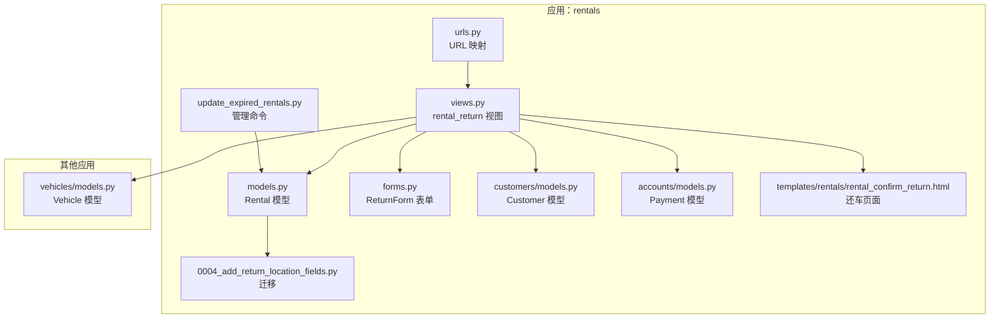
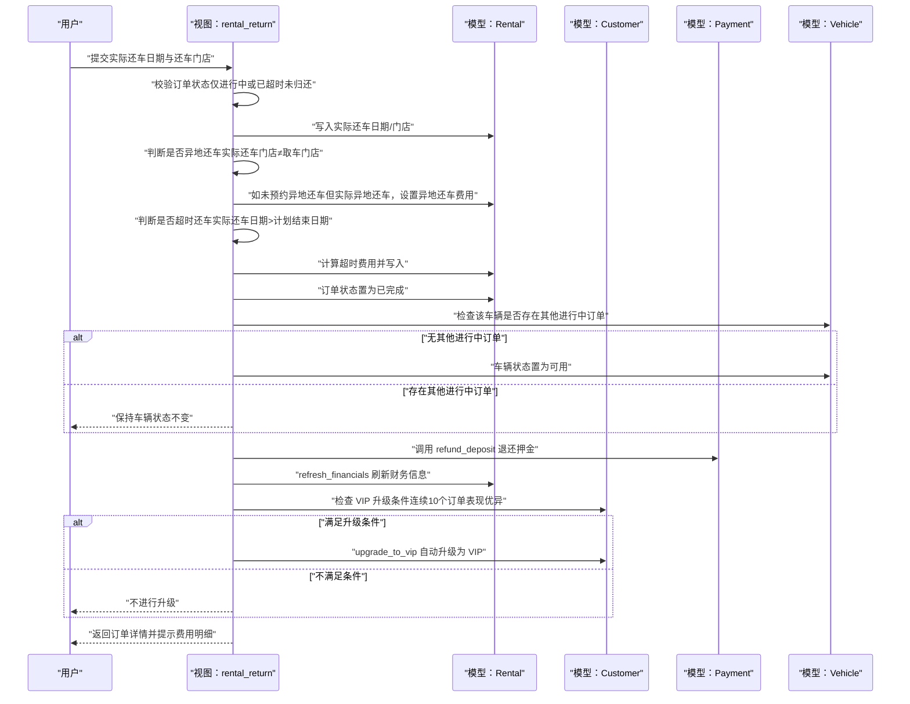
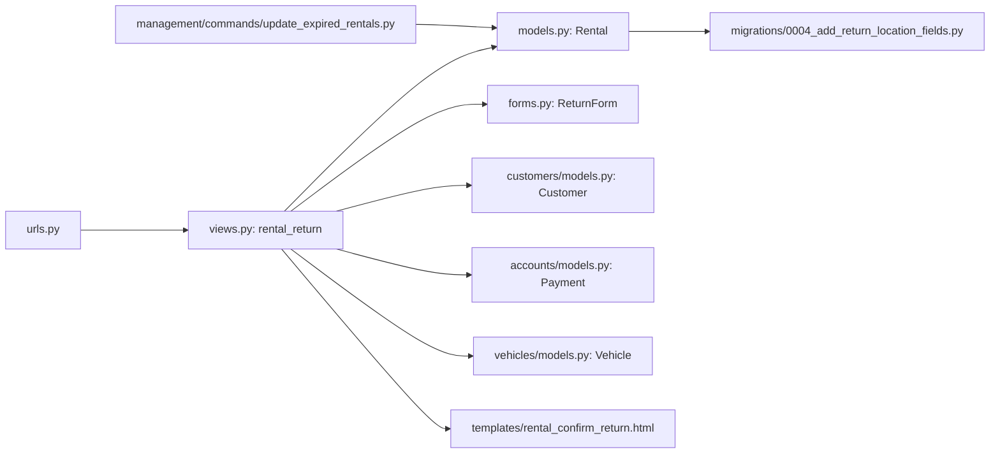

# 车辆归还处理

<cite>
**本文引用的文件**
- [views.py](file://code/car_rental_system/rentals/views.py)
- [models.py](file://code/car_rental_system/rentals/models.py)
- [forms.py](file://code/car_rental_system/rentals/forms.py)
- [urls.py](file://code/car_rental_system/rentals/urls.py)
- [0004_add_return_location_fields.py](file://code/car_rental_system/rentals/migrations/0004_add_return_location_fields.py)
- [update_expired_rentals.py](file://code/car_rental_system/rentals/management/commands/update_expired_rentals.py)
- [customers/models.py](file://code/car_rental_system/customers/models.py)
- [accounts/models.py](file://code/car_rental_system/accounts/models.py)
- [vehicles/models.py](file://code/car_rental_system/vehicles/models.py)
- [templates/rentals/rental_confirm_return.html](file://code/car_rental_system/templates/rentals/rental_confirm_return.html)
- [还车逻辑修改说明.md](file://code/car_rental_system/还车逻辑修改说明.md)
</cite>

## 目录
1. [简介](#简介)
2. [项目结构](#项目结构)
3. [核心组件](#核心组件)
4. [架构总览](#架构总览)
5. [详细组件分析](#详细组件分析)
6. [依赖关系分析](#依赖关系分析)
7. [性能考量](#性能考量)
8. [故障排查指南](#故障排查指南)
9. [结论](#结论)
10. [附录](#附录)

## 简介
本文件面向“车辆归还”的完整业务流程与实现细节，重点围绕 rental_return 视图函数展开，涵盖以下关键点：
- 订单状态校验：仅允许“进行中”或“已超时未归还”的订单进行还车。
- 表单 ReturnForm 的提交处理：接收实际还车日期与实际还车门店，并进行默认值回填与校验。
- 异地还车判定：当实际还车门店与取车门店不一致时，系统自动识别并按策略计算异地还车费用。
- 超时还车判定：当实际还车日期晚于计划结束日期时，按日租金计算超时费用。
- 订单完成与车辆状态更新：只有当该车辆没有其他进行中订单时，才将车辆状态恢复为“可用”。
- 押金退还：通过 refund_deposit 方法触发押金自动退还流程。
- VIP 会员自动升级：基于连续10个订单表现优异的条件，自动将客户升级为 VIP。
- 修改前后业务逻辑对比：结合还车逻辑修改说明文档，梳理变更点与影响。

## 项目结构
与“车辆归还”直接相关的模块与文件如下：
- 视图层：rentals/views.py 中的 rental_return 视图函数
- 模型层：rentals/models.py 中的 Rental 模型及车辆状态字段
- 表单层：rentals/forms.py 中的 ReturnForm
- URL 映射：rentals/urls.py
- 迁移：rentals/migrations/0004_add_return_location_fields.py 新增实际还车门店与超时费用字段
- 管理命令：rentals/management/commands/update_expired_rentals.py 自动更新过期订单状态
- 客户模型：customers/models.py 提供 VIP 升级与诚信度检查
- 支付模型：accounts/models.py 提供支付与退款记录
- 车辆模型：vehicles/models.py 提供车辆状态字段
- 模板：templates/rentals/rental_confirm_return.html 展示还车页面与前端费用预览
- 文档：还车逻辑修改说明.md 对比修改前后逻辑差异

图表来源
- [views.py](file://code/car_rental_system/rentals/views.py#L279-L392)
- [models.py](file://code/car_rental_system/rentals/models.py#L1-L160)
- [forms.py](file://code/car_rental_system/rentals/forms.py#L312-L364)
- [urls.py](file://code/car_rental_system/rentals/urls.py#L1-L22)
- [customers/models.py](file://code/car_rental_system/customers/models.py#L101-L154)
- [accounts/models.py](file://code/car_rental_system/accounts/models.py#L147-L200)
- [vehicles/models.py](file://code/car_rental_system/vehicles/models.py#L1-L85)
- [templates/rentals/rental_confirm_return.html](file://code/car_rental_system/templates/rentals/rental_confirm_return.html#L1-L232)
- [0004_add_return_location_fields.py](file://code/car_rental_system/rentals/migrations/0004_add_return_location_fields.py#L1-L42)
- [update_expired_rentals.py](file://code/car_rental_system/rentals/management/commands/update_expired_rentals.py#L1-L191)

章节来源
- [views.py](file://code/car_rental_system/rentals/views.py#L279-L392)
- [urls.py](file://code/car_rental_system/rentals/urls.py#L1-L22)

## 核心组件
- 视图函数 rental_return：负责还车流程的入口，包括状态校验、表单处理、费用计算、状态更新、车辆状态恢复、押金退还与 VIP 升级。
- 表单 ReturnForm：提供实际还车日期与实际还车门店的输入校验。
- 模型 Rental：维护订单状态、计划与实际还车日期、异地还车标记与费用、超时费用、结算状态与财务汇总等。
- 客户模型 Customer：提供 VIP 升级资格检查与升级操作。
- 支付模型 Payment：提供押金退还的支付记录创建与财务刷新。
- 车辆模型 Vehicle：提供车辆状态字段，用于还车后恢复为“可用”。

章节来源
- [views.py](file://code/car_rental_system/rentals/views.py#L279-L392)
- [forms.py](file://code/car_rental_system/rentals/forms.py#L312-L364)
- [models.py](file://code/car_rental_system/rentals/models.py#L1-L160)
- [customers/models.py](file://code/car_rental_system/customers/models.py#L101-L154)
- [accounts/models.py](file://code/car_rental_system/accounts/models.py#L147-L200)
- [vehicles/models.py](file://code/car_rental_system/vehicles/models.py#L1-L85)

## 架构总览
下面以序列图展示“车辆归还”的端到端流程，从用户提交还车表单到系统完成状态更新与财务处理。

图表来源
- [views.py](file://code/car_rental_system/rentals/views.py#L279-L392)
- [models.py](file://code/car_rental_system/rentals/models.py#L286-L401)
- [customers/models.py](file://code/car_rental_system/customers/models.py#L101-L154)
- [accounts/models.py](file://code/car_rental_system/accounts/models.py#L147-L200)
- [vehicles/models.py](file://code/car_rental_system/vehicles/models.py#L1-L85)

## 详细组件分析

### 视图函数 rental_return 的执行逻辑
- 状态校验：仅允许“进行中”或“已超时未归还”的订单进入还车流程；否则提示错误并返回详情页。
- 表单处理：
  - 若未填写实际还车门店，默认使用取车门店。
  - 校验还车日期不得晚于当天。
- 异地还车判定与费用：
  - 当实际还车门店与取车门店不一致时，视为“实际异地还车”。
  - 若租车时未勾选异地还车，系统自动追加异地还车费用（默认为日租金的一定比例，可在实现中调整）。
  - 若租车时已勾选异地还车，系统按既定规则处理。
- 超时还车判定与费用：
  - 当实际还车日期晚于计划结束日期时，按“超期天数×日租金”计算超时费用。
- 订单完成与车辆状态更新：
  - 将订单状态置为“已完成”。
  - 检查该车辆是否还有其他进行中订单；若无，则将车辆状态置为“可用”，否则保持不变。
- 押金退还：
  - 调用 Rental.refund_deposit 方法，依据支付记录与已退金额计算可退金额并创建退款记录。
  - 成功后刷新财务信息（累计支付/退款与结算状态）。
- VIP 自动升级：
  - 若客户非 VIP，检查其最近已完成订单的连续表现（无超时、异地还车行为与预约一致），若连续10个订单均满足，自动升级为 VIP。
- 成功消息汇总：
  - 汇总异地还车费用、超时费用与押金退还金额，一并提示给用户。

章节来源
- [views.py](file://code/car_rental_system/rentals/views.py#L279-L392)

### 表单 ReturnForm 的字段与校验
- 字段：
  - actual_return_date：实际还车日期，必填，不得晚于当天。
  - actual_return_location：实际还车门店，可选；若为空则默认取车门店。
- 校验：
  - 还车日期不得晚于当天。
  - 还车门店为空时，允许使用默认取车门店。

章节来源
- [forms.py](file://code/car_rental_system/rentals/forms.py#L312-L364)

### 模型 Rental 的关键字段与方法
- 关键字段：
  - actual_return_date、actual_return_location：记录实际还车日期与门店。
  - overdue_fee：超时还车费用。
  - is_cross_location_return、return_location、cross_location_fee：异地还车相关字段。
  - status：订单状态（新增“已超时未归还”）。
  - amount_paid、amount_refunded、settlement_status、settled_at：财务与结算状态。
- 关键方法：
  - calculate_order_total：计算订单总额（基础租金+押金+异地费用+超时费用）。
  - refresh_financials：根据支付记录刷新累计支付/退款与结算状态。
  - refund_deposit：退还押金并创建退款记录，刷新财务信息。
  - auto_update_status：自动更新订单状态（预订中→进行中、进行中→已超时未归还）。

章节来源
- [models.py](file://code/car_rental_system/rentals/models.py#L1-L160)
- [models.py](file://code/car_rental_system/rentals/models.py#L286-L401)

### 客户模型 Customer 的 VIP 升级机制
- check_vip_upgrade_eligibility：
  - 从最近完成的订单开始向前统计连续满足条件的订单数（无超时、异地还车行为与预约一致）。
  - 若连续达到阈值（如10个），返回“可升级”。
- upgrade_to_vip：将客户会员等级提升为 VIP。

章节来源
- [customers/models.py](file://code/car_rental_system/customers/models.py#L101-L154)

### 支付模型 Payment 的押金退还流程
- refund_deposit 调用 Payment 创建退款记录，填充用户、金额、支付方式、交易类型、状态与描述等字段。
- 退款成功后刷新财务信息，确保结算状态与时间正确。

章节来源
- [accounts/models.py](file://code/car_rental_system/accounts/models.py#L147-L200)
- [models.py](file://code/car_rental_system/rentals/models.py#L334-L394)

### 车辆模型 Vehicle 的状态管理
- 车辆状态字段：AVAILABLE、RENTED、MAINTENANCE。
- 还车后仅当该车辆无其他进行中订单时，才将其状态置为“可用”。

章节来源
- [vehicles/models.py](file://code/car_rental_system/vehicles/models.py#L1-L85)

### 页面模板与前端费用预览
- 模板 rental_confirm_return.html 展示订单基本信息、车辆信息、计划与当前费用、归还处理表单与说明。
- 前端脚本根据用户输入的还车日期与还车门店，实时计算基础费用、VIP 折扣、超时费用与异地还车费用，并预览最终应付金额。

章节来源
- [templates/rentals/rental_confirm_return.html](file://code/car_rental_system/templates/rentals/rental_confirm_return.html#L1-L232)

### 过期订单自动更新与还车关系
- 管理命令 update_expired_rentals 会在后台任务中将“进行中”且已过期的订单更新为“已超时未归还”，提醒用户还车。
- 系统不会自动完成订单，只有在用户还车后，订单才被标记为“已完成”。

章节来源
- [update_expired_rentals.py](file://code/car_rental_system/rentals/management/commands/update_expired_rentals.py#L1-L191)

### 还车逻辑修改说明（对比分析）
- 修改背景与目标：明确还车流程的触发条件、异地还车与超时还车的判定标准、费用计算策略与车辆状态恢复规则。
- 修改要点：
  - 限定还车入口仅对“进行中/已超时未归还”的订单开放。
  - 明确异地还车判定与费用追加规则（未预约但实际异地还车）。
  - 明确超时还车判定与费用计算规则（按日租金计算）。
  - 明确车辆状态恢复条件（无其他进行中订单）。
  - 明确押金退还流程与财务刷新。
  - 明确 VIP 升级条件与自动升级逻辑。
- 影响范围：上述修改直接影响 rental_return 视图函数的执行分支与字段赋值，以及模板与前端费用预览的展示逻辑。

章节来源
- [还车逻辑修改说明.md](file://code/car_rental_system/还车逻辑修改说明.md)

## 依赖关系分析
- 视图函数 rental_return 依赖：
  - 模型：Rental（状态更新、费用计算、押金退还、财务刷新）、Customer（VIP 升级）、Vehicle（车辆状态）、Payment（退款记录）。
  - 表单：ReturnForm（输入校验）。
  - URL：rentals/urls.py 提供 /<int:pk>/return/ 路由。
  - 模板：rental_confirm_return.html 提供页面与前端费用预览。
  - 迁移：0004_add_return_location_fields.py 新增实际还车门店与超时费用字段。
  - 管理命令：update_expired_rentals.py 自动更新过期订单状态。

图表来源
- [urls.py](file://code/car_rental_system/rentals/urls.py#L1-L22)
- [views.py](file://code/car_rental_system/rentals/views.py#L279-L392)
- [models.py](file://code/car_rental_system/rentals/models.py#L1-L160)
- [forms.py](file://code/car_rental_system/rentals/forms.py#L312-L364)
- [customers/models.py](file://code/car_rental_system/customers/models.py#L101-L154)
- [accounts/models.py](file://code/car_rental_system/accounts/models.py#L147-L200)
- [vehicles/models.py](file://code/car_rental_system/vehicles/models.py#L1-L85)
- [0004_add_return_location_fields.py](file://code/car_rental_system/rentals/migrations/0004_add_return_location_fields.py#L1-L42)
- [update_expired_rentals.py](file://code/car_rental_system/rentals/management/commands/update_expired_rentals.py#L1-L191)
- [templates/rentals/rental_confirm_return.html](file://code/car_rental_system/templates/rentals/rental_confirm_return.html#L1-L232)

## 性能考量
- 状态自动更新缓存：Rental.auto_update_status 使用缓存避免频繁更新，每5分钟最多更新一次，减少数据库压力。
- 事务保护：还车流程使用原子事务包裹，确保数据一致性（更新订单、车辆状态、押金退款与财务刷新）。
- 查询优化：还车时检查车辆是否存在其他进行中订单采用 count 查询，避免不必要的对象加载。
- 前端费用预览：模板内前端脚本实时计算费用，减轻服务器压力，同时提升用户体验。

章节来源
- [models.py](file://code/car_rental_system/rentals/models.py#L171-L229)
- [views.py](file://code/car_rental_system/rentals/views.py#L279-L392)
- [templates/rentals/rental_confirm_return.html](file://code/car_rental_system/templates/rentals/rental_confirm_return.html#L233-L312)

## 故障排查指南
- 还车入口被拒绝：
  - 检查订单状态是否为“进行中”或“已超时未归还”。若为其他状态，系统会提示错误并阻止还车。
- 还车日期校验失败：
  - 确认实际还车日期不得晚于当天；若晚于当天，表单校验会报错。
- 异地还车费用异常：
  - 若租车时未勾选异地还车但实际还车门店与取车门店不同，系统会自动追加异地还车费用；若已勾选且实际一致，不应产生额外费用。
- 超时还车费用异常：
  - 确认实际还车日期是否晚于计划结束日期；若晚于结束日期，系统将按“超期天数×日租金”计算超时费用。
- 车辆状态未恢复为“可用”：
  - 确认该车辆在还车后是否仍有其他进行中订单；若有，系统不会恢复车辆状态。
- 押金未退还：
  - 检查是否存在可退金额（押金-已退金额>0）；若无可用用户账户，系统无法创建退款记录。
- VIP 升级未生效：
  - 检查客户最近已完成订单是否满足连续10个订单无超时、异地还车行为与预约一致的条件。

章节来源
- [views.py](file://code/car_rental_system/rentals/views.py#L279-L392)
- [forms.py](file://code/car_rental_system/rentals/forms.py#L312-L364)
- [models.py](file://code/car_rental_system/rentals/models.py#L286-L401)
- [customers/models.py](file://code/car_rental_system/customers/models.py#L101-L154)

## 结论
“车辆归还”流程在系统中通过 rental_return 视图函数统一调度，实现了严谨的状态校验、灵活的异地还车与超时还车判定、可靠的车辆状态恢复、规范的押金退还与财务刷新，以及基于历史订单表现的 VIP 自动升级机制。配合迁移与管理命令，系统能够稳定地支持日常运营与用户体验优化。建议在生产环境中持续监控状态自动更新与还车流程的执行日志，确保异常场景得到及时处理。

## 附录
- URL 映射：/rentals/<int:pk>/return/ 路由指向 rental_return 视图。
- 迁移：新增实际还车门店与超时费用字段，支撑还车流程的数据存储需求。
- 模板：提供还车页面与前端费用预览，增强交互体验。

章节来源
- [urls.py](file://code/car_rental_system/rentals/urls.py#L1-L22)
- [0004_add_return_location_fields.py](file://code/car_rental_system/rentals/migrations/0004_add_return_location_fields.py#L1-L42)
- [templates/rentals/rental_confirm_return.html](file://code/car_rental_system/templates/rentals/rental_confirm_return.html#L1-L232)