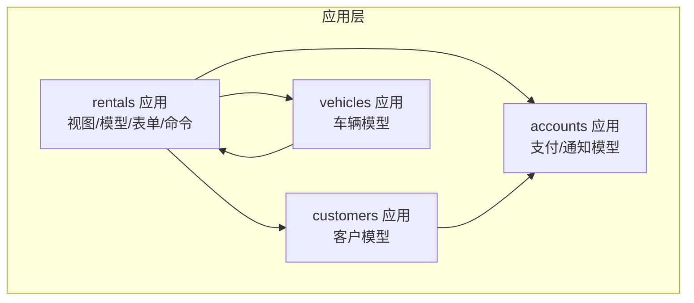
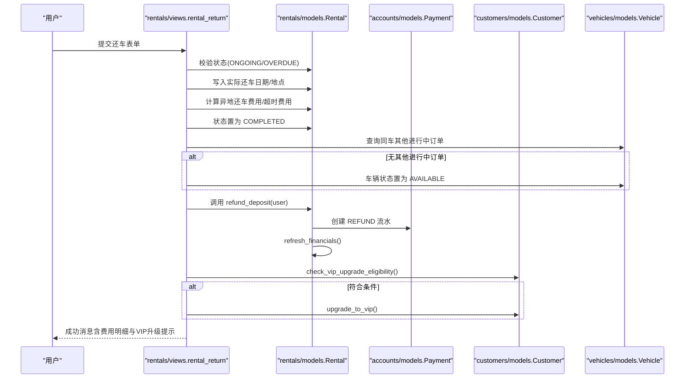
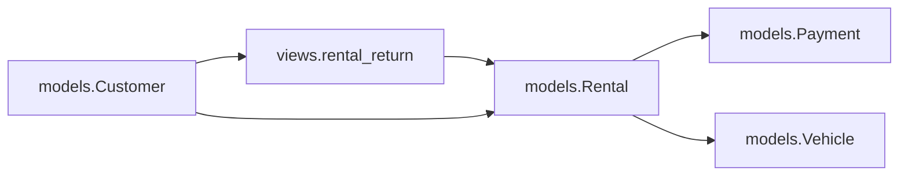

# 还车后处理流程

<cite>
**本文引用的文件**
- [rentals/models.py](file://code/car_rental_system/rentals/models.py)
- [rentals/views.py](file://code/car_rental_system/rentals/views.py)
- [customers/models.py](file://code/car_rental_system/customers/models.py)
- [vehicles/models.py](file://code/car_rental_system/vehicles/models.py)
- [accounts/models.py](file://code/car_rental_system/accounts/models.py)
- [rentals/forms.py](file://code/car_rental_system/rentals/forms.py)
- [templates/rentals/rental_confirm_return.html](file://code/car_rental_system/templates/rentals/rental_confirm_return.html)
- [rentals/management/commands/update_historical_orders.py](file://code/car_rental_system/rentals/management/commands/update_historical_orders.py)
- [accounts/views.py](file://code/car_rental_system/accounts/views.py)
- [退款信息显示说明.md](file://code/car_rental_system/退款信息显示说明.md)
</cite>

## 目录
1. [简介](#简介)
2. [项目结构](#项目结构)
3. [核心组件](#核心组件)
4. [架构总览](#架构总览)
5. [详细组件分析](#详细组件分析)
6. [依赖关系分析](#依赖关系分析)
7. [性能考量](#性能考量)
8. [故障排查指南](#故障排查指南)
9. [结论](#结论)

## 简介
本文件聚焦“车辆归还完成后的系统处理流程”，围绕以下目标展开：
- 订单状态从“进行中”更新为“已完成”的完整路径与触发条件
- 车辆状态更新逻辑：仅当该车辆无其他未完成订单时，将其状态重置为“可用”
- refund_deposit 方法如何调用支付系统接口执行押金退还，并记录退款流水
- VIP 会员自动升级机制的触发条件（连续10个订单无超时、无不诚信异地还车）与等级提升实现逻辑
- 所有后续异步操作与数据一致性保障措施

## 项目结构
系统采用 Django 应用分层组织，涉及订单、客户、车辆、账户与支付等模块。还车流程主要由 rentals 应用的视图与模型协同完成，支付与退款通过 accounts 应用的 Payment 模型落地。

图表来源
- [rentals/views.py](file://code/car_rental_system/rentals/views.py#L279-L392)
- [rentals/models.py](file://code/car_rental_system/rentals/models.py#L1-L120)
- [customers/models.py](file://code/car_rental_system/customers/models.py#L1-L160)
- [vehicles/models.py](file://code/car_rental_system/vehicles/models.py#L1-L85)
- [accounts/models.py](file://code/car_rental_system/accounts/models.py#L147-L251)

章节来源
- [rentals/views.py](file://code/car_rental_system/rentals/views.py#L1-L120)
- [rentals/models.py](file://code/car_rental_system/rentals/models.py#L1-L120)

## 核心组件
- 订单模型（Rental）：负责订单状态、费用计算、押金退还、财务刷新与车辆状态联动
- 客户模型（Customer）：负责 VIP 升级资格校验与升级执行
- 车辆模型（Vehicle）：负责车辆状态维护
- 支付模型（Payment）：负责支付与退款流水记录
- 还车视图（rental_return）：还车流程的入口，串联状态变更、费用计算、车辆状态与退款
- 还车表单（ReturnForm）：约束还车日期与还车门店
- 历史订单批量处理命令：用于历史数据修复与一致性保障

章节来源
- [rentals/models.py](file://code/car_rental_system/rentals/models.py#L120-L210)
- [customers/models.py](file://code/car_rental_system/customers/models.py#L101-L154)
- [vehicles/models.py](file://code/car_rental_system/vehicles/models.py#L1-L85)
- [accounts/models.py](file://code/car_rental_system/accounts/models.py#L147-L251)
- [rentals/views.py](file://code/car_rental_system/rentals/views.py#L279-L392)
- [rentals/forms.py](file://code/car_rental_system/rentals/forms.py#L312-L364)
- [rentals/management/commands/update_historical_orders.py](file://code/car_rental_system/rentals/management/commands/update_historical_orders.py#L1-L120)

## 架构总览
还车流程的关键交互如下：

图表来源
- [rentals/views.py](file://code/car_rental_system/rentals/views.py#L279-L392)
- [rentals/models.py](file://code/car_rental_system/rentals/models.py#L334-L394)
- [customers/models.py](file://code/car_rental_system/customers/models.py#L101-L154)
- [vehicles/models.py](file://code/car_rental_system/vehicles/models.py#L1-L85)
- [accounts/models.py](file://code/car_rental_system/accounts/models.py#L147-L251)

## 详细组件分析

### 还车流程（rental_return 视图）
- 触发时机：用户在还车确认页面提交表单
- 关键步骤
  - 自动状态同步：先调用自动状态更新，确保状态最新
  - 状态校验：仅允许“进行中/已超时未归还”的订单还车
  - 写入还车信息：实际还车日期、实际还车门店（默认取车门店）
  - 费用计算：
    - 若实际还车地点与取车地点不同且未预约异地还车，追加异地还车费用
    - 若实际还车日期晚于结束日期，按日租金计算超时费用
  - 状态变更：订单状态置为“已完成”
  - 车辆状态更新：若该车无其他进行中订单，则置为“可用”
  - 押金退还：调用订单模型的 refund_deposit 并记录退款流水
  - 财务刷新：refresh_financials 同步累计支付/退款与结算状态
  - VIP 升级：若客户非 VIP，检查连续10个已完成订单的诚信度，满足则升级
  - 结果反馈：拼装费用明细与升级提示，返回成功消息

章节来源
- [rentals/views.py](file://code/car_rental_system/rentals/views.py#L279-L392)
- [templates/rentals/rental_confirm_return.html](file://code/car_rental_system/templates/rentals/rental_confirm_return.html#L150-L216)

### 订单模型（Rental）与车辆状态联动
- 状态更新策略
  - 自动状态更新：将“预订中”在到达开始日期时激活为“进行中”，并将车辆状态置为“已租”
  - 超时更新：将“进行中”在超过结束日期时更新为“已超时未归还”
- 还车后车辆状态更新
  - 当订单状态从“预订中/进行中”变为“已完成”时，系统会检查该车是否仍有其他“进行中”订单
  - 仅当无其他进行中订单时，才将车辆状态置为“可用”

章节来源
- [rentals/models.py](file://code/car_rental_system/rentals/models.py#L171-L229)
- [rentals/views.py](file://code/car_rental_system/rentals/views.py#L234-L276)

### 押金退还与退款流水（refund_deposit）
- 退款触发条件
  - 订单存在押金且尚未完全退款
- 退款金额计算
  - 退款金额 = 订单押金 - 已退款金额
- 退款用户确定
  - 优先使用支付记录中的用户；若无支付记录，使用客户关联的用户
- 退款流水创建
  - 创建一条状态为“已退款”、类型为“退款”的 Payment 记录
  - 退款方式默认为“银行卡”，交易号为系统生成
- 财务信息刷新
  - 调用 refresh_financials，同步累计支付/退款与结算状态

章节来源
- [rentals/models.py](file://code/car_rental_system/rentals/models.py#L334-L394)
- [accounts/models.py](file://code/car_rental_system/accounts/models.py#L147-L251)

### VIP 会员自动升级机制
- 触发条件
  - 客户非 VIP
  - 连续10个已完成订单均满足：
    - 无超时归还（overdue_fee 为0）
    - 无不诚信异地还车（若租车时预约异地还车，实际应异地还车；若未预约，实际不应异地还车）
- 升级实现
  - 满足条件后，将客户会员等级从“普通会员”提升为“VIP”
- 前端提示
  - 个人中心展示升级进度与条件说明，满足条件时提示系统将在下次还车时自动升级

章节来源
- [customers/models.py](file://code/car_rental_system/customers/models.py#L101-L154)
- [accounts/views.py](file://code/car_rental_system/accounts/views.py#L145-L195)
- [templates/rentals/rental_confirm_return.html](file://code/car_rental_system/templates/rentals/rental_confirm_return.html#L219-L230)

### 历史数据一致性保障
- 历史批量处理命令
  - 自动更新历史订单状态（PENDING→ONGOING、ONGOING→OVERDUE）
  - 为已完成订单退还押金并创建退款记录
  - 为已取消订单退还已支付金额并创建退款记录
  - 刷新所有订单的财务信息
- 使用建议
  - 首先使用 dry-run 预览，确认后再执行真实更新
  - 若仅需修复财务信息，可跳过状态与退款步骤

章节来源
- [rentals/management/commands/update_historical_orders.py](file://code/car_rental_system/rentals/management/commands/update_historical_orders.py#L1-L120)
- [退款信息显示说明.md](file://code/car_rental_system/退款信息显示说明.md#L1-L60)

## 依赖关系分析
- 模块耦合
  - rentals/views 依赖 rentals/models、customers/models、vehicles/models、accounts/models
  - rentals/models 依赖 accounts/models（支付/退款）、vehicles/models（车辆状态）
  - customers/models 依赖 rentals/models（订单统计）
- 关键依赖链
  - 还车视图 → 订单模型（写入还车信息、状态变更、费用计算）→ 支付模型（退款流水）→ 客户模型（VIP 升级）

图表来源
- [rentals/views.py](file://code/car_rental_system/rentals/views.py#L279-L392)
- [rentals/models.py](file://code/car_rental_system/rentals/models.py#L334-L394)
- [customers/models.py](file://code/car_rental_system/customers/models.py#L101-L154)
- [vehicles/models.py](file://code/car_rental_system/vehicles/models.py#L1-L85)
- [accounts/models.py](file://code/car_rental_system/accounts/models.py#L147-L251)

## 性能考量
- 自动状态更新缓存
  - 使用缓存限制自动状态更新频率（每5分钟最多更新一次），降低数据库压力
- 查询优化
  - 还车流程中对车辆其他进行中订单的查询为计数查询，复杂度低
  - 批量处理命令采用 select_related 与聚合查询，减少 N+1 查询
- 前端费用预览
  - 前端脚本在用户输入还车日期/地点时即时计算费用，减少后端压力

章节来源
- [rentals/models.py](file://code/car_rental_system/rentals/models.py#L171-L229)
- [rentals/management/commands/update_historical_orders.py](file://code/car_rental_system/rentals/management/commands/update_historical_orders.py#L96-L165)
- [templates/rentals/rental_confirm_return.html](file://code/car_rental_system/templates/rentals/rental_confirm_return.html#L233-L312)

## 故障排查指南
- 问题：订单已完成但未显示退款
  - 可能原因：历史订单未刷新财务信息、退款记录未创建
  - 解决方案：执行批量更新命令（支持 dry-run 预览）
- 问题：VIP 升级未生效
  - 可能原因：连续订单不满足条件、系统未在还车时触发升级
  - 解决方案：确认连续10个订单均无超时与不诚信异地还车；若满足，系统将在下次还车时自动升级
- 问题：车辆状态未恢复为“可用”
  - 可能原因：该车仍有其他进行中订单
  - 解决方案：确认该车无其他进行中订单后，系统会自动置为“可用”

章节来源
- [退款信息显示说明.md](file://code/car_rental_system/退款信息显示说明.md#L1-L97)
- [customers/models.py](file://code/car_rental_system/customers/models.py#L101-L154)
- [rentals/views.py](file://code/car_rental_system/rentals/views.py#L332-L364)

## 结论
还车流程通过“还车视图”串联订单状态变更、费用计算、车辆状态与退款流水，并在满足条件时自动触发 VIP 升级。系统通过自动状态更新缓存、批量历史修复命令与前端费用预览等手段，兼顾了实时性与一致性。建议在生产环境中：
- 定期运行批量历史修复命令，确保历史数据一致
- 关注 VIP 升级条件与提示，引导用户保持良好租车记录
- 对异常场景（退款用户缺失、车辆仍被占用）建立监控与人工干预机制