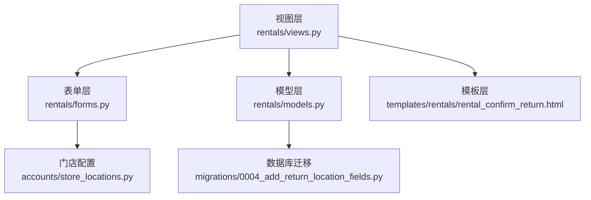
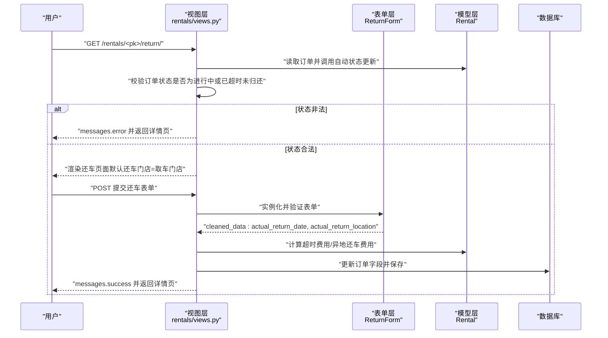
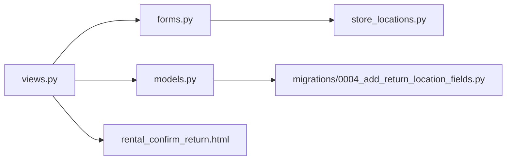

# 还车条件验证

<cite>
**本文引用的文件**
- [models.py](file://code/car_rental_system/rentals/models.py)
- [views.py](file://code/car_rental_system/rentals/views.py)
- [forms.py](file://code/car_rental_system/rentals/forms.py)
- [urls.py](file://code/car_rental_system/rentals/urls.py)
- [store_locations.py](file://code/car_rental_system/accounts/store_locations.py)
- [rental_confirm_return.html](file://code/car_rental_system/templates/rentals/rental_confirm_return.html)
- [0004_add_return_location_fields.py](file://code/car_rental_system/rentals/migrations/0004_add_return_location_fields.py)
</cite>

## 目录
1. [引言](#引言)
2. [项目结构](#项目结构)
3. [核心组件](#核心组件)
4. [架构总览](#架构总览)
5. [详细组件分析](#详细组件分析)
6. [依赖分析](#依赖分析)
7. [性能考量](#性能考量)
8. [故障排查指南](#故障排查指南)
9. [结论](#结论)

## 引言
本文件聚焦“车辆归还前的业务规则验证逻辑”，围绕以下目标展开：
- 解释 rental_return 视图如何检查订单当前状态是否为“进行中”或“已超时未归还”，拒绝“已完成”“已取消”等无效状态发起还车。
- 说明 ReturnForm 表单对“实际还车日期”和“实际还车门店”的验证机制：日期不得早于取车日期、不得晚于今日；门店字段为空时回退到取车门店；还车门店与取车门店不同将触发异地还车费用判定。
- 结合 models.py 中 Rental 模型的状态机设计，说明状态转换的合法性校验流程。
- 提供验证失败时的错误处理与用户提示路径示例。

## 项目结构
与还车验证直接相关的模块与文件如下：
- 视图层：rentals/views.py 中的 rental_return 视图负责还车入口与状态校验、费用计算与状态变更。
- 表单层：rentals/forms.py 中的 ReturnForm 负责还车表单字段的前端与后端验证。
- 模型层：rentals/models.py 中的 Rental 模型定义状态机、自动状态更新、财务字段与清理逻辑。
- 配置与数据：accounts/store_locations.py 提供系统内的有效门店集合；rentals/migrations/0004_add_return_location_fields.py 为模型新增还车相关字段。
- 模板层：templates/rentals/rental_confirm_return.html 展示还车页面、错误提示与费用预览。

图表来源
- [views.py](file://code/car_rental_system/rentals/views.py#L279-L392)
- [forms.py](file://code/car_rental_system/rentals/forms.py#L312-L364)
- [models.py](file://code/car_rental_system/rentals/models.py#L12-L169)
- [store_locations.py](file://code/car_rental_system/accounts/store_locations.py#L1-L79)
- [0004_add_return_location_fields.py](file://code/car_rental_system/rentals/migrations/0004_add_return_location_fields.py#L1-L40)
- [rental_confirm_return.html](file://code/car_rental_system/templates/rentals/rental_confirm_return.html#L1-L232)

章节来源
- [views.py](file://code/car_rental_system/rentals/views.py#L279-L392)
- [forms.py](file://code/car_rental_system/rentals/forms.py#L312-L364)
- [models.py](file://code/car_rental_system/rentals/models.py#L12-L169)
- [store_locations.py](file://code/car_rental_system/accounts/store_locations.py#L1-L79)
- [0004_add_return_location_fields.py](file://code/car_rental_system/rentals/migrations/0004_add_return_location_fields.py#L1-L40)
- [rental_confirm_return.html](file://code/car_rental_system/templates/rentals/rental_confirm_return.html#L1-L232)

## 核心组件
- Rental 模型状态机与自动更新
  - 状态枚举包含“预订中”“进行中”“已超时未归还”“已完成”“已取消”。通过自动更新逻辑将“预订中”激活为“进行中”，将“进行中”超期更新为“已超时未归还”。
  - 清理方法 clean 对日期与还车日期进行约束，保证实际还车日期不早于取车日期、不晚于今日。
- ReturnForm 表单
  - 对“实际还车日期”进行“不得晚于今日”的校验；对“实际还车门店”进行可空处理，空值回退到取车门店。
- rental_return 视图
  - 在还车入口处强制校验订单状态仅允许“进行中”或“已超时未归还”；提交后根据还车日期计算超时费用，根据还车门店与取车门店差异计算异地还车费用，并将订单状态更新为“已完成”。

章节来源
- [models.py](file://code/car_rental_system/rentals/models.py#L12-L169)
- [models.py](file://code/car_rental_system/rentals/models.py#L230-L245)
- [forms.py](file://code/car_rental_system/rentals/forms.py#L312-L364)
- [views.py](file://code/car_rental_system/rentals/views.py#L279-L392)

## 架构总览
下面的序列图展示了“还车条件验证”的关键调用链：从用户访问还车页面，到视图层的状态校验、表单验证、费用计算与状态变更。

图表来源
- [views.py](file://code/car_rental_system/rentals/views.py#L279-L392)
- [forms.py](file://code/car_rental_system/rentals/forms.py#L312-L364)
- [models.py](file://code/car_rental_system/rentals/models.py#L12-L169)

## 详细组件分析

### rental_return 视图的还车条件验证
- 状态前置校验
  - 仅允许“进行中”或“已超时未归还”的订单发起还车；否则提示错误并返回详情页。
- 表单处理
  - 若表单有效：提取实际还车日期与实际还车门店；若门店为空则回退到取车门店。
  - 事务内更新订单字段：实际还车日期、实际还车门店、异地还车费用（如需）、超时还车费用、状态为“已完成”。
  - 若该车辆无其他进行中订单，则将车辆状态更新为“可用”。
  - 退还押金并刷新财务信息，最后构建成功消息（包含费用明细与VIP升级提示）。
- 默认值与用户体验
  - 页面初始默认还车门店为取车门店；模板提供费用预览与提示信息。

章节来源
- [views.py](file://code/car_rental_system/rentals/views.py#L279-L392)
- [rental_confirm_return.html](file://code/car_rental_system/templates/rentals/rental_confirm_return.html#L150-L216)

### ReturnForm 表单的字段验证机制
- 实际还车日期
  - 不得晚于今日；用于防止未来还车。
- 实际还车门店
  - 可为空；为空时由视图层回退到取车门店。
  - 该字段在表单层不做系统内门店有效性校验，有效性校验由系统门店配置提供并在视图层使用。
- 门店有效性与异地还车判定
  - 视图层根据“实际还车门店”与“取车门店”是否不同，判定是否产生异地还车费用；若租车时未勾选异地还车而实际异地还车，系统会自动增加异地还车费用并标记为异地还车。

章节来源
- [forms.py](file://code/car_rental_system/rentals/forms.py#L312-L364)
- [views.py](file://code/car_rental_system/rentals/views.py#L279-L392)

### 模型层状态机与清理逻辑
- 状态机
  - 状态枚举包含“预订中”“进行中”“已超时未归还”“已完成”“已取消”。
  - 自动更新逻辑：将到达开始日期的“预订中”订单激活为“进行中”，并将超期的“进行中”订单更新为“已超时未归还”。
- 清理逻辑 clean
  - 当存在实际还车日期时，校验其不得早于取车日期，也不得晚于今日。
- 财务与结算
  - 模型提供计算订单总额的方法，包含基础租金、押金、异地还车费用、超时还车费用；支持刷新累计支付/退款并更新结算状态。

章节来源
- [models.py](file://code/car_rental_system/rentals/models.py#L12-L169)
- [models.py](file://code/car_rental_system/rentals/models.py#L230-L245)
- [models.py](file://code/car_rental_system/rentals/models.py#L286-L333)

### 门店有效性与系统配置
- 有效门店集合
  - 通过 accounts/store_locations.py 提供系统内所有有效门店列表。
- 表单与视图中的使用
  - 表单层 ReturnForm 不做系统内门店校验；视图层在还车时根据“实际还车门店”与“取车门店”差异决定是否收取异地还车费用。

章节来源
- [store_locations.py](file://code/car_rental_system/accounts/store_locations.py#L1-L79)
- [views.py](file://code/car_rental_system/rentals/views.py#L279-L392)

### 数据模型与还车字段
- 新增字段
  - 实际还车门店：记录用户实际还车的门店名称。
  - 超时还车费用：记录因超期还车产生的费用。
- 迁移文件
  - 通过迁移文件添加上述字段，确保数据库结构与业务需求一致。

章节来源
- [0004_add_return_location_fields.py](file://code/car_rental_system/rentals/migrations/0004_add_return_location_fields.py#L1-L40)
- [models.py](file://code/car_rental_system/rentals/models.py#L12-L169)

### URL 与入口路由
- 还车入口 URL
  - /rentals/<int:pk>/return/ 由 rentals/urls.py 映射至 rental_return 视图。

章节来源
- [urls.py](file://code/car_rental_system/rentals/urls.py#L9-L22)

### 验证失败的错误处理与用户提示
- 视图层错误提示
  - 当订单状态不满足“进行中/已超时未归还”时，使用消息框架输出错误并返回详情页。
- 表单层错误提示
  - ReturnForm 对还车日期与还车门店进行校验，错误通过表单错误集合在模板中渲染。
- 模板层展示
  - rental_confirm_return.html 展示表单字段、错误信息与费用预览，帮助用户理解验证失败原因与费用构成。

章节来源
- [views.py](file://code/car_rental_system/rentals/views.py#L279-L392)
- [forms.py](file://code/car_rental_system/rentals/forms.py#L312-L364)
- [rental_confirm_return.html](file://code/car_rental_system/templates/rentals/rental_confirm_return.html#L150-L216)

## 依赖分析
- 视图层依赖
  - 视图层依赖模型层的自动状态更新与清理逻辑，以及表单层的 ReturnForm。
- 表单层依赖
  - ReturnForm 依赖系统门店配置，用于还车门店字段的可选项与默认值。
- 模型层依赖
  - 模型层依赖车辆与客户模型，提供状态机、自动更新与财务计算能力。
- 模板层依赖
  - 模板层依赖视图层上下文与表单对象，渲染错误信息与费用预览。

图表来源
- [views.py](file://code/car_rental_system/rentals/views.py#L279-L392)
- [forms.py](file://code/car_rental_system/rentals/forms.py#L312-L364)
- [models.py](file://code/car_rental_system/rentals/models.py#L12-L169)
- [store_locations.py](file://code/car_rental_system/accounts/store_locations.py#L1-L79)
- [0004_add_return_location_fields.py](file://code/car_rental_system/rentals/migrations/0004_add_return_location_fields.py#L1-L40)
- [rental_confirm_return.html](file://code/car_rental_system/templates/rentals/rental_confirm_return.html#L1-L232)

## 性能考量
- 自动状态更新缓存
  - 模型层的自动状态更新通过缓存限制更新频率，避免频繁写入。
- 查询与事务
  - 视图层在还车处理中使用事务包裹，确保状态变更与财务更新的一致性。
- 前端费用预览
  - 模板层提供费用预览与交互，减少后端压力并提升用户体验。

章节来源
- [models.py](file://code/car_rental_system/rentals/models.py#L171-L229)
- [views.py](file://code/car_rental_system/rentals/views.py#L279-L392)
- [rental_confirm_return.html](file://code/car_rental_system/templates/rentals/rental_confirm_return.html#L233-L312)

## 故障排查指南
- 症状：尝试对“已完成”“已取消”订单发起还车，提示状态非法
  - 排查要点：确认订单状态是否为“进行中”或“已超时未归还”；查看视图层状态校验逻辑。
  - 参考路径：[views.py](file://code/car_rental_system/rentals/views.py#L279-L392)
- 症状：还车日期提示错误
  - 排查要点：确认还车日期不得晚于今日；若使用表单，请检查表单 clean 方法。
  - 参考路径：[forms.py](file://code/car_rental_system/rentals/forms.py#L312-L364)
- 症状：还车门店未生效或未触发异地还车费用
  - 排查要点：确认还车门店为空时是否回退到取车门店；确认还车门店与取车门店是否不同；检查视图层的异地还车判定逻辑。
  - 参考路径：[views.py](file://code/car_rental_system/rentals/views.py#L279-L392)
- 症状：系统内门店名称不匹配
  - 排查要点：确认系统有效门店集合；表单层与视图层均基于系统配置进行门店判定。
  - 参考路径：[store_locations.py](file://code/car_rental_system/accounts/store_locations.py#L1-L79)

章节来源
- [views.py](file://code/car_rental_system/rentals/views.py#L279-L392)
- [forms.py](file://code/car_rental_system/rentals/forms.py#L312-L364)
- [store_locations.py](file://code/car_rental_system/accounts/store_locations.py#L1-L79)

## 结论
- 还车入口严格限定在“进行中/已超时未归还”的订单，避免对“已完成/已取消”等无效状态发起还车。
- ReturnForm 对还车日期与还车门店进行基础校验；系统通过“实际还车门店”与“取车门店”的差异自动判定异地还车费用。
- 模型层提供状态机与自动更新，配合视图层的事务与财务刷新，确保还车流程的正确性与一致性。
- 模板层提供清晰的错误提示与费用预览，有助于用户理解验证失败原因并顺利完成还车。