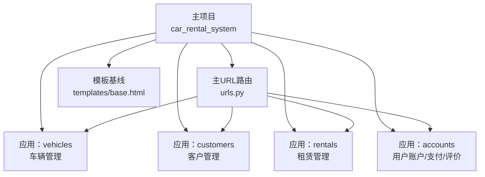
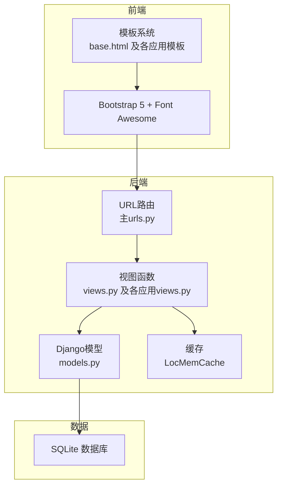
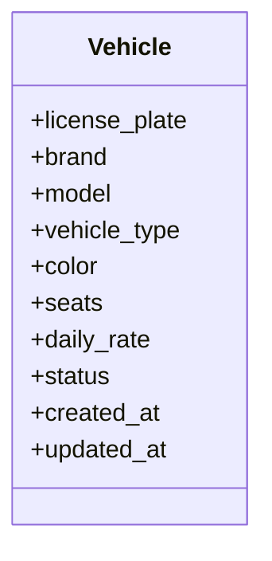
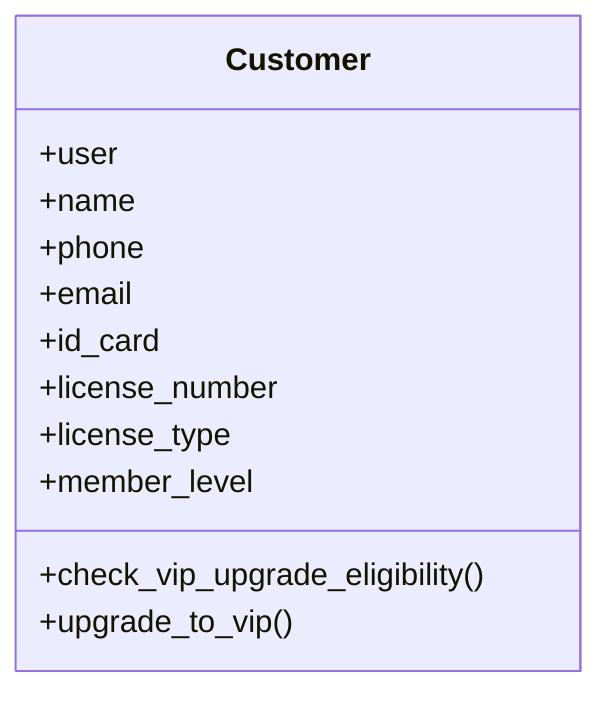
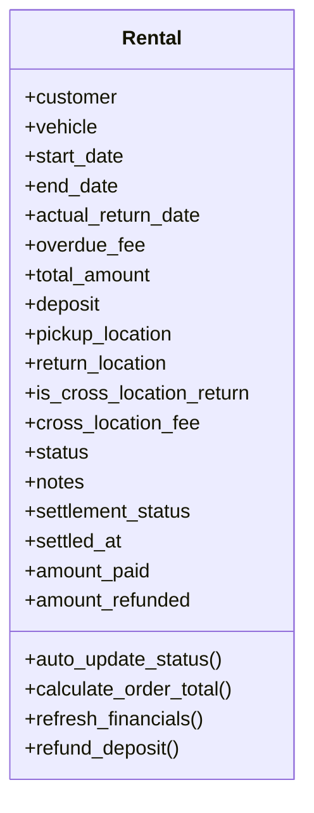
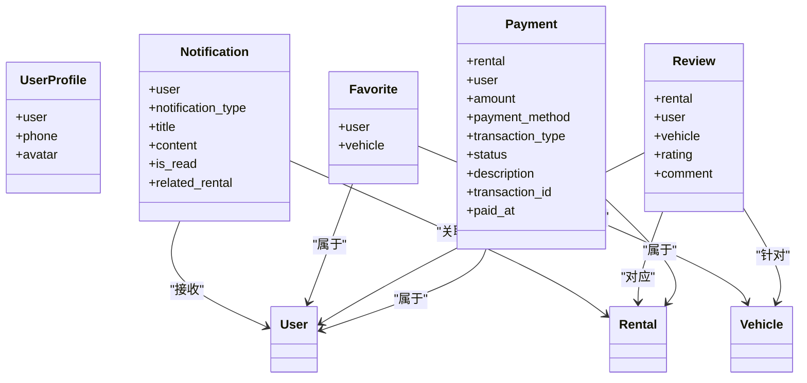
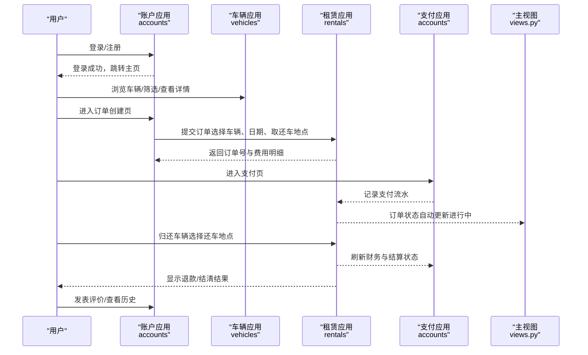
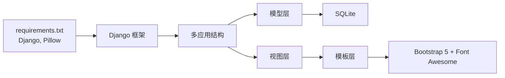

# 系统概述

<cite>
**本文引用的文件**
- [README.md](file://README.md)
- [settings.py](file://code/car_rental_system/car_rental_system/settings.py)
- [urls.py](file://code/car_rental_system/car_rental_system/urls.py)
- [views.py](file://code/car_rental_system/views.py)
- [requirements.txt](file://code/car_rental_system/requirements.txt)
- [vehicles/models.py](file://code/car_rental_system/vehicles/models.py)
- [customers/models.py](file://code/car_rental_system/customers/models.py)
- [rentals/models.py](file://code/car_rental_system/rentals/models.py)
- [accounts/models.py](file://code/car_rental_system/accounts/models.py)
- [vehicles/urls.py](file://code/car_rental_system/vehicles/urls.py)
- [customers/urls.py](file://code/car_rental_system/customers/urls.py)
- [rentals/urls.py](file://code/car_rental_system/rentals/urls.py)
- [accounts/urls.py](file://code/car_rental_system/accounts/urls.py)
- [base.html](file://code/car_rental_system/templates/base.html)
</cite>

## 目录
1. [简介](#简介)
2. [项目结构](#项目结构)
3. [核心组件](#核心组件)
4. [架构总览](#架构总览)
5. [详细组件分析](#详细组件分析)
6. [依赖关系分析](#依赖关系分析)
7. [性能考量](#性能考量)
8. [故障排查指南](#故障排查指南)
9. [结论](#结论)
10. [附录](#附录)

## 简介
本项目是一个基于 Django 框架开发的租车管理系统，旨在为小型或中型租车企业提供完整的数字化运营支撑。系统覆盖车辆管理、客户管理、租赁订单处理、支付结算以及 VIP 会员体系等核心业务模块，同时提供现代化的前端界面与完善的后台管理能力。通过清晰的业务流程设计与自动化机制（如订单状态自动更新、VIP 升级、押金与退款处理），系统能够有效提升运营效率、降低人工成本，并改善用户体验。

系统目标与业务范围
- 目标：构建一个功能完备、易于维护、可扩展的租车业务平台，支持从用户浏览、下单、支付到还车、结算、评价的全链路闭环。
- 业务范围：涵盖车辆资源管理、客户信息与会员等级管理、订单生命周期管理（预订、进行、超时、完成、取消）、支付与退款、评价与信誉体系、后台统计与报表。

技术选型与设计理念
- 后端：Django 5.2.8，采用多应用（apps）分层组织，职责清晰，便于扩展与维护。
- 前端：Bootstrap 5 + Font Awesome，响应式设计，兼顾桌面与移动端体验；模板继承与静态资源管理优化加载性能。
- 数据库：SQLite（开发环境），轻量易部署，适合教学与演示场景；生产环境可平滑迁移到更大型数据库。
- 架构理念：以领域模型为中心，围绕 Vehicle、Customer、Rental、Review、Payment 等核心实体展开；通过视图函数与 URL 分发实现清晰的路由与控制流；利用缓存与查询优化提升性能；通过管理命令与自动任务保障业务一致性。

应用价值
- 对用户：便捷的车辆浏览、订单管理、支付与评价体验，支持 VIP 权益与积分化信誉体系。
- 对管理员：统一的后台管理界面，支持车辆、客户、订单、评价与财务的集中管控，提供统计看板与报表。
- 对企业：标准化的业务流程、自动化规则与数据驱动决策支持，降低运营风险与成本。

## 项目结构
系统采用“主项目 + 多应用”的结构组织，每个应用负责特定业务域，主 URL 将请求分发至各应用的子 URL 配置，模板采用统一的 base.html 进行布局复用。

图表来源
- [urls.py](file://code/car_rental_system/car_rental_system/urls.py#L1-L43)
- [vehicles/urls.py](file://code/car_rental_system/vehicles/urls.py#L1-L18)
- [customers/urls.py](file://code/car_rental_system/customers/urls.py#L1-L19)
- [rentals/urls.py](file://code/car_rental_system/rentals/urls.py#L1-L22)
- [accounts/urls.py](file://code/car_rental_system/accounts/urls.py#L1-L50)
- [base.html](file://code/car_rental_system/templates/base.html#L1-L291)

章节来源
- [urls.py](file://code/car_rental_system/car_rental_system/urls.py#L1-L43)
- [settings.py](file://code/car_rental_system/car_rental_system/settings.py#L33-L44)
- [base.html](file://code/car_rental_system/templates/base.html#L1-L291)

## 核心组件
系统围绕以下核心模型与应用展开：
- 车辆模型（Vehicle）：管理车辆基本信息、状态与索引，支撑车辆列表、筛选与状态变更。
- 客户模型（Customer）：管理客户资料、会员等级与 VIP 升级逻辑。
- 租赁模型（Rental）：管理订单生命周期、费用计算、状态自动更新、结算与退款。
- 支付与评价（Payment、Review）：记录支付流水、退款与用户评价，支撑财务与信誉体系。
- 应用与路由：vehicles、customers、rentals、accounts 四个应用分别提供 CRUD、状态管理、支付与评价等能力。

章节来源
- [vehicles/models.py](file://code/car_rental_system/vehicles/models.py#L1-L85)
- [customers/models.py](file://code/car_rental_system/customers/models.py#L1-L160)
- [rentals/models.py](file://code/car_rental_system/rentals/models.py#L1-L401)
- [accounts/models.py](file://code/car_rental_system/accounts/models.py#L1-L318)

## 架构总览
系统采用典型的 MVC（Model-View-Controller）分层：
- 模型层：Django ORM 定义实体与关系，配合索引与约束保证数据完整性与查询性能。
- 视图层：函数视图负责业务逻辑与数据聚合，模板渲染输出页面。
- 路由层：主 URL 将请求分发到各应用子 URL，再映射到具体视图。
- 前端层：Bootstrap 响应式布局，模板继承 base.html，统一导航与样式。

图表来源
- [urls.py](file://code/car_rental_system/car_rental_system/urls.py#L1-L43)
- [views.py](file://code/car_rental_system/views.py#L1-L227)
- [settings.py](file://code/car_rental_system/car_rental_system/settings.py#L141-L151)
- [base.html](file://code/car_rental_system/templates/base.html#L1-L291)

## 详细组件分析

### 车辆管理（vehicles）
- 职责：车辆信息录入、编辑、删除、状态管理与列表展示。
- 关键点：状态枚举（可用/已租/维修中），索引优化（车牌、状态、品牌型号、座位数）。
- 典型流程：管理员在后台创建/编辑车辆，用户在前台浏览与筛选，系统根据状态与日期自动调整可用性。

图表来源
- [vehicles/models.py](file://code/car_rental_system/vehicles/models.py#L1-L85)

章节来源
- [vehicles/models.py](file://code/car_rental_system/vehicles/models.py#L1-L85)
- [vehicles/urls.py](file://code/car_rental_system/vehicles/urls.py#L1-L18)

### 客户管理（customers）
- 职责：客户信息登记、编辑、删除、会员等级管理与 VIP 升降级。
- 关键点：VIP 升级条件（连续 N 个订单无超时且诚信异地还车），升级策略与手动授权并存。
- 典型流程：用户注册成为普通会员，系统根据订单表现自动评估升级，管理员也可手动干预。

图表来源
- [customers/models.py](file://code/car_rental_system/customers/models.py#L1-L160)

章节来源
- [customers/models.py](file://code/car_rental_system/customers/models.py#L1-L160)
- [customers/urls.py](file://code/car_rental_system/customers/urls.py#L1-L19)

### 租赁管理（rentals）
- 职责：订单创建、状态管理、还车处理、费用计算与结算。
- 关键点：订单状态自动更新（预订中→进行中→超时未归还），费用计算（基础租金、押金、异地还车费、超时费），退款与结算状态刷新。
- 典型流程：用户提交订单，系统计算费用并生成订单；到期自动更新状态并联动车辆状态；还车后刷新财务与结算状态，必要时退还押金。

图表来源
- [rentals/models.py](file://code/car_rental_system/rentals/models.py#L1-L401)

章节来源
- [rentals/models.py](file://code/car_rental_system/rentals/models.py#L1-L401)
- [rentals/urls.py](file://code/car_rental_system/rentals/urls.py#L1-L22)

### 支付与评价（accounts）
- 职责：用户账户与资料、收藏、评价、支付记录与通知。
- 关键点：支付流水（支付/退款）、状态（待支付/已支付/失败/已退款）、方法（支付宝/微信/银行卡/现金）；评价评分与索引优化；通知类型与关联订单。
- 典型流程：用户在订单详情发起支付，系统记录支付流水；订单完成后触发押金退还；用户可对已完成订单发表评价。

图表来源
- [accounts/models.py](file://code/car_rental_system/accounts/models.py#L1-L318)

章节来源
- [accounts/models.py](file://code/car_rental_system/accounts/models.py#L1-L318)
- [accounts/urls.py](file://code/car_rental_system/accounts/urls.py#L1-L50)

### 典型工作流：从登录到完成租车
该流程展示了用户视角下的主要业务步骤，贯穿车辆浏览、订单创建、支付、还车与评价的完整闭环。

图表来源
- [accounts/urls.py](file://code/car_rental_system/accounts/urls.py#L1-L50)
- [vehicles/urls.py](file://code/car_rental_system/vehicles/urls.py#L1-L18)
- [rentals/urls.py](file://code/car_rental_system/rentals/urls.py#L1-L22)
- [views.py](file://code/car_rental_system/views.py#L1-L227)

## 依赖关系分析
- 模块耦合：应用间通过模型外键关联（Customer-Rental、Vehicle-Rental、User-Payment 等），形成清晰的领域边界；避免循环导入，使用延迟导入（如在方法内部导入）。
- 外部依赖：Django 5.2.8、Pillow，SQLite 本地数据库；前端依赖 Bootstrap 5 与 Font Awesome，通过 CDN 加速与回退策略提升稳定性。
- 性能与可靠性：启用内存缓存（LocMemCache）与数据库连接超时配置；模板层使用静态资源与延迟加载，减少首屏等待。

图表来源
- [requirements.txt](file://code/car_rental_system/requirements.txt#L1-L4)
- [settings.py](file://code/car_rental_system/car_rental_system/settings.py#L141-L151)
- [base.html](file://code/car_rental_system/templates/base.html#L1-L291)

章节来源
- [requirements.txt](file://code/car_rental_system/requirements.txt#L1-L4)
- [settings.py](file://code/car_rental_system/car_rental_system/settings.py#L79-L84)
- [base.html](file://code/car_rental_system/templates/base.html#L1-L291)

## 性能考量
- 查询优化：在视图中广泛使用 select_related 与聚合查询，减少 N+1 查询与数据库往返次数。
- 索引与字段约束：模型层面为高频查询字段建立索引（如车牌、状态、会员等级、评分等），并使用最小值校验等约束确保数据质量。
- 缓存策略：使用内存缓存存储短期状态（如订单状态自动更新的冷却时间），降低重复计算开销。
- 前端优化：模板层采用 CDN 加速与回退方案，JavaScript 延迟加载，页面加载指示器提升感知速度。

章节来源
- [views.py](file://code/car_rental_system/views.py#L21-L116)
- [vehicles/models.py](file://code/car_rental_system/vehicles/models.py#L68-L85)
- [customers/models.py](file://code/car_rental_system/customers/models.py#L89-L100)
- [accounts/models.py](file://code/car_rental_system/accounts/models.py#L133-L142)
- [settings.py](file://code/car_rental_system/car_rental_system/settings.py#L141-L151)
- [base.html](file://code/car_rental_system/templates/base.html#L1-L291)

## 故障排查指南
- 登录与权限
  - 若未登录访问受保护页面，系统将重定向至统一登录页；若权限不足，将返回 403 并提示无权限。
- 错误页面
  - 404 页面：未找到资源时返回自定义页面；500 页面：服务器内部错误时返回自定义页面；403 页面：权限不足时返回自定义页面。
- 数据库与迁移
  - 首次运行或模型变更后，需执行迁移命令创建/应用迁移文件；数据库文件为 SQLite，位于项目根目录。
- 支付与退款
  - 支付记录与退款记录均保留状态与描述，便于审计；订单完成后系统自动退还押金，若存在异常可检查支付流水与退款记录。
- 订单状态
  - 订单状态会根据日期自动更新；若出现异常，可通过管理命令批量更新历史订单。

章节来源
- [views.py](file://code/car_rental_system/views.py#L209-L227)
- [settings.py](file://code/car_rental_system/car_rental_system/settings.py#L127-L135)
- [README.md](file://README.md#L183-L194)

## 结论
本系统以 Django 为核心，结合 Bootstrap 前端与 SQLite 数据库，构建了一个功能完整、结构清晰、性能友好的租车管理平台。通过模型化的业务抽象、自动化的状态与财务处理、完善的权限与错误处理机制，系统能够在教学与演示场景中快速落地，并为后续扩展（如接入真实支付网关、引入更复杂的报表引擎）打下坚实基础。

## 附录
- 功能全景图（基于 README.md 的功能清单）
  - 用户端：用户认证与账户管理、车辆浏览与选择、订单管理、支付功能、还车功能、VIP 会员系统。
  - 管理员端：车辆管理、客户管理、租赁管理、评价管理。
- URL 结构参考（基于 README.md）
  - 用户相关：登录、注册、主页、个人中心、我的订单、订单详情、创建订单、消费明细等。
  - 管理员相关：客户管理、客户列表、添加客户、租赁管理、租赁列表、添加租赁、车辆管理、管理后台。

章节来源
- [README.md](file://README.md#L41-L116)
- [README.md](file://README.md#L196-L218)