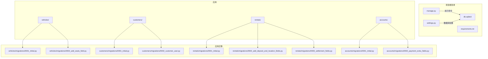
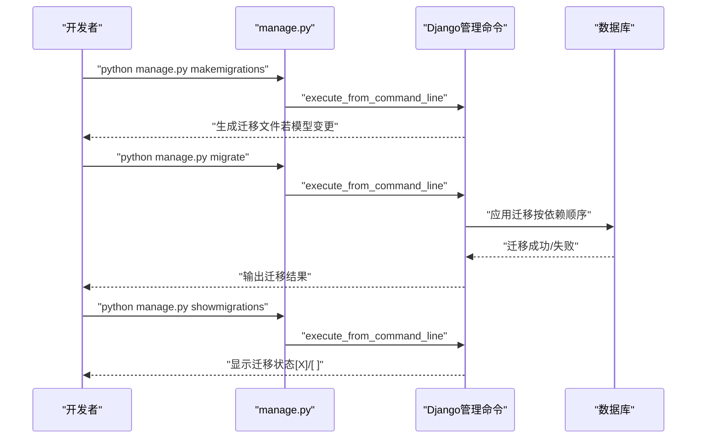
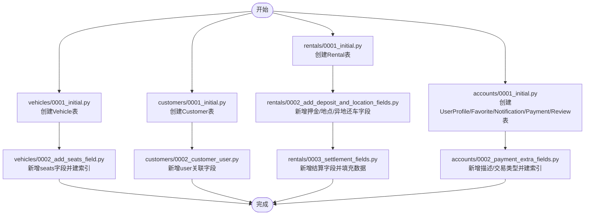
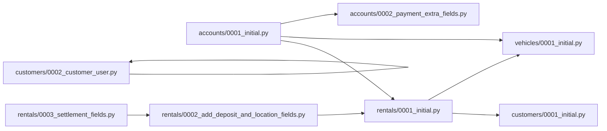

# 数据库迁移管理

<cite>
**本文引用的文件**
- [manage.py](file://code/car_rental_system/manage.py)
- [settings.py](file://code/car_rental_system/car_rental_system/settings.py)
- [requirements.txt](file://code/car_rental_system/requirements.txt)
- [迁移执行说明.md](file://code/car_rental_system/迁移执行说明.md)
- [README.md](file://code/car_rental_system/README.md)
- [optimize_database.py](file://code/car_rental_system/optimize_database.py)
- [accounts/migrations/0001_initial.py](file://code/car_rental_system/accounts/migrations/0001_initial.py)
- [accounts/migrations/0002_payment_extra_fields.py](file://code/car_rental_system/accounts/migrations/0002_payment_extra_fields.py)
- [customers/migrations/0001_initial.py](file://code/car_rental_system/customers/migrations/0001_initial.py)
- [customers/migrations/0002_customer_user.py](file://code/car_rental_system/customers/migrations/0002_customer_user.py)
- [rentals/migrations/0001_initial.py](file://code/car_rental_system/rentals/migrations/0001_initial.py)
- [rentals/migrations/0002_add_deposit_and_location_fields.py](file://code/car_rental_system/rentals/migrations/0002_add_deposit_and_location_fields.py)
- [rentals/migrations/0003_settlement_fields.py](file://code/car_rental_system/rentals/migrations/0003_settlement_fields.py)
- [vehicles/migrations/0001_initial.py](file://code/car_rental_system/vehicles/migrations/0001_initial.py)
- [vehicles/migrations/0002_add_seats_field.py](file://code/car_rental_system/vehicles/migrations/0002_add_seats_field.py)
</cite>

## 目录
1. [简介](#简介)
2. [项目结构](#项目结构)
3. [核心组件](#核心组件)
4. [架构总览](#架构总览)
5. [详细组件分析](#详细组件分析)
6. [依赖关系分析](#依赖关系分析)
7. [性能考量](#性能考量)
8. [故障排查指南](#故障排查指南)
9. [结论](#结论)
10. [附录](#附录)

## 简介
本文件系统性梳理本项目的数据库迁移机制，围绕Django迁移命令（如makemigrations、migrate、showmigrations）的使用方法展开，解释迁移文件的生成原理、版本控制策略与迁移历史管理方式，并结合项目现有的迁移文件（如0001_initial.py、0002_add_seats_field.py等）说明迁移演进过程。同时，文档覆盖SQLite默认数据库配置与向生产级数据库（如PostgreSQL）迁移的步骤，提供迁移冲突解决流程、数据迁移脚本编写方法以及迁移回滚的最佳实践，并给出常见问题（如迁移失败、数据库不一致）的诊断与修复方案。

## 项目结构
项目采用标准Django多应用结构，数据库迁移文件分布在各应用的migrations目录下，每个应用的初始模型迁移文件通常命名为0001_initial.py，后续变更通过独立迁移文件逐步演进。数据库默认使用SQLite，位于项目根目录的db.sqlite3文件。

图表来源
- [manage.py](file://code/car_rental_system/manage.py#L1-L23)
- [settings.py](file://code/car_rental_system/car_rental_system/settings.py#L76-L84)
- [requirements.txt](file://code/car_rental_system/requirements.txt#L1-L4)
- [vehicles/migrations/0001_initial.py](file://code/car_rental_system/vehicles/migrations/0001_initial.py#L1-L39)
- [vehicles/migrations/0002_add_seats_field.py](file://code/car_rental_system/vehicles/migrations/0002_add_seats_field.py#L1-L32)
- [customers/migrations/0001_initial.py](file://code/car_rental_system/customers/migrations/0001_initial.py#L1-L38)
- [customers/migrations/0002_customer_user.py](file://code/car_rental_system/customers/migrations/0002_customer_user.py#L1-L22)
- [rentals/migrations/0001_initial.py](file://code/car_rental_system/rentals/migrations/0001_initial.py#L1-L43)
- [rentals/migrations/0002_add_deposit_and_location_fields.py](file://code/car_rental_system/rentals/migrations/0002_add_deposit_and_location_fields.py#L1-L76)
- [rentals/migrations/0003_settlement_fields.py](file://code/car_rental_system/rentals/migrations/0003_settlement_fields.py#L1-L95)
- [accounts/migrations/0001_initial.py](file://code/car_rental_system/accounts/migrations/0001_initial.py#L1-L117)
- [accounts/migrations/0002_payment_extra_fields.py](file://code/car_rental_system/accounts/migrations/0002_payment_extra_fields.py#L1-L42)

章节来源
- [README.md](file://code/car_rental_system/README.md#L117-L195)
- [settings.py](file://code/car_rental_system/car_rental_system/settings.py#L76-L84)

## 核心组件
- 管理入口：通过manage.py统一调用Django命令行工具，设置DJANGO_SETTINGS_MODULE指向项目settings模块。
- 数据库配置：默认使用SQLite，数据库文件位于项目根目录，可通过settings.py的DATABASES配置项扩展至PostgreSQL等生产数据库。
- 迁移文件：各应用的migrations目录下存放迁移历史，文件名按顺序递增，依赖关系通过dependencies字段声明。
- 运行时优化：提供数据库索引优化脚本，辅助提升查询性能。

章节来源
- [manage.py](file://code/car_rental_system/manage.py#L1-L23)
- [settings.py](file://code/car_rental_system/car_rental_system/settings.py#L76-L84)
- [optimize_database.py](file://code/car_rental_system/optimize_database.py#L1-L55)

## 架构总览
下图展示了从命令行到数据库迁移的总体流程，包括迁移生成、应用与状态查看的关键步骤。

图表来源
- [manage.py](file://code/car_rental_system/manage.py#L1-L23)
- [README.md](file://code/car_rental_system/README.md#L183-L195)
- [迁移执行说明.md](file://code/car_rental_system/迁移执行说明.md#L24-L86)

## 详细组件分析

### 迁移命令与工作流
- 生成迁移：当模型发生变更后，使用命令生成迁移文件，Django会检测模型差异并创建对应的操作集合。
- 应用迁移：执行migrate将迁移文件逐个应用到数据库，严格遵循依赖顺序，确保外键与索引等依赖关系正确建立。
- 查看状态：showmigrations用于检查哪些迁移已应用、哪些未应用，便于定位问题。

章节来源
- [README.md](file://code/car_rental_system/README.md#L183-L195)
- [迁移执行说明.md](file://code/car_rental_system/迁移执行说明.md#L24-L86)

### 迁移文件生成原理与版本控制策略
- 文件命名：迁移文件按顺序编号，如0001_initial.py、0002_add_seats_field.py，确保可排序与可追溯。
- 依赖声明：每个迁移文件通过dependencies字段声明前置迁移，形成线性或分支的依赖链，保证执行顺序。
- 版本控制：迁移文件应纳入版本控制，避免多人协作时因迁移顺序不同导致冲突；建议每次模型变更提交独立迁移文件。

章节来源
- [vehicles/migrations/0001_initial.py](file://code/car_rental_system/vehicles/migrations/0001_initial.py#L1-L39)
- [vehicles/migrations/0002_add_seats_field.py](file://code/car_rental_system/vehicles/migrations/0002_add_seats_field.py#L1-L32)
- [customers/migrations/0001_initial.py](file://code/car_rental_system/customers/migrations/0001_initial.py#L1-L38)
- [customers/migrations/0002_customer_user.py](file://code/car_rental_system/customers/migrations/0002_customer_user.py#L1-L22)
- [rentals/migrations/0001_initial.py](file://code/car_rental_system/rentals/migrations/0001_initial.py#L1-L43)
- [rentals/migrations/0002_add_deposit_and_location_fields.py](file://code/car_rental_system/rentals/migrations/0002_add_deposit_and_location_fields.py#L1-L76)
- [accounts/migrations/0001_initial.py](file://code/car_rental_system/accounts/migrations/0001_initial.py#L1-L117)
- [accounts/migrations/0002_payment_extra_fields.py](file://code/car_rental_system/accounts/migrations/0002_payment_extra_fields.py#L1-L42)

### 迁移历史管理方式（以现有文件为例）
- 初始模型：vehicles、customers、rentals、accounts均包含0001_initial.py，定义了基础表结构与索引。
- 后续演进：通过新增字段、索引、数据填充等操作逐步完善业务需求，例如：
  - vehicles：新增座位数字段并添加索引。
  - customers：为Customer模型增加与用户模型的一对一关联字段。
  - rentals：新增押金、取还车地点、异地还车标记与费用等字段，并补充结算相关字段与数据填充逻辑。
  - accounts：为Payment模型增加描述与交易类型字段，并添加相应索引。

图表来源
- [vehicles/migrations/0001_initial.py](file://code/car_rental_system/vehicles/migrations/0001_initial.py#L1-L39)
- [vehicles/migrations/0002_add_seats_field.py](file://code/car_rental_system/vehicles/migrations/0002_add_seats_field.py#L1-L32)
- [customers/migrations/0001_initial.py](file://code/car_rental_system/customers/migrations/0001_initial.py#L1-L38)
- [customers/migrations/0002_customer_user.py](file://code/car_rental_system/customers/migrations/0002_customer_user.py#L1-L22)
- [rentals/migrations/0001_initial.py](file://code/car_rental_system/rentals/migrations/0001_initial.py#L1-L43)
- [rentals/migrations/0002_add_deposit_and_location_fields.py](file://code/car_rental_system/rentals/migrations/0002_add_deposit_and_location_fields.py#L1-L76)
- [rentals/migrations/0003_settlement_fields.py](file://code/car_rental_system/rentals/migrations/0003_settlement_fields.py#L1-L95)
- [accounts/migrations/0001_initial.py](file://code/car_rental_system/accounts/migrations/0001_initial.py#L1-L117)
- [accounts/migrations/0002_payment_extra_fields.py](file://code/car_rental_system/accounts/migrations/0002_payment_extra_fields.py#L1-L42)

### 数据库引擎配置（SQLite默认配置）与生产迁移（PostgreSQL）
- 默认配置：项目使用SQLite作为默认数据库，数据库文件位于项目根目录，通过settings.py的DATABASES配置项指定。
- 生产迁移：若需迁移到PostgreSQL，应在settings.py中替换ENGINE与NAME等参数，并确保依赖包安装（requirements.txt中仅包含Django与Pillow）。迁移步骤如下：
  1) 在目标数据库中创建数据库与用户，并赋予必要权限。
  2) 修改settings.py中的DATABASES配置为PostgreSQL连接参数。
  3) 执行python manage.py migrate应用迁移。
  4) 如需同步历史数据，可参考数据迁移脚本编写方法（见下一节）。

章节来源
- [settings.py](file://code/car_rental_system/car_rental_system/settings.py#L76-L84)
- [requirements.txt](file://code/car_rental_system/requirements.txt#L1-L4)
- [README.md](file://code/car_rental_system/README.md#L219-L227)

### 数据迁移脚本编写方法
- RunPython操作：在迁移中使用RunPython执行自定义数据填充或转换逻辑，如rentals/0003_settlement_fields.py中对结算相关字段的批量填充。
- 脚本化工具：提供独立脚本optimize_database.py，通过Django setup初始化环境后，使用原生SQL语句创建索引，提升查询性能。

章节来源
- [rentals/migrations/0003_settlement_fields.py](file://code/car_rental_system/rentals/migrations/0003_settlement_fields.py#L1-L95)
- [optimize_database.py](file://code/car_rental_system/optimize_database.py#L1-L55)

### 迁移回滚最佳实践
- 回滚策略：Django不建议直接回滚已应用的迁移，应通过新增迁移来撤销或修正变更，保持迁移历史不可变。
- 逆向操作：对于字段删除、索引移除等操作，可在新的迁移中使用对应的逆向操作（如RemoveField、RemoveIndex），并确保依赖关系正确。
- 备份优先：在执行可能破坏数据的迁移前，务必备份数据库文件或导出数据快照。

章节来源
- [迁移执行说明.md](file://code/car_rental_system/迁移执行说明.md#L55-L66)

### 迁移冲突解决流程
- 冲突识别：当多个开发者在同一模型上生成迁移文件时，可能出现依赖冲突或重复操作。
- 解决步骤：
  1) 合并迁移：将冲突的迁移文件合并为一个新迁移，保留必要的操作序列。
  2) 调整依赖：确保dependencies字段指向正确的前置迁移。
  3) 验证顺序：使用showmigrations核对迁移顺序与状态。
  4) 重新应用：在安全环境下执行migrate，观察输出并检查数据库一致性。

章节来源
- [迁移执行说明.md](file://code/car_rental_system/迁移执行说明.md#L102-L112)

## 依赖关系分析
下图展示应用间迁移的依赖关系，体现模型间的外键与关联关系如何通过迁移顺序保障一致性。

图表来源
- [accounts/migrations/0001_initial.py](file://code/car_rental_system/accounts/migrations/0001_initial.py#L1-L117)
- [accounts/migrations/0002_payment_extra_fields.py](file://code/car_rental_system/accounts/migrations/0002_payment_extra_fields.py#L1-L42)
- [customers/migrations/0001_initial.py](file://code/car_rental_system/customers/migrations/0001_initial.py#L1-L38)
- [customers/migrations/0002_customer_user.py](file://code/car_rental_system/customers/migrations/0002_customer_user.py#L1-L22)
- [rentals/migrations/0001_initial.py](file://code/car_rental_system/rentals/migrations/0001_initial.py#L1-L43)
- [rentals/migrations/0002_add_deposit_and_location_fields.py](file://code/car_rental_system/rentals/migrations/0002_add_deposit_and_location_fields.py#L1-L76)
- [rentals/migrations/0003_settlement_fields.py](file://code/car_rental_system/rentals/migrations/0003_settlement_fields.py#L1-L95)
- [vehicles/migrations/0001_initial.py](file://code/car_rental_system/vehicles/migrations/0001_initial.py#L1-L39)
- [vehicles/migrations/0002_add_seats_field.py](file://code/car_rental_system/vehicles/migrations/0002_add_seats_field.py#L1-L32)

## 性能考量
- 索引优化：通过迁移添加索引以提升查询性能，如vehicles/0002_add_seats_field.py为seats字段添加索引；customers/0001_initial.py与rentals/0001_initial.py已包含多处索引。
- 运行时索引：提供optimize_database.py脚本，通过原生SQL创建常用索引，进一步优化查询性能。
- SQLite连接参数：settings.py中为默认数据库增加了超时参数，有助于在并发场景下提升稳定性。

章节来源
- [vehicles/migrations/0002_add_seats_field.py](file://code/car_rental_system/vehicles/migrations/0002_add_seats_field.py#L1-L32)
- [customers/migrations/0001_initial.py](file://code/car_rental_system/customers/migrations/0001_initial.py#L1-L38)
- [rentals/migrations/0001_initial.py](file://code/car_rental_system/rentals/migrations/0001_initial.py#L1-L43)
- [optimize_database.py](file://code/car_rental_system/optimize_database.py#L1-L55)
- [settings.py](file://code/car_rental_system/car_rental_system/settings.py#L153-L157)

## 故障排查指南
- 迁移失败常见原因：
  - Python环境与Django版本不匹配。
  - 数据库文件被其他进程占用或无写权限。
  - 迁移依赖顺序错误或缺失中间迁移。
- 排查步骤：
  1) 使用showmigrations查看迁移状态，确认未应用迁移列表。
  2) 检查数据库文件权限与占用情况。
  3) 根据错误信息定位具体迁移文件，必要时回滚至上一个稳定迁移并重新生成。
  4) 参考迁移执行说明中的注意事项，先停止开发服务器并备份数据库。
- 数据库不一致：
  - 若出现“列不存在”等错误，通常是未应用最新迁移导致，执行migrate后问题通常可解决。
  - 对于历史数据不一致，可使用RunPython迁移或独立脚本进行修复。

章节来源
- [迁移执行说明.md](file://code/car_rental_system/迁移执行说明.md#L54-L112)
- [README.md](file://code/car_rental_system/README.md#L183-L195)

## 结论
本项目遵循Django标准的迁移机制，通过有序的迁移文件与明确的依赖关系，实现了从初始模型到复杂业务字段与结算逻辑的平滑演进。SQLite默认配置满足本地开发需求，同时具备向PostgreSQL等生产数据库迁移的能力。建议在团队协作中坚持“每次变更提交独立迁移文件”的原则，并配合索引优化与定期备份，确保迁移过程的安全与可维护性。

## 附录
- 常用命令清单
  - 生成迁移：python manage.py makemigrations
  - 应用迁移：python manage.py migrate
  - 查看迁移状态：python manage.py showmigrations
  - 启动开发服务器：python manage.py runserver
  - 创建超级用户：python manage.py createsuperuser

章节来源
- [README.md](file://code/car_rental_system/README.md#L149-L195)
- [迁移执行说明.md](file://code/car_rental_system/迁移执行说明.md#L24-L86)