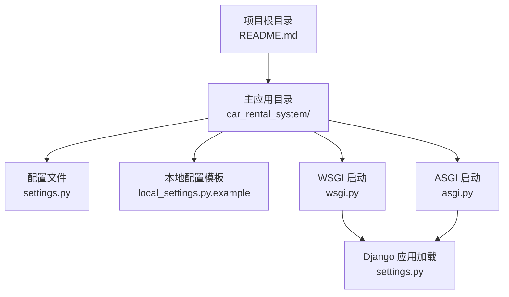
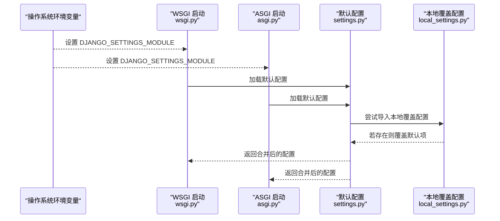
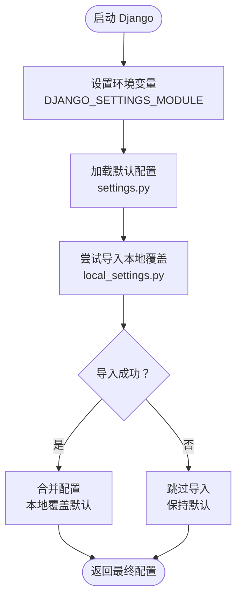
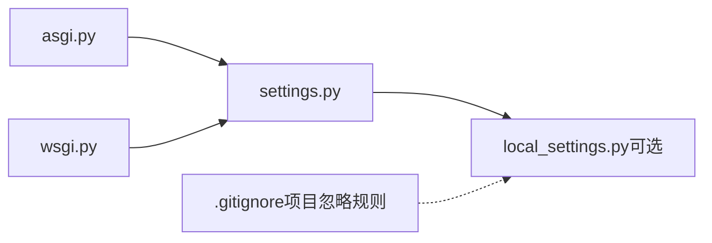

# 环境配置

<cite>
**本文引用的文件**
- [settings.py](file://code/car_rental_system/car_rental_system/settings.py)
- [local_settings.py.example](file://code/car_rental_system/car_rental_system/local_settings.py.example)
- [GIT_UPLOAD_GUIDE.md](file://code/car_rental_system/GIT_UPLOAD_GUIDE.md)
- [README.md](file://README.md)
- [asgi.py](file://code/car_rental_system/car_rental_system/asgi.py)
- [wsgi.py](file://code/car_rental_system/car_rental_system/wsgi.py)
- [系统测试与优化报告.md](file://code/car_rental_system/系统测试与优化报告.md)
- [check_before_upload.md](file://code/car_rental_system/check_before_upload.md)
</cite>

## 目录
1. [简介](#简介)
2. [项目结构](#项目结构)
3. [核心组件](#核心组件)
4. [架构总览](#架构总览)
5. [详细组件分析](#详细组件分析)
6. [依赖关系分析](#依赖关系分析)
7. [性能考虑](#性能考虑)
8. [故障排查指南](#故障排查指南)
9. [结论](#结论)
10. [附录](#附录)

## 简介
本指南围绕项目中的环境配置展开，重点解释 settings.py 中的关键配置项及其作用，并结合 local_settings.py.example 展示如何实现开发、测试、生产环境的配置分离。同时，文档阐述配置加载机制（通过 Python 导入机制覆盖默认设置）、常见配置错误的排查方法（如密钥泄露风险、跨域访问失败等），并通过流程图和序列图帮助读者建立清晰的配置优先级与覆盖逻辑认知。

## 项目结构
本项目采用标准 Django 项目结构，核心配置集中在 car_rental_system/settings.py，本地覆盖配置模板为 car_rental_system/local_settings.py.example。WSGI/ASGI 启动入口通过环境变量 DJANGO_SETTINGS_MODULE 指向 settings.py，从而加载配置。

图表来源
- [settings.py](file://code/car_rental_system/car_rental_system/settings.py#L1-L179)
- [local_settings.py.example](file://code/car_rental_system/car_rental_system/local_settings.py.example#L1-L29)
- [asgi.py](file://code/car_rental_system/car_rental_system/asgi.py#L1-L16)
- [wsgi.py](file://code/car_rental_system/car_rental_system/wsgi.py#L1-L16)

章节来源
- [settings.py](file://code/car_rental_system/car_rental_system/settings.py#L1-L179)
- [README.md](file://README.md#L1-L60)

## 核心组件
本节聚焦 settings.py 中与环境配置密切相关的关键项，包括安全密钥、调试模式、主机白名单、国际化与时区等。

- SECRET_KEY（安全密钥）
  - 作用：用于签名 Django 的会话 Cookie、CSRF 令牌等，保障应用安全。
  - 生产建议：务必使用强随机值，避免硬编码在版本控制中；可通过环境变量或本地覆盖文件注入。
  - 当前默认值：项目中存在默认密钥，仅用于开发演示，生产环境必须替换。
  
- DEBUG（调试模式）
  - 作用：开启后输出详细错误信息，便于开发调试；关闭后隐藏敏感错误细节，提升安全性。
  - 生产建议：生产环境必须设为 False。
  
- ALLOWED_HOSTS（允许的主机）
  - 作用：限制 HTTP Host 头部，防止 Host 头攻击；生产环境必须精确配置域名。
  - 生产建议：仅包含实际部署域名，避免使用通配符。
  
- LANGUAGE_CODE 与 TIME_ZONE（本地化）
  - 作用：设置语言与时间区域，影响模板渲染、日期时间显示与数据库时区处理。
  - 项目默认：简体中文与上海时区，满足国内使用场景。

章节来源
- [settings.py](file://code/car_rental_system/car_rental_system/settings.py#L20-L30)
- [settings.py](file://code/car_rental_system/car_rental_system/settings.py#L106-L116)

## 架构总览
下图展示了 Django 启动时的配置加载顺序与覆盖机制：默认配置由 settings.py 提供，随后尝试导入本地覆盖配置 local_settings.py（若存在），最终以本地配置为准。

图表来源
- [asgi.py](file://code/car_rental_system/car_rental_system/asgi.py#L1-L16)
- [wsgi.py](file://code/car_rental_system/car_rental_system/wsgi.py#L1-L16)
- [settings.py](file://code/car_rental_system/car_rental_system/settings.py#L1-L179)
- [local_settings.py.example](file://code/car_rental_system/car_rental_system/local_settings.py.example#L1-L29)

## 详细组件分析

### 配置加载机制与覆盖逻辑
- 加载顺序
  1) Django 通过环境变量 DJANGO_SETTINGS_MODULE 指定 settings.py。
  2) settings.py 作为默认配置源，定义项目的基础设置。
  3) settings.py 内部尝试从 local_settings.py 导入所有符号，实现“本地覆盖”。
  4) 若本地文件不存在，则导入失败被捕获，不影响默认配置继续生效。
- 覆盖原则
  - 本地配置文件中的同名项将覆盖 settings.py 中的默认值。
  - 未在本地文件中声明的项仍使用 settings.py 的默认值。
- 安全性
  - 本地配置文件 local_settings.py 不应纳入版本控制，项目提供了示例模板与上传检查指引，确保敏感信息不外泄。

图表来源
- [asgi.py](file://code/car_rental_system/car_rental_system/asgi.py#L1-L16)
- [wsgi.py](file://code/car_rental_system/car_rental_system/wsgi.py#L1-L16)
- [settings.py](file://code/car_rental_system/car_rental_system/settings.py#L1-L179)
- [local_settings.py.example](file://code/car_rental_system/car_rental_system/local_settings.py.example#L1-L29)

章节来源
- [settings.py](file://code/car_rental_system/car_rental_system/settings.py#L1-L179)
- [GIT_UPLOAD_GUIDE.md](file://code/car_rental_system/GIT_UPLOAD_GUIDE.md#L124-L140)

### SECRET_KEY 的安全设置
- 开发阶段
  - 使用示例模板 local_settings.py.example 中的占位值，便于快速启动。
- 生产阶段
  - 必须替换为强随机密钥，避免硬编码在版本控制中。
  - 推荐通过环境变量注入，或在本地覆盖文件中设置。
- 风险提示
  - 若密钥泄露，可能导致会话劫持、CSRF 攻击等安全问题。
  - 一旦发生泄露，应立即轮换密钥并重新部署。

章节来源
- [settings.py](file://code/car_rental_system/car_rental_system/settings.py#L20-L30)
- [local_settings.py.example](file://code/car_rental_system/car_rental_system/local_settings.py.example#L7-L11)
- [GIT_UPLOAD_GUIDE.md](file://code/car_rental_system/GIT_UPLOAD_GUIDE.md#L141-L147)

### DEBUG 模式的启用与禁用
- 开发阶段
  - 可开启以获得详细错误信息，便于定位问题。
- 生产阶段
  - 必须关闭，避免暴露内部错误细节。
- 影响范围
  - 关闭后错误页面将呈现通用信息，有助于降低攻击面。

章节来源
- [settings.py](file://code/car_rental_system/car_rental_system/settings.py#L20-L30)
- [local_settings.py.example](file://code/car_rental_system/car_rental_system/local_settings.py.example#L10-L12)

### ALLOWED_HOSTS 的生产环境配置建议
- 基本原则
  - 仅包含实际部署域名，避免使用通配符，防止 Host 头攻击。
- 示例
  - 本地模板中提供了示例值，生产环境需替换为真实域名。
- 常见问题
  - 跨域访问失败或 400 Bad Request：多因未正确配置 ALLOWED_HOSTS。

章节来源
- [settings.py](file://code/car_rental_system/car_rental_system/settings.py#L20-L30)
- [local_settings.py.example](file://code/car_rental_system/car_rental_system/local_settings.py.example#L13-L14)

### LANGUAGE_CODE 与 TIME_ZONE 的本地化设置
- LANGUAGE_CODE
  - 控制模板与国际化文本的语言，默认为简体中文。
- TIME_ZONE
  - 控制时区，默认为 Asia/Shanghai。
- 影响范围
  - 影响日期时间显示、日志记录、数据库时区一致性等。

章节来源
- [settings.py](file://code/car_rental_system/car_rental_system/settings.py#L106-L116)

### 如何利用 local_settings.py.example 创建本地配置文件
- 步骤
  1) 复制示例文件为 local_settings.py。
  2) 在 local_settings.py 中填写真实配置（如 SECRET_KEY、DEBUG、ALLOWED_HOSTS 等）。
  3) 确保 local_settings.py 不被提交到版本控制。
- 依据
  - 项目上传指南明确给出了复制与导入流程。

章节来源
- [local_settings.py.example](file://code/car_rental_system/car_rental_system/local_settings.py.example#L1-L29)
- [GIT_UPLOAD_GUIDE.md](file://code/car_rental_system/GIT_UPLOAD_GUIDE.md#L124-L140)

### 配置优先级与覆盖逻辑（代码级说明）
- 优先级
  - settings.py 默认配置为基线。
  - local_settings.py 存在时，其同名项覆盖默认值。
  - 未在 local_settings.py 中声明的项保持默认值。
- 导入机制
  - settings.py 内部通过导入语句尝试从本地文件导入所有符号，导入失败则忽略。

章节来源
- [settings.py](file://code/car_rental_system/car_rental_system/settings.py#L1-L179)
- [GIT_UPLOAD_GUIDE.md](file://code/car_rental_system/GIT_UPLOAD_GUIDE.md#L133-L139)

### 生产环境安全配置参考
- 安全建议
  - 关闭 DEBUG，限定 ALLOWED_HOSTS，启用 HTTPS 重定向与 HSTS。
- 参考
  - 项目测试与优化报告中提供了生产环境安全配置示例。

章节来源
- [系统测试与优化报告.md](file://code/car_rental_system/系统测试与优化报告.md#L241-L255)

## 依赖关系分析
- 启动入口
  - asgi.py 与 wsgi.py 通过环境变量指定 settings.py 作为配置模块。
- 配置依赖
  - settings.py 依赖本地覆盖配置 local_settings.py（可选）。
- 版本控制与安全
  - 项目上传指南强调 local_settings.py 与 .env 不应提交到仓库，并提供了上传前检查清单。

图表来源
- [asgi.py](file://code/car_rental_system/car_rental_system/asgi.py#L1-L16)
- [wsgi.py](file://code/car_rental_system/car_rental_system/wsgi.py#L1-L16)
- [settings.py](file://code/car_rental_system/car_rental_system/settings.py#L1-L179)
- [GIT_UPLOAD_GUIDE.md](file://code/car_rental_system/GIT_UPLOAD_GUIDE.md#L1-L60)

章节来源
- [asgi.py](file://code/car_rental_system/car_rental_system/asgi.py#L1-L16)
- [wsgi.py](file://code/car_rental_system/car_rental_system/wsgi.py#L1-L16)
- [GIT_UPLOAD_GUIDE.md](file://code/car_rental_system/GIT_UPLOAD_GUIDE.md#L1-L60)

## 性能考虑
- 缓存与日志
  - 项目内置内存缓存与日志配置，有助于开发调试与性能观测。
- 数据库连接
  - SQLite 默认连接超时参数已优化，适合开发环境；生产环境建议使用更稳定的数据库并配置连接池。

章节来源
- [settings.py](file://code/car_rental_system/car_rental_system/settings.py#L141-L179)

## 故障排查指南
- 密钥泄露风险
  - 症状：密钥被提交到版本控制或泄露。
  - 处理：立即轮换密钥，从历史中移除敏感文件，必要时重写 Git 历史并通知团队成员。
  - 预防：使用环境变量或本地覆盖文件存储密钥，确保不在仓库中出现真实密钥。
  
- 跨域访问失败（Host 头错误）
  - 症状：访问时报错或 400 Bad Request。
  - 处理：在 local_settings.py 中设置正确的 ALLOWED_HOSTS，包含实际域名。
  
- 上传前检查
  - 使用上传检查脚本与清单，确认数据库文件、敏感配置文件未被跟踪，.gitignore 规则有效。
  
- 生产环境安全
  - 关闭 DEBUG，限定 ALLOWED_HOSTS，启用 HTTPS 重定向与 HSTS，避免通配符配置。

章节来源
- [GIT_UPLOAD_GUIDE.md](file://code/car_rental_system/GIT_UPLOAD_GUIDE.md#L102-L170)
- [check_before_upload.md](file://code/car_rental_system/check_before_upload.md#L69-L114)
- [系统测试与优化报告.md](file://code/car_rental_system/系统测试与优化报告.md#L241-L255)

## 结论
本指南梳理了 settings.py 的关键配置项与加载机制，明确了开发、测试、生产三类环境的配置分离策略。通过本地覆盖文件与环境变量注入，既能保证开发便利，又能满足生产安全要求。建议在部署前严格遵循上传检查清单，确保敏感信息不外泄，并按生产安全最佳实践完善配置。

## 附录
- 快速对照表
  - SECRET_KEY：生产必须替换，避免硬编码。
  - DEBUG：生产必须关闭。
  - ALLOWED_HOSTS：生产必须精确配置域名。
  - LANGUAGE_CODE/TIME_ZONE：按需调整语言与时区。
- 参考路径
  - 默认配置：[settings.py](file://code/car_rental_system/car_rental_system/settings.py#L1-L179)
  - 本地覆盖模板：[local_settings.py.example](file://code/car_rental_system/car_rental_system/local_settings.py.example#L1-L29)
  - 启动入口：[asgi.py](file://code/car_rental_system/car_rental_system/asgi.py#L1-L16)，[wsgi.py](file://code/car_rental_system/car_rental_system/wsgi.py#L1-L16)
  - 上传与安全：[GIT_UPLOAD_GUIDE.md](file://code/car_rental_system/GIT_UPLOAD_GUIDE.md#L102-L170)，[check_before_upload.md](file://code/car_rental_system/check_before_upload.md#L69-L114)
  - 生产安全参考：[系统测试与优化报告.md](file://code/car_rental_system/系统测试与优化报告.md#L241-L255)