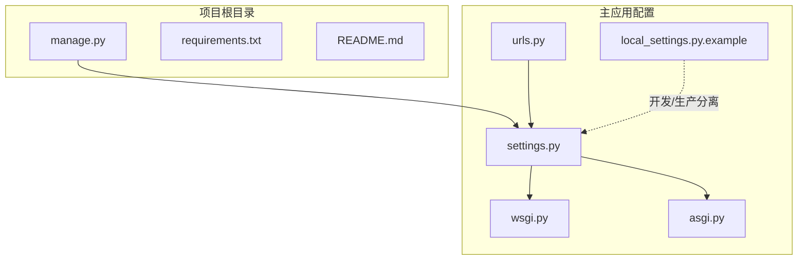
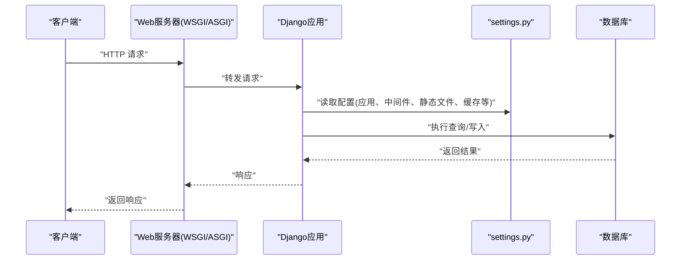
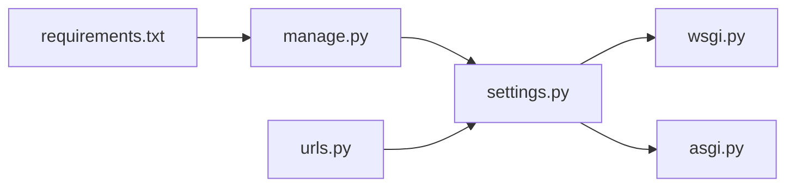

# 系统配置与部署

<cite>
**本文引用的文件**
- [settings.py](file://code/car_rental_system/car_rental_system/settings.py)
- [local_settings.py.example](file://code/car_rental_system/car_rental_system/local_settings.py.example)
- [manage.py](file://code/car_rental_system/manage.py)
- [wsgi.py](file://code/car_rental_system/car_rental_system/wsgi.py)
- [asgi.py](file://code/car_rental_system/car_rental_system/asgi.py)
- [urls.py](file://code/car_rental_system/car_rental_system/urls.py)
- [requirements.txt](file://code/car_rental_system/requirements.txt)
- [README.md](file://README.md)
- [迁移执行说明.md](file://code/car_rental_system/迁移执行说明.md)
- [GIT_UPLOAD_GUIDE.md](file://code/car_rental_system/GIT_UPLOAD_GUIDE.md)
</cite>

## 目录
1. [简介](#简介)
2. [项目结构](#项目结构)
3. [核心组件](#核心组件)
4. [架构总览](#架构总览)
5. [详细组件分析](#详细组件分析)
6. [依赖关系分析](#依赖关系分析)
7. [性能考虑](#性能考虑)
8. [故障排查指南](#故障排查指南)
9. [结论](#结论)
10. [附录](#附录)

## 简介
本指南面向开发者与运维人员，围绕项目环境配置与生产部署展开，重点说明 settings.py 中的关键配置项（如 DEBUG、数据库、静态文件、安全密钥等），讲解 local_settings.py.example 的使用方法以实现开发与生产环境分离，介绍 manage.py 支持的关键命令（如 runserver、migrate、collectstatic）的应用场景，并提供 Docker 部署建议与 WSGI/ASGI 配置示例，帮助系统在不同环境中稳定运行。

## 项目结构
项目采用标准 Django 结构，核心配置集中在 car_rental_system 子目录下，入口脚本与 WSGI/ASGI 配置分别位于 manage.py、wsgi.py、asgi.py，主 URL 路由在 car_rental_system/urls.py 中定义。

图表来源
- [manage.py](file://code/car_rental_system/manage.py#L1-L23)
- [settings.py](file://code/car_rental_system/car_rental_system/settings.py#L1-L179)
- [urls.py](file://code/car_rental_system/car_rental_system/urls.py#L1-L43)
- [wsgi.py](file://code/car_rental_system/car_rental_system/wsgi.py#L1-L17)
- [asgi.py](file://code/car_rental_system/car_rental_system/asgi.py#L1-L17)
- [requirements.txt](file://code/car_rental_system/requirements.txt#L1-L4)
- [README.md](file://README.md#L1-L278)

章节来源
- [README.md](file://README.md#L1-L278)
- [requirements.txt](file://code/car_rental_system/requirements.txt#L1-L4)

## 核心组件
- settings.py：项目全局配置，包含应用注册、中间件、模板、静态文件、国际化、缓存、数据库、日志、登录重定向等。
- local_settings.py.example：示例本地配置文件，用于覆盖生产敏感信息（如 SECRET_KEY、DEBUG、ALLOWED_HOSTS、数据库等），避免提交到版本库。
- manage.py：Django 管理入口，设置 DJANGO_SETTINGS_MODULE 并调用命令行执行器。
- wsgi.py / asgi.py：WSGI/ASGI 应用入口，供生产 Web 服务器（如 Gunicorn、uWSGI）加载。
- urls.py：主路由配置，包含各应用子路由及开发环境下的静态文件服务。

章节来源
- [settings.py](file://code/car_rental_system/car_rental_system/settings.py#L1-L179)
- [local_settings.py.example](file://code/car_rental_system/car_rental_system/local_settings.py.example#L1-L29)
- [manage.py](file://code/car_rental_system/manage.py#L1-L23)
- [wsgi.py](file://code/car_rental_system/car_rental_system/wsgi.py#L1-L17)
- [asgi.py](file://code/car_rental_system/car_rental_system/asgi.py#L1-L17)
- [urls.py](file://code/car_rental_system/car_rental_system/urls.py#L1-L43)

## 架构总览
下图展示了从请求到响应的关键流程，以及配置文件之间的耦合关系。

图表来源
- [wsgi.py](file://code/car_rental_system/car_rental_system/wsgi.py#L1-L17)
- [asgi.py](file://code/car_rental_system/car_rental_system/asgi.py#L1-L17)
- [settings.py](file://code/car_rental_system/car_rental_system/settings.py#L1-L179)
- [urls.py](file://code/car_rental_system/car_rental_system/urls.py#L1-L43)

## 详细组件分析

### settings.py 配置详解
- 基础路径与安全
  - BASE_DIR：项目根目录定位。
  - SECRET_KEY：Django 安全密钥，生产环境务必替换为强随机值。
  - DEBUG：开发调试开关，生产必须关闭。
  - ALLOWED_HOSTS：允许访问的主机列表，生产需明确域名。
- 应用与中间件
  - INSTALLED_APPS：注册 vehicles、customers、rentals、accounts 等应用。
  - MIDDLEWARE：包含安全、会话、CSRF、消息、点击劫持等中间件。
- 模板与静态资源
  - TEMPLATES：模板目录指向项目根 templates。
  - STATIC_URL、STATICFILES_DIRS：静态文件路径配置。
  - LOGIN_URL、LOGIN_REDIRECT_URL、LOGOUT_REDIRECT_URL：统一登录与重定向。
- 数据库与国际化
  - DATABASES：默认 SQLite，文件位于项目根 db.sqlite3。
  - AUTH_PASSWORD_VALIDATORS：密码强度校验器。
  - LANGUAGE_CODE、TIME_ZONE、USE_I18N、USE_TZ：语言与时区设置。
- 错误页面与默认字段
  - HANDLER404、HANDLER500、HANDLER403：自定义错误页面处理器。
  - DEFAULT_AUTO_FIELD：默认主键类型。
- 缓存与数据库优化
  - CACHES：内存缓存配置，提升性能。
  - DATABASES['default']['OPTIONS']：SQLite 超时参数优化。
- 日志配置
  - LOGGING：控制台日志输出，便于调试与性能问题定位。

章节来源
- [settings.py](file://code/car_rental_system/car_rental_system/settings.py#L1-L179)

### local_settings.py.example 使用指南
- 作用：作为本地覆盖配置文件，避免将真实敏感信息提交到版本库。
- 使用方法：
  - 复制示例文件为 local_settings.py。
  - 在其中填写生产环境的真实配置（如 SECRET_KEY、DEBUG、ALLOWED_HOSTS、数据库等）。
  - settings.py 中应尝试导入 local_settings.py 的内容，实现开发/生产分离。
- 安全建议：
  - 生产环境务必设置 DEBUG=False、ALLOWED_HOSTS 指定域名。
  - 将 SECRET_KEY 存储在环境变量或 local_settings.py 中，不要硬编码在 settings.py。
  - 参考项目内安全建议与 .env 方案说明。

章节来源
- [local_settings.py.example](file://code/car_rental_system/car_rental_system/local_settings.py.example#L1-L29)
- [GIT_UPLOAD_GUIDE.md](file://code/car_rental_system/GIT_UPLOAD_GUIDE.md#L102-L170)

### manage.py 命令行工具
- 入口职责：设置 DJANGO_SETTINGS_MODULE，调用 Django 命令行执行器。
- 常用命令（结合项目实践）：
  - runserver：本地开发服务器，默认监听 127.0.0.1:8000。
  - migrate：应用数据库迁移，首次运行或模型变更后必须执行。
  - collectstatic：收集静态文件至静态目录（生产环境常用），配合 Web 服务器提供静态资源。
  - createsuperuser：创建管理员账号（可选）。
  - showmigrations：查看迁移状态。
  - update_expired_rentals：手动触发过期订单状态更新与押金结算（见迁移说明）。
- 建议：
  - 生产环境不使用 runserver，改用 WSGI/ASGI 服务器（如 Gunicorn/uWSGI）+ 反向代理。
  - 迁移前后注意停止开发服务器，必要时备份数据库。

章节来源
- [manage.py](file://code/car_rental_system/manage.py#L1-L23)
- [README.md](file://README.md#L149-L195)
- [迁移执行说明.md](file://code/car_rental_system/迁移执行说明.md#L1-L112)

### WSGI/ASGI 配置
- wsgi.py：WSGI 应用入口，供 WSGI 服务器加载。
- asgi.py：ASGI 应用入口，供异步 Web 服务器加载。
- 生产建议：
  - 使用 WSGI 服务器（如 Gunicorn）托管 wsgi.py。
  - 如需异步能力，使用 ASGI 服务器（如 Daphne/Uvicorn）托管 asgi.py。
  - 配合反向代理（Nginx/Apache）与静态文件服务。

章节来源
- [wsgi.py](file://code/car_rental_system/car_rental_system/wsgi.py#L1-L17)
- [asgi.py](file://code/car_rental_system/car_rental_system/asgi.py#L1-L17)

### 静态文件与开发环境服务
- settings.py 中定义了静态文件路径与 URL。
- urls.py 在 DEBUG=True 时提供静态文件服务，便于开发阶段直接访问静态资源。
- 生产环境建议通过 Web 服务器（Nginx/Apache）直接提供静态文件，避免 Django 处理静态请求。

章节来源
- [settings.py](file://code/car_rental_system/car_rental_system/settings.py#L118-L130)
- [urls.py](file://code/car_rental_system/car_rental_system/urls.py#L40-L43)

### 数据库与迁移
- 默认使用 SQLite，数据库文件位于项目根目录。
- 首次运行或模型变更后，必须执行迁移命令以创建/更新数据库结构。
- 迁移说明文档提供了多种执行方式与注意事项，包括备份数据库、验证迁移状态、定期运行订单状态更新命令等。

章节来源
- [settings.py](file://code/car_rental_system/car_rental_system/settings.py#L76-L85)
- [README.md](file://README.md#L183-L195)
- [迁移执行说明.md](file://code/car_rental_system/迁移执行说明.md#L1-L112)

## 依赖关系分析
- manage.py 依赖 settings.py 设置 DJANGO_SETTINGS_MODULE。
- settings.py 依赖 wsgi.py/asgi.py 提供 WSGI/ASGI 应用入口。
- urls.py 依赖 settings.py 的静态文件配置与 DEBUG 标志，决定是否提供静态文件服务。
- requirements.txt 指定 Django 与 Pillow 版本，确保环境一致性。

图表来源
- [manage.py](file://code/car_rental_system/manage.py#L1-L23)
- [settings.py](file://code/car_rental_system/car_rental_system/settings.py#L1-L179)
- [wsgi.py](file://code/car_rental_system/car_rental_system/wsgi.py#L1-L17)
- [asgi.py](file://code/car_rental_system/car_rental_system/asgi.py#L1-L17)
- [urls.py](file://code/car_rental_system/car_rental_system/urls.py#L1-L43)
- [requirements.txt](file://code/car_rental_system/requirements.txt#L1-L4)

章节来源
- [requirements.txt](file://code/car_rental_system/requirements.txt#L1-L4)

## 性能考虑
- 缓存：settings.py 中配置了内存缓存，可提升热点数据访问性能。
- 数据库：SQLite 超时参数优化有助于并发场景下的稳定性。
- 日志：控制台日志便于定位性能问题，但生产环境建议接入集中式日志系统。
- 静态文件：生产环境通过 Web 服务器提供静态文件，减少 Django 处理压力。

章节来源
- [settings.py](file://code/car_rental_system/car_rental_system/settings.py#L141-L179)
- [urls.py](file://code/car_rental_system/car_rental_system/urls.py#L40-L43)

## 故障排查指南
- 迁移失败
  - 现象：提示缺失列或迁移异常。
  - 排查：确认已执行迁移命令；停止开发服务器；必要时备份数据库；使用 showmigrations 查看迁移状态。
  - 参考：迁移说明文档。
- 静态文件 404
  - 现象：开发环境静态资源无法加载。
  - 排查：确认 DEBUG=True；确认 STATICFILES_DIRS 配置；确认 urls.py 中的静态文件路由已启用。
- 访问受限或 400 错误
  - 现象：ALLOWED_HOSTS 配置不当导致请求被拒绝。
  - 排查：生产环境设置正确的域名；DEBUG=False。
- 订单状态未自动更新
  - 现象：到期订单未自动结束与押金退还。
  - 排查：执行 update_expired_rentals 管理命令；将其纳入计划任务（Windows 任务计划程序或 Linux cron）。

章节来源
- [迁移执行说明.md](file://code/car_rental_system/迁移执行说明.md#L87-L112)
- [urls.py](file://code/car_rental_system/car_rental_system/urls.py#L40-L43)
- [settings.py](file://code/car_rental_system/car_rental_system/settings.py#L22-L30)

## 结论
通过合理配置 settings.py 与 local_settings.py，结合 manage.py 的命令行工具与 WSGI/ASGI 应用入口，系统可以在开发与生产环境之间实现清晰的分离与稳定的运行。生产部署建议采用 WSGI/ASGI 服务器 + 反向代理 + 静态文件直出的方式，并严格遵循安全配置（关闭 DEBUG、限定 ALLOWED_HOSTS、妥善保管 SECRET_KEY）。迁移与计划任务的正确执行是保障业务逻辑稳定性的关键。

## 附录

### A. 配置清单与最佳实践
- 安全
  - 生产环境：DEBUG=False；ALLOWED_HOSTS 指定域名；SECRET_KEY 来自环境变量或 local_settings.py。
- 数据库
  - 默认 SQLite，生产可切换为 PostgreSQL/MySQL；确保连接字符串与权限正确。
- 静态文件
  - 开发：DEBUG=True 时由 Django 提供；生产：由 Web 服务器提供。
- 缓存与日志
  - 使用内存缓存提升性能；生产接入集中式日志系统。

章节来源
- [settings.py](file://code/car_rental_system/car_rental_system/settings.py#L22-L30)
- [settings.py](file://code/car_rental_system/car_rental_system/settings.py#L141-L179)
- [urls.py](file://code/car_rental_system/car_rental_system/urls.py#L40-L43)
- [GIT_UPLOAD_GUIDE.md](file://code/car_rental_system/GIT_UPLOAD_GUIDE.md#L102-L170)

### B. Docker 部署建议（概念性说明）
- 镜像构建
  - 基于 Python 官方镜像，安装 requirements.txt 中的依赖。
  - 将项目代码复制进镜像，设置工作目录。
- 环境变量
  - 通过环境变量注入 SECRET_KEY、DEBUG、ALLOWED_HOSTS、数据库连接等敏感信息。
- 静态文件
  - 使用 collectstatic 将静态文件收集到指定目录，容器内由 Web 服务器提供。
- WSGI 服务器
  - 使用 Gunicorn/uWSGI 托管 wsgi.py，配置并发与进程数。
- 反向代理
  - 使用 Nginx/Apache 作为反向代理，处理静态文件与 SSL 终止。
- 数据持久化
  - 将数据库文件与日志目录映射到宿主机卷，确保数据持久化。
- 健康检查与日志
  - 配置健康检查与日志采集，便于运维监控。

（本节为概念性建议，未直接对应具体源文件）