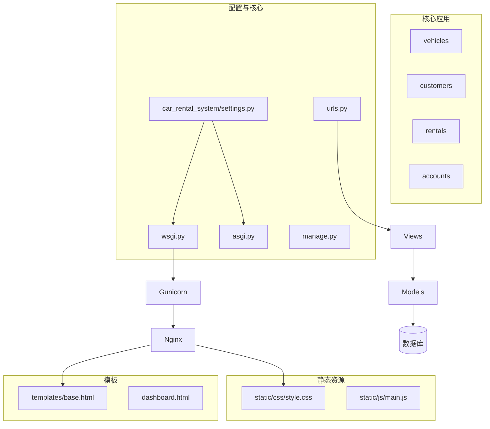
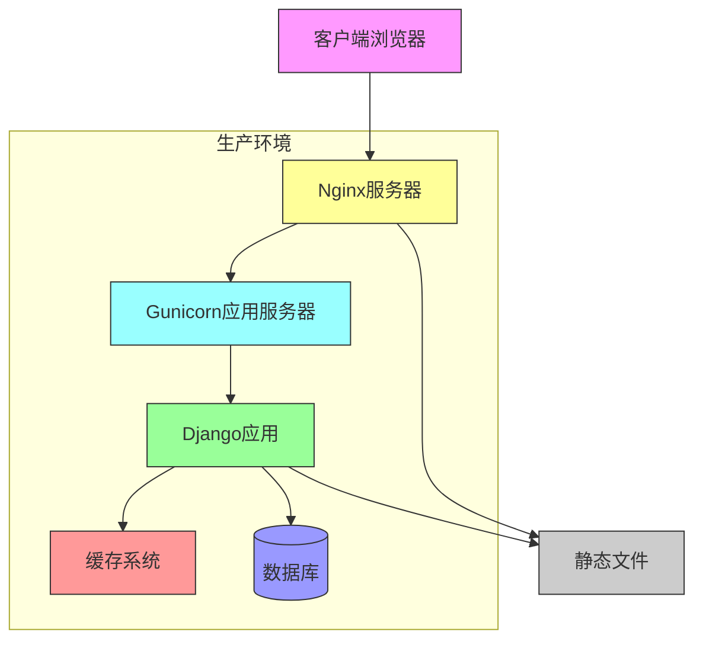
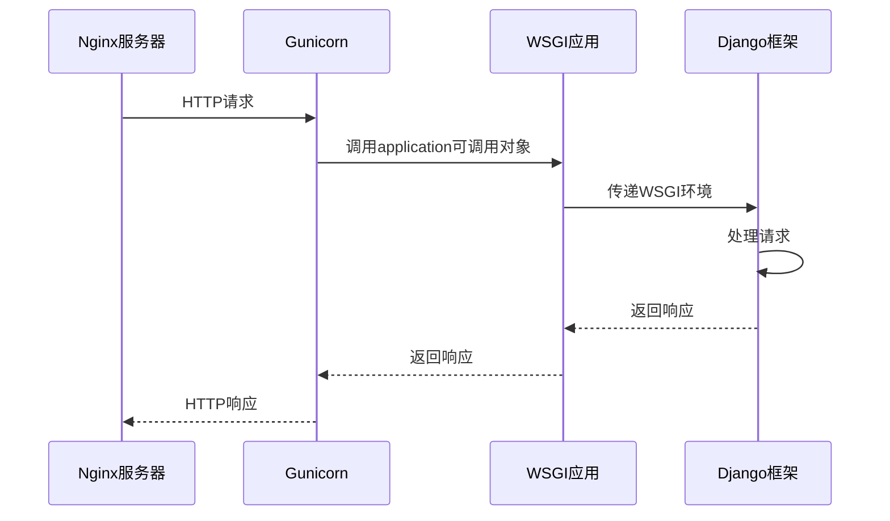
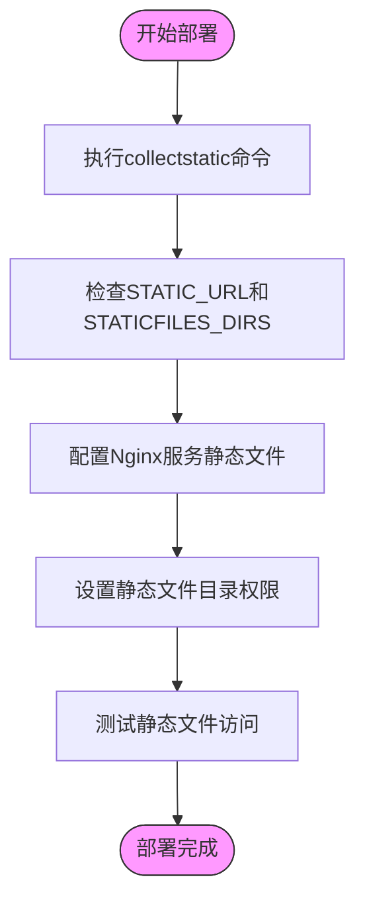
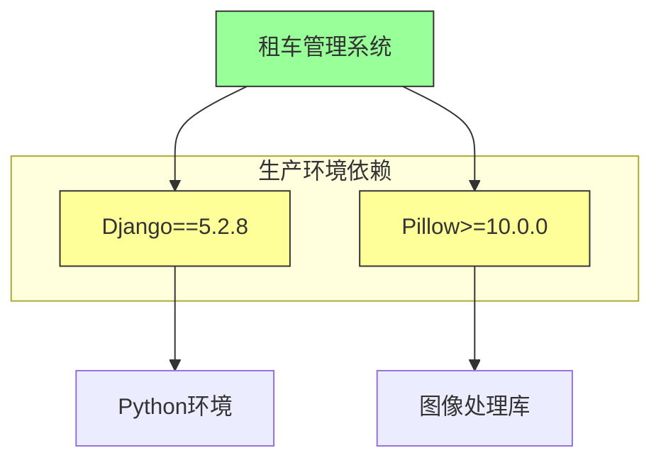
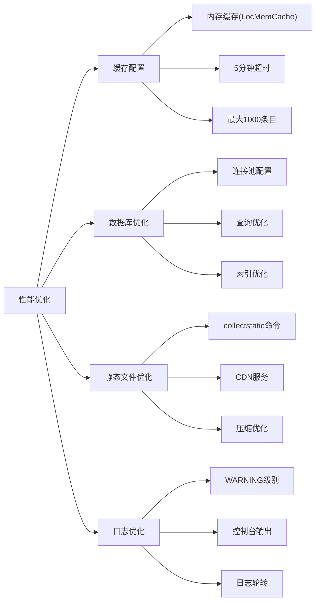
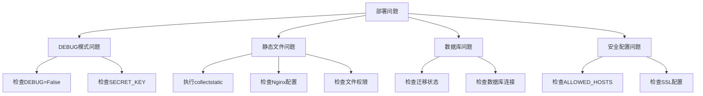

# 部署策略与生产上线

<cite>
**本文档引用的文件**  
- [wsgi.py](file://code/car_rental_system/car_rental_system/wsgi.py)
- [settings.py](file://code/car_rental_system/car_rental_system/settings.py)
- [local_settings.py.example](file://code/car_rental_system/car_rental_system/local_settings.py.example)
- [manage.py](file://code/car_rental_system/manage.py)
- [urls.py](file://code/car_rental_system/car_rental_system/urls.py)
- [views.py](file://code/car_rental_system/views.py)
- [requirements.txt](file://code/car_rental_system/requirements.txt)
- [GIT_UPLOAD_GUIDE.md](file://code/car_rental_system/GIT_UPLOAD_GUIDE.md)
- [系统测试与优化报告.md](file://code/car_rental_system/系统测试与优化报告.md)
- [QUICK_START.md](file://code/car_rental_system/QUICK_START.md)
</cite>

## 目录
1. [简介](#简介)
2. [项目结构](#项目结构)
3. [核心组件](#核心组件)
4. [架构概览](#架构概览)
5. [详细组件分析](#详细组件分析)
6. [依赖分析](#依赖分析)
7. [性能考虑](#性能考虑)
8. [故障排除指南](#故障排除指南)
9. [结论](#结论)

## 简介
本文档为租车管理系统提供完整的生产环境部署指南。涵盖从开发环境到生产服务器的完整部署流程，包括WSGI应用入口机制、Web服务器集成、静态文件处理、安全配置、容器化部署建议以及性能优化方案，确保系统稳定高效运行。

## 项目结构
本项目采用标准的Django项目结构，具有清晰的模块化设计。核心应用包括车辆管理、客户管理、租赁管理和账户管理，每个应用都有独立的模型、视图和URL配置。



**Diagram sources**  
- [settings.py](file://code/car_rental_system/car_rental_system/settings.py#L1-L179)
- [wsgi.py](file://code/car_rental_system/car_rental_system/wsgi.py#L1-L17)

**Section sources**  
- [settings.py](file://code/car_rental_system/car_rental_system/settings.py#L1-L179)
- [wsgi.py](file://code/car_rental_system/car_rental_system/wsgi.py#L1-L17)

## 核心组件
系统的核心组件包括基于Django框架的WSGI应用入口、配置管理系统、URL路由机制和静态文件处理系统。生产环境部署需要特别关注安全配置、性能优化和错误处理机制。

**Section sources**  
- [wsgi.py](file://code/car_rental_system/car_rental_system/wsgi.py#L1-L17)
- [settings.py](file://code/car_rental_system/car_rental_system/settings.py#L1-L179)

## 架构概览
系统采用典型的Django Web应用架构，前端通过Nginx反向代理，后端由Gunicorn运行WSGI应用，数据库使用SQLite（生产环境建议升级为PostgreSQL）。



**Diagram sources**  
- [wsgi.py](file://code/car_rental_system/car_rental_system/wsgi.py#L1-L17)
- [settings.py](file://code/car_rental_system/car_rental_system/settings.py#L1-L179)

## 详细组件分析

### WSGI应用入口分析
WSGI（Web Server Gateway Interface）是Python Web应用的标准接口，连接Web服务器和Python应用。



**Diagram sources**  
- [wsgi.py](file://code/car_rental_system/car_rental_system/wsgi.py#L1-L17)
- [settings.py](file://code/car_rental_system/car_rental_system/settings.py#L73)

**Section sources**  
- [wsgi.py](file://code/car_rental_system/car_rental_system/wsgi.py#L1-L17)
- [settings.py](file://code/car_rental_system/car_rental_system/settings.py#L73)

### 静态文件处理分析
静态文件处理是生产环境部署的关键环节，需要正确配置收集和提供服务的流程。



**Diagram sources**  
- [settings.py](file://code/car_rental_system/car_rental_system/settings.py#L121-L124)
- [urls.py](file://code/car_rental_system/car_rental_system/urls.py#L41-L42)

**Section sources**  
- [settings.py](file://code/car_rental_system/car_rental_system/settings.py#L121-L124)
- [urls.py](file://code/car_rental_system/car_rental_system/urls.py#L41-L42)

### 生产环境安全配置分析
生产环境安全配置是确保系统安全运行的基础，必须正确设置关键安全参数。

```mermaid
classDiagram
class ProductionSettings {
+SECRET_KEY : str
+DEBUG : bool
+ALLOWED_HOSTS : list
+SECURE_SSL_REDIRECT : bool
+SECURE_HSTS_SECONDS : int
+DATABASES : dict
+CACHES : dict
+LOGGING : dict
}
class DevelopmentSettings {
+SECRET_KEY : str
+DEBUG : bool
+ALLOWED_HOSTS : list
+DATABASES : dict
}
ProductionSettings <|-- DevelopmentSettings : 继承
ProductionSettings --> LocalSettings : 覆盖
DevelopmentSettings --> Settings : 基础
note right of ProductionSettings
生产环境必须设置 :
- DEBUG = False
- SECRET_KEY为强密钥
- ALLOWED_HOSTS指定域名
- 启用HTTPS重定向
end note
```

**Diagram sources**  
- [local_settings.py.example](file://code/car_rental_system/car_rental_system/local_settings.py.example#L1-L27)
- [settings.py](file://code/car_rental_system/car_rental_system/settings.py#L23-L28)

**Section sources**  
- [local_settings.py.example](file://code/car_rental_system/car_rental_system/local_settings.py.example#L1-L27)
- [GIT_UPLOAD_GUIDE.md](file://code/car_rental_system/GIT_UPLOAD_GUIDE.md#L124-L139)

## 依赖分析
系统依赖关系清晰，主要依赖Django框架和Pillow库，通过requirements.txt文件进行管理。



**Diagram sources**  
- [requirements.txt](file://code/car_rental_system/requirements.txt#L1-L4)
- [settings.py](file://code/car_rental_system/car_rental_system/settings.py#L33-L43)

**Section sources**  
- [requirements.txt](file://code/car_rental_system/requirements.txt#L1-L4)
- [settings.py](file://code/car_rental_system/car_rental_system/settings.py#L33-L43)

## 性能考虑
系统性能优化涉及缓存配置、数据库优化和静态文件处理等多个方面。



**Diagram sources**  
- [settings.py](file://code/car_rental_system/car_rental_system/settings.py#L142-L156)
- [系统测试与优化报告.md](file://code/car_rental_system/系统测试与优化报告.md#L229-L255)

**Section sources**  
- [settings.py](file://code/car_rental_system/car_rental_system/settings.py#L142-L156)
- [系统测试与优化报告.md](file://code/car_rental_system/系统测试与优化报告.md#L229-L255)

## 故障排除指南
部署过程中可能遇到的常见问题及解决方案。



**Section sources**  
- [settings.py](file://code/car_rental_system/car_rental_system/settings.py#L26-L28)
- [QUICK_START.md](file://code/car_rental_system/QUICK_START.md#L1-L28)
- [系统测试与优化报告.md](file://code/car_rental_system/系统测试与优化报告.md#L243-L250)

## 结论
本部署指南提供了从开发环境到生产环境的完整迁移方案。关键要点包括：使用local_settings.py进行生产环境安全配置，正确配置WSGI应用与Gunicorn+Nginx的集成，执行collectstatic命令处理静态文件，以及实施性能优化措施。通过遵循本指南，可以确保租车管理系统在生产环境中稳定、安全、高效地运行。