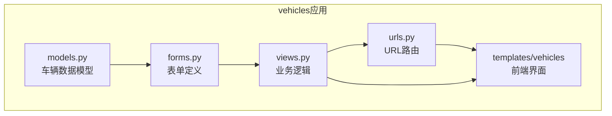
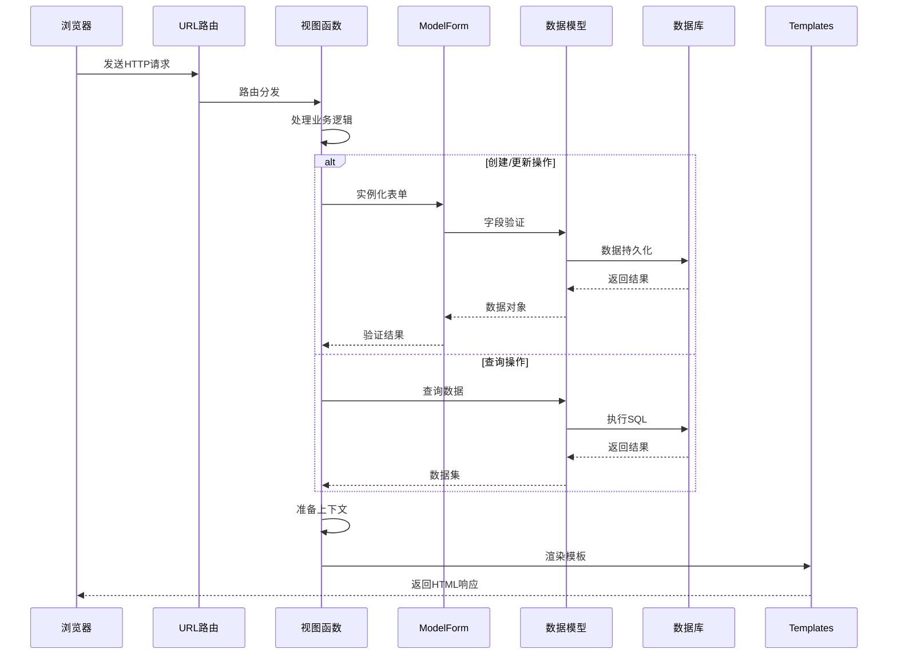
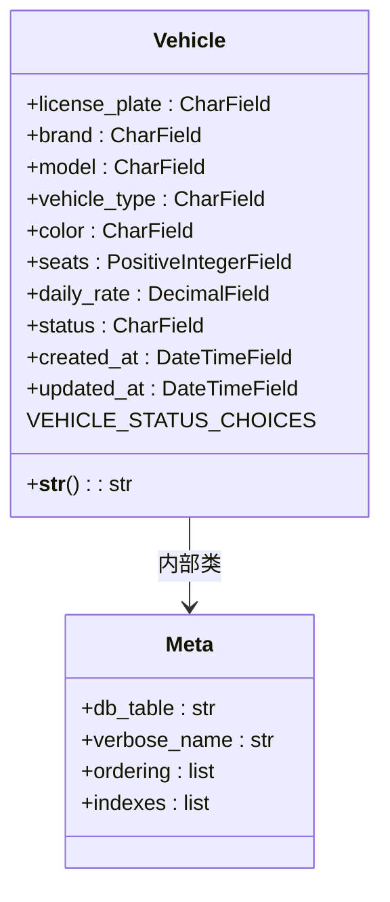
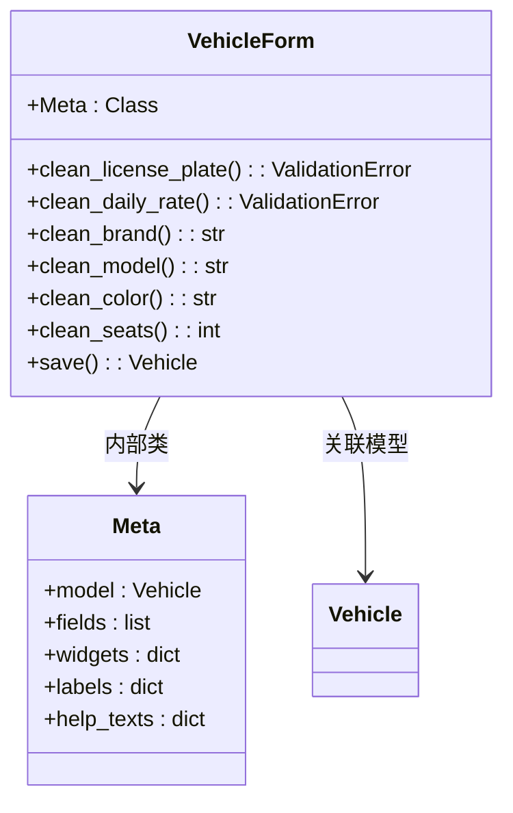
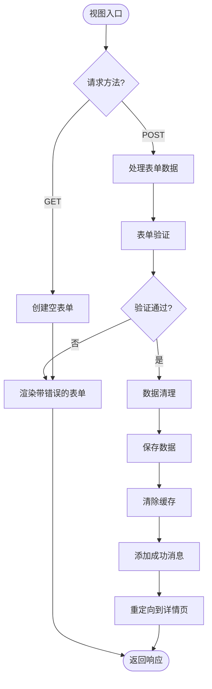
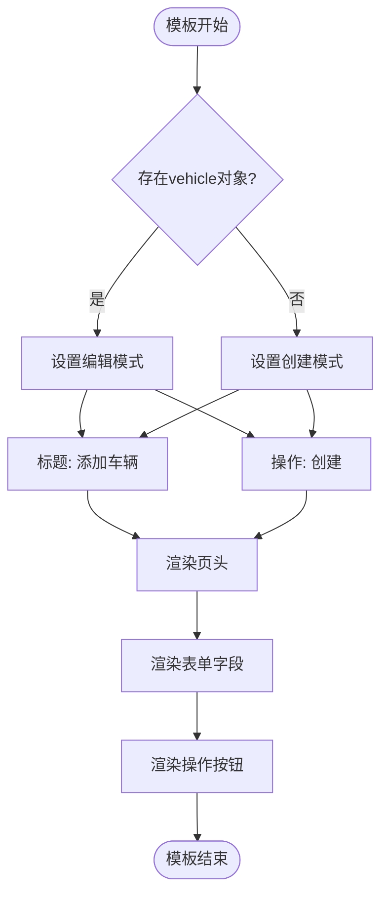
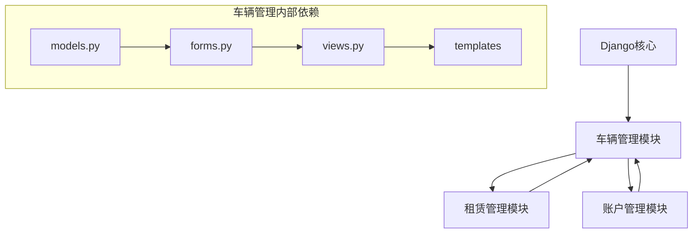

# 车辆信息管理

<cite>
**本文档引用文件**  
- [models.py](file://code/car_rental_system/vehicles/models.py)
- [forms.py](file://code/car_rental_system/vehicles/forms.py)
- [views.py](file://code/car_rental_system/vehicles/views.py)
- [urls.py](file://code/car_rental_system/vehicles/urls.py)
- [vehicle_form.html](file://code/car_rental_system/templates/vehicles/vehicle_form.html)
- [vehicle_list.html](file://code/car_rental_system/templates/vehicles/vehicle_list.html)
- [vehicle_detail.html](file://code/car_rental_system/templates/vehicles/vehicle_detail.html)
- [0001_initial.py](file://code/car_rental_system/vehicles/migrations/0001_initial.py)
</cite>

## 目录
1. [项目结构](#项目结构)
2. [核心组件](#核心组件)
3. [架构概述](#架构概述)
4. [详细组件分析](#详细组件分析)
5. [依赖分析](#依赖分析)
6. [性能考虑](#性能考虑)
7. [故障排除指南](#故障排除指南)
8. [结论](#结论)

## 项目结构

车辆信息管理模块采用Django标准的MVC架构模式，包含模型（models）、表单（forms）、视图（views）、URL配置和模板（templates）五个核心部分。该模块位于`vehicles`应用目录下，实现了车辆信息的增删改查（CRUD）全流程管理功能。

**图示来源**  
- [models.py](file://code/car_rental_system/vehicles/models.py)
- [forms.py](file://code/car_rental_system/vehicles/forms.py)
- [views.py](file://code/car_rental_system/vehicles/views.py)
- [urls.py](file://code/car_rental_system/vehicles/urls.py)

**本节来源**  
- [models.py](file://code/car_rental_system/vehicles/models.py)
- [forms.py](file://code/car_rental_system/vehicles/forms.py)
- [views.py](file://code/car_rental_system/vehicles/views.py)
- [urls.py](file://code/car_rental_system/vehicles/urls.py)

## 核心组件

车辆信息管理模块的核心组件包括Vehicle模型、VehicleForm表单、四个主要视图函数（vehicle_create、vehicle_update、vehicle_detail、vehicle_list）以及对应的HTML模板。这些组件协同工作，实现了完整的车辆信息管理功能。

**本节来源**  
- [models.py](file://code/car_rental_system/vehicles/models.py#L6-L85)
- [forms.py](file://code/car_rental_system/vehicles/forms.py#L6-L153)
- [views.py](file://code/car_rental_system/vehicles/views.py#L138-L322)

## 架构概述

车辆信息管理系统采用分层架构设计，从前端界面到后端数据存储形成了清晰的调用链路。系统通过URL路由将HTTP请求分发到相应的视图函数，视图函数处理业务逻辑并调用模型和表单组件，最终渲染模板返回响应。

**图示来源**  
- [urls.py](file://code/car_rental_system/vehicles/urls.py)
- [views.py](file://code/car_rental_system/vehicles/views.py)
- [forms.py](file://code/car_rental_system/vehicles/forms.py)
- [models.py](file://code/car_rental_system/vehicles/models.py)

## 详细组件分析

### 车辆模型分析

Vehicle模型定义了车辆信息的核心数据结构，包含车牌号、品牌、型号等关键字段。每个字段都有明确的业务含义、数据类型和验证规则。

**图示来源**  
- [models.py](file://code/car_rental_system/vehicles/models.py#L6-L85)
- [0001_initial.py](file://code/car_rental_system/vehicles/migrations/0001_initial.py)

**本节来源**  
- [models.py](file://code/car_rental_system/vehicles/models.py#L6-L85)

### 车辆表单分析

VehicleForm基于Django的ModelForm实现，将Vehicle模型与前端表单无缝集成。表单配置了自定义小部件（widgets）、标签（labels）和帮助文本（help_texts），并应用了Bootstrap样式。

**图示来源**  
- [forms.py](file://code/car_rental_system/vehicles/forms.py#L6-L153)
- [vehicle_form.html](file://code/car_rental_system/templates/vehicles/vehicle_form.html)

**本节来源**  
- [forms.py](file://code/car_rental_system/vehicles/forms.py#L6-L153)

### 视图逻辑分析

车辆管理视图实现了CRUD操作的核心逻辑，包括表单验证、数据清理和用户反馈机制。各视图函数通过Django的消息框架（messages）提供操作结果提示。

**图示来源**  
- [views.py](file://code/car_rental_system/vehicles/views.py#L198-L252)
- [forms.py](file://code/car_rental_system/vehicles/forms.py)

**本节来源**  
- [views.py](file://code/car_rental_system/vehicles/views.py#L198-L252)

### 模板复用分析

vehicle_form.html模板通过上下文变量实现了创建和编辑场景的复用。模板根据action和title变量动态调整界面元素，提高了代码的可维护性。

**图示来源**  
- [vehicle_form.html](file://code/car_rental_system/templates/vehicles/vehicle_form.html)
- [views.py](file://code/car_rental_system/vehicles/views.py)

**本节来源**  
- [vehicle_form.html](file://code/car_rental_system/templates/vehicles/vehicle_form.html)

## 依赖分析

车辆管理模块与其他系统组件存在明确的依赖关系。该模块依赖于Django框架的核心组件，同时为租赁管理等其他模块提供数据支持。

**图示来源**  
- [models.py](file://code/car_rental_system/vehicles/models.py)
- [forms.py](file://code/car_rental_system/vehicles/forms.py)
- [views.py](file://code/car_rental_system/vehicles/views.py)

**本节来源**  
- [models.py](file://code/car_rental_system/vehicles/models.py)
- [forms.py](file://code/car_rental_system/vehicles/forms.py)
- [views.py](file://code/car_rental_system/vehicles/views.py)

## 性能考虑

车辆管理系统在设计时考虑了多项性能优化措施。通过数据库索引、查询优化和缓存机制，确保了系统在大数据量下的响应速度。

- **数据库索引**：为车牌号、状态、品牌型号等常用查询字段创建了数据库索引
- **查询优化**：使用`only()`方法仅选择需要的字段，减少数据库I/O
- **缓存机制**：对品牌、车型等筛选选项使用Redis缓存，有效期5分钟
- **聚合查询**：使用`aggregate()`进行统计查询，减少数据库访问次数
- **分页处理**：列表页每页显示10条记录，避免一次性加载过多数据

**本节来源**  
- [views.py](file://code/car_rental_system/vehicles/views.py#L42-L135)
- [models.py](file://code/car_rental_system/vehicles/models.py#L73-L78)

## 故障排除指南

### 常见问题及解决方案

1. **车牌号重复问题**
   - 现象：添加车辆时提示"该车牌号已存在"
   - 原因：系统要求车牌号必须唯一
   - 解决：检查输入的车牌号是否已存在于系统中

2. **无法删除车辆**
   - 现象：删除车辆时提示"无法删除，因为有活跃的租赁订单"
   - 原因：系统保护机制防止数据不一致
   - 解决：先处理相关租赁订单，再尝试删除

3. **状态更新失败**
   - 现象：无法将已租车辆状态改为可用
   - 原因：系统校验逻辑阻止非法状态转换
   - 解决：确保车辆没有正在进行的租赁订单

4. **表单验证错误**
   - 现象：提交表单时出现各种验证错误
   - 原因：输入数据不符合验证规则
   - 解决：检查日租金是否为正数、座位数是否在2-50之间等

**本节来源**  
- [forms.py](file://code/car_rental_system/vehicles/forms.py#L87-L138)
- [views.py](file://code/car_rental_system/vehicles/views.py#L255-L286)

## 结论

车辆信息管理系统实现了完整的CRUD功能，具有良好的架构设计和用户体验。系统通过ModelForm与前端表单的深度集成，确保了数据的一致性和完整性。视图层的业务逻辑清晰，包含了完善的表单验证、数据清理和用户反馈机制。模板设计灵活，通过变量控制实现了创建和编辑场景的复用。整体系统性能经过优化，在大数据量下仍能保持良好的响应速度。