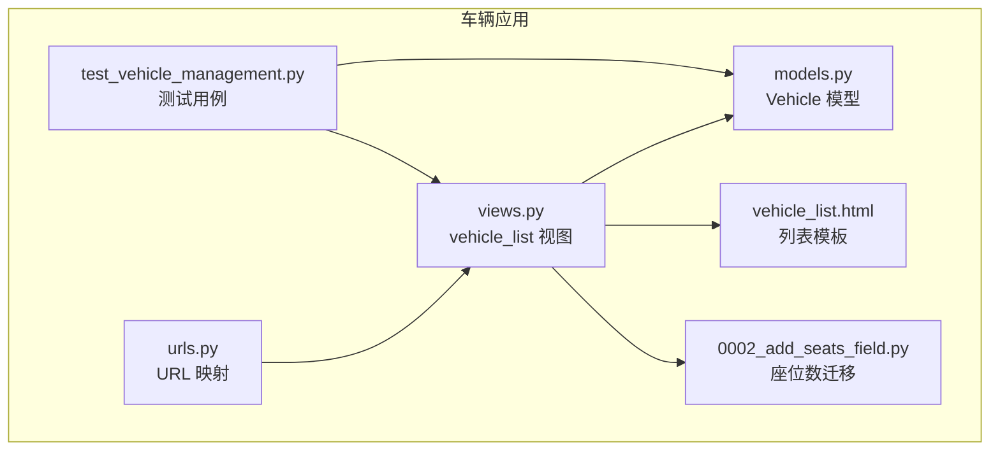
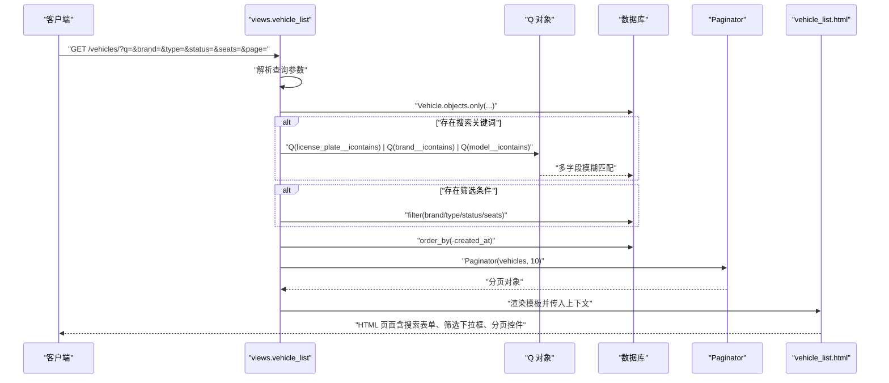
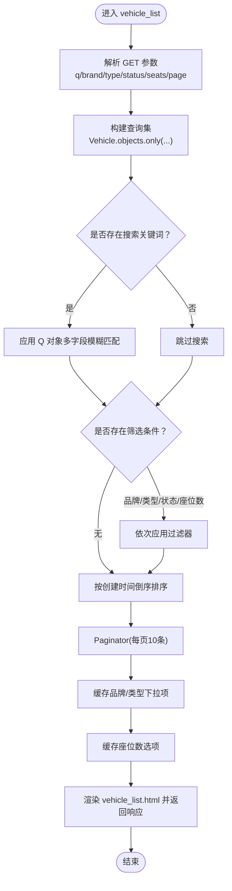
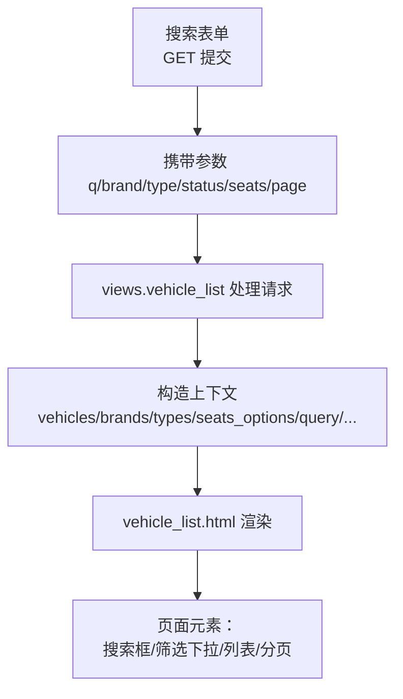
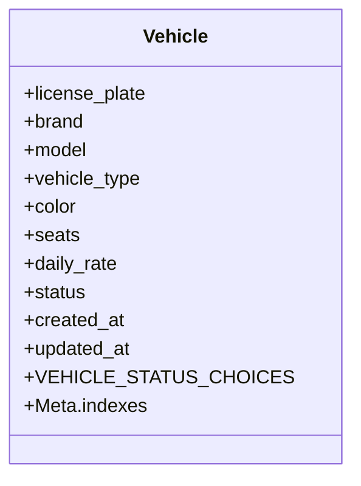
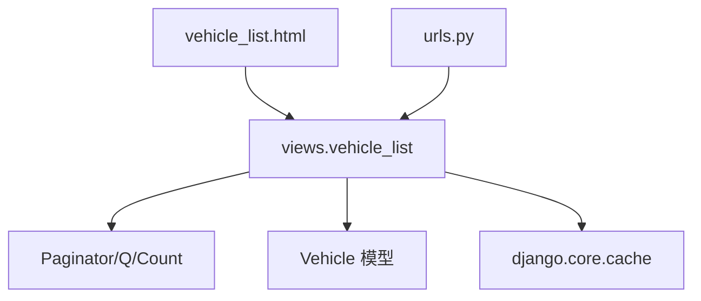

# 车辆列表展示

<cite>
**本文引用的文件**
- [views.py](file://code/car_rental_system/vehicles/views.py)
- [vehicle_list.html](file://code/car_rental_system/templates/vehicles/vehicle_list.html)
- [models.py](file://code/car_rental_system/vehicles/models.py)
- [urls.py](file://code/car_rental_system/vehicles/urls.py)
- [0002_add_seats_field.py](file://code/car_rental_system/vehicles/migrations/0002_add_seats_field.py)
- [test_vehicle_management.py](file://code/car_rental_system/test_vehicle_management.py)
</cite>

## 目录
1. [简介](#简介)
2. [项目结构](#项目结构)
3. [核心组件](#核心组件)
4. [架构总览](#架构总览)
5. [详细组件分析](#详细组件分析)
6. [依赖关系分析](#依赖关系分析)
7. [性能考量](#性能考量)
8. [故障排查指南](#故障排查指南)
9. [结论](#结论)
10. [附录](#附录)

## 简介
本文件系统化梳理“车辆列表展示”功能，围绕 vehicle_list 视图的搜索、筛选与分页机制展开，重点说明：
- 如何解析 q、brand、type、status、seats 等查询参数，构建动态查询集；
- 使用 Q 对象实现多字段模糊匹配；
- 使用 only() 方法优化查询性能，减少数据库负载；
- Paginator 组件的分页实现；
- 缓存机制（cache.get/set）对品牌、车型与座位数筛选项的加载提速；
- 结合 vehicle_list.html 模板，说明搜索表单、筛选下拉框与分页控件的前端交互设计；
- 提供在页面顶部显示车辆总数及各状态统计信息的实现思路与示例路径。

## 项目结构
车辆列表功能涉及后端视图、模板与模型定义，关键文件如下：
- 视图层：vehicles/views.py 中的 vehicle_list 视图负责处理搜索、筛选、分页与上下文渲染。
- 模板层：vehicles/vehicle_list.html 提供搜索表单、筛选下拉框与分页控件的前端交互。
- 模型层：vehicles/models.py 定义车辆字段、状态枚举与数据库索引，支撑查询与筛选。
- URL 层：vehicles/urls.py 将 /vehicles/ 映射到 vehicle_list 视图。
- 迁移层：vehicles/migrations/0002_add_seats_field.py 为车辆新增 seats 字段并建立索引，支持座位数筛选。
- 测试层：test_vehicle_management.py 展示了基于 Q 对象的多字段模糊搜索与状态统计等用法，可作为参考。

图表来源
- [views.py](file://code/car_rental_system/vehicles/views.py#L42-L135)
- [vehicle_list.html](file://code/car_rental_system/templates/vehicles/vehicle_list.html#L1-L233)
- [models.py](file://code/car_rental_system/vehicles/models.py#L1-L85)
- [urls.py](file://code/car_rental_system/vehicles/urls.py#L1-L18)
- [0002_add_seats_field.py](file://code/car_rental_system/vehicles/migrations/0002_add_seats_field.py#L1-L32)
- [test_vehicle_management.py](file://code/car_rental_system/test_vehicle_management.py#L1-L171)

章节来源
- [views.py](file://code/car_rental_system/vehicles/views.py#L42-L135)
- [vehicle_list.html](file://code/car_rental_system/templates/vehicles/vehicle_list.html#L1-L233)
- [models.py](file://code/car_rental_system/vehicles/models.py#L1-L85)
- [urls.py](file://code/car_rental_system/vehicles/urls.py#L1-L18)
- [0002_add_seats_field.py](file://code/car_rental_system/vehicles/migrations/0002_add_seats_field.py#L1-L32)
- [test_vehicle_management.py](file://code/car_rental_system/test_vehicle_management.py#L1-L171)

## 核心组件
- vehicle_list 视图：解析 GET 参数，构建动态查询集，应用 Q 对象进行多字段模糊匹配，使用 only() 限制字段，结合缓存与 Paginator 实现高效分页。
- vehicle_list.html 模板：提供搜索表单、品牌/类型/座位数/状态下拉筛选与分页控件；支持在页面顶部显示车辆总数与各状态统计信息。
- Vehicle 模型：定义状态枚举、字段与索引，为查询与筛选提供基础。
- URL 映射：将 /vehicles/ 映射到 vehicle_list 视图，便于访问列表页。
- 座位数迁移：新增 seats 字段并建立索引，支持座位数筛选与性能优化。

章节来源
- [views.py](file://code/car_rental_system/vehicles/views.py#L42-L135)
- [vehicle_list.html](file://code/car_rental_system/templates/vehicles/vehicle_list.html#L1-L233)
- [models.py](file://code/car_rental_system/vehicles/models.py#L1-L85)
- [urls.py](file://code/car_rental_system/vehicles/urls.py#L1-L18)
- [0002_add_seats_field.py](file://code/car_rental_system/vehicles/migrations/0002_add_seats_field.py#L1-L32)

## 架构总览
下面以序列图展示 vehicle_list 的请求-响应流程，包括参数解析、查询构建、缓存与分页处理。

图表来源
- [views.py](file://code/car_rental_system/vehicles/views.py#L42-L135)
- [vehicle_list.html](file://code/car_rental_system/templates/vehicles/vehicle_list.html#L1-L233)

## 详细组件分析

### 视图：vehicle_list 的搜索、筛选与分页
- 查询参数解析
  - 解析 q、brand、type、status、seats、page 等 GET 参数，作为后续查询与模板上下文的基础。
- 动态查询集构建
  - 使用 only() 仅选择必要字段，降低网络与内存开销。
  - 使用 Q 对象实现多字段模糊匹配（车牌号、品牌、型号），提升搜索灵活性。
  - 依次应用品牌、类型、状态与座位数筛选；座位数筛选包含类型转换与异常处理，确保字段存在性与输入合法性。
- 缓存策略
  - 品牌与类型下拉选项通过缓存键读取/写入，首次加载时从数据库 distinct 排序后缓存，默认缓存 300 秒。
  - 座位数选项同样采用缓存，若 seats 字段不存在则回退为空列表，保证迁移不一致时的健壮性。
- 分页实现
  - 先排序（按创建时间倒序），再使用 Paginator 每页 10 条，最后通过 get_page(page) 获取当前页对象。
- 上下文传递
  - 将分页对象与各筛选参数回传给模板，用于前端渲染与保持筛选状态。

图表来源
- [views.py](file://code/car_rental_system/vehicles/views.py#L42-L135)

章节来源
- [views.py](file://code/car_rental_system/vehicles/views.py#L42-L135)

### 模板：vehicle_list.html 的前端交互设计
- 搜索表单
  - 使用 GET 方法提交，输入框 name="q"，占位提示“车牌号、品牌、型号”，值绑定到模板变量 query。
- 筛选下拉框
  - 品牌下拉框 name="brand"，选项来自 brands 列表，选中状态由 brand_filter 控制。
  - 类型下拉框 name="type"，选项来自 types 列表，选中状态由 type_filter 控制。
  - 座位数下拉框 name="seats"，选项来自 seats_options 列表，选中状态由 seats_filter 控制。
  - 状态下拉框 name="status"，选项包含 AVAILABLE、RENTED、MAINTENANCE，选中状态由 status_filter 控制。
- 列表表格
  - 展示车牌号、品牌型号、类型、座位数、颜色、日租金、状态、创建时间等字段。
  - 状态使用徽章样式区分不同状态。
- 分页控件
  - 当存在多页时显示分页导航，上一页/下一页链接保留当前筛选参数；当前页高亮显示；底部显示当前页记录范围与总记录数。
- 页面顶部统计信息
  - 可在模板顶部添加一个统计区域，展示车辆总数与各状态统计（例如使用聚合查询的结果）。具体实现可参考以下示例路径：
    - [index 视图中的聚合统计示例](file://code/car_rental_system/vehicles/views.py#L13-L39)
    - [测试用例中的状态统计示例](file://code/car_rental_system/test_vehicle_management.py#L109-L116)

图表来源
- [vehicle_list.html](file://code/car_rental_system/templates/vehicles/vehicle_list.html#L1-L233)
- [views.py](file://code/car_rental_system/vehicles/views.py#L42-L135)

章节来源
- [vehicle_list.html](file://code/car_rental_system/templates/vehicles/vehicle_list.html#L1-L233)
- [views.py](file://code/car_rental_system/vehicles/views.py#L42-L135)

### 数据模型：Vehicle 的字段与索引
- 关键字段
  - license_plate、brand、model、vehicle_type、color、seats、daily_rate、status、created_at、updated_at。
- 状态枚举
  - AVAILABLE、RENTED、MAINTENANCE。
- 索引
  - 为 license_plate、status、brand+model、seats 建立索引，提升查询与筛选性能。
- 迁移
  - 0002_add_seats_field.py 新增 seats 字段并添加索引，支持座位数筛选与性能优化。

图表来源
- [models.py](file://code/car_rental_system/vehicles/models.py#L1-L85)
- [0002_add_seats_field.py](file://code/car_rental_system/vehicles/migrations/0002_add_seats_field.py#L1-L32)

章节来源
- [models.py](file://code/car_rental_system/vehicles/models.py#L1-L85)
- [0002_add_seats_field.py](file://code/car_rental_system/vehicles/migrations/0002_add_seats_field.py#L1-L32)

### URL 映射与入口
- URL 路径 vehicles/ 映射到 vehicle_list 视图，便于直接访问车辆列表页。

章节来源
- [urls.py](file://code/car_rental_system/vehicles/urls.py#L1-L18)

## 依赖关系分析
- 视图依赖
  - Django 内置：Paginator、Q、Count、messages、redirect、render、get_object_or_404、HttpResponse、HttpResponseBadRequest、require_http_methods、method_decorator、ListView。
  - 自定义模型：Vehicle。
  - 第三方/内置缓存：django.core.cache。
- 模板依赖
  - 使用 Bootstrap 组件（card、form、pagination、badge）与 Font Awesome 图标。
  - 使用 Django 模板语法进行循环、条件判断与参数传递。
- 模型依赖
  - Vehicle 模型定义字段、choices 与索引，为查询与筛选提供基础。

图表来源
- [views.py](file://code/car_rental_system/vehicles/views.py#L1-L135)
- [vehicle_list.html](file://code/car_rental_system/templates/vehicles/vehicle_list.html#L1-L233)
- [urls.py](file://code/car_rental_system/vehicles/urls.py#L1-L18)
- [models.py](file://code/car_rental_system/vehicles/models.py#L1-L85)

章节来源
- [views.py](file://code/car_rental_system/vehicles/views.py#L1-L135)
- [vehicle_list.html](file://code/car_rental_system/templates/vehicles/vehicle_list.html#L1-L233)
- [urls.py](file://code/car_rental_system/vehicles/urls.py#L1-L18)
- [models.py](file://code/car_rental_system/vehicles/models.py#L1-L85)

## 性能考量
- 字段选择优化
  - 使用 only() 仅选择列表所需字段，减少数据库往返与序列化开销。
- 查询条件优化
  - 使用 Q 对象进行多字段模糊匹配，避免多次查询。
  - 通过索引（license_plate、status、brand+model、seats）加速查询。
- 分页与排序
  - 先排序再分页，避免在大量数据中重复排序。
- 缓存策略
  - 品牌、类型、座位数选项使用缓存，降低数据库 distinct 查询频率。
- 异常与健壮性
  - 座位数筛选包含类型转换与异常捕获，确保字段不存在或输入非法时不中断流程。

章节来源
- [views.py](file://code/car_rental_system/vehicles/views.py#L42-L135)
- [models.py](file://code/car_rental_system/vehicles/models.py#L68-L85)
- [0002_add_seats_field.py](file://code/car_rental_system/vehicles/migrations/0002_add_seats_field.py#L1-L32)

## 故障排查指南
- 搜索无结果
  - 检查 q 参数是否正确传递至模板与视图；确认 Q 对象的多字段匹配是否生效。
  - 参考示例路径：[Q 对象多字段匹配示例](file://code/car_rental_system/vehicles/views.py#L61-L66)
- 筛选无效
  - 检查 brand/type/status/seats 参数是否正确传递；确认 only() 是否包含对应字段。
  - 参考示例路径：[only() 字段选择示例](file://code/car_rental_system/vehicles/views.py#L52-L55)
- 分页链接丢失筛选参数
  - 检查模板分页链接是否拼接了 q、brand、type、status、seats 参数。
  - 参考示例路径：[分页链接参数拼接示例](file://code/car_rental_system/templates/vehicles/vehicle_list.html#L189-L225)
- 座位数筛选异常
  - 检查 seats 字段是否存在与迁移是否完成；确认异常处理逻辑是否生效。
  - 参考示例路径：[座位数筛选与异常处理示例](file://code/car_rental_system/vehicles/views.py#L78-L86)
- 缓存未命中
  - 检查缓存键是否正确；确认缓存时间与数据库 distinct 查询是否按预期执行。
  - 参考示例路径：[缓存品牌/类型/座位数示例](file://code/car_rental_system/vehicles/views.py#L90-L122)
- 页面顶部统计信息缺失
  - 在 vehicle_list.html 顶部添加统计区域，使用聚合查询获取总数与各状态统计。
  - 参考示例路径：[聚合统计示例](file://code/car_rental_system/vehicles/views.py#L13-L39)、[测试用例统计示例](file://code/car_rental_system/test_vehicle_management.py#L109-L116)

章节来源
- [views.py](file://code/car_rental_system/vehicles/views.py#L42-L135)
- [vehicle_list.html](file://code/car_rental_system/templates/vehicles/vehicle_list.html#L185-L232)
- [test_vehicle_management.py](file://code/car_rental_system/test_vehicle_management.py#L109-L116)

## 结论
vehicle_list 视图通过合理的参数解析、Q 对象多字段模糊匹配、only() 字段选择、Paginator 分页与缓存策略，实现了高性能的车辆列表展示。模板提供了直观的搜索与筛选交互，并通过分页控件保障大数据量下的浏览体验。结合聚合统计可在页面顶部直观呈现车辆总数与各状态概览，进一步提升管理效率。

## 附录
- 示例路径汇总
  - 搜索与筛选：[views.py](file://code/car_rental_system/vehicles/views.py#L42-L135)
  - 分页链接参数拼接：[vehicle_list.html](file://code/car_rental_system/templates/vehicles/vehicle_list.html#L189-L225)
  - only() 字段选择：[views.py](file://code/car_rental_system/vehicles/views.py#L52-L55)
  - Q 对象多字段匹配：[views.py](file://code/car_rental_system/vehicles/views.py#L61-L66)
  - 缓存策略（品牌/类型/座位数）：[views.py](file://code/car_rental_system/vehicles/views.py#L90-L122)
  - 页面顶部统计信息：[views.py](file://code/car_rental_system/vehicles/views.py#L13-L39)、[test_vehicle_management.py](file://code/car_rental_system/test_vehicle_management.py#L109-L116)