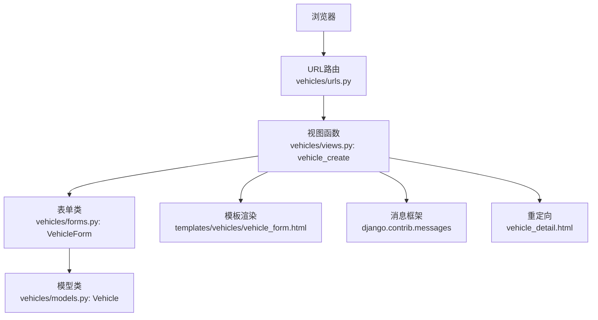
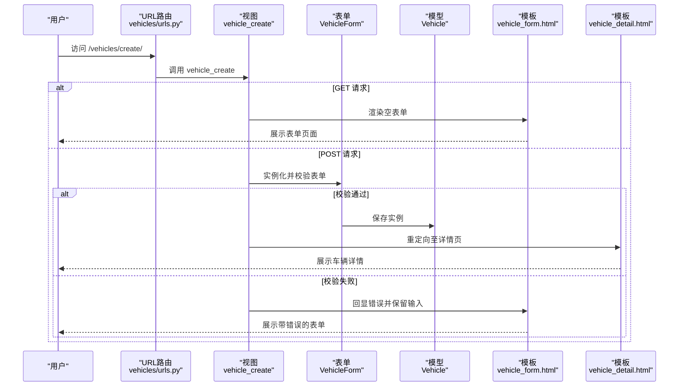
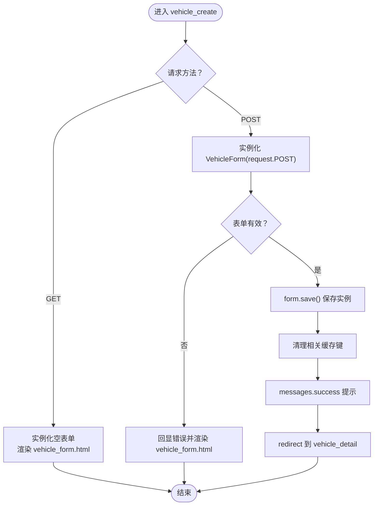
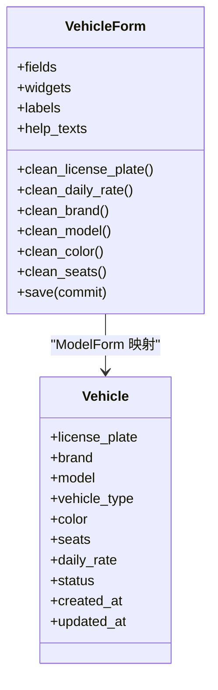
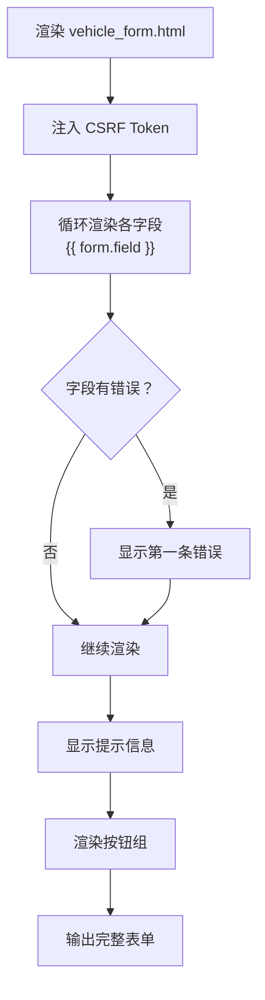
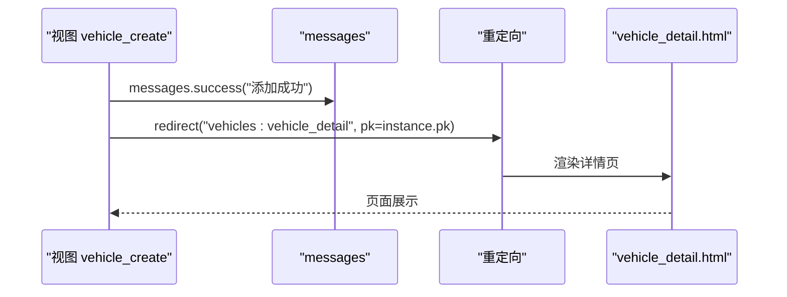
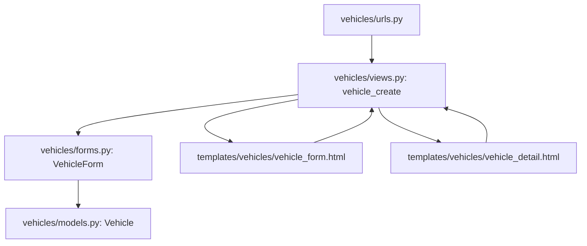

# 车辆创建

<cite>
**本文引用的文件**
- [views.py](file://code/car_rental_system/vehicles/views.py)
- [forms.py](file://code/car_rental_system/vehicles/forms.py)
- [models.py](file://code/car_rental_system/vehicles/models.py)
- [vehicle_form.html](file://code/car_rental_system/templates/vehicles/vehicle_form.html)
- [vehicle_detail.html](file://code/car_rental_system/templates/vehicles/vehicle_detail.html)
- [urls.py](file://code/car_rental_system/vehicles/urls.py)
- [base.html](file://code/car_rental_system/templates/vehicles/base.html)
</cite>

## 目录
1. [简介](#简介)
2. [项目结构](#项目结构)
3. [核心组件](#核心组件)
4. [架构概览](#架构概览)
5. [详细组件分析](#详细组件分析)
6. [依赖关系分析](#依赖关系分析)
7. [性能考量](#性能考量)
8. [故障排查指南](#故障排查指南)
9. [结论](#结论)
10. [附录](#附录)

## 简介
本文件围绕“车辆创建”功能展开，系统性说明 vehicle_create 视图的实现逻辑，包括：
- GET 请求渲染空表单的流程；
- POST 请求时 ModelForm 的数据验证、错误反馈与成功保存后的重定向；
- 结合 forms.py 中 VehicleForm 类的字段映射、Bootstrap 样式集成（form-control、form-select）与占位符设置；
- clean_license_plate 等自定义验证方法如何防止重复车牌号提交；
- save() 方法中对品牌、型号、颜色、车牌号等字段的 strip 数据清理；
- vehicle_form.html 模板如何通过 Django 模板标签渲染表单字段，并利用 messages 框架显示“添加成功”提示；
- 表单提交后如何跳转至车辆详情页。

## 项目结构
车辆创建功能涉及以下关键文件：
- 视图层：vehicles/views.py 中的 vehicle_create 视图
- 表单层：vehicles/forms.py 中的 VehicleForm
- 模型层：vehicles/models.py 中的 Vehicle 模型
- 模板层：vehicles/vehicle_form.html、vehicles/vehicle_detail.html、vehicles/base.html
- URL 映射：vehicles/urls.py

图表来源
- [urls.py](file://code/car_rental_system/vehicles/urls.py#L9-L18)
- [views.py](file://code/car_rental_system/vehicles/views.py#L198-L222)
- [forms.py](file://code/car_rental_system/vehicles/forms.py#L1-L153)
- [models.py](file://code/car_rental_system/vehicles/models.py#L1-L85)
- [vehicle_form.html](file://code/car_rental_system/templates/vehicles/vehicle_form.html#L1-L200)
- [vehicle_detail.html](file://code/car_rental_system/templates/vehicles/vehicle_detail.html#L1-L350)

章节来源
- [urls.py](file://code/car_rental_system/vehicles/urls.py#L9-L18)
- [views.py](file://code/car_rental_system/vehicles/views.py#L198-L222)

## 核心组件
- 视图函数 vehicle_create：处理 GET/POST 请求，渲染表单或保存数据并重定向。
- 表单类 VehicleForm：定义字段、控件样式、标签、帮助文本、自定义验证与保存逻辑。
- 模型类 Vehicle：定义字段约束、索引与状态枚举。
- 模板 vehicle_form.html：渲染表单字段、错误提示与按钮。
- 模板 vehicle_detail.html：作为成功保存后的目标页面。

章节来源
- [views.py](file://code/car_rental_system/vehicles/views.py#L198-L222)
- [forms.py](file://code/car_rental_system/vehicles/forms.py#L1-L153)
- [models.py](file://code/car_rental_system/vehicles/models.py#L1-L85)
- [vehicle_form.html](file://code/car_rental_system/templates/vehicles/vehicle_form.html#L1-L200)
- [vehicle_detail.html](file://code/car_rental_system/templates/vehicles/vehicle_detail.html#L1-L350)

## 架构概览
下图展示了从用户访问到成功创建并跳转详情页的端到端流程。

图表来源
- [urls.py](file://code/car_rental_system/vehicles/urls.py#L12-L14)
- [views.py](file://code/car_rental_system/vehicles/views.py#L198-L222)
- [forms.py](file://code/car_rental_system/vehicles/forms.py#L1-L153)
- [models.py](file://code/car_rental_system/vehicles/models.py#L1-L85)
- [vehicle_form.html](file://code/car_rental_system/templates/vehicles/vehicle_form.html#L1-L200)
- [vehicle_detail.html](file://code/car_rental_system/templates/vehicles/vehicle_detail.html#L1-L350)

## 详细组件分析

### 视图函数 vehicle_create 的实现逻辑
- GET 请求：实例化空的 VehicleForm，传递标题与动作到模板，渲染 vehicle_form.html。
- POST 请求：
  - 使用 VehicleForm(request.POST) 实例化表单；
  - 若表单 is_valid() 为真，调用 form.save() 保存数据；
  - 清理相关缓存键；
  - 使用 messages.success 发送“添加成功”提示；
  - 重定向到车辆详情页（vehicles:vehicle_detail）。

图表来源
- [views.py](file://code/car_rental_system/vehicles/views.py#L198-L222)

章节来源
- [views.py](file://code/car_rental_system/vehicles/views.py#L198-L222)

### 表单类 VehicleForm 的字段映射与 Bootstrap 样式
- 字段映射：fields 包含 license_plate、brand、model、vehicle_type、color、seats、daily_rate、status，与 Vehicle 模型字段一一对应。
- 控件样式：
  - 文本输入使用 form-control；
  - 下拉选择使用 form-select；
  - 各字段设置 placeholder、maxlength、min/max、step 等属性；
  - labels 与 help_texts 提供本地化标签与提示。
- 自定义验证：
  - clean_license_plate：检查车牌号唯一性（排除当前编辑实例）；
  - clean_daily_rate：限制日租金范围；
  - clean_brand/model/color：strip 去除首尾空白；
  - clean_seats：限制座位数范围；
- 保存逻辑：save() 中对 brand、model、color、license_plate 再次 strip 并持久化。

图表来源
- [forms.py](file://code/car_rental_system/vehicles/forms.py#L1-L153)
- [models.py](file://code/car_rental_system/vehicles/models.py#L1-L85)

章节来源
- [forms.py](file://code/car_rental_system/vehicles/forms.py#L1-L153)
- [models.py](file://code/car_rental_system/vehicles/models.py#L1-L85)

### 模板 vehicle_form.html 的渲染与错误反馈
- 使用  保护表单安全；
- 通过 {{ form.field }} 渲染每个字段，结合 Bootstrap 样式类；
- 错误反馈：针对每个字段，若存在 errors，则显示第一条错误信息；
- 提示信息：包含车牌号唯一、日租金正数、状态影响等提示；
- 按钮：取消返回列表或详情，提交按钮触发 POST。

图表来源
- [vehicle_form.html](file://code/car_rental_system/templates/vehicles/vehicle_form.html#L1-L200)

章节来源
- [vehicle_form.html](file://code/car_rental_system/templates/vehicles/vehicle_form.html#L1-L200)

### 成功保存后的重定向与详情页
- 视图中使用 messages.success 发送“添加成功”提示；
- 重定向到 vehicles:vehicle_detail，传入新创建车辆的主键；
- 模板 vehicle_detail.html 展示车辆的详细信息、状态管理、评价与租赁历史等。

图表来源
- [views.py](file://code/car_rental_system/vehicles/views.py#L201-L212)
- [vehicle_detail.html](file://code/car_rental_system/templates/vehicles/vehicle_detail.html#L1-L350)

章节来源
- [views.py](file://code/car_rental_system/vehicles/views.py#L201-L212)
- [vehicle_detail.html](file://code/car_rental_system/templates/vehicles/vehicle_detail.html#L1-L350)

## 依赖关系分析
- URL 路由 vehicles/urls.py 将 /vehicles/create/ 映射到 vehicle_create；
- 视图 vehicle_create 依赖 VehicleForm 与 Vehicle 模型；
- VehicleForm 依赖 Vehicle 模型字段与状态枚举；
- 模板 vehicle_form.html 依赖 VehicleForm 字段与 messages 框架；
- 模板 vehicle_detail.html 作为重定向目标页。

图表来源
- [urls.py](file://code/car_rental_system/vehicles/urls.py#L9-L18)
- [views.py](file://code/car_rental_system/vehicles/views.py#L198-L222)
- [forms.py](file://code/car_rental_system/vehicles/forms.py#L1-L153)
- [models.py](file://code/car_rental_system/vehicles/models.py#L1-L85)
- [vehicle_form.html](file://code/car_rental_system/templates/vehicles/vehicle_form.html#L1-L200)
- [vehicle_detail.html](file://code/car_rental_system/templates/vehicles/vehicle_detail.html#L1-L350)

章节来源
- [urls.py](file://code/car_rental_system/vehicles/urls.py#L9-L18)
- [views.py](file://code/car_rental_system/vehicles/views.py#L198-L222)
- [forms.py](file://code/car_rental_system/vehicles/forms.py#L1-L153)
- [models.py](file://code/car_rental_system/vehicles/models.py#L1-L85)
- [vehicle_form.html](file://code/car_rental_system/templates/vehicles/vehicle_form.html#L1-L200)
- [vehicle_detail.html](file://code/car_rental_system/templates/vehicles/vehicle_detail.html#L1-L350)

## 性能考量
- 表单验证与保存：ModelForm 的 is_valid() 与 save() 在单次请求内完成，避免多次数据库往返；
- 模板渲染：vehicle_form.html 对每个字段单独处理错误显示，便于前端快速定位问题；
- 重定向：成功后立即重定向，减少重复提交风险；
- 缓存清理：保存成功后清理相关缓存键，确保后续列表页筛选选项与排序结果一致。

章节来源
- [views.py](file://code/car_rental_system/vehicles/views.py#L201-L212)
- [forms.py](file://code/car_rental_system/vehicles/forms.py#L140-L153)

## 故障排查指南
- 车牌号重复：
  - 现象：提交后出现“该车牌号已存在”的错误；
  - 原因：clean_license_plate 校验发现重复；
  - 处理：修改车牌号或检查现有记录。
- 日租金非法：
  - 现象：提示日租金必须为正数或超过上限；
  - 原因：clean_daily_rate 校验失败；
  - 处理：调整为正数且不超过上限。
- 座位数非法：
  - 现象：提示座位数不在允许范围内；
  - 原因：clean_seats 校验失败；
  - 处理：调整为 2-50 之间的整数。
- 品牌/型号/颜色为空白：
  - 现象：保存后字段去除了前后空白；
  - 原因：clean_* 与 save() 的 strip；
  - 处理：无需手动处理，系统已自动清理。
- 重定向未生效：
  - 现象：提交后仍停留在表单页；
  - 原因：表单校验失败；
  - 处理：修正错误后再次提交。

章节来源
- [forms.py](file://code/car_rental_system/vehicles/forms.py#L87-L112)
- [forms.py](file://code/car_rental_system/vehicles/forms.py#L113-L139)
- [forms.py](file://code/car_rental_system/vehicles/forms.py#L140-L153)
- [views.py](file://code/car_rental_system/vehicles/views.py#L201-L212)

## 结论
vehicle_create 视图通过清晰的 GET/POST 分支、完善的 ModelForm 校验与错误反馈、以及成功的消息提示与重定向，实现了“车辆创建”的完整闭环。VehicleForm 的字段映射、Bootstrap 样式与自定义验证共同保证了用户体验与数据一致性；save() 中的 strip 清理进一步提升了数据质量。最终，表单提交成功后跳转至车辆详情页，形成良好的业务闭环。

## 附录
- URL 映射：/vehicles/create/ -> vehicles:vehicle_create
- 模板基页：vehicles/base.html 提供基础样式与状态徽章样式
- 重定向目标：vehicles:vehicle_detail（pk）

章节来源
- [urls.py](file://code/car_rental_system/vehicles/urls.py#L12-L14)
- [base.html](file://code/car_rental_system/templates/vehicles/base.html#L1-L27)
- [vehicle_detail.html](file://code/car_rental_system/templates/vehicles/vehicle_detail.html#L1-L350)