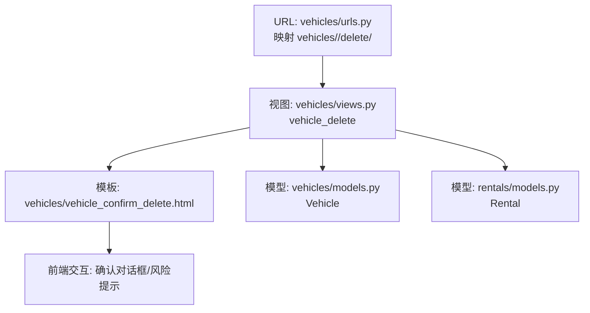
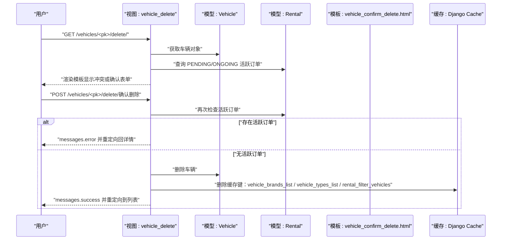
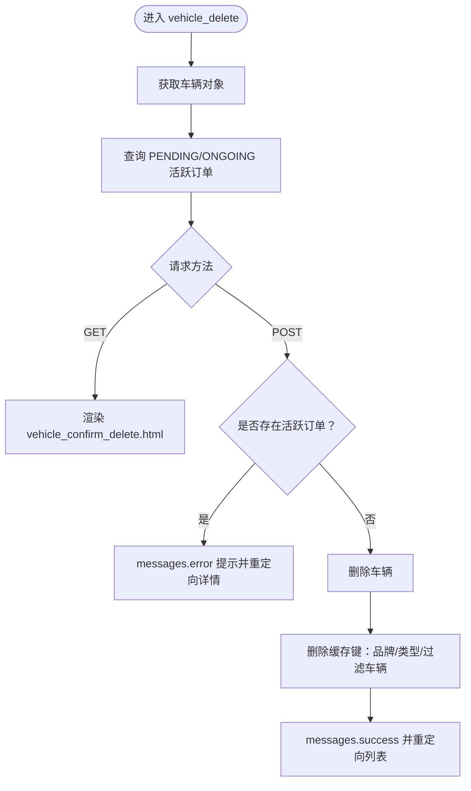
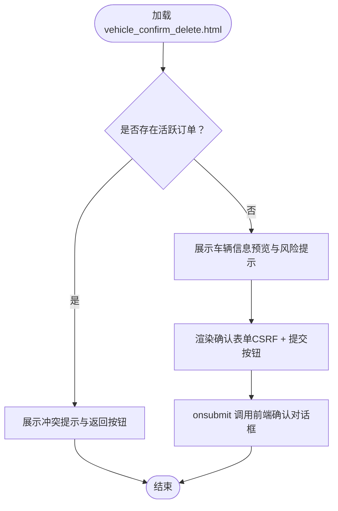
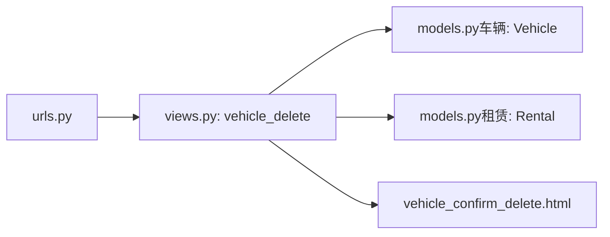

# 车辆删除管理

<cite>
**本文引用的文件**
- [views.py](file://code/car_rental_system/vehicles/views.py)
- [urls.py](file://code/car_rental_system/vehicles/urls.py)
- [vehicle_confirm_delete.html](file://code/car_rental_system/templates/vehicles/vehicle_confirm_delete.html)
- [models.py（车辆）](file://code/car_rental_system/vehicles/models.py)
- [models.py（租赁）](file://code/car_rental_system/rentals/models.py)
- [vehicle_list.html](file://code/car_rental_system/templates/vehicles/vehicle_list.html)
</cite>

## 目录
1. [简介](#简介)
2. [项目结构](#项目结构)
3. [核心组件](#核心组件)
4. [架构总览](#架构总览)
5. [详细组件分析](#详细组件分析)
6. [依赖关系分析](#依赖关系分析)
7. [性能考量](#性能考量)
8. [故障排查指南](#故障排查指南)
9. [结论](#结论)

## 简介
本文件聚焦“车辆删除管理”功能，围绕 vehicle_delete 视图的安全控制机制展开，详细说明：
- 删除前对“进行中（PENDING/ONGOING）”租赁订单的检查，防止业务冲突；
- POST 请求确认删除的防误操作设计；
- 成功删除后的缓存清理策略（品牌、车型列表、过滤用缓存）；
- vehicle_confirm_delete.html 模板如何展示车辆信息与冲突订单提示；
- 使用 messages.error 阻止非法删除并返回错误提示，确保数据一致性与用户体验。

## 项目结构
与“车辆删除管理”直接相关的模块与文件如下：
- URL 映射：vehicles/urls.py
- 视图函数：vehicles/views.py 中的 vehicle_delete
- 模板：vehicles/vehicle_confirm_delete.html
- 模型：vehicles/models.py（Vehicle）、rentals/models.py（Rental）

图表来源
- [urls.py](file://code/car_rental_system/vehicles/urls.py#L1-L18)
- [views.py](file://code/car_rental_system/vehicles/views.py#L255-L286)
- [vehicle_confirm_delete.html](file://code/car_rental_system/templates/vehicles/vehicle_confirm_delete.html#L1-L148)
- [models.py（车辆）](file://code/car_rental_system/vehicles/models.py#L1-L85)
- [models.py（租赁）](file://code/car_rental_system/rentals/models.py#L1-L170)

章节来源
- [urls.py](file://code/car_rental_system/vehicles/urls.py#L1-L18)
- [views.py](file://code/car_rental_system/vehicles/views.py#L255-L286)
- [vehicle_confirm_delete.html](file://code/car_rental_system/templates/vehicles/vehicle_confirm_delete.html#L1-L148)
- [models.py（车辆）](file://code/car_rental_system/vehicles/models.py#L1-L85)
- [models.py（租赁）](file://code/car_rental_system/rentals/models.py#L1-L170)

## 核心组件
- URL 配置：将删除入口映射到 vehicle_delete 视图，路径包含车辆主键。
- 视图函数 vehicle_delete：
  - GET：渲染删除确认页面，传入车辆对象与活跃订单集合。
  - POST：若存在 PENDING/ONGOING 的活跃订单则阻止删除并提示；否则删除车辆并清理相关缓存，返回成功消息与重定向。
- 模板 vehicle_confirm_delete.html：
  - 若存在活跃订单：展示冲突提示与返回按钮。
  - 若无活跃订单：展示车辆信息预览、风险提示，并提供确认删除表单与取消按钮。
- 模型依赖：
  - Vehicle：承载车辆基本信息与状态。
  - Rental：承载租赁订单状态，用于判断是否存在活跃订单。

章节来源
- [urls.py](file://code/car_rental_system/vehicles/urls.py#L1-L18)
- [views.py](file://code/car_rental_system/vehicles/views.py#L255-L286)
- [vehicle_confirm_delete.html](file://code/car_rental_system/templates/vehicles/vehicle_confirm_delete.html#L1-L148)
- [models.py（车辆）](file://code/car_rental_system/vehicles/models.py#L1-L85)
- [models.py（租赁）](file://code/car_rental_system/rentals/models.py#L1-L170)

## 架构总览
下图展示了“删除车辆”的端到端流程，包括安全检查、模板渲染与缓存清理。

图表来源
- [views.py](file://code/car_rental_system/vehicles/views.py#L255-L286)
- [vehicle_confirm_delete.html](file://code/car_rental_system/templates/vehicles/vehicle_confirm_delete.html#L1-L148)
- [models.py（车辆）](file://code/car_rental_system/vehicles/models.py#L1-L85)
- [models.py（租赁）](file://code/car_rental_system/rentals/models.py#L1-L170)

## 详细组件分析

### 视图：vehicle_delete 的安全控制与流程
- 入口与参数：通过 URL 配置接收车辆主键 pk，使用 get_object_or_404 获取车辆对象。
- 活跃订单检查：
  - 从 rentals.models 导入 Rental，查询当前车辆在 PENDING/ONGOING 状态下的订单集合。
  - 使用 only('id') 仅取最小必要字段，降低数据库负载。
- GET 行为：
  - 将 vehicle 与 active_rentals 传入模板 vehicle_confirm_delete.html，用于渲染确认页面。
- POST 行为：
  - 若存在活跃订单：调用 messages.error 输出错误消息，重定向回车辆详情页。
  - 若无活跃订单：记录车牌号、删除车辆、清理缓存键、输出成功消息并重定向到车辆列表。
- 缓存清理：
  - 删除 vehicle_brands_list、vehicle_types_list、rental_filter_vehicles，确保后续筛选与列表展示的数据一致性。

图表来源
- [views.py](file://code/car_rental_system/vehicles/views.py#L255-L286)

章节来源
- [views.py](file://code/car_rental_system/vehicles/views.py#L255-L286)

### 模板：vehicle_confirm_delete.html 的冲突提示与确认对话框
- 冲突提示区域：
  - 当存在活跃订单时，模板以警告样式展示冲突信息，列出订单号、客户名与租期范围，并提示先完成或取消订单。
  - 提供返回详情按钮，便于用户回到车辆详情页。
- 确认删除区域：
  - 展示即将删除的车辆信息预览（车牌号、品牌、型号、类型、颜色、日租金等）。
  - 风险提示强调删除不可逆、相关租赁记录也会被永久删除。
  - 提供确认表单，包含 CSRF Token 与提交按钮；同时通过 onsubmit 调用前端确认对话框，增强防误操作。
- 替代方案提示：
  - 当无活跃订单时，模板建议将车辆状态设为“维修中”，或直接编辑车辆信息，避免误删。

图表来源
- [vehicle_confirm_delete.html](file://code/car_rental_system/templates/vehicles/vehicle_confirm_delete.html#L1-L148)

章节来源
- [vehicle_confirm_delete.html](file://code/car_rental_system/templates/vehicles/vehicle_confirm_delete.html#L1-L148)

### URL 与路由
- vehicles/urls.py 将删除入口映射到 vehicles:vehicle_delete，路径包含车辆主键，保证删除操作与具体车辆绑定。

章节来源
- [urls.py](file://code/car_rental_system/vehicles/urls.py#L1-L18)

### 模型依赖与状态约束
- Vehicle 模型：
  - 字段包含 license_plate、brand、model、vehicle_type、color、seats、daily_rate、status 等，用于模板展示与业务判断。
- Rental 模型：
  - RENTAL_STATUS_CHOICES 包含 PENDING、ONGOING、OVERDUE、COMPLETED、CANCELLED 等状态，视图通过 status__in=['PENDING','ONGOING'] 过滤活跃订单。
  - 与 Vehicle 一对多关系，用于判断某辆车是否存在进行中的订单。

章节来源
- [models.py（车辆）](file://code/car_rental_system/vehicles/models.py#L1-L85)
- [models.py（租赁）](file://code/car_rental_system/rentals/models.py#L1-L170)

## 依赖关系分析
- 视图依赖：
  - vehicles/views.py 依赖 vehicles/models.py（Vehicle）与 rentals/models.py（Rental）。
  - 视图依赖 Django 的 messages 与缓存系统。
- 模板依赖：
  - vehicle_confirm_delete.html 依赖车辆与活跃订单上下文，用于条件渲染与信息展示。
- URL 依赖：
  - vehicles/urls.py 依赖 vehicles/views.py 中的 vehicle_delete 函数。

图表来源
- [views.py](file://code/car_rental_system/vehicles/views.py#L255-L286)
- [vehicle_confirm_delete.html](file://code/car_rental_system/templates/vehicles/vehicle_confirm_delete.html#L1-L148)
- [urls.py](file://code/car_rental_system/vehicles/urls.py#L1-L18)
- [models.py（车辆）](file://code/car_rental_system/vehicles/models.py#L1-L85)
- [models.py（租赁）](file://code/car_rental_system/rentals/models.py#L1-L170)

章节来源
- [views.py](file://code/car_rental_system/vehicles/views.py#L255-L286)
- [vehicle_confirm_delete.html](file://code/car_rental_system/templates/vehicles/vehicle_confirm_delete.html#L1-L148)
- [urls.py](file://code/car_rental_system/vehicles/urls.py#L1-L18)
- [models.py（车辆）](file://code/car_rental_system/vehicles/models.py#L1-L85)
- [models.py（租赁）](file://code/car_rental_system/rentals/models.py#L1-L170)

## 性能考量
- 查询优化：
  - 活跃订单查询使用 only('id')，仅取最小必要字段，减少数据库传输与序列化开销。
- 缓存策略：
  - 车辆列表页在 vehicle_list 中使用缓存键 vehicle_brands_list、vehicle_types_list、vehicle_seats_list，删除车辆后同步清理对应缓存键，避免陈旧数据影响筛选与展示。
- 分页与字段裁剪：
  - 车辆列表使用 only(...) 与分页，降低查询成本；删除视图也采用最小字段查询，提升响应速度。

章节来源
- [views.py](file://code/car_rental_system/vehicles/views.py#L42-L135)
- [views.py](file://code/car_rental_system/vehicles/views.py#L255-L286)

## 故障排查指南
- 无法删除车辆
  - 现象：POST 提交后立即返回错误提示并重定向回详情页。
  - 原因：存在 PENDING 或 ONGOING 的活跃订单。
  - 处理：先完成或取消相关订单，再尝试删除。
  - 参考路径：[views.py](file://code/car_rental_system/vehicles/views.py#L264-L269)
- 删除后筛选异常
  - 现象：品牌/类型筛选结果不更新或列表不变化。
  - 原因：缓存未清理导致陈旧数据。
  - 处理：确认删除流程已清理 vehicle_brands_list、vehicle_types_list、rental_filter_vehicles；如仍异常，检查缓存后端与键名。
  - 参考路径：[views.py](file://code/car_rental_system/vehicles/views.py#L272-L277)
- 模板未显示冲突提示
  - 现象：点击删除后直接进入确认表单，未看到冲突提示。
  - 原因：当前车辆无 PENDING/ONGOING 订单。
  - 处理：核对订单状态；如需临时停用，建议使用“维修中”状态而非删除。
  - 参考路径：[vehicle_confirm_delete.html](file://code/car_rental_system/templates/vehicles/vehicle_confirm_delete.html#L22-L46)
- 前端确认对话框
  - 现象：提交前弹出二次确认。
  - 原因：模板 onsubmit 调用 confirmDelete(...)。
  - 处理：确认对话框文案包含“此操作无法撤销”，确保用户知情。
  - 参考路径：[vehicle_confirm_delete.html](file://code/car_rental_system/templates/vehicles/vehicle_confirm_delete.html#L107-L117)

章节来源
- [views.py](file://code/car_rental_system/vehicles/views.py#L264-L279)
- [vehicle_confirm_delete.html](file://code/car_rental_system/templates/vehicles/vehicle_confirm_delete.html#L22-L46)
- [vehicle_confirm_delete.html](file://code/car_rental_system/templates/vehicles/vehicle_confirm_delete.html#L107-L117)

## 结论
- 安全控制：通过在删除前检查 PENDING/ONGOING 的活跃订单，有效避免业务冲突，保障数据一致性。
- 防误操作：模板层提供确认对话框与风险提示，配合后端 messages.error/messagess.success，提升用户体验与安全性。
- 缓存维护：删除成功后清理关键缓存键，确保后续筛选与列表展示的准确性。
- 可替代方案：当无活跃订单时，模板建议将状态设为“维修中”或编辑车辆，避免误删造成不可逆损失。