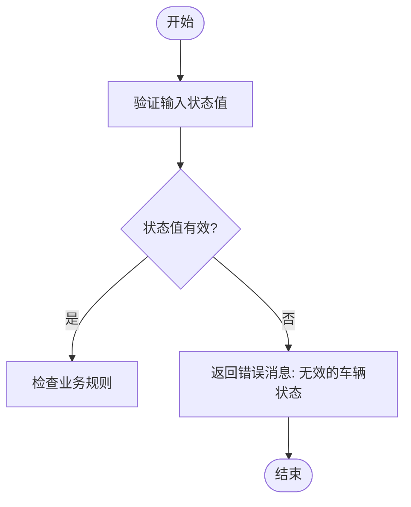
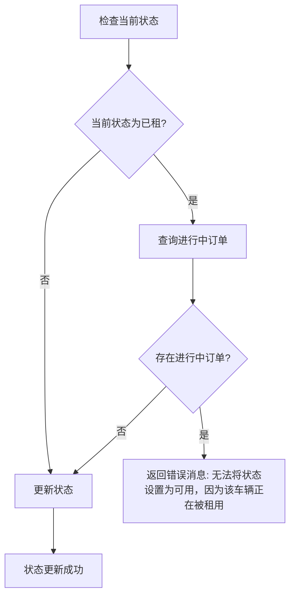
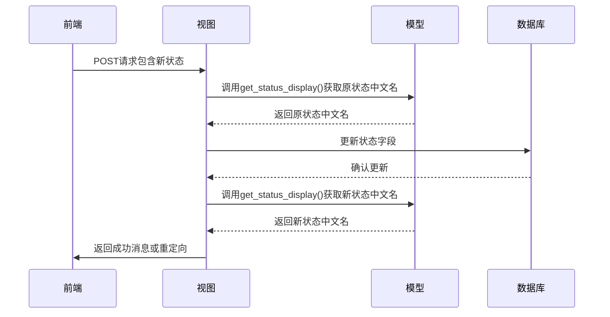
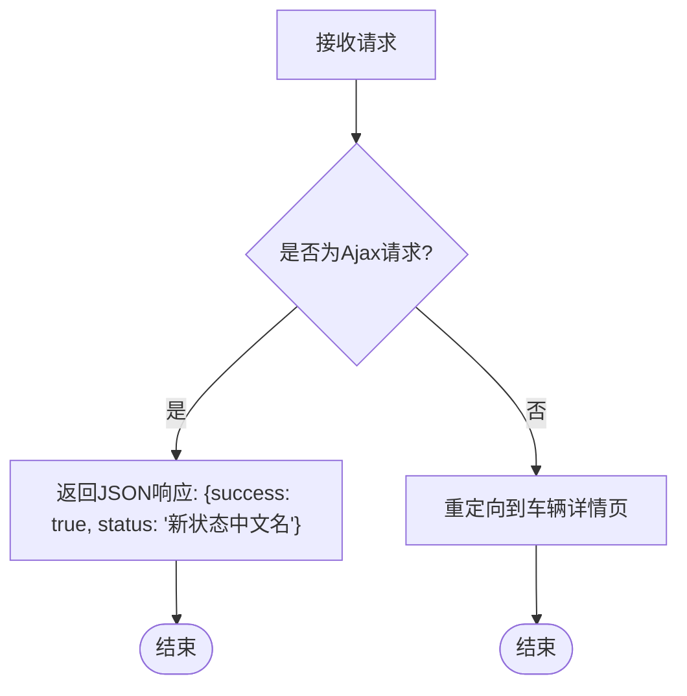
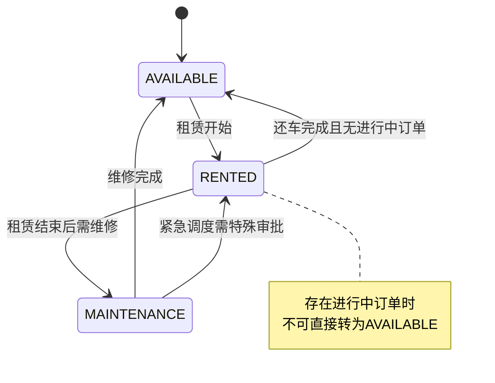

# 车辆状态管理

<cite>
**本文档引用的文件**   
- [vehicle_status_update.py](file://code\car_rental_system\vehicles\views.py#L289-L322)
- [vehicle_detail.html](file://code\car_rental_system\templates\vehicles\vehicle_detail.html#L83-L124)
- [models.py](file://code\car_rental_system\vehicles\models.py#L6-L11)
- [rentals.py](file://code\car_rental_system\rentals\models.py#L13-L19)
- [urls.py](file://code\car_rental_system\vehicles\urls.py#L17)
</cite>

## 目录
1. [功能概述](#功能概述)
2. [状态值验证机制](#状态值验证机制)
3. [业务约束规则](#业务约束规则)
4. [状态变更处理流程](#状态变更处理流程)
5. [用户友好消息提示](#用户友好消息提示)
6. [Ajax请求支持](#ajax请求支持)
7. [前端交互实现](#前端交互实现)
8. [状态机设计原则](#状态机设计原则)

## 功能概述
车辆状态管理功能通过`vehicle_status_update`视图实现，负责处理车辆状态的变更请求。该功能接收POST请求，验证新的状态值是否合法，并根据业务规则执行状态变更。系统支持三种车辆状态：可用、已租和维修中。状态变更操作需要遵循严格的业务约束，确保数据的一致性和业务流程的正确性。

**文档来源**
- [vehicle_status_update.py](file://code\car_rental_system\vehicles\views.py#L289-L322)
- [models.py](file://code\car_rental_system\vehicles\models.py#L6-L11)

## 状态值验证机制
系统通过`VEHICLE_STATUS_CHOICES`定义了合法的车辆状态选项，包括'AVAILABLE'(可用)、'RENTED'(已租)和'MAINTENANCE'(维修中)。当接收到状态更新请求时，系统首先验证提交的状态值是否属于这些预定义的选项。



**图示来源**
- [models.py](file://code\car_rental_system\vehicles\models.py#L6-L11)
- [vehicle_status_update.py](file://code\car_rental_system\vehicles\views.py#L297-L299)

## 业务约束规则
系统实施了关键的业务约束：已租车辆在存在进行中订单时不可直接设为可用状态。这一规则确保了业务逻辑的一致性，防止在车辆仍在使用时错误地将其标记为可用。



**图示来源**
- [vehicle_status_update.py](file://code\car_rental_system\vehicles\views.py#L302-L308)
- [rentals.py](file://code\car_rental_system\rentals\models.py#L13-L19)

## 状态变更处理流程
状态变更处理流程包括获取当前状态的中文显示名称、更新数据库记录以及生成用户反馈消息。系统使用Django模型的`get_status_display()`方法来获取状态的可读中文名称。



**图示来源**
- [vehicle_status_update.py](file://code\car_rental_system\vehicles\views.py#L310-L315)
- [models.py](file://code\car_rental_system\vehicles\models.py#L52-L58)

## 用户友好消息提示
系统通过Django的messages框架向用户提供清晰的状态变更反馈。当状态成功更新时，系统会显示包含状态变更前后中文名称的详细消息，提高用户体验。

```python
# 代码逻辑示例（非实际代码内容）
old_status = vehicle.get_status_display()  # 获取原状态中文名
new_status_display = vehicle.get_status_display()  # 获取新状态中文名
messages.success(request, f'车辆 {vehicle.license_plate} 状态已从 "{old_status}" 更新为 "{new_status_display}"')
```

**文档来源**
- [vehicle_status_update.py](file://code\car_rental_system\vehicles\views.py#L310-L315)

## Ajax请求支持
视图支持Ajax请求，能够根据请求类型返回相应的响应。对于Ajax请求，系统返回JSON格式的响应，实现前端页面的无刷新状态更新。



**图示来源**
- [vehicle_status_update.py](file://code\car_rental_system\vehicles\views.py#L318-L320)
- [vehicle_detail.html](file://code\car_rental_system\templates\vehicles\vehicle_detail.html#L106-L118)

## 前端交互实现
前端通过按钮组提供直观的状态变更界面，每个按钮对应一种状态选项。按钮的禁用状态根据当前车辆状态动态设置，防止重复操作。

```html
<!-- 前端代码结构示例（非实际代码内容） -->
<div class="btn-group w-100" role="group">
    <button type="button" class="btn btn-success" 
            onclick="updateVehicleStatus(vehicleId, 'AVAILABLE', this)"
            disabled="当前状态为可用时禁用">
        可用
    </button>
    <button type="button" class="btn btn-danger" 
            onclick="updateVehicleStatus(vehicleId, 'RENTED', this)"
            disabled="当前状态为已租时禁用">
        已租
    </button>
    <button type="button" class="btn btn-warning" 
            onclick="updateVehicleStatus(vehicleId, 'MAINTENANCE', this)"
            disabled="当前状态为维修中时禁用">
        维修中
    </button>
</div>
```

**文档来源**
- [vehicle_detail.html](file://code\car_rental_system\templates\vehicles\vehicle_detail.html#L105-L119)

## 状态机设计原则
车辆状态管理采用状态机设计模式，通过`Vehicle`模型的`status`字段实现。状态机设计确保了状态转换的可控性和可预测性，所有状态变更都必须通过预定义的业务规则验证。



**图示来源**
- [models.py](file://code\car_rental_system\vehicles\models.py#L52-L58)
- [vehicle_status_update.py](file://code\car_rental_system\vehicles\views.py#L302-L308)
- [rentals.py](file://code\car_rental_system\rentals\models.py#L13-L19)