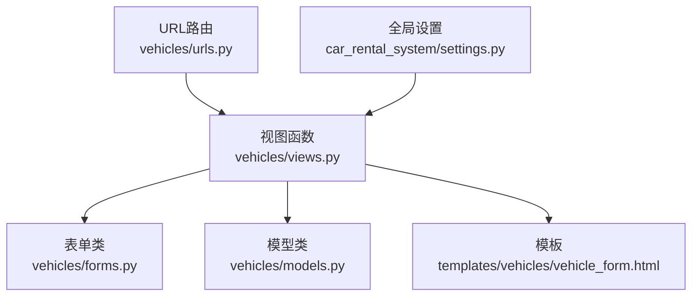
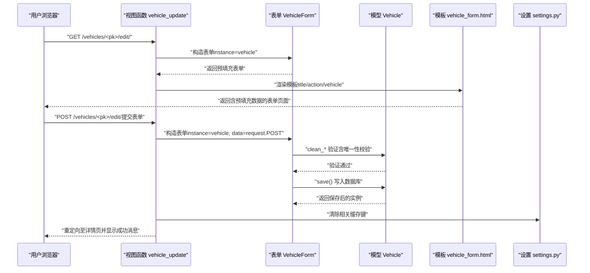
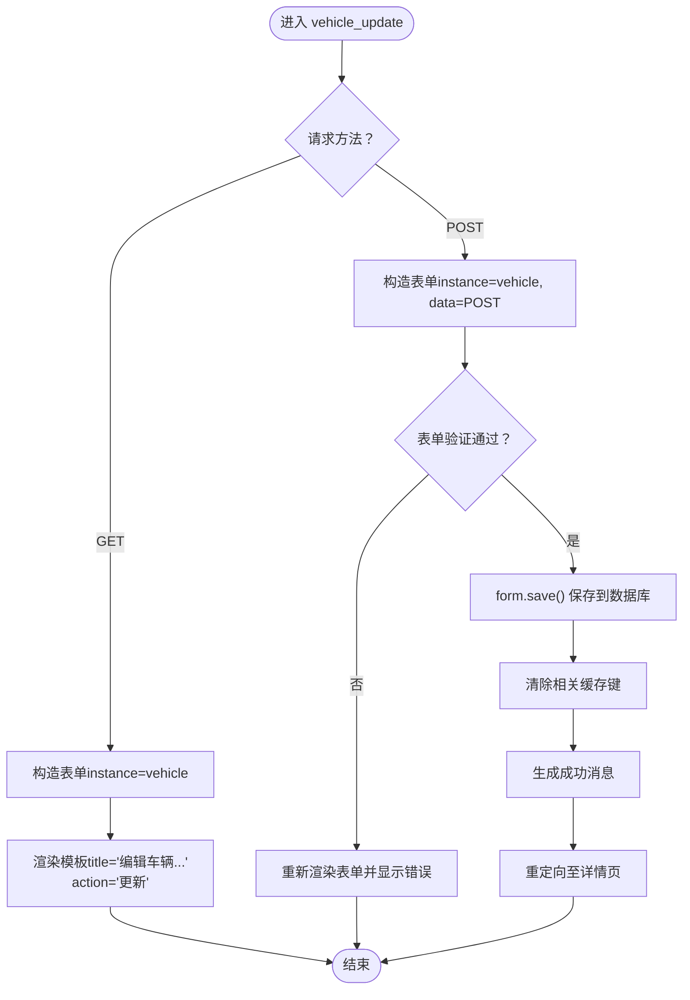
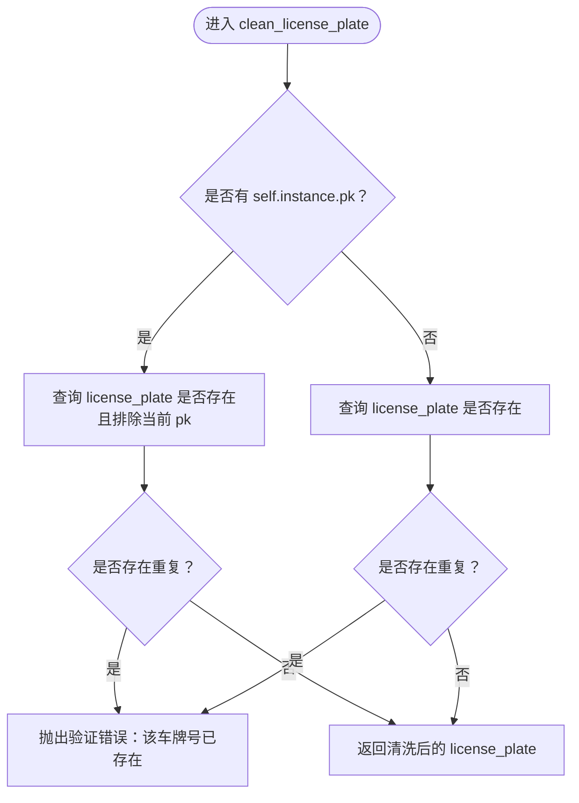
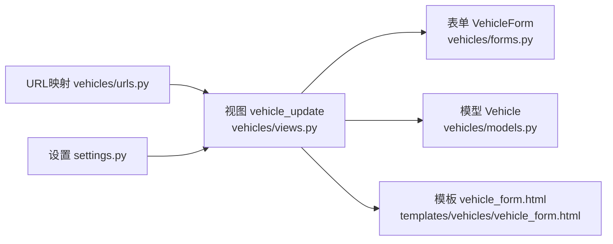

# 车辆编辑

<cite>
**本文引用的文件**
- [views.py](file://code/car_rental_system/vehicles/views.py)
- [forms.py](file://code/car_rental_system/vehicles/forms.py)
- [vehicle_form.html](file://code/car_rental_system/templates/vehicles/vehicle_form.html)
- [models.py](file://code/car_rental_system/vehicles/models.py)
- [urls.py](file://code/car_rental_system/vehicles/urls.py)
- [settings.py](file://code/car_rental_system/car_rental_system/settings.py)
- [test_vehicle_management.py](file://code/car_rental_system/test_vehicle_management.py)
</cite>

## 目录
1. [简介](#简介)
2. [项目结构](#项目结构)
3. [核心组件](#核心组件)
4. [架构总览](#架构总览)
5. [详细组件分析](#详细组件分析)
6. [依赖关系分析](#依赖关系分析)
7. [性能考量](#性能考量)
8. [故障排查指南](#故障排查指南)
9. [结论](#结论)
10. [附录](#附录)

## 简介
本文件围绕“车辆信息编辑”功能展开，重点解析 vehicle_update 视图的实现机制，说明如何通过 ModelForm 的 instance 参数将现有车辆对象注入表单以实现数据预填充；对比创建与编辑场景下的表单处理差异；解释在 PUT/PATCH 请求未启用时使用 POST 方法更新数据的 Django 实践；结合 forms.py 中的字段验证逻辑，阐述在编辑状态下如何排除当前车辆自身进行车牌号唯一性校验；描述模板 vehicle_form.html 如何根据上下文动态显示“编辑车辆”标题与“更新”操作按钮；最后提供编辑成功后清除缓存并重定向至详情页的完整流程及消息提示生成方式。

## 项目结构
车辆编辑功能涉及以下关键模块：
- 视图层：vehicles/views.py 中的 vehicle_update 视图负责处理 GET/POST 请求，构建表单并保存数据。
- 表单层：vehicles/forms.py 中的 VehicleForm 对车辆字段进行验证与清洗。
- 模板层：vehicles/vehicle_form.html 根据上下文渲染标题、按钮与表单字段。
- 模型层：vehicles/models.py 定义车辆模型及其唯一性约束。
- URL 映射：vehicles/urls.py 将 /vehicles/<int:pk>/edit/ 映射到 vehicle_update 视图。
- 全局配置：car_rental_system/settings.py 配置了缓存、静态资源与国际化等，影响编辑后的缓存清理策略与页面呈现。

图表来源
- [urls.py](file://code/car_rental_system/vehicles/urls.py#L1-L18)
- [views.py](file://code/car_rental_system/vehicles/views.py#L225-L252)
- [forms.py](file://code/car_rental_system/vehicles/forms.py#L1-L153)
- [models.py](file://code/car_rental_system/vehicles/models.py#L1-L85)
- [vehicle_form.html](file://code/car_rental_system/templates/vehicles/vehicle_form.html#L1-L200)
- [settings.py](file://code/car_rental_system/car_rental_system/settings.py#L50-L179)

章节来源
- [urls.py](file://code/car_rental_system/vehicles/urls.py#L1-L18)
- [views.py](file://code/car_rental_system/vehicles/views.py#L225-L252)
- [forms.py](file://code/car_rental_system/vehicles/forms.py#L1-L153)
- [models.py](file://code/car_rental_system/vehicles/models.py#L1-L85)
- [vehicle_form.html](file://code/car_rental_system/templates/vehicles/vehicle_form.html#L1-L200)
- [settings.py](file://code/car_rental_system/car_rental_system/settings.py#L50-L179)

## 核心组件
- vehicle_update 视图：接收 GET/POST 请求，编辑模式下通过 instance=vehicle 注入现有对象，POST 提交后进行表单验证与保存，成功后清除相关缓存并重定向至详情页，同时生成成功消息。
- VehicleForm 表单：定义字段、标签、帮助文本与小部件；在 clean_license_plate 中实现车牌号唯一性校验，并在编辑状态下排除当前实例自身。
- vehicle_form.html 模板：根据上下文变量 title、action、vehicle 动态渲染标题与按钮；渲染表单字段并显示错误与提示信息。
- Vehicle 模型：定义 license_plate 唯一性约束与状态枚举，确保业务一致性。
- URL 映射：将 /vehicles/<int:pk>/edit/ 映射到 vehicle_update，支持编辑特定车辆。

章节来源
- [views.py](file://code/car_rental_system/vehicles/views.py#L225-L252)
- [forms.py](file://code/car_rental_system/vehicles/forms.py#L1-L153)
- [vehicle_form.html](file://code/car_rental_system/templates/vehicles/vehicle_form.html#L1-L200)
- [models.py](file://code/car_rental_system/vehicles/models.py#L1-L85)
- [urls.py](file://code/car_rental_system/vehicles/urls.py#L1-L18)

## 架构总览
下面的序列图展示了“编辑车辆”的端到端流程：浏览器发起 GET 请求进入编辑页，服务器返回带预填充数据的表单；用户提交 POST，服务器验证表单并保存，随后清除缓存并重定向至详情页，同时生成消息提示。

图表来源
- [views.py](file://code/car_rental_system/vehicles/views.py#L225-L252)
- [forms.py](file://code/car_rental_system/vehicles/forms.py#L1-L153)
- [vehicle_form.html](file://code/car_rental_system/templates/vehicles/vehicle_form.html#L1-L200)
- [settings.py](file://code/car_rental_system/car_rental_system/settings.py#L141-L151)

## 详细组件分析

### 视图：vehicle_update 的实现机制
- GET 场景：通过 get_object_or_404 获取目标车辆，构造 VehicleForm(instance=vehicle)，将现有数据预填充到表单字段，渲染模板并传入 title 与 action 上下文。
- POST 场景：使用 VehicleForm(request.POST, instance=vehicle) 接收并绑定数据；若表单验证通过，则调用 form.save() 保存到数据库；随后清除缓存键（如车辆品牌、类型、可选车辆列表等），生成成功消息，最后重定向到车辆详情页。
- 与 vehicle_create 的差异：两者均使用 @require_http_methods(["GET", "POST"])，但 vehicle_create 不传入 instance，因此不会预填充数据；而 vehicle_update 传入 instance=vehicle，使表单具备编辑态的数据预填充能力。

图表来源
- [views.py](file://code/car_rental_system/vehicles/views.py#L225-L252)

章节来源
- [views.py](file://code/car_rental_system/vehicles/views.py#L225-L252)

### 表单：ModelForm 的 instance 注入与数据预填充
- 在编辑场景，视图将 instance=vehicle 传递给 VehicleForm，ModelForm 会将该实例的字段值作为初始值填充到表单控件中，从而实现“预填充”。
- 与创建场景的区别：创建时仅传入 request.POST，不传入 instance，表单为空，用于新增记录；编辑时传入 instance，表单为更新模式，字段值来自数据库。

章节来源
- [views.py](file://code/car_rental_system/vehicles/views.py#L225-L252)
- [forms.py](file://code/car_rental_system/vehicles/forms.py#L1-L153)

### 字段验证：车牌号唯一性校验（编辑态排除自身）
- VehicleForm.clean_license_plate 在编辑状态下通过 self.instance.pk 判断是否为已有实例；若存在，则在查询重复车牌号时使用 exclude(pk=self.instance.pk) 排除当前车辆自身，避免“自碰”导致的唯一性错误。
- 若为新建（无 self.instance.pk），则直接检查是否存在相同车牌号，若存在则抛出验证错误。

图表来源
- [forms.py](file://code/car_rental_system/vehicles/forms.py#L87-L100)

章节来源
- [forms.py](file://code/car_rental_system/vehicles/forms.py#L87-L100)

### 模板：动态标题与按钮
- 模板通过上下文变量 title、action、vehicle 控制标题与按钮文案：
  - 标题：当 action 为“更新”时，title 为“编辑车辆 - 车牌号”，体现编辑态。
  - 按钮：当 action 为“更新”时，按钮显示“更新”并带有保存图标。
  - 返回链接：根据是否存在 vehicle 决定返回详情页或列表页。
- 表单字段渲染：模板遍历 VehicleForm 的字段，输出标签、输入控件、帮助文本与错误信息。

章节来源
- [vehicle_form.html](file://code/car_rental_system/templates/vehicles/vehicle_form.html#L1-L200)
- [views.py](file://code/car_rental_system/vehicles/views.py#L225-L252)

### 缓存清理与重定向：编辑成功后的完整流程
- 成功保存后，视图清除与车辆筛选相关的缓存键（如品牌列表、类型列表、可选车辆列表），保证后续查询与筛选结果的准确性。
- 生成成功消息（包含车牌号），随后重定向至车辆详情页，用户可在详情页看到更新后的信息与提示。

章节来源
- [views.py](file://code/car_rental_system/vehicles/views.py#L225-L252)
- [settings.py](file://code/car_rental_system/car_rental_system/settings.py#L141-L151)

### PUT/PATCH 未启用时的更新实践
- 本系统通过 @require_http_methods(["GET", "POST"]) 限制 vehicle_update 的请求方法，编辑更新采用 POST 提交。这是 Django 常见做法：HTML 表单默认仅支持 GET/POST，PUT/PATCH 需要额外隐藏域或前端 JS 支持；本项目未启用 PUT/PATCH，因此统一使用 POST 实现更新。

章节来源
- [views.py](file://code/car_rental_system/vehicles/views.py#L225-L252)

### 与创建场景的表单处理差异
- 创建：VehicleForm() 无 instance，表单为空，提交后保存新记录。
- 编辑：VehicleForm(instance=vehicle) 有 instance，表单预填充旧值，提交后保存更新记录。
- 二者共享同一表单类 VehicleForm，验证规则一致，但数据来源不同。

章节来源
- [views.py](file://code/car_rental_system/vehicles/views.py#L198-L222)
- [views.py](file://code/car_rental_system/vehicles/views.py#L225-L252)
- [forms.py](file://code/car_rental_system/vehicles/forms.py#L1-L153)

## 依赖关系分析
- 视图依赖：
  - vehicles/views.py 依赖 vehicles/models.py（Vehicle）、vehicles/forms.py（VehicleForm）、Django 的 messages、redirect、get_object_or_404。
  - 模板 vehicles/vehicle_form.html 依赖 vehicles/views.py 传入的上下文变量（form、title、action、vehicle）。
- 表单依赖：
  - vehicles/forms.py 依赖 vehicles/models.py（Vehicle 模型与状态枚举、唯一性约束）。
- URL 依赖：
  - vehicles/urls.py 将 /vehicles/<int:pk>/edit/ 映射到 vehicle_update，供视图使用。
- 配置依赖：
  - car_rental_system/settings.py 配置缓存（LocMemCache）与静态资源路径，影响编辑后缓存清理与页面样式。

图表来源
- [views.py](file://code/car_rental_system/vehicles/views.py#L225-L252)
- [forms.py](file://code/car_rental_system/vehicles/forms.py#L1-L153)
- [models.py](file://code/car_rental_system/vehicles/models.py#L1-L85)
- [vehicle_form.html](file://code/car_rental_system/templates/vehicles/vehicle_form.html#L1-L200)
- [urls.py](file://code/car_rental_system/vehicles/urls.py#L1-L18)
- [settings.py](file://code/car_rental_system/car_rental_system/settings.py#L141-L151)

章节来源
- [views.py](file://code/car_rental_system/vehicles/views.py#L225-L252)
- [forms.py](file://code/car_rental_system/vehicles/forms.py#L1-L153)
- [models.py](file://code/car_rental_system/vehicles/models.py#L1-L85)
- [vehicle_form.html](file://code/car_rental_system/templates/vehicles/vehicle_form.html#L1-L200)
- [urls.py](file://code/car_rental_system/vehicles/urls.py#L1-L18)
- [settings.py](file://code/car_rental_system/car_rental_system/settings.py#L141-L151)

## 性能考量
- 缓存策略：编辑成功后清除与筛选相关的缓存键，避免陈旧数据影响列表页与筛选功能的用户体验。
- 模板渲染：模板对字段进行逐项渲染并显示错误信息，有助于减少不必要的二次请求。
- 数据库约束：模型层对 license_plate 设置唯一性约束，配合表单清洗与验证，降低重复数据风险。

章节来源
- [views.py](file://code/car_rental_system/vehicles/views.py#L225-L252)
- [settings.py](file://code/car_rental_system/car_rental_system/settings.py#L141-L151)
- [models.py](file://code/car_rental_system/vehicles/models.py#L1-L85)

## 故障排查指南
- 编辑后页面仍显示旧数据
  - 检查是否正确传入 instance=vehicle；确认视图在 POST 场景使用 VehicleForm(request.POST, instance=vehicle)。
  - 确认缓存键是否被清除，必要时手动刷新或等待缓存过期。
- 车牌号唯一性错误
  - 在编辑场景下，确认 clean_license_plate 已通过 exclude(pk=self.instance.pk) 排除当前车辆；若仍有冲突，检查数据库中是否存在重复车牌号。
- 表单提交无响应
  - 确认 URL 映射正确，路径为 /vehicles/<int:pk>/edit/；确认模板中的 form method="post" 与 CSRF 令牌存在。
- 重定向后未显示消息
  - 确认 messages.success 已调用；检查模板中是否正确渲染消息上下文。

章节来源
- [views.py](file://code/car_rental_system/vehicles/views.py#L225-L252)
- [forms.py](file://code/car_rental_system/vehicles/forms.py#L87-L100)
- [vehicle_form.html](file://code/car_rental_system/templates/vehicles/vehicle_form.html#L1-L200)
- [urls.py](file://code/car_rental_system/vehicles/urls.py#L1-L18)

## 结论
vehicle_update 视图通过 ModelForm 的 instance 参数实现了编辑态的数据预填充；与 vehicle_create 共用同一表单类，但在数据来源与上下文变量上形成差异化处理。表单在 clean_license_plate 中针对编辑态排除当前实例，确保唯一性校验的正确性；模板依据上下文动态渲染标题与按钮，提升用户体验。编辑成功后，系统清除相关缓存并重定向至详情页，同时生成明确的成功消息，形成闭环的编辑流程。

## 附录
- 相关测试参考：test_vehicle_management.py 展示了车辆模型、表单验证与业务逻辑的基本行为，可用于辅助理解与回归测试。

章节来源
- [test_vehicle_management.py](file://code/car_rental_system/test_vehicle_management.py#L1-L171)