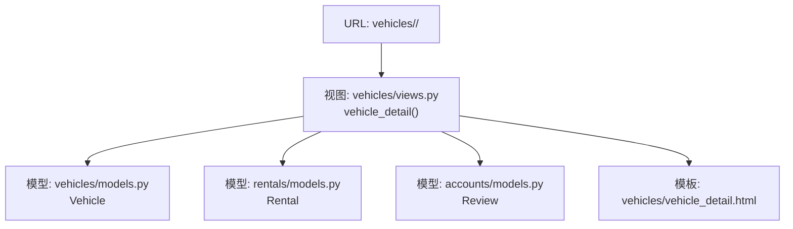
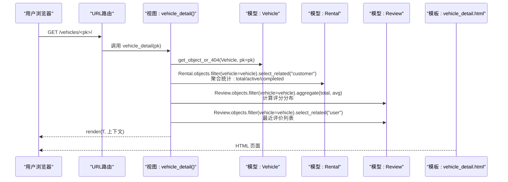
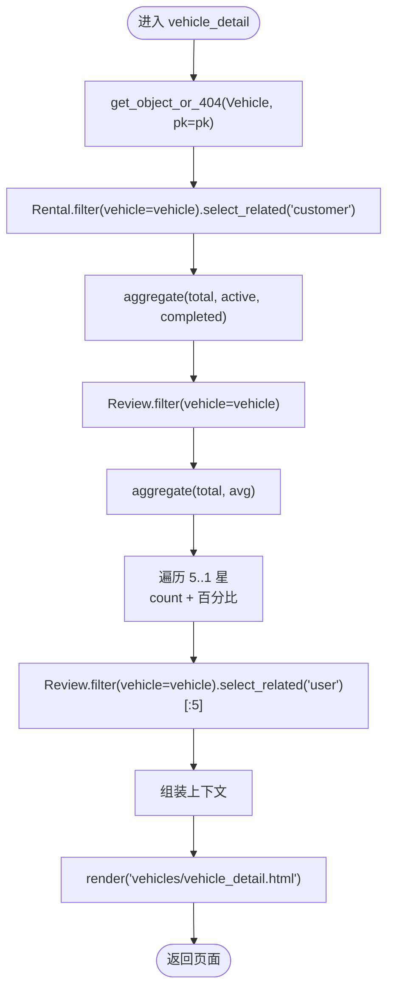
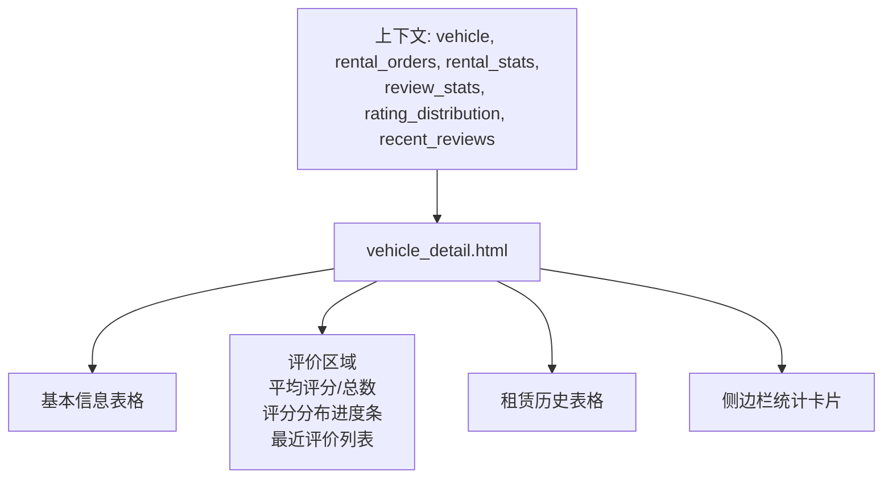
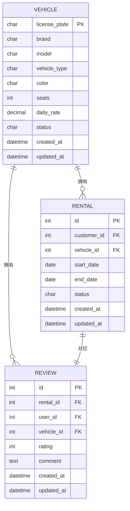
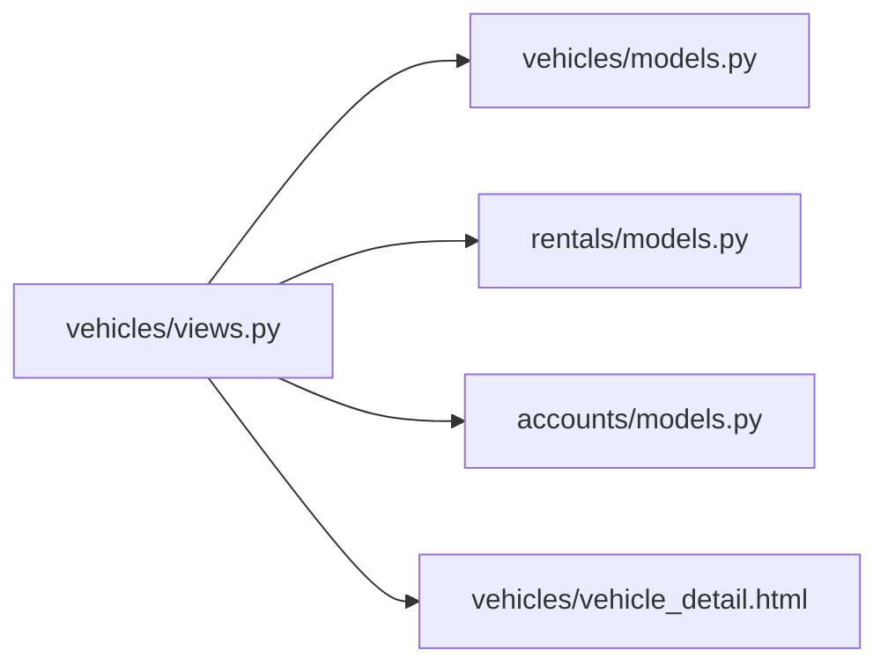

# 车辆详情查看

<cite>
**本文引用的文件**
- [views.py](file://code/car_rental_system/vehicles/views.py)
- [vehicle_detail.html](file://code/car_rental_system/templates/vehicles/vehicle_detail.html)
- [models.py](file://code/car_rental_system/vehicles/models.py)
- [models.py](file://code/car_rental_system/rentals/models.py)
- [models.py](file://code/car_rental_system/accounts/models.py)
- [urls.py](file://code/car_rental_system/vehicles/urls.py)
- [views.py](file://code/car_rental_system/views.py)
</cite>

## 目录
1. [简介](#简介)
2. [项目结构](#项目结构)
3. [核心组件](#核心组件)
4. [架构总览](#架构总览)
5. [详细组件分析](#详细组件分析)
6. [依赖关系分析](#依赖关系分析)
7. [性能考量](#性能考量)
8. [故障排查指南](#故障排查指南)
9. [结论](#结论)

## 简介
本文件围绕“车辆详情查看”功能进行全面技术文档化，重点解析 vehicle_detail 视图的数据聚合逻辑与模板渲染策略。内容涵盖：
- 如何使用 get_object_or_404 安全获取车辆实例
- 如何通过 select_related 优化关联查询性能
- 视图如何聚合租赁订单统计（总数量、进行中、已完成）、评价数据（平均评分、评分分布）及最近评价列表
- 结合 vehicle_detail.html 模板，说明如何展示车辆基本信息、租赁历史图表化数据和用户评价星级分布
- 提供 Django ORM 的 aggregate() 和 Count() 在统计计算中的应用示例路径，以及模板中 for 循环和 if 判断的渲染要点

## 项目结构
与“车辆详情查看”直接相关的模块与文件如下：
- 视图层：vehicles/views.py 中的 vehicle_detail 函数负责数据聚合与上下文组装
- 模板层：vehicles/vehicle_detail.html 负责渲染车辆详情页面
- 模型层：vehicles/models.py（车辆）、rentals/models.py（租赁订单）、accounts/models.py（评价）
- URL 配置：vehicles/urls.py 将 /vehicles/<int:pk>/ 路由映射到 vehicle_detail

**图表来源**
- [urls.py](file://code/car_rental_system/vehicles/urls.py#L1-L18)
- [views.py](file://code/car_rental_system/vehicles/views.py#L138-L195)
- [vehicle_detail.html](file://code/car_rental_system/templates/vehicles/vehicle_detail.html#L1-L350)
- [models.py](file://code/car_rental_system/vehicles/models.py#L1-L85)
- [models.py](file://code/car_rental_system/rentals/models.py#L1-L170)
- [models.py](file://code/car_rental_system/accounts/models.py#L83-L145)

**章节来源**
- [urls.py](file://code/car_rental_system/vehicles/urls.py#L1-L18)
- [views.py](file://code/car_rental_system/vehicles/views.py#L138-L195)
- [vehicle_detail.html](file://code/car_rental_system/templates/vehicles/vehicle_detail.html#L1-L350)
- [models.py](file://code/car_rental_system/vehicles/models.py#L1-L85)
- [models.py](file://code/car_rental_system/rentals/models.py#L1-L170)
- [models.py](file://code/car_rental_system/accounts/models.py#L83-L145)

## 核心组件
- 视图函数 vehicle_detail：负责安全获取车辆、聚合租赁与评价数据、准备上下文并渲染模板
- 模板 vehicle_detail.html：负责展示车辆基本信息、统计卡片、评价分布与最近评价列表、以及租赁历史表格
- 模型关系：
  - Vehicle 与 Rental：一对多（Vehicle.rentals）
  - Vehicle 与 Review：一对多（Vehicle.reviews）
  - Rental 与 Review：一对一（Rental.review）

**章节来源**
- [views.py](file://code/car_rental_system/vehicles/views.py#L138-L195)
- [vehicle_detail.html](file://code/car_rental_system/templates/vehicles/vehicle_detail.html#L1-L350)
- [models.py](file://code/car_rental_system/vehicles/models.py#L1-L85)
- [models.py](file://code/car_rental_system/rentals/models.py#L1-L170)
- [models.py](file://code/car_rental_system/accounts/models.py#L83-L145)

## 架构总览
下图展示了从 URL 请求到页面渲染的关键调用链与数据流。

**图表来源**
- [urls.py](file://code/car_rental_system/vehicles/urls.py#L1-L18)
- [views.py](file://code/car_rental_system/vehicles/views.py#L138-L195)
- [vehicle_detail.html](file://code/car_rental_system/templates/vehicles/vehicle_detail.html#L1-L350)
- [models.py](file://code/car_rental_system/vehicles/models.py#L1-L85)
- [models.py](file://code/car_rental_system/rentals/models.py#L1-L170)
- [models.py](file://code/car_rental_system/accounts/models.py#L83-L145)

## 详细组件分析

### 视图：vehicle_detail 的数据聚合逻辑
- 安全获取车辆实例
  - 使用 get_object_or_404(Vehicle, pk=pk)，确保不存在时返回 404
- 关联查询优化
  - 对 Rental 查询使用 select_related("customer")，避免 N+1 查询
  - 对 Review 查询使用 select_related("user")，避免 N+1 查询
- 租赁订单统计
  - 使用 Rental.objects.filter(vehicle=vehicle).aggregate(
      total=Count('id'),
      active=Count('id', filter=Q(status='ONGOING')),
      completed=Count('id', filter=Q(status='COMPLETED'))
    )
  - 将结果封装为 rental_stats 字典，包含 total、active、completed
- 评价数据统计
  - 使用 Review.objects.filter(vehicle=vehicle).aggregate(total=Count('id'), average_rating=Avg('rating'))
  - 计算评分分布：遍历 5~1 星，对每个评分值统计 count，并计算百分比
- 最近评价列表
  - 使用 Review.objects.filter(vehicle=vehicle).select_related("user").order_by("-created_at")[:5]
- 上下文组装
  - 包含 vehicle、rental_orders、rental_stats、review_stats、rating_distribution、recent_reviews

**图表来源**
- [views.py](file://code/car_rental_system/vehicles/views.py#L138-L195)

**章节来源**
- [views.py](file://code/car_rental_system/vehicles/views.py#L138-L195)

### 模板：vehicle_detail.html 的渲染要点
- 车辆基本信息
  - 展示 license_plate、brand、model、vehicle_type、color、seats、daily_rate、status、created_at
  - 使用条件判断渲染状态徽章
- 评价区域
  - 当 review_stats.total > 0 时显示平均评分与总数
  - 使用 rating_distribution 渲染星级分布进度条
  - 使用 recent_reviews 渲染最近评价列表，逐条展示用户名、时间、星级与评论内容
- 租赁历史
  - 使用 rental_orders 渲染表格，包含订单号、客户、租期、状态、创建时间与查看详情按钮
- 侧边栏统计
  - 展示 rental_stats 的 total、active、completed 三类统计卡片

**图表来源**
- [vehicle_detail.html](file://code/car_rental_system/templates/vehicles/vehicle_detail.html#L1-L350)
- [views.py](file://code/car_rental_system/vehicles/views.py#L138-L195)

**章节来源**
- [vehicle_detail.html](file://code/car_rental_system/templates/vehicles/vehicle_detail.html#L1-L350)

### 模型关系与外键约束
- Vehicle 与 Rental：Vehicle.rentals（一对多）
- Vehicle 与 Review：Vehicle.reviews（一对多）
- Rental 与 Review：Rental.review（一对一）

**图表来源**
- [models.py](file://code/car_rental_system/vehicles/models.py#L1-L85)
- [models.py](file://code/car_rental_system/rentals/models.py#L1-L170)
- [models.py](file://code/car_rental_system/accounts/models.py#L83-L145)

**章节来源**
- [models.py](file://code/car_rental_system/vehicles/models.py#L1-L85)
- [models.py](file://code/car_rental_system/rentals/models.py#L1-L170)
- [models.py](file://code/car_rental_system/accounts/models.py#L83-L145)

### URL 与路由
- vehicles/urls.py 将 /vehicles/<int:pk>/ 映射到 vehicles/views.py 的 vehicle_detail 视图

**章节来源**
- [urls.py](file://code/car_rental_system/vehicles/urls.py#L1-L18)

## 依赖关系分析
- 视图依赖
  - vehicles/views.py 依赖 vehicles/models.py、rentals/models.py、accounts/models.py
  - 模板 vehicle_detail.html 依赖上下文中的 vehicle、rental_orders、rental_stats、review_stats、rating_distribution、recent_reviews
- 外部依赖
  - Django ORM 的 Count、Avg、Q、aggregate、select_related
  - Django 模板的 for 循环、if 判断、过滤器（date、floatformat、make_list 等）

**图表来源**
- [views.py](file://code/car_rental_system/vehicles/views.py#L138-L195)
- [vehicle_detail.html](file://code/car_rental_system/templates/vehicles/vehicle_detail.html#L1-L350)
- [models.py](file://code/car_rental_system/vehicles/models.py#L1-L85)
- [models.py](file://code/car_rental_system/rentals/models.py#L1-L170)
- [models.py](file://code/car_rental_system/accounts/models.py#L83-L145)

**章节来源**
- [views.py](file://code/car_rental_system/vehicles/views.py#L138-L195)
- [vehicle_detail.html](file://code/car_rental_system/templates/vehicles/vehicle_detail.html#L1-L350)
- [models.py](file://code/car_rental_system/vehicles/models.py#L1-L85)
- [models.py](file://code/car_rental_system/rentals/models.py#L1-L170)
- [models.py](file://code/car_rental_system/accounts/models.py#L83-L145)

## 性能考量
- 使用 get_object_or_404 安全获取对象，避免显式异常处理带来的分支复杂度
- 使用 select_related 优化关联查询，减少 N+1 查询风险
- 使用 aggregate() 与 Count()、Avg() 在数据库层面完成统计，降低 Python 层循环成本
- 仅在需要时计算评分分布百分比，避免重复查询
- 模板中使用 for 循环与条件判断渲染，保持前端逻辑简洁

[本节为通用性能建议，无需特定文件引用]

## 故障排查指南
- 404 页面
  - 若传入的 pk 不存在，get_object_or_404 会触发 404 响应
- 无租赁历史或评价
  - 当 rental_orders 或 recent_reviews 为空时，模板会显示“暂无租赁历史/暂无用户评价”的提示
- 评分分布为空
  - 当 review_stats.total 为 0 时，rating_distribution 不会被渲染；模板会显示“暂无用户评价”
- 状态更新冲突
  - 若车辆处于 RENTED 状态，尝试将其设为 AVAILABLE 时，若仍有 ONGOING 订单，会阻止状态变更并提示错误

**章节来源**
- [views.py](file://code/car_rental_system/vehicles/views.py#L138-L195)
- [vehicle_detail.html](file://code/car_rental_system/templates/vehicles/vehicle_detail.html#L1-L350)

## 结论
- vehicle_detail 视图通过 get_object_or_404 保证安全性，通过 select_related 优化关联查询，使用 aggregate() 与 Count()/Avg() 在数据库层面完成统计，最终将聚合后的数据以清晰的上下文传递给模板
- vehicle_detail.html 模板充分利用 for 循环与 if 判断，将车辆基本信息、统计卡片、评价分布与最近评价列表、以及租赁历史表格有序呈现
- 该实现兼顾可读性与性能，适合在中大型数据量场景下稳定运行