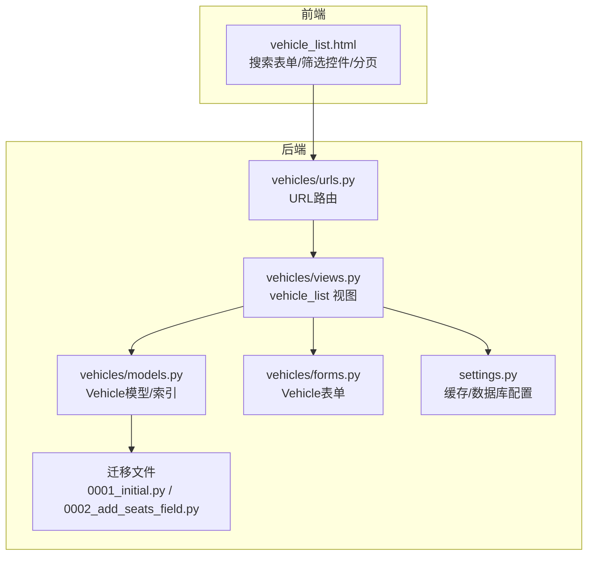
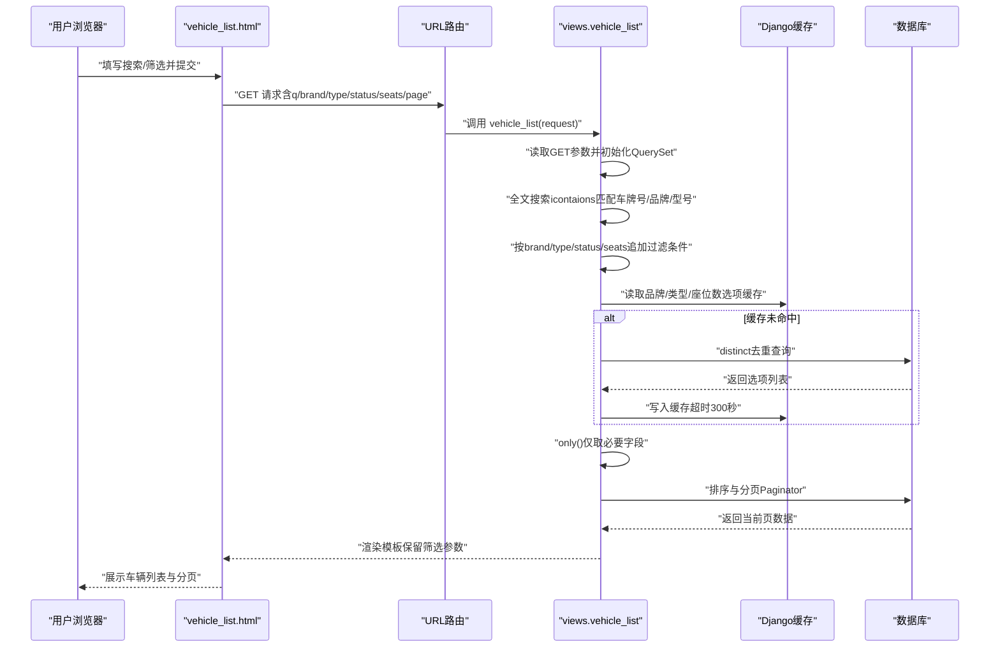
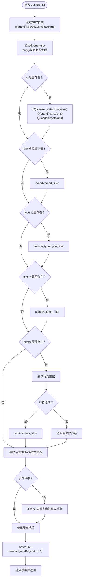
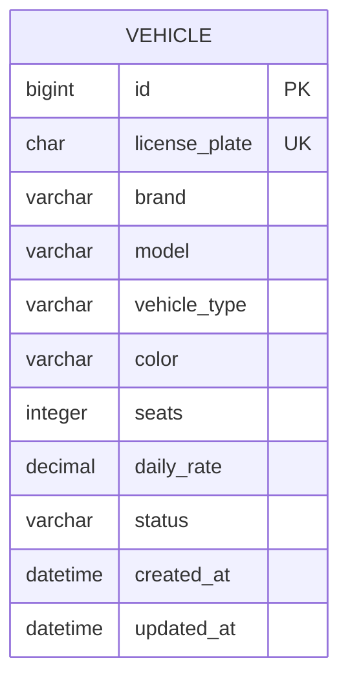
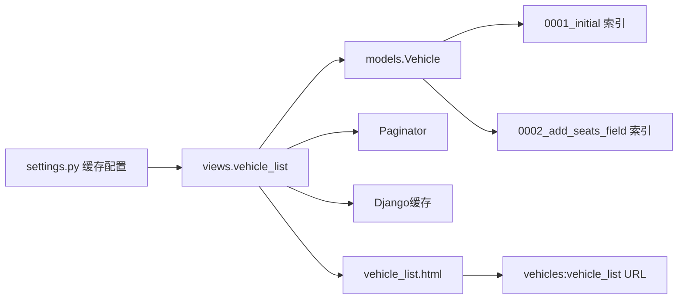

# 车辆搜索与筛选功能

<cite>
**本文引用的文件**
- [views.py](file://code/car_rental_system/vehicles/views.py)
- [models.py](file://code/car_rental_system/vehicles/models.py)
- [vehicle_list.html](file://code/car_rental_system/templates/vehicles/vehicle_list.html)
- [urls.py](file://code/car_rental_system/vehicles/urls.py)
- [forms.py](file://code/car_rental_system/vehicles/forms.py)
- [settings.py](file://code/car_rental_system/car_rental_system/settings.py)
- [0001_initial.py](file://code/car_rental_system/vehicles/migrations/0001_initial.py)
- [0002_add_seats_field.py](file://code/car_rental_system/vehicles/migrations/0002_add_seats_field.py)
- [test_vehicle_management.py](file://code/car_rental_system/test_vehicle_management.py)
</cite>

## 目录
1. [简介](#简介)
2. [项目结构](#项目结构)
3. [核心组件](#核心组件)
4. [架构总览](#架构总览)
5. [详细组件分析](#详细组件分析)
6. [依赖关系分析](#依赖关系分析)
7. [性能考量](#性能考量)
8. [故障排查指南](#故障排查指南)
9. [结论](#结论)
10. [附录](#附录)

## 简介
本文件围绕“车辆搜索与筛选”功能展开，系统性说明 vehicle_list 视图如何接收并解析多参数查询（q、brand、type、status、seats），如何基于这些参数动态构建 QuerySet 实现多条件过滤；解释全文搜索逻辑（icontaions 模糊匹配）对车牌号、品牌与型号的支持；梳理筛选下拉框的数据来源（品牌、类型、座位数）及其去重与缓存策略；结合模板中的搜索表单与筛选控件，展示前后端数据交互流程；最后给出性能优化建议（数据库索引、only 字段选择、分页协同）以及实际代码示例路径。

## 项目结构
车辆搜索与筛选功能主要涉及以下模块：
- 视图层：vehicles/views.py 中的 vehicle_list 视图负责接收查询参数、构建 QuerySet、分页与渲染模板。
- 模型层：vehicles/models.py 定义 Vehicle 模型及数据库索引，支撑查询性能。
- 模板层：vehicles/vehicle_list.html 提供搜索表单与筛选控件，并渲染分页。
- URL 层：vehicles/urls.py 将请求路由到对应视图。
- 配置层：car_rental_system/settings.py 配置了缓存与数据库连接池，提升性能。
- 迁移层：0001_initial.py 与 0002_add_seats_field.py 定义了基础索引与座位数索引，保障查询效率。

图表来源
- [vehicle_list.html](file://code/car_rental_system/templates/vehicles/vehicle_list.html#L1-L233)
- [urls.py](file://code/car_rental_system/vehicles/urls.py#L1-L18)
- [views.py](file://code/car_rental_system/vehicles/views.py#L42-L136)
- [models.py](file://code/car_rental_system/vehicles/models.py#L1-L85)
- [settings.py](file://code/car_rental_system/car_rental_system/settings.py#L141-L151)
- [0001_initial.py](file://code/car_rental_system/vehicles/migrations/0001_initial.py#L1-L39)
- [0002_add_seats_field.py](file://code/car_rental_system/vehicles/migrations/0002_add_seats_field.py#L1-L32)

章节来源
- [vehicle_list.html](file://code/car_rental_system/templates/vehicles/vehicle_list.html#L1-L233)
- [urls.py](file://code/car_rental_system/vehicles/urls.py#L1-L18)
- [views.py](file://code/car_rental_system/vehicles/views.py#L42-L136)
- [models.py](file://code/car_rental_system/vehicles/models.py#L1-L85)
- [settings.py](file://code/car_rental_system/car_rental_system/settings.py#L141-L151)
- [0001_initial.py](file://code/car_rental_system/vehicles/migrations/0001_initial.py#L1-L39)
- [0002_add_seats_field.py](file://code/car_rental_system/vehicles/migrations/0002_add_seats_field.py#L1-L32)

## 核心组件
- vehicle_list 视图：接收 GET 参数 q、brand、type、status、seats，构建 QuerySet 并进行多条件过滤；使用 only() 仅取必要字段；通过缓存框架减少品牌、类型、座位数选项的数据库查询；使用 Paginator 实现分页。
- Vehicle 模型：定义字段与索引，包含 license_plate、brand、model、vehicle_type、color、seats、daily_rate、status、created_at 等；Meta 中定义了多个数据库索引，显著提升查询性能。
- vehicle_list.html 模板：提供搜索表单与筛选控件（品牌、类型、座位数、状态），并在分页区域保留所有筛选参数，确保翻页不丢失筛选条件。
- settings.py 缓存配置：默认使用内存缓存 LocMemCache，超时 300 秒，适合开发与小规模生产环境。
- 迁移文件：0001_initial.py 初始索引（license_plate、status、brand+model），0002_add_seats_field.py 为 seats 字段添加索引，进一步优化座位数筛选。

章节来源
- [views.py](file://code/car_rental_system/vehicles/views.py#L42-L136)
- [models.py](file://code/car_rental_system/vehicles/models.py#L1-L85)
- [vehicle_list.html](file://code/car_rental_system/templates/vehicles/vehicle_list.html#L1-L233)
- [settings.py](file://code/car_rental_system/car_rental_system/settings.py#L141-L151)
- [0001_initial.py](file://code/car_rental_system/vehicles/migrations/0001_initial.py#L1-L39)
- [0002_add_seats_field.py](file://code/car_rental_system/vehicles/migrations/0002_add_seats_field.py#L1-L32)

## 架构总览
下面的序列图展示了用户在 vehicle_list 页面提交搜索与筛选请求后的完整流程，包括参数解析、QuerySet 构建、缓存读写、分页与模板渲染。

图表来源
- [vehicle_list.html](file://code/car_rental_system/templates/vehicles/vehicle_list.html#L1-L233)
- [urls.py](file://code/car_rental_system/vehicles/urls.py#L1-L18)
- [views.py](file://code/car_rental_system/vehicles/views.py#L42-L136)
- [settings.py](file://code/car_rental_system/car_rental_system/settings.py#L141-L151)

## 详细组件分析

### vehicle_list 视图：多参数查询与动态 QuerySet 构建
- 参数接收与初始化
  - 读取 q、brand、type、status、seats、page 等 GET 参数。
  - 使用 only() 仅选择必要字段，避免不必要的数据传输与序列化开销。
- 全文搜索逻辑（icontaions）
  - 当 q 存在时，对 license_plate、brand、model 同时进行 icontaions 模糊匹配，并通过 Q 对象组合。
- 多条件过滤
  - brand/type/status 分别作为独立过滤条件；seats 在存在且可解析为整数时生效。
  - 对 seats 的异常处理（字段不存在或非整数）保证健壮性。
- 缓存优化（品牌/类型/座位数）
  - 使用 Django 缓存框架，键名分别为 vehicle_brands_list、vehicle_types_list、vehicle_seats_list。
  - 若缓存未命中，执行 distinct 去重查询并写入缓存，超时 300 秒。
  - 座位数选项在字段不存在时回退为空列表，避免异常。
- 排序与分页
  - 先按 created_at 降序排序，再使用 Paginator 每页 10 条。
  - 分页链接保留所有筛选参数，确保翻页不丢失条件。
- 上下文传递
  - 返回 vehicles、brands、types、seats_options、各筛选参数值给模板。

图表来源
- [views.py](file://code/car_rental_system/vehicles/views.py#L42-L136)

章节来源
- [views.py](file://code/car_rental_system/vehicles/views.py#L42-L136)

### Vehicle 模型与数据库索引
- 字段与约束
  - 包含 license_plate（唯一）、brand、model、vehicle_type、color、seats、daily_rate、status、created_at、updated_at。
  - status 使用 Choice 枚举，便于前端展示与筛选。
- 数据库索引（关键点）
  - license_plate：唯一索引，加速唯一性校验与按车牌号查询。
  - status：索引，加速按状态筛选。
  - brand+model：联合索引，优化品牌与型号组合查询。
  - seats：索引，优化座位数筛选。
- 排序默认
  - ordering = ['-created_at']，与视图排序一致，减少额外排序成本。

图表来源
- [models.py](file://code/car_rental_system/vehicles/models.py#L1-L85)
- [0001_initial.py](file://code/car_rental_system/vehicles/migrations/0001_initial.py#L1-L39)
- [0002_add_seats_field.py](file://code/car_rental_system/vehicles/migrations/0002_add_seats_field.py#L1-L32)

章节来源
- [models.py](file://code/car_rental_system/vehicles/models.py#L1-L85)
- [0001_initial.py](file://code/car_rental_system/vehicles/migrations/0001_initial.py#L1-L39)
- [0002_add_seats_field.py](file://code/car_rental_system/vehicles/migrations/0002_add_seats_field.py#L1-L32)

### 模板：搜索表单与筛选控件
- 搜索输入框（q）：支持按车牌号、品牌、型号进行模糊匹配。
- 品牌/类型/座位数/状态下拉框：与视图参数一一对应，初始值来自上下文。
- 分页区域：保留所有筛选参数，点击上一页/下一页/页码时自动拼接参数。
- 列表展示：包含 license_plate、brand/model、vehicle_type、seats、color、daily_rate、status、created_at 等字段。

章节来源
- [vehicle_list.html](file://code/car_rental_system/templates/vehicles/vehicle_list.html#L1-L233)

### URL 路由与视图绑定
- URL 模式 vehicles/... 与 views 中的 index、vehicle_list、vehicle_detail、vehicle_create、vehicle_update、vehicle_delete、vehicle_status_update 对应。
- vehicle_list 通过 vehicles/vehicles/ 路由访问。

章节来源
- [urls.py](file://code/car_rental_system/vehicles/urls.py#L1-L18)

### 缓存配置与策略
- settings.py 中配置默认缓存为 LocMemCache，TIMEOUT=300 秒，适合开发与小规模生产。
- 视图中针对品牌、类型、座位数分别设置缓存键，避免重复查询 distinct 结果。
- 新增/更新/删除车辆后清除相关缓存键，保证筛选选项一致性。

章节来源
- [settings.py](file://code/car_rental_system/car_rental_system/settings.py#L141-L151)
- [views.py](file://code/car_rental_system/vehicles/views.py#L198-L210)
- [views.py](file://code/car_rental_system/vehicles/views.py#L225-L241)
- [views.py](file://code/car_rental_system/vehicles/views.py#L255-L286)

### 表单与数据清洗（补充）
- VehicleForm 对 license_plate 唯一性校验、brand/model/color 去空白、seats/daily_rate 数值范围校验、status 选择项等进行清洗与验证。
- 保存时统一清理前后空格，确保数据质量。

章节来源
- [forms.py](file://code/car_rental_system/vehicles/forms.py#L1-L153)

## 依赖关系分析
- 视图依赖
  - 依赖 Vehicle 模型进行查询与排序。
  - 依赖 Django 缓存框架进行筛选选项缓存。
  - 依赖 Paginator 进行分页。
  - 依赖模板渲染上下文。
- 模板依赖
  - 依赖 URL 名称 vehicles:vehicle_list 生成分页链接。
  - 依赖上下文变量 brands、types、seats_options、query、brand_filter、type_filter、status_filter、seats_filter。
- 数据库依赖
  - 依赖迁移文件中定义的索引，确保查询性能。
- 配置依赖
  - 依赖 settings.py 中的缓存与数据库连接池配置。

图表来源
- [views.py](file://code/car_rental_system/vehicles/views.py#L42-L136)
- [models.py](file://code/car_rental_system/vehicles/models.py#L1-L85)
- [vehicle_list.html](file://code/car_rental_system/templates/vehicles/vehicle_list.html#L1-L233)
- [urls.py](file://code/car_rental_system/vehicles/urls.py#L1-L18)
- [settings.py](file://code/car_rental_system/car_rental_system/settings.py#L141-L151)
- [0001_initial.py](file://code/car_rental_system/vehicles/migrations/0001_initial.py#L1-L39)
- [0002_add_seats_field.py](file://code/car_rental_system/vehicles/migrations/0002_add_seats_field.py#L1-L32)

章节来源
- [views.py](file://code/car_rental_system/vehicles/views.py#L42-L136)
- [vehicle_list.html](file://code/car_rental_system/templates/vehicles/vehicle_list.html#L1-L233)
- [urls.py](file://code/car_rental_system/vehicles/urls.py#L1-L18)
- [models.py](file://code/car_rental_system/vehicles/models.py#L1-L85)
- [settings.py](file://code/car_rental_system/car_rental_system/settings.py#L141-L151)
- [0001_initial.py](file://code/car_rental_system/vehicles/migrations/0001_initial.py#L1-L39)
- [0002_add_seats_field.py](file://code/car_rental_system/vehicles/migrations/0002_add_seats_field.py#L1-L32)

## 性能考量
- 数据库索引
  - 已为 license_plate、status、brand+model、seats 建立索引，可显著提升按状态、品牌、座位数与唯一车牌号的查询性能。
  - 建议在高并发场景下评估是否需要为常用组合（如 status+brand、status+seats）建立复合索引。
- 字段选择优化
  - 使用 only() 仅取必要字段（如 id、license_plate、brand、model、vehicle_type、color、seats、daily_rate、status、created_at），减少序列化与网络传输开销。
- 缓存策略
  - 品牌、类型、座位数选项缓存 300 秒，降低 distinct 查询频率；新增/更新/删除车辆后主动清除缓存键，保证一致性。
- 分页与筛选协同
  - 分页前先排序，避免重复排序；分页链接保留筛选参数，提升用户体验与查询稳定性。
- 数据库连接池
  - settings.py 中为 SQLite 配置了超时参数，有助于缓解锁等待问题。

章节来源
- [models.py](file://code/car_rental_system/vehicles/models.py#L68-L85)
- [views.py](file://code/car_rental_system/vehicles/views.py#L51-L55)
- [views.py](file://code/car_rental_system/vehicles/views.py#L90-L122)
- [settings.py](file://code/car_rental_system/car_rental_system/settings.py#L153-L157)

## 故障排查指南
- 全文搜索无结果
  - 检查 q 是否为空；确认 license_plate、brand、model 是否存在 icontaions 匹配。
  - 参考路径：[views.py](file://code/car_rental_system/vehicles/views.py#L61-L66)
- 座位数筛选无效
  - 确认 seats 参数是否为整数；若 seats 字段不存在或迁移未应用，将忽略该筛选。
  - 参考路径：[views.py](file://code/car_rental_system/vehicles/views.py#L78-L86)
- 筛选项为空
  - 缓存未命中时会触发 distinct 查询；若字段不存在则返回空列表。
  - 参考路径：[views.py](file://code/car_rental_system/vehicles/views.py#L110-L122)
- 分页链接丢失筛选条件
  - 模板分页链接需保留 q、brand、type、seats、status 参数；检查模板中拼接逻辑。
  - 参考路径：[vehicle_list.html](file://code/car_rental_system/templates/vehicles/vehicle_list.html#L185-L233)
- 缓存未生效
  - 确认 settings.py 中 CACHES 配置；检查视图中缓存键与过期时间。
  - 参考路径：[settings.py](file://code/car_rental_system/car_rental_system/settings.py#L141-L151)
- 新增/更新/删除后筛选选项不同步
  - 确认在新增/更新/删除车辆后是否调用了缓存清理逻辑。
  - 参考路径：[views.py](file://code/car_rental_system/vehicles/views.py#L205-L210)、[views.py](file://code/car_rental_system/vehicles/views.py#L234-L239)、[views.py](file://code/car_rental_system/vehicles/views.py#L272-L277)

章节来源
- [views.py](file://code/car_rental_system/vehicles/views.py#L61-L86)
- [views.py](file://code/car_rental_system/vehicles/views.py#L110-L122)
- [vehicle_list.html](file://code/car_rental_system/templates/vehicles/vehicle_list.html#L185-L233)
- [settings.py](file://code/car_rental_system/car_rental_system/settings.py#L141-L151)

## 结论
该功能通过“参数解析 + 动态 QuerySet + 缓存 + 分页”的组合，实现了高效、稳定的车辆搜索与筛选体验。数据库索引与 only() 字段选择进一步提升了性能；缓存策略降低了重复查询成本；模板保留筛选参数的分页设计增强了用户体验。建议在生产环境中结合业务量评估复合索引与缓存容量，并持续监控查询性能与缓存命中率。

## 附录
- 关键实现路径参考
  - 视图入口与参数处理：[views.py](file://code/car_rental_system/vehicles/views.py#L42-L136)
  - 全文搜索与多条件过滤：[views.py](file://code/car_rental_system/vehicles/views.py#L61-L86)
  - 缓存策略与筛选选项：[views.py](file://code/car_rental_system/vehicles/views.py#L90-L122)
  - 分页与筛选协同：[views.py](file://code/car_rental_system/vehicles/views.py#L104-L108)、[vehicle_list.html](file://code/car_rental_system/templates/vehicles/vehicle_list.html#L185-L233)
  - 数据库索引与模型定义：[models.py](file://code/car_rental_system/vehicles/models.py#L68-L85)、[0001_initial.py](file://code/car_rental_system/vehicles/migrations/0001_initial.py#L1-L39)、[0002_add_seats_field.py](file://code/car_rental_system/vehicles/migrations/0002_add_seats_field.py#L1-L32)
  - 模板表单与分页：[vehicle_list.html](file://code/car_rental_system/templates/vehicles/vehicle_list.html#L1-L233)
  - URL 路由绑定：[urls.py](file://code/car_rental_system/vehicles/urls.py#L1-L18)
  - 缓存配置：[settings.py](file://code/car_rental_system/car_rental_system/settings.py#L141-L151)
  - 表单清洗与验证：[forms.py](file://code/car_rental_system/vehicles/forms.py#L1-L153)
  - 测试用例（查询与搜索）：[test_vehicle_management.py](file://code/car_rental_system/test_vehicle_management.py#L90-L108)