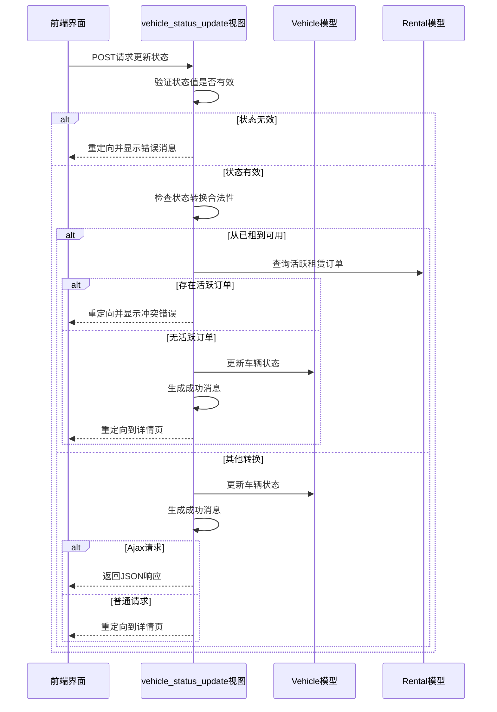
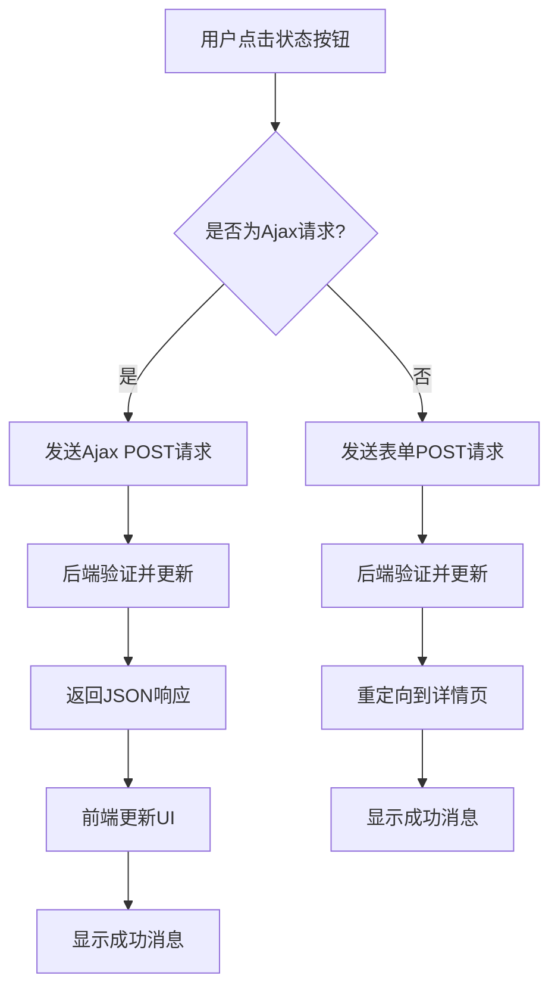

# 车辆状态管理

<cite>
**本文档引用文件**  
- [models.py](file://code/car_rental_system/vehicles/models.py)
- [views.py](file://code/car_rental_system/vehicles/views.py)
- [vehicle_detail.html](file://code/car_rental_system/templates/vehicles/vehicle_detail.html)
- [main.js](file://code/car_rental_system/static/js/main.js)
- [urls.py](file://code/car_rental_system/vehicles/urls.py)
</cite>

## 目录
1. [引言](#引言)
2. [车辆状态定义](#车辆状态定义)
3. [状态转换规则](#状态转换规则)
4. [状态更新视图实现](#状态更新视图实现)
5. [前端交互设计](#前端交互设计)
6. [前后端协同工作流程](#前后端协同工作流程)
7. [错误处理策略](#错误处理策略)
8. [总结](#总结)

## 引言
车辆状态管理是租车管理系统中的核心功能之一，用于跟踪和控制每辆车的可用性。本系统定义了三种车辆状态：可用、已租和维修中。通过车辆详情页面的状态管理组件，管理员可以快速更新车辆状态，系统会自动验证状态变更的合法性并处理相关业务逻辑。该功能结合了Django后端视图和前端JavaScript代码，实现了同步和异步两种更新方式，确保了用户体验的流畅性和数据的一致性。

## 车辆状态定义
系统在`Vehicle`模型中定义了`VEHICLE_STATUS_CHOICES`枚举，包含三种状态选项：

- **AVAILABLE（可用）**：车辆当前空闲，可供客户租赁
- **RENTED（已租）**：车辆已被客户租用，处于使用中状态
- **MAINTENANCE（维修中）**：车辆正在进行维护或修理，暂时不可用

这些状态在数据库中以英文代码存储，但在用户界面中显示为中文描述，实现了国际化支持。

**Section sources**
- [models.py](file://code/car_rental_system/vehicles/models.py#L7-L10)

## 状态转换规则
系统实施了严格的状态转换规则，确保业务逻辑的正确性：

1. **可用 → 已租**：允许转换，表示车辆被成功租出
2. **可用 → 维修中**：允许转换，表示车辆需要进行维护
3. **已租 → 维修中**：允许转换，表示租用中的车辆需要紧急维修
4. **维修中 → 可用**：允许转换，表示车辆维护完成，重新投入使用
5. **维修中 → 已租**：允许转换，表示维护完成的车辆直接被租用
6. **已租 → 可用**：**有条件允许**，仅当车辆没有活跃的租赁订单时才可转换

特别地，从"已租"状态直接转换为"可用"状态受到严格限制，必须确保没有正在进行的租赁订单，防止数据不一致。

**Section sources**
- [views.py](file://code/car_rental_system/vehicles/views.py#L302-L308)

## 状态更新视图实现
`vehicle_status_update`视图处理车辆状态的更新请求，实现了完整的业务逻辑验证和数据持久化。

**Diagram sources**
- [views.py](file://code/car_rental_system/vehicles/views.py#L289-L322)

**Section sources**
- [views.py](file://code/car_rental_system/vehicles/views.py#L289-L322)

## 前端交互设计
前端通过`vehicle_detail.html`模板中的状态管理组件提供直观的用户界面，结合JavaScript实现流畅的交互体验。

### 状态徽章颜色编码
系统使用不同的颜色来直观表示车辆状态：
- **绿色**：可用状态，表示车辆可租
- **红色**：已租状态，表示车辆已被占用
- **黄色**：维修中状态，表示车辆暂时不可用

### 按钮交互设计
状态更新按钮组采用禁用模式防止无效操作：
- 当前状态对应的按钮被禁用，防止重复设置相同状态
- 其他状态按钮可点击，允许状态变更
- 按钮点击后触发`updateVehicleStatus`函数处理更新

### 成功消息提示
状态更新成功后，系统通过Django消息框架显示成功提示，告知用户状态变更详情。对于Ajax请求，前端会接收JSON响应并可能显示更精细的成功通知。

**Diagram sources**
- [vehicle_detail.html](file://code/car_rental_system/templates/vehicles/vehicle_detail.html#L104-L118)
- [main.js](file://code/car_rental_system/static/js/main.js)

**Section sources**
- [vehicle_detail.html](file://code/car_rental_system/templates/vehicles/vehicle_detail.html#L83-L120)

## 前后端协同工作流程
车辆状态更新功能通过前后端紧密协作实现，确保数据一致性和用户体验。

### URL路由配置
系统在`vehicles/urls.py`中配置了状态更新的URL模式，将`/vehicles/<int:pk>/status/`路径映射到`vehicle_status_update`视图。

**Section sources**
- [urls.py](file://code/car_rental_system/vehicles/urls.py#L17)

### 表单提交流程
1. 用户在车辆详情页面点击状态更新按钮
2. 前端JavaScript收集车辆ID和目标状态
3. 发送POST请求到状态更新视图
4. 后端验证请求并执行状态变更逻辑
5. 根据请求类型返回相应响应（重定向或JSON）
6. 前端根据响应更新界面状态

### Ajax异步支持
视图通过检查`X-Requested-With`请求头来识别Ajax请求，对于Ajax请求返回JSON格式的成功响应，允许前端实现无刷新的状态更新，提升用户体验。

## 错误处理策略
系统实现了多层次的错误处理机制，确保数据完整性和用户友好性。

### 状态合法性验证
首先验证请求中的状态值是否属于预定义的状态选项，防止非法状态值的注入。

### 活跃订单冲突检测
当尝试将"已租"车辆设为"可用"时，系统会查询是否存在状态为"ONGOING"的活跃租赁订单，如果存在则阻止状态变更并提示用户。

### 用户反馈机制
系统使用Django的消息框架向用户反馈操作结果：
- 成功操作：显示绿色成功消息，包含状态变更详情
- 失败操作：显示红色错误消息，解释失败原因
- 消息在页面重定向后仍然可见，确保用户收到反馈

**Section sources**
- [views.py](file://code/car_rental_system/vehicles/views.py#L297-L308)

## 总结
车辆状态管理功能通过精心设计的状态枚举、严格的转换规则和完善的前后端协作，实现了对车辆生命周期的有效控制。系统不仅提供了直观的用户界面，还通过Ajax支持实现了流畅的交互体验。状态变更时的合法性验证和冲突检测确保了数据的一致性和业务逻辑的正确性。该功能是租车管理系统的核心组成部分，为车辆调度、租赁管理和维护计划提供了可靠的数据基础。