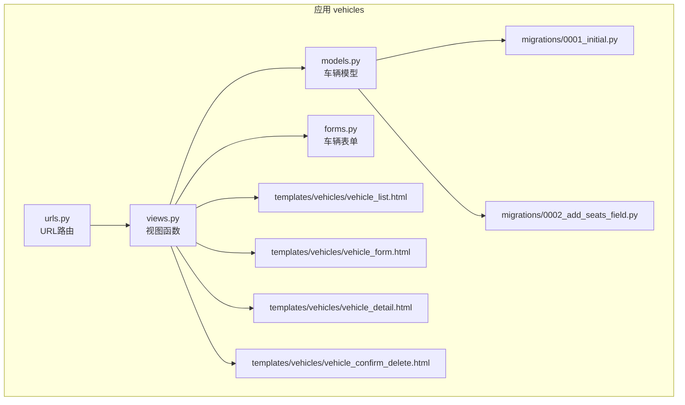
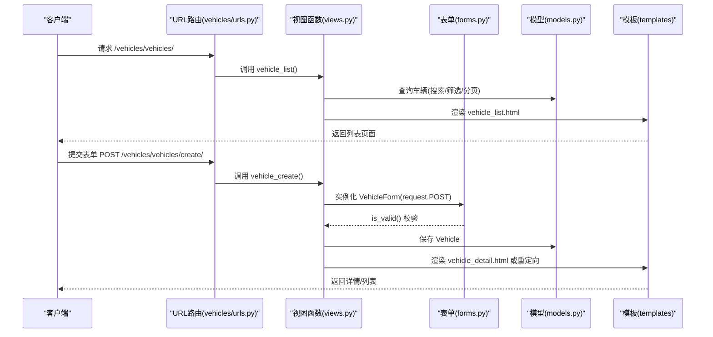
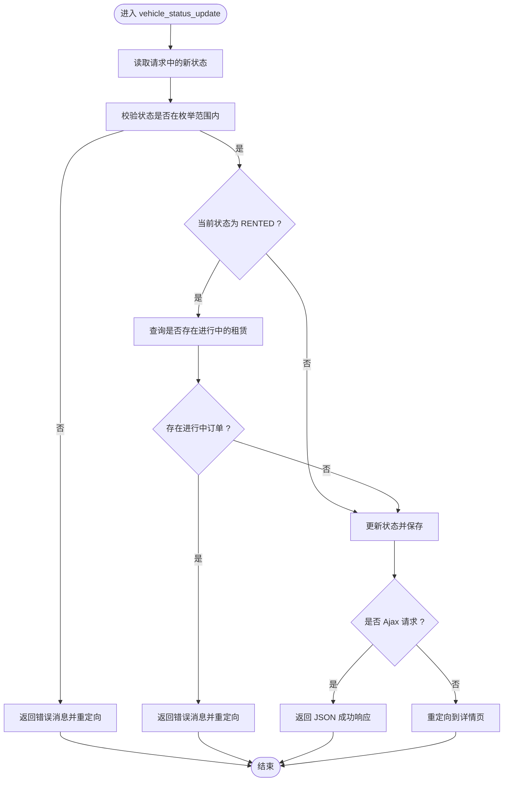
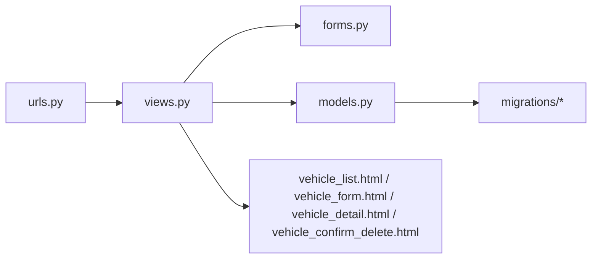

# 车辆管理模块

<cite>
**本文引用的文件**
- [models.py](file://code/car_rental_system/vehicles/models.py)
- [forms.py](file://code/car_rental_system/vehicles/forms.py)
- [views.py](file://code/car_rental_system/vehicles/views.py)
- [urls.py](file://code/car_rental_system/vehicles/urls.py)
- [vehicle_list.html](file://code/car_rental_system/templates/vehicles/vehicle_list.html)
- [vehicle_form.html](file://code/car_rental_system/templates/vehicles/vehicle_form.html)
- [vehicle_detail.html](file://code/car_rental_system/templates/vehicles/vehicle_detail.html)
- [vehicle_confirm_delete.html](file://code/car_rental_system/templates/vehicles/vehicle_confirm_delete.html)
- [0001_initial.py](file://code/car_rental_system/vehicles/migrations/0001_initial.py)
- [0002_add_seats_field.py](file://code/car_rental_system/vehicles/migrations/0002_add_seats_field.py)
- [test_vehicle_management.py](file://code/car_rental_system/test_vehicle_management.py)
- [车辆管理功能开发完成报告.md](file://code/car_rental_system/车辆管理功能开发完成报告.md)
</cite>

## 目录
1. [简介](#简介)
2. [项目结构](#项目结构)
3. [核心组件](#核心组件)
4. [架构总览](#架构总览)
5. [详细组件分析](#详细组件分析)
6. [依赖关系分析](#依赖关系分析)
7. [性能考量](#性能考量)
8. [故障排查指南](#故障排查指南)
9. [结论](#结论)
10. [附录](#附录)

## 简介
本文件面向开发与运维人员，系统化梳理“车辆管理模块”的实现细节，覆盖车辆信息的增删改查全流程；解释 Vehicle 模型字段的业务含义与验证规则；阐述车辆状态机（可用、已租、维修中）的转换逻辑与实现方式；说明前端模板与后端视图的交互机制，以及搜索筛选功能的技术实现；并结合测试与开发报告中的实现细节，提供可操作的排障与优化建议。

## 项目结构
车辆管理模块位于应用 vehicles 下，采用典型的 Django 分层组织：模型（models）、表单（forms）、视图（views）、URL 路由（urls）与模板（templates）。迁移文件定义了数据库结构与索引策略；测试脚本验证核心功能；开发报告提供了整体实现说明与使用指引。

**图表来源**
- [models.py](file://code/car_rental_system/vehicles/models.py#L1-L85)
- [forms.py](file://code/car_rental_system/vehicles/forms.py#L1-L153)
- [views.py](file://code/car_rental_system/vehicles/views.py#L1-L322)
- [urls.py](file://code/car_rental_system/vehicles/urls.py#L1-L18)
- [vehicle_list.html](file://code/car_rental_system/templates/vehicles/vehicle_list.html#L1-L233)
- [vehicle_form.html](file://code/car_rental_system/templates/vehicles/vehicle_form.html#L1-L200)
- [vehicle_detail.html](file://code/car_rental_system/templates/vehicles/vehicle_detail.html#L1-L350)
- [vehicle_confirm_delete.html](file://code/car_rental_system/templates/vehicles/vehicle_confirm_delete.html#L1-L148)
- [0001_initial.py](file://code/car_rental_system/vehicles/migrations/0001_initial.py#L1-L39)
- [0002_add_seats_field.py](file://code/car_rental_system/vehicles/migrations/0002_add_seats_field.py#L1-L32)

**章节来源**
- [models.py](file://code/car_rental_system/vehicles/models.py#L1-L85)
- [forms.py](file://code/car_rental_system/vehicles/forms.py#L1-L153)
- [views.py](file://code/car_rental_system/vehicles/views.py#L1-L322)
- [urls.py](file://code/car_rental_system/vehicles/urls.py#L1-L18)
- [vehicle_list.html](file://code/car_rental_system/templates/vehicles/vehicle_list.html#L1-L233)
- [vehicle_form.html](file://code/car_rental_system/templates/vehicles/vehicle_form.html#L1-L200)
- [vehicle_detail.html](file://code/car_rental_system/templates/vehicles/vehicle_detail.html#L1-L350)
- [vehicle_confirm_delete.html](file://code/car_rental_system/templates/vehicles/vehicle_confirm_delete.html#L1-L148)
- [0001_initial.py](file://code/car_rental_system/vehicles/migrations/0001_initial.py#L1-L39)
- [0002_add_seats_field.py](file://code/car_rental_system/vehicles/migrations/0002_add_seats_field.py#L1-L32)

## 核心组件
- 模型层：Vehicle 定义了车牌号、品牌、型号、车辆类型、颜色、座位数、日租金、状态、创建/更新时间等字段，并内置状态枚举与索引。
- 表单层：VehicleForm 对字段进行前端渲染、标签、帮助文本与验证规则，包含车牌号唯一性、日租金范围、座位数范围、字符串清洗等。
- 视图层：提供首页、列表、详情、创建、更新、删除、状态更新等视图；实现搜索/筛选/分页、缓存、统计与消息提示。
- 模板层：vehicle_list.html、vehicle_form.html、vehicle_detail.html、vehicle_confirm_delete.html 完成页面渲染与交互。
- 路由层：vehicles/urls.py 将 URL 与视图绑定。
- 迁移层：0001_initial.py 定义初始表结构与索引；0002_add_seats_field.py 添加 seats 字段并建立索引。

**章节来源**
- [models.py](file://code/car_rental_system/vehicles/models.py#L1-L85)
- [forms.py](file://code/car_rental_system/vehicles/forms.py#L1-L153)
- [views.py](file://code/car_rental_system/vehicles/views.py#L1-L322)
- [urls.py](file://code/car_rental_system/vehicles/urls.py#L1-L18)
- [vehicle_list.html](file://code/car_rental_system/templates/vehicles/vehicle_list.html#L1-L233)
- [vehicle_form.html](file://code/car_rental_system/templates/vehicles/vehicle_form.html#L1-L200)
- [vehicle_detail.html](file://code/car_rental_system/templates/vehicles/vehicle_detail.html#L1-L350)
- [vehicle_confirm_delete.html](file://code/car_rental_system/templates/vehicles/vehicle_confirm_delete.html#L1-L148)
- [0001_initial.py](file://code/car_rental_system/vehicles/migrations/0001_initial.py#L1-L39)
- [0002_add_seats_field.py](file://code/car_rental_system/vehicles/migrations/0002_add_seats_field.py#L1-L32)

## 架构总览
车辆管理模块遵循 MVC（Model-View-Template）模式，前后端通过 URL 路由与模板渲染协作，数据通过 ORM 层持久化。

**图表来源**
- [urls.py](file://code/car_rental_system/vehicles/urls.py#L1-L18)
- [views.py](file://code/car_rental_system/vehicles/views.py#L1-L322)
- [forms.py](file://code/car_rental_system/vehicles/forms.py#L1-L153)
- [models.py](file://code/car_rental_system/vehicles/models.py#L1-L85)
- [vehicle_list.html](file://code/car_rental_system/templates/vehicles/vehicle_list.html#L1-L233)
- [vehicle_form.html](file://code/car_rental_system/templates/vehicles/vehicle_form.html#L1-L200)

## 详细组件分析

### Vehicle 模型与字段语义
- 字段与业务含义
  - license_plate：车辆唯一标识，数据库唯一约束，用于精确识别与关联。
  - brand/model/vehicle_type/color：车辆基本信息，支撑搜索与筛选。
  - seats：座位数，默认值与最小值校验，支持按座位数筛选。
  - daily_rate：日租金，最小值校验，确保正数。
  - status：车辆状态，枚举值 AVAILABLE/RENTED/MAINTENANCE。
  - created_at/updated_at：时间戳，用于排序与审计。
- 索引与排序
  - 为 license_plate、status、brand+model、seats 建立索引，提升查询与筛选性能。
  - 默认按创建时间倒序排列，便于查看最新车辆。
- 状态机与转换规则
  - 状态集合：AVAILABLE、RENTED、MAINTENANCE。
  - 转换限制：
    - 将状态从 RENTED 设为 AVAILABLE 时，需确保无进行中的租赁订单。
    - 删除车辆前需检查是否存在活跃的租赁订单，否则禁止删除。
  - 状态更新接口支持 Ajax 异步更新，返回 JSON。

**章节来源**
- [models.py](file://code/car_rental_system/vehicles/models.py#L1-L85)
- [0001_initial.py](file://code/car_rental_system/vehicles/migrations/0001_initial.py#L1-L39)
- [0002_add_seats_field.py](file://code/car_rental_system/vehicles/migrations/0002_add_seats_field.py#L1-L32)
- [views.py](file://code/car_rental_system/vehicles/views.py#L289-L322)

### VehicleForm 表单验证与清洗
- 字段渲染与标签
  - 使用 Bootstrap 控件与中文标签/帮助文本，统一 UI 体验。
- 关键验证规则
  - 车牌号唯一性：新增与编辑均校验，排除自身主键。
  - 日租金：必须为正数且不超过上限。
  - 座位数：范围 2-50。
  - 字符串清洗：去除首尾空白，避免脏数据入库。
- 保存行为
  - 在 commit=True 时调用实例保存，保证清洗后的数据写入数据库。

**章节来源**
- [forms.py](file://code/car_rental_system/vehicles/forms.py#L1-L153)

### 视图层：CRUD 与状态管理
- 首页 index：聚合统计各状态车辆数量与最近添加车辆。
- 列表 vehicle_list：支持关键词搜索（车牌号/品牌/型号）、多维筛选（品牌、类型、状态、座位数）、分页与缓存。
- 详情 vehicle_detail：展示车辆信息、相关租赁统计与评价分布、最近评价与租赁历史。
- 创建 vehicle_create：GET 显示表单，POST 校验并保存，成功后跳转详情并清除相关缓存。
- 更新 vehicle_update：同上，支持编辑现有车辆。
- 删除 vehicle_delete：检查是否存在活跃租赁订单，若存在则阻止删除并提示；否则删除并清除缓存。
- 状态更新 vehicle_status_update：校验新状态合法性，必要时检查活跃租赁，支持 Ajax 返回 JSON。

**图表来源**
- [views.py](file://code/car_rental_system/vehicles/views.py#L289-L322)

**章节来源**
- [views.py](file://code/car_rental_system/vehicles/views.py#L1-L322)

### 前端模板与交互机制
- vehicle_list.html
  - 搜索与筛选表单：支持 q、brand、type、status、seats 参数，提交后保持筛选状态。
  - 列表表格：展示车牌号、品牌型号、类型、座位数、颜色、日租金、状态、创建时间与操作按钮。
  - 分页：支持上一页/下一页与页码跳转，携带筛选参数。
- vehicle_form.html
  - 共用表单模板，支持创建与编辑；显示字段错误与帮助文本；包含提示信息。
- vehicle_detail.html
  - 展示车辆信息与状态徽章；提供快速状态更新按钮；展示评价统计与分布、最近评价；展示租赁历史。
- vehicle_confirm_delete.html
  - 删除确认页，若存在活跃租赁则阻止删除并给出提示；否则显示风险提示与确认表单。

**章节来源**
- [vehicle_list.html](file://code/car_rental_system/templates/vehicles/vehicle_list.html#L1-L233)
- [vehicle_form.html](file://code/car_rental_system/templates/vehicles/vehicle_form.html#L1-L200)
- [vehicle_detail.html](file://code/car_rental_system/templates/vehicles/vehicle_detail.html#L1-L350)
- [vehicle_confirm_delete.html](file://code/car_rental_system/templates/vehicles/vehicle_confirm_delete.html#L1-L148)

### 搜索与筛选技术实现
- 搜索：对 license_plate、brand、model 进行不区分大小写的模糊匹配。
- 筛选：按 brand、vehicle_type、status、seats（可选）过滤。
- 性能优化：
  - 使用 only() 仅选择必要字段，减少查询负载。
  - 使用缓存存储品牌、类型、座位数选项，降低重复查询成本。
  - 使用 Paginator 分页，避免一次性加载大量数据。
  - 为常用字段建立数据库索引，加速查询。

**章节来源**
- [views.py](file://code/car_rental_system/vehicles/views.py#L42-L135)
- [0001_initial.py](file://code/car_rental_system/vehicles/migrations/0001_initial.py#L1-L39)
- [0002_add_seats_field.py](file://code/car_rental_system/vehicles/migrations/0002_add_seats_field.py#L1-L32)

### 表单验证、图片上传与状态变更流程（结合测试）
- 表单验证与保存：参考测试脚本中的 VehicleForm 有效性与保存流程，确保字段校验与清洗逻辑正确。
- 图片上传处理：当前仓库未发现车辆图片字段或上传逻辑；如需扩展，可在模型中添加 ImageField 并在表单中增加文件控件，同时在视图中处理文件上传与路径保存。
- 状态变更：通过 vehicle_status_update 接口完成，支持 Ajax 异步更新，返回 JSON。

**章节来源**
- [test_vehicle_management.py](file://code/car_rental_system/test_vehicle_management.py#L1-L171)
- [views.py](file://code/car_rental_system/vehicles/views.py#L289-L322)

## 依赖关系分析
- 视图依赖模型与表单，渲染模板并返回响应。
- URL 路由将请求映射到具体视图。
- 模板依赖视图上下文变量，渲染页面内容。
- 迁移文件定义数据库结构与索引，影响查询性能与可用字段。

**图表来源**
- [urls.py](file://code/car_rental_system/vehicles/urls.py#L1-L18)
- [views.py](file://code/car_rental_system/vehicles/views.py#L1-L322)
- [forms.py](file://code/car_rental_system/vehicles/forms.py#L1-L153)
- [models.py](file://code/car_rental_system/vehicles/models.py#L1-L85)
- [vehicle_list.html](file://code/car_rental_system/templates/vehicles/vehicle_list.html#L1-L233)
- [vehicle_form.html](file://code/car_rental_system/templates/vehicles/vehicle_form.html#L1-L200)
- [vehicle_detail.html](file://code/car_rental_system/templates/vehicles/vehicle_detail.html#L1-L350)
- [vehicle_confirm_delete.html](file://code/car_rental_system/templates/vehicles/vehicle_confirm_delete.html#L1-L148)

**章节来源**
- [urls.py](file://code/car_rental_system/vehicles/urls.py#L1-L18)
- [views.py](file://code/car_rental_system/vehicles/views.py#L1-L322)
- [models.py](file://code/car_rental_system/vehicles/models.py#L1-L85)

## 性能考量
- 数据库层面
  - 为 license_plate、status、brand+model、seats 建立索引，显著提升搜索与筛选效率。
  - 使用 only() 仅取必要字段，减少网络与内存开销。
- 缓存层面
  - 对品牌、类型、座位数选项使用缓存，降低重复查询成本。
- 分页与排序
  - 使用 Paginator 分页，配合排序，避免一次性加载大量数据。
- 视图聚合
  - 首页使用聚合查询统计各状态车辆数量，减少多次查询。

**章节来源**
- [models.py](file://code/car_rental_system/vehicles/models.py#L68-L85)
- [views.py](file://code/car_rental_system/vehicles/views.py#L13-L39)
- [views.py](file://code/car_rental_system/vehicles/views.py#L42-L135)

## 故障排查指南
- 车牌号重复
  - 现象：表单保存时报错。
  - 原因：license_plate 唯一性约束。
  - 处理：修改为唯一值或检查是否为编辑场景（需排除自身主键）。
  - 参考：表单清洗与验证逻辑。
- 日租金非法
  - 现象：日租金小于等于 0 或过大。
  - 原因：未满足最小值或最大值限制。
  - 处理：调整为合法数值。
- 座位数非法
  - 现象：座位数小于 2 或大于 50。
  - 原因：超出允许范围。
  - 处理：调整为 2-50。
- 状态更新失败
  - 现象：将 RENTED 设为 AVAILABLE 时被拒绝。
  - 原因：存在进行中的租赁订单。
  - 处理：先完成或取消相关订单后再更新。
- 删除失败
  - 现象：删除时提示存在活跃租赁订单。
  - 原因：业务规则禁止删除。
  - 处理：将状态改为 MAINTENANCE 或等待订单结束。

**章节来源**
- [forms.py](file://code/car_rental_system/vehicles/forms.py#L87-L153)
- [views.py](file://code/car_rental_system/vehicles/views.py#L255-L287)
- [views.py](file://code/car_rental_system/vehicles/views.py#L289-L322)

## 结论
车辆管理模块以清晰的职责划分与完善的验证机制，实现了车辆信息的全生命周期管理。通过索引、缓存与分页等手段优化查询性能；通过严格的业务规则保障数据一致性；通过 Ajax 与消息提示提升用户体验。开发报告与测试脚本进一步验证了功能的完整性与稳定性。

## 附录
- 开发报告要点摘录：包含视图函数、URL、模板、表单、业务逻辑、安全性与用户体验、代码质量与数据完整性、测试验证等。
- 测试脚本要点：覆盖模型 CRUD、表单验证、查询与统计、业务逻辑（状态与唯一性）。

**章节来源**
- [车辆管理功能开发完成报告.md](file://code/car_rental_system/车辆管理功能开发完成报告.md#L1-L215)
- [test_vehicle_management.py](file://code/car_rental_system/test_vehicle_management.py#L1-L171)