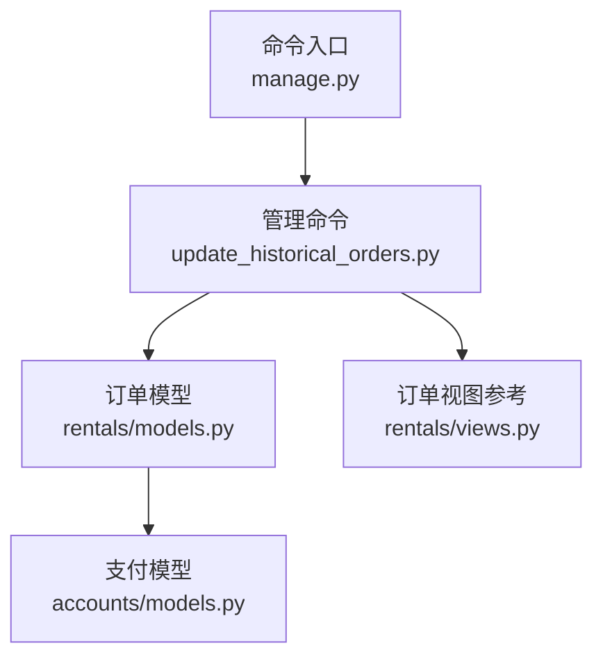
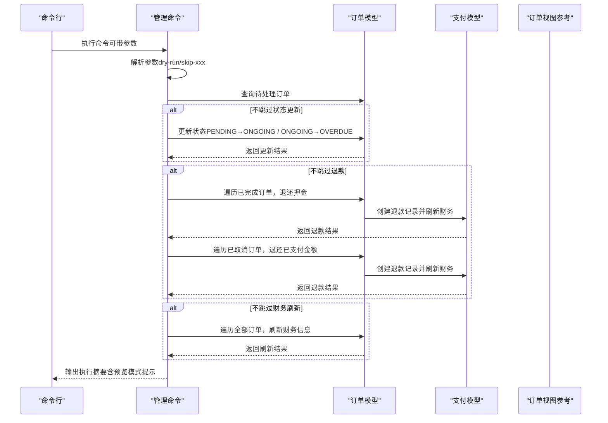
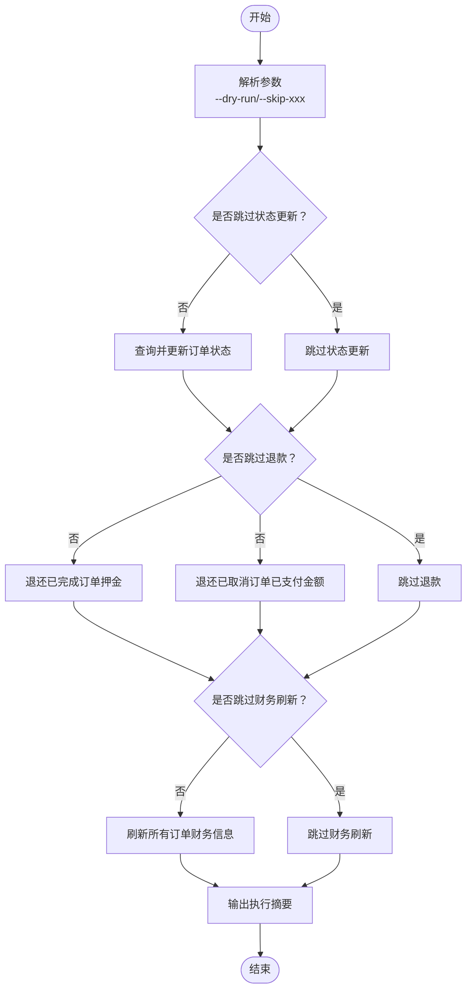
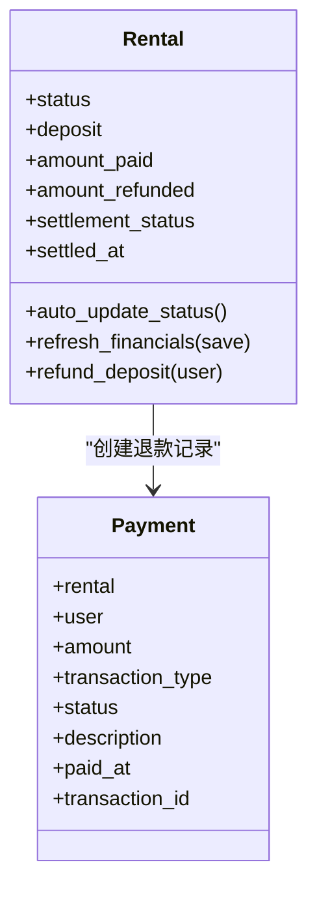
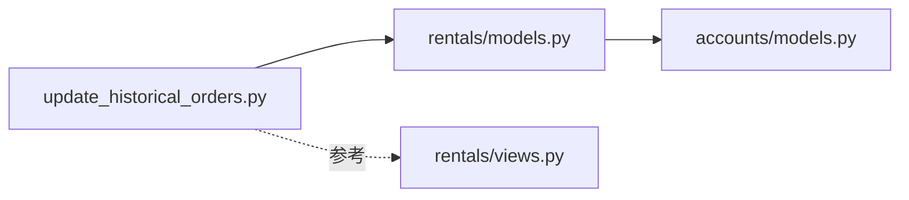

# 批量更新历史订单说明

<cite>
**本文引用的文件**
- [update_historical_orders.py](file://code/car_rental_system/rentals/management/commands/update_historical_orders.py)
- [models.py（订单）](file://code/car_rental_system/rentals/models.py)
- [models.py（支付）](file://code/car_rental_system/accounts/models.py)
- [views.py（订单相关视图）](file://code/car_rental_system/rentals/views.py)
- [批量更新历史订单说明.md](file://code/car_rental_system/批量更新历史订单说明.md)
- [manage.py](file://code/car_rental_system/manage.py)
</cite>

## 目录
1. [简介](#简介)
2. [项目结构](#项目结构)
3. [核心组件](#核心组件)
4. [架构概览](#架构概览)
5. [详细组件分析](#详细组件分析)
6. [依赖关系分析](#依赖关系分析)
7. [性能考量](#性能考量)
8. [故障排查指南](#故障排查指南)
9. [结论](#结论)
10. [附录](#附录)

## 简介
本说明面向系统管理员，提供“批量更新历史订单”管理命令的完整操作指南。该命令用于统一修复历史订单状态、处理退款（已完成订单的押金、已取消订单的已支付金额）以及刷新财务信息，帮助在系统迁移、数据修复或历史遗留问题处理时快速恢复数据一致性。命令支持预览模式与分步执行，具备幂等性，适合大规模数据处理场景。

## 项目结构
- 管理命令位于：`code/car_rental_system/rentals/management/commands/update_historical_orders.py`
- 订单模型与财务刷新逻辑位于：`code/car_rental_system/rentals/models.py`
- 支付记录模型位于：`code/car_rental_system/accounts/models.py`
- 命令入口与项目启动位于：`code/car_rental_system/manage.py`
- 详细使用说明与示例位于：`code/car_rental_system/批量更新历史订单说明.md`

图表来源
- [manage.py](file://code/car_rental_system/manage.py#L1-L23)
- [update_historical_orders.py](file://code/car_rental_system/rentals/management/commands/update_historical_orders.py#L1-L311)
- [models.py（订单）](file://code/car_rental_system/rentals/models.py#L1-L401)
- [models.py（支付）](file://code/car_rental_system/accounts/models.py#L1-L318)
- [views.py（订单相关视图）](file://code/car_rental_system/rentals/views.py#L1-L563)

章节来源
- [manage.py](file://code/car_rental_system/manage.py#L1-L23)
- [批量更新历史订单说明.md](file://code/car_rental_system/批量更新历史订单说明.md#L1-L195)

## 核心组件
- 管理命令：负责解析参数、调度各子任务、输出执行摘要与预览信息。
- 订单模型：提供状态更新、押金退还、财务刷新等关键方法。
- 支付模型：提供退款记录创建与财务统计的基础能力。
- 订单视图：展示命令逻辑在业务流程中的对应行为（如还车、取消时的退款与财务刷新）。

章节来源
- [update_historical_orders.py](file://code/car_rental_system/rentals/management/commands/update_historical_orders.py#L1-L311)
- [models.py（订单）](file://code/car_rental_system/rentals/models.py#L1-L401)
- [models.py（支付）](file://code/car_rental_system/accounts/models.py#L1-L318)
- [views.py（订单相关视图）](file://code/car_rental_system/rentals/views.py#L1-L563)

## 架构概览
命令执行流程分为三个阶段：
1) 更新订单状态：将“预订中”激活为“进行中”，将“进行中”过期为“已超时未归还”
2) 退款处理：对已完成订单退还押金；对已取消订单退还已支付金额
3) 刷新财务信息：重新计算每个订单的已支付、已退款、结算状态与结算时间

图表来源
- [update_historical_orders.py](file://code/car_rental_system/rentals/management/commands/update_historical_orders.py#L35-L95)
- [update_historical_orders.py](file://code/car_rental_system/rentals/management/commands/update_historical_orders.py#L96-L165)
- [update_historical_orders.py](file://code/car_rental_system/rentals/management/commands/update_historical_orders.py#L167-L211)
- [update_historical_orders.py](file://code/car_rental_system/rentals/management/commands/update_historical_orders.py#L213-L284)
- [update_historical_orders.py](file://code/car_rental_system/rentals/management/commands/update_historical_orders.py#L286-L310)
- [models.py（订单）](file://code/car_rental_system/rentals/models.py#L296-L333)
- [models.py（订单）](file://code/car_rental_system/rentals/models.py#L334-L394)
- [models.py（支付）](file://code/car_rental_system/accounts/models.py#L147-L248)
- [views.py（订单相关视图）](file://code/car_rental_system/rentals/views.py#L395-L466)

## 详细组件分析

### 管理命令：update_historical_orders
- 功能概述
  - 支持预览模式（--dry-run）：仅输出将要执行的操作，不写入数据库
  - 支持分步执行：通过--skip-status/--skip-deposit/--skip-financials跳过指定步骤
  - 自动更新订单状态、处理退款、刷新财务信息，并输出执行摘要
- 关键参数
  - --dry-run：预览模式
  - --skip-status：跳过订单状态更新
  - --skip-deposit：跳过退款处理（已完成订单押金与已取消订单已支付金额）
  - --skip-financials：跳过财务信息刷新
- 执行流程
  - 阶段一：状态更新（PENDING→ONGOING，ONGOING→OVERDUE）
  - 阶段二：退款处理（已完成订单押金、已取消订单已支付金额）
  - 阶段三：财务信息刷新（amount_paid/amount_refunded/settlement_status/settled_at）

图表来源
- [update_historical_orders.py](file://code/car_rental_system/rentals/management/commands/update_historical_orders.py#L13-L34)
- [update_historical_orders.py](file://code/car_rental_system/rentals/management/commands/update_historical_orders.py#L35-L95)
- [update_historical_orders.py](file://code/car_rental_system/rentals/management/commands/update_historical_orders.py#L96-L165)
- [update_historical_orders.py](file://code/car_rental_system/rentals/management/commands/update_historical_orders.py#L167-L211)
- [update_historical_orders.py](file://code/car_rental_system/rentals/management/commands/update_historical_orders.py#L213-L284)
- [update_historical_orders.py](file://code/car_rental_system/rentals/management/commands/update_historical_orders.py#L286-L310)

章节来源
- [update_historical_orders.py](file://code/car_rental_system/rentals/management/commands/update_historical_orders.py#L1-L311)
- [批量更新历史订单说明.md](file://code/car_rental_system/批量更新历史订单说明.md#L21-L67)

### 订单模型：状态更新与财务刷新
- 状态更新
  - PENDING→ONGOING：当到达开始日期时激活
  - ONGOING→OVERDUE：当超过结束日期时标记为已超时未归还
  - 车辆状态联动：从PENDING→ONGOING时若车辆为AVAILABLE则置为RENTED
- 财务刷新
  - 重新计算amount_paid/amount_refunded
  - 根据支付情况更新settlement_status与settled_at
- 押金退还
  - 仅针对已完成订单，按“押金-已退款押金”的差额进行退款
  - 退款成功后刷新财务信息

图表来源
- [models.py（订单）](file://code/car_rental_system/rentals/models.py#L171-L230)
- [models.py（订单）](file://code/car_rental_system/rentals/models.py#L296-L333)
- [models.py（订单）](file://code/car_rental_system/rentals/models.py#L334-L394)
- [models.py（支付）](file://code/car_rental_system/accounts/models.py#L147-L248)

章节来源
- [models.py（订单）](file://code/car_rental_system/rentals/models.py#L1-L401)
- [models.py（支付）](file://code/car_rental_system/accounts/models.py#L1-L318)

### 支付模型：退款与财务统计
- 退款流程
  - 为已完成订单创建REFUND类型的Payment记录，金额为可退押金
  - 为已取消订单创建REFUND类型的Payment记录，金额为净已支付金额
- 财务统计
  - 通过聚合查询计算已支付与已退款总额，驱动订单财务刷新

章节来源
- [models.py（支付）](file://code/car_rental_system/accounts/models.py#L147-L248)
- [update_historical_orders.py](file://code/car_rental_system/rentals/management/commands/update_historical_orders.py#L167-L211)
- [update_historical_orders.py](file://code/car_rental_system/rentals/management/commands/update_historical_orders.py#L213-L284)

### 命令参数与使用场景
- --dry-run：预览模式，不实际修改数据，适合首次执行前核对影响范围
- --skip-status：跳过状态更新，适用于仅需退款或刷新财务的场景
- --skip-deposit：跳过退款处理，适用于仅需状态更新或财务刷新的场景
- --skip-financials：跳过财务刷新，适用于仅需状态更新或退款的场景

章节来源
- [update_historical_orders.py](file://code/car_rental_system/rentals/management/commands/update_historical_orders.py#L13-L34)
- [批量更新历史订单说明.md](file://code/car_rental_system/批量更新历史订单说明.md#L41-L67)

### 典型执行示例
- 预览模式
  - 建议先执行预览，确认将要更新的订单数量与退款金额
  - 输出包含各阶段的预览条目与最终摘要
- 正式执行
  - 在确认预览无误后移除--dry-run参数执行实际更新
  - 输出包含各阶段的执行条目与最终摘要

章节来源
- [批量更新历史订单说明.md](file://code/car_rental_system/批量更新历史订单说明.md#L70-L147)

## 依赖关系分析
- 命令依赖订单模型的状态更新与财务刷新方法
- 退款依赖支付模型创建退款记录
- 视图层展示了还车与取消时的退款与财务刷新逻辑，作为业务行为参考

图表来源
- [update_historical_orders.py](file://code/car_rental_system/rentals/management/commands/update_historical_orders.py#L1-L311)
- [models.py（订单）](file://code/car_rental_system/rentals/models.py#L1-L401)
- [models.py（支付）](file://code/car_rental_system/accounts/models.py#L1-L318)
- [views.py（订单相关视图）](file://code/car_rental_system/rentals/views.py#L1-L563)

章节来源
- [update_historical_orders.py](file://code/car_rental_system/rentals/management/commands/update_historical_orders.py#L1-L311)
- [models.py（订单）](file://code/car_rental_system/rentals/models.py#L1-L401)
- [models.py（支付）](file://code/car_rental_system/accounts/models.py#L1-L318)
- [views.py（订单相关视图）](file://code/car_rental_system/rentals/views.py#L1-L563)

## 性能考量
- 查询与遍历
  - 状态更新与退款处理均采用批量查询与逐条处理，注意在大量订单场景下的I/O与事务开销
- 事务控制
  - 状态更新与退款处理使用原子事务，保证单条订单的内部一致性
- 索引与过滤
  - 订单模型包含常用索引（如status、start_date、end_date），有助于提升查询效率
- 分步执行
  - 建议在大数据量场景下分步执行（先状态更新，再退款，最后财务刷新），降低单次执行压力

章节来源
- [models.py（订单）](file://code/car_rental_system/rentals/models.py#L158-L169)
- [update_historical_orders.py](file://code/car_rental_system/rentals/management/commands/update_historical_orders.py#L100-L165)
- [update_historical_orders.py](file://code/car_rental_system/rentals/management/commands/update_historical_orders.py#L167-L211)
- [update_historical_orders.py](file://code/car_rental_system/rentals/management/commands/update_historical_orders.py#L286-L310)

## 故障排查指南
- 预览模式与正式执行差异
  - 预览模式仅输出将要执行的操作，不写入数据库；正式执行会创建退款记录并刷新财务
- 退款失败或未退款
  - 已完成订单：若押金已全部退还或订单无押金，将不会产生退款
  - 已取消订单：若无已支付金额或无法确定退款用户，将提示无法退款
- 财务刷新异常
  - 若支付记录异常或缺失，可能导致amount_paid/amount_refunded统计不准确，建议先检查支付表数据
- 幂等性与重复执行
  - 命令具备幂等性，重复执行不会重复更新已处理的数据，可安全多次运行

章节来源
- [update_historical_orders.py](file://code/car_rental_system/rentals/management/commands/update_historical_orders.py#L167-L211)
- [update_historical_orders.py](file://code/car_rental_system/rentals/management/commands/update_historical_orders.py#L213-L284)
- [update_historical_orders.py](file://code/car_rental_system/rentals/management/commands/update_historical_orders.py#L286-L310)
- [批量更新历史订单说明.md](file://code/car_rental_system/批量更新历史订单说明.md#L148-L164)

## 结论
“批量更新历史订单”管理命令提供了对历史订单状态、退款与财务信息的统一修复能力。通过预览模式与分步执行，管理员可以在保障数据安全的前提下高效完成大规模历史数据治理。建议在执行前做好数据备份，并结合业务需求合理选择参数组合，确保操作的准确性与可追溯性。

## 附录

### 命令参数一览
- --dry-run：预览模式，不实际修改数据
- --skip-status：跳过订单状态更新
- --skip-deposit：跳过退款处理（已完成订单押金与已取消订单已支付金额）
- --skip-financials：跳过财务信息刷新

章节来源
- [update_historical_orders.py](file://code/car_rental_system/rentals/management/commands/update_historical_orders.py#L13-L34)
- [批量更新历史订单说明.md](file://code/car_rental_system/批量更新历史订单说明.md#L59-L67)

### 分步执行策略（大规模数据）
- 第一步：仅更新状态
  - 命令：python manage.py update_historical_orders --skip-deposit --skip-financials
- 第二步：仅退款
  - 命令：python manage.py update_historical_orders --skip-status --skip-financials
- 第三步：仅刷新财务
  - 命令：python manage.py update_historical_orders --skip-status --skip-deposit
- 最终：确认无误后执行完整命令
  - 命令：python manage.py update_historical_orders

章节来源
- [批量更新历史订单说明.md](file://code/car_rental_system/批量更新历史订单说明.md#L171-L195)