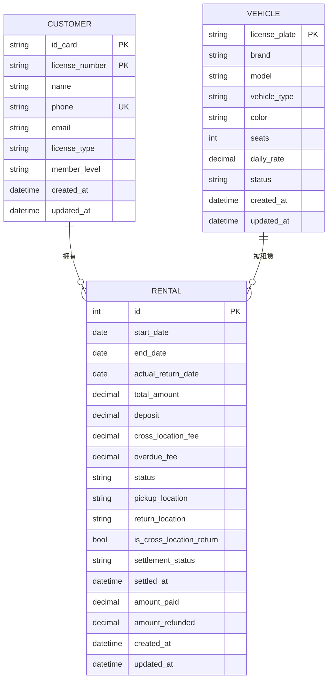

# 数据库设计文档

<cite>
**本文档引用的文件**
- [vehicles/models.py](file://code/car_rental_system/vehicles/models.py)
- [customers/models.py](file://code/car_rental_system/customers/models.py)
- [rentals/models.py](file://code/car_rental_system/rentals/models.py)
- [vehicles/migrations/0001_initial.py](file://code/car_rental_system/vehicles/migrations/0001_initial.py)
- [customers/migrations/0001_initial.py](file://code/car_rental_system/customers/migrations/0001_initial.py)
- [rentals/migrations/0001_initial.py](file://code/car_rental_system/rentals/migrations/0001_initial.py)
- [optimize_database.py](file://code/car_rental_system/optimize_database.py)
- [rentals/forms.py](file://code/car_rental_system/rentals/forms.py)
- [customers/views.py](file://code/car_rental_system/customers/views.py)
</cite>

## 目录
1. [引言](#引言)
2. [核心模型结构](#核心模型结构)
   1. [车辆(Vehicle)模型](#车辆vehicle模型)
   2. [客户(Customer)模型](#客户customer模型)
   3. [租赁订单(Rental)模型](#租赁订单rental模型)
3. [实体关系图(ERD)](#实体关系图erd)
4. [字段映射表](#字段映射表)
5. [外键关系与数据完整性](#外键关系与数据完整性)
6. [关联查询示例](#关联查询示例)
7. [数据验证与业务规则](#数据验证与业务规则)
8. [性能优化建议](#性能优化建议)
9. [结论](#结论)

## 引言
本文档详细说明了租车管理系统中三个核心模型的数据库设计：车辆(Vehicle)、客户(Customer)和租赁订单(Rental)。文档涵盖了模型的字段定义、数据类型、约束条件、索引策略、外键关系、数据完整性保障机制以及业务规则。通过实体关系图和字段映射表，清晰地展示了各模型之间的关联。同时，文档提供了关联查询的代码示例和性能优化建议，为开发者提供全面的参考。

## 核心模型结构

### 车辆(Vehicle)模型
车辆模型用于管理所有可租赁的车辆信息，包括车辆的基本属性、状态和租金等。

**字段定义：**
- **license_plate (车牌号)**: 字符串类型，最大长度20，唯一约束，作为车辆的唯一标识
- **brand (品牌)**: 字符串类型，最大长度50，存储汽车品牌
- **model (型号)**: 字符串类型，最大长度50，存储汽车型号
- **vehicle_type (车辆类型)**: 字符串类型，最大长度20，如轿车、SUV、MPV等
- **color (颜色)**: 字符串类型，最大长度20，存储车身颜色
- **seats (座位数)**: 正整数类型，默认值5，验证器确保座位数≥2
- **daily_rate (日租金)**: 十进制类型，最大10位数字，2位小数，验证器确保租金>0.01
- **status (车辆状态)**: 字符串类型，最大长度20，枚举值：'AVAILABLE'(可用)、'RENTED'(已租)、'MAINTENANCE'(维修中)，默认'AVAILABLE'
- **created_at (创建时间)**: 日期时间类型，自动添加创建时间
- **updated_at (更新时间)**: 日期时间类型，自动更新最后修改时间

**约束条件：**
- `license_plate` 字段具有唯一性约束
- `seats` 字段有最小值验证器，确保座位数≥2
- `daily_rate` 字段有最小值验证器，确保日租金>0.01

**索引策略：**
- 在 `license_plate` 字段上创建索引，优化通过车牌号查询的性能
- 在 `status` 字段上创建索引，优化按车辆状态查询的性能
- 在 `brand` 和 `model` 字段上创建复合索引，优化按品牌和型号查询的性能
- 在 `seats` 字段上创建索引，优化按座位数搜索的性能

**业务规则：**
- 车辆状态决定了其是否可被租赁，只有状态为'AVAILABLE'的车辆才能创建新的租赁订单
- 日租金必须大于0.01，确保车辆有基本的租赁价值

**Section sources**
- [vehicles/models.py](file://code/car_rental_system/vehicles/models.py#L6-L85)
- [vehicles/migrations/0001_initial.py](file://code/car_rental_system/vehicles/migrations/0001_initial.py#L1-L39)
- [vehicles/migrations/0002_add_seats_field.py](file://code/car_rental_system/vehicles/migrations/0002_add_seats_field.py#L1-L32)

### 客户(Customer)模型
客户模型用于管理租车客户的信息，包括个人资料、联系方式和会员等级等。

**字段定义：**
- **user (关联用户)**: 一对一关系，关联Django的User模型，可为空
- **name (姓名)**: 字符串类型，最大长度100，存储客户姓名
- **phone (联系电话)**: 字符串类型，最大长度20，正则验证器确保为有效的11位手机号
- **email (邮箱)**: 邮箱类型，可为空，存储电子邮箱地址
- **id_card (身份证号)**: 字符串类型，最大长度18，唯一约束，正则验证器确保为有效的身份证号码
- **license_number (驾照号)**: 字符串类型，最大长度20，唯一约束，存储驾驶证号码
- **license_type (驾照类型)**: 字符串类型，最大长度10，枚举值：'A'(A类驾照)、'B'(B类驾照)、'C'(C类驾照)，默认'C'
- **member_level (会员等级)**: 字符串类型，最大长度20，枚举值：'NORMAL'(普通会员)、'VIP'(VIP会员)，默认'NORMAL'
- **created_at (创建时间)**: 日期时间类型，自动添加创建时间
- **updated_at (更新时间)**: 日期时间类型，自动更新最后修改时间

**约束条件：**
- `id_card` 和 `license_number` 字段具有唯一性约束
- `phone` 字段通过正则表达式验证，确保为有效的手机号码
- `id_card` 字段通过正则表达式验证，确保为有效的身份证号码

**索引策略：**
- 在 `id_card` 字段上创建索引，优化通过身份证号查询的性能
- 在 `license_number` 字段上创建索引，优化通过驾照号查询的性能
- 在 `phone` 字段上创建索引，优化通过手机号查询的性能
- 在 `member_level` 字段上创建索引，优化按会员等级查询的性能

**业务规则：**
- 系统提供 `check_vip_upgrade_eligibility` 方法，检查客户是否符合VIP升级条件
- VIP升级条件：连续10个已完成订单都满足：没有超时归还且没有不诚信的异地还车行为
- 提供 `upgrade_to_vip` 方法，将符合条件的客户升级为VIP会员

**Section sources**
- [customers/models.py](file://code/car_rental_system/customers/models.py#L7-L160)
- [customers/migrations/0001_initial.py](file://code/car_rental_system/customers/migrations/0001_initial.py#L1-L38)
- [customers/views.py](file://code/car_rental_system/customers/views.py#L1-L200)

### 租赁订单(Rental)模型
租赁订单模型用于管理车辆租赁的完整生命周期，包括预订、进行中、完成和取消等状态。

**字段定义：**
- **customer (客户)**: 外键关系，关联Customer模型，级联删除
- **vehicle (车辆)**: 外键关系，关联Vehicle模型，级联删除
- **start_date (租赁开始日期)**: 日期类型，存储租赁开始日期
- **end_date (租赁结束日期)**: 日期类型，存储租赁结束日期
- **actual_return_date (实际还车日期)**: 日期类型，可为空，存储实际还车日期
- **actual_return_location (实际还车门店)**: 字符串类型，最大长度200，可为空，存储实际还车门店
- **overdue_fee (超时还车费用)**: 十进制类型，最大10位数字，2位小数，默认0.00，验证器确保费用≥0.00
- **total_amount (总金额)**: 十进制类型，最大10位数字，2位小数，验证器确保金额≥0.01
- **deposit (押金)**: 十进制类型，最大10位数字，2位小数，默认0.00，验证器确保金额≥0.00
- **pickup_location (取车地点)**: 字符串类型，最大长度200，默认'门店'，存储取车地点
- **return_location (还车地点)**: 字符串类型，最大长度200，可为空，存储还车地点（异地还车时填写）
- **is_cross_location_return (是否异地还车)**: 布尔类型，默认False，标识是否异地还车
- **cross_location_fee (异地还车费用)**: 十进制类型，最大10位数字，2位小数，默认0.00，验证器确保费用≥0.00
- **status (订单状态)**: 字符串类型，最大长度20，枚举值：'PENDING'(预订中)、'ONGOING'(进行中)、'OVERDUE'(已超时未归还)、'COMPLETED'(已完成)、'CANCELLED'(已取消)，默认'PENDING'
- **notes (备注)**: 文本类型，可为空，存储订单备注信息
- **created_at (创建时间)**: 日期时间类型，自动添加创建时间
- **updated_at (更新时间)**: 日期时间类型，自动更新最后修改时间
- **settlement_status (结算状态)**: 字符串类型，最大长度20，枚举值：'UNSETTLED'(未结算)、'PARTIAL'(部分结算)、'SETTLED'(已结算)，默认'UNSETTLED'
- **settled_at (结算时间)**: 日期时间类型，可为空，存储订单完成并结算的时间
- **amount_paid (累计支付金额)**: 十进制类型，最大10位数字，2位小数，默认0.00，存储用户累计支付金额
- **amount_refunded (累计退款金额)**: 十进制类型，最大10位数字，2位小数，默认0.00，存储系统累计退款金额

**约束条件：**
- `start_date` 和 `end_date` 必须满足：结束日期不能早于开始日期
- `actual_return_date` 必须满足：不能早于租赁开始日期，且不能晚于今天
- `total_amount` 必须大于0.01，确保订单有基本金额
- `overdue_fee`、`deposit` 和 `cross_location_fee` 必须大于等于0.00

**索引策略：**
- 在 `start_date` 和 `end_date` 字段上创建索引，优化按租赁日期查询的性能
- 在 `status` 字段上创建索引，优化按订单状态查询的性能
- 在 `customer` 和 `status` 字段上创建复合索引，优化按客户和状态查询的性能
- 在 `vehicle` 和 `status` 字段上创建复合索引，优化按车辆和状态查询的性能

**业务规则：**
- 订单状态自动更新机制：当到达开始日期时，状态从'PENDING'变为'ONGOING'；当超过结束日期时，状态变为'OVERDUE'
- VIP客户无需支付押金，普通客户需要支付押金（默认为日租金的10倍）
- 异地还车时，系统自动计算异地还车费用（默认为日租金的50%）
- 提供 `calculate_order_total` 方法，计算订单总额（基础租金+押金+异地费用+超时费用）
- 提供 `refresh_financials` 方法，根据支付记录刷新累计支付/退款信息和结算状态
- 提供 `refund_deposit` 方法，退还订单押金

**Section sources**
- [rentals/models.py](file://code/car_rental_system/rentals/models.py#L12-L401)
- [rentals/migrations/0001_initial.py](file://code/car_rental_system/rentals/migrations/0001_initial.py#L1-L43)
- [rentals/migrations/0002_add_deposit_and_location_fields.py](file://code/car_rental_system/rentals/migrations/0002_add_deposit_and_location_fields.py#L1-L76)
- [rentals/forms.py](file://code/car_rental_system/rentals/forms.py#L130-L329)

## 实体关系图(ERD)


**Diagram sources**
- [vehicles/models.py](file://code/car_rental_system/vehicles/models.py#L6-L85)
- [customers/models.py](file://code/car_rental_system/customers/models.py#L7-L160)
- [rentals/models.py](file://code/car_rental_system/rentals/models.py#L12-L401)

## 字段映射表
| 模型 | 字段名 | 数据类型 | 是否为空 | 默认值 | 约束/验证器 | 索引 | 说明 |
|------|-------|---------|--------|--------|-----------|------|------|
| **Vehicle** | license_plate | CharField(20) | 否 | - | 唯一 | 是 | 车牌号，车辆唯一标识 |
| | brand | CharField(50) | 否 | - | - | 是 | 汽车品牌 |
| | model | CharField(50) | 否 | - | - | 是 | 汽车型号 |
| | vehicle_type | CharField(20) | 否 | - | - | 是 | 车辆类型（轿车、SUV等） |
| | color | CharField(20) | 否 | - | - | 否 | 车身颜色 |
| | seats | PositiveIntegerField | 否 | 5 | ≥2 | 是 | 车辆座位数 |
| | daily_rate | DecimalField(10,2) | 否 | - | >0.01 | 否 | 每日租金价格 |
| | status | CharField(20) | 否 | AVAILABLE | 枚举 | 是 | 车辆状态 |
| | created_at | DateTimeField | 否 | - | auto_now_add | 否 | 创建时间 |
| | updated_at | DateTimeField | 否 | - | auto_now | 否 | 更新时间 |
| **Customer** | user | OneToOneField | 是 | - | CASCADE | 否 | 关联用户账号 |
| | name | CharField(100) | 否 | - | - | 否 | 客户姓名 |
| | phone | CharField(20) | 否 | - | 手机号正则 | 是 | 联系电话 |
| | email | EmailField | 是 | - | - | 否 | 电子邮箱地址 |
| | id_card | CharField(18) | 否 | - | 唯一，身份证正则 | 是 | 18位身份证号码 |
| | license_number | CharField(20) | 否 | - | 唯一 | 是 | 驾驶证号码 |
| | license_type | CharField(10) | 否 | C | 枚举 | 否 | 驾驶证类型 |
| | member_level | CharField(20) | 否 | NORMAL | 枚举 | 是 | 客户会员等级 |
| | created_at | DateTimeField | 否 | - | auto_now_add | 否 | 创建时间 |
| | updated_at | DateTimeField | 否 | - | auto_now | 否 | 更新时间 |
| **Rental** | customer | ForeignKey | 否 | - | CASCADE | 是 | 关联客户 |
| | vehicle | ForeignKey | 否 | - | CASCADE | 是 | 关联车辆 |
| | start_date | DateField | 否 | - | - | 是 | 租赁开始日期 |
| | end_date | DateField | 否 | - | - | 是 | 租赁结束日期 |
| | actual_return_date | DateField | 是 | - | - | 否 | 实际还车日期 |
| | total_amount | DecimalField(10,2) | 否 | - | ≥0.01 | 否 | 租赁总费用 |
| | deposit | DecimalField(10,2) | 否 | 0.00 | ≥0.00 | 否 | 租赁押金金额 |
| | cross_location_fee | DecimalField(10,2) | 否 | 0.00 | ≥0.00 | 否 | 异地还车费用 |
| | overdue_fee | DecimalField(10,2) | 否 | 0.00 | ≥0.00 | 否 | 超时还车费用 |
| | status | CharField(20) | 否 | PENDING | 枚举 | 是 | 订单状态 |
| | notes | TextField | 是 | - | - | 否 | 订单备注信息 |
| | created_at | DateTimeField | 否 | - | auto_now_add | 否 | 创建时间 |
| | updated_at | DateTimeField | 否 | - | auto_now | 否 | 更新时间 |
| | settlement_status | CharField(20) | 否 | UNSETTLED | 枚举 | 否 | 结算状态 |
| | settled_at | DateTimeField | 是 | - | - | 否 | 结算时间 |
| | amount_paid | DecimalField(10,2) | 否 | 0.00 | - | 否 | 累计支付金额 |
| | amount_refunded | DecimalField(10,2) | 否 | 0.00 | - | 否 | 累计退款金额 |

**Section sources**
- [vehicles/models.py](file://code/car_rental_system/vehicles/models.py#L6-L85)
- [customers/models.py](file://code/car_rental_system/customers/models.py#L7-L160)
- [rentals/models.py](file://code/car_rental_system/rentals/models.py#L12-L401)

## 外键关系与数据完整性
系统通过外键关系和级联删除机制确保数据完整性：

1. **客户与租赁订单关系**：
   - `Rental` 模型通过 `customer` 外键关联 `Customer` 模型
   - 外键设置为 `on_delete=models.CASCADE`，当客户被删除时，其所有租赁订单也会被级联删除
   - 这确保了不会存在孤立的租赁订单记录

2. **车辆与租赁订单关系**：
   - `Rental` 模型通过 `vehicle` 外键关联 `Vehicle` 模型
   - 外键同样设置为 `on_delete=models.CASCADE`，当车辆被删除时，其所有租赁订单也会被级联删除
   - 这保证了租赁订单始终关联到有效的车辆

3. **数据完整性保障**：
   - 通过 `unique=True` 约束确保 `Vehicle.license_plate`、`Customer.id_card` 和 `Customer.license_number` 的唯一性
   - 通过 `validators` 验证器确保关键字段的数据有效性，如手机号、身份证号的格式验证
   - 通过 `MinValueValidator` 确保金额类字段的合理性，防止负数或零值
   - 通过 `clean` 方法实现跨字段验证，如确保结束日期不早于开始日期
   - 通过 `save` 方法在保存时自动计算总金额和押金，确保数据一致性

4. **状态一致性**：
   - 车辆状态与租赁订单状态相互关联：当订单状态变为'ONGOING'时，车辆状态自动更新为'RENTED'
   - 系统提供 `auto_update_status` 类方法，定期检查并自动更新订单状态，确保状态与实际业务情况一致
   - 通过缓存机制避免频繁更新，每5分钟最多更新一次

**Section sources**
- [rentals/models.py](file://code/car_rental_system/rentals/models.py#L27-L38)
- [vehicles/models.py](file://code/car_rental_system/vehicles/models.py#L6-L85)
- [rentals/models.py](file://code/car_rental_system/rentals/models.py#L230-L271)

## 关联查询示例
系统通过Django ORM的关联查询功能，实现了高效的跨模型数据访问：

1. **通过客户访问所有订单**：
   ```python
   # 获取客户对象
   customer = Customer.objects.get(id=1)
   # 通过related_name='rentals'访问客户的所有租赁订单
   customer_rentals = customer.rentals.all()
   # 按创建时间倒序排列
   recent_rentals = customer.rentals.order_by('-created_at')
   # 筛选特定状态的订单
   completed_rentals = customer.rentals.filter(status='COMPLETED')
   ```

2. **通过车辆访问所有租赁记录**：
   ```python
   # 获取车辆对象
   vehicle = Vehicle.objects.get(license_plate='京A12345')
   # 通过related_name='rentals'访问车辆的所有租赁记录
   vehicle_rentals = vehicle.rentals.all()
   # 筛选进行中的订单
   ongoing_rentals = vehicle.rentals.filter(status='ONGOING')
   # 获取最近的租赁记录
   latest_rental = vehicle.rentals.order_by('-created_at').first()
   ```

3. **优化的关联查询**：
   ```python
   # 使用select_related优化一对一或外键查询
   rentals_with_customer = Rental.objects.select_related('customer', 'vehicle').all()
   
   # 使用prefetch_related优化一对多查询
   customers_with_rentals = Customer.objects.prefetch_related('rentals').all()
   
   # 使用聚合查询一次性获取统计信息
   customers_with_stats = Customer.objects.annotate(
       total_rentals=Count('rentals'),
       total_amount=Sum('rentals__total_amount')
   )
   ```

4. **复杂条件查询**：
   ```python
   # 查询特定时间段内可用的车辆
   available_vehicles = Vehicle.objects.filter(
       status='AVAILABLE'
   ).exclude(
       rentals__status__in=['PENDING', 'ONGOING', 'OVERDUE'],
       rentals__start_date__lte=end_date,
       rentals__end_date__gte=start_date
   )
   
   # 查询VIP客户的租赁记录
   vip_rentals = Rental.objects.filter(
       customer__member_level='VIP'
   ).select_related('customer', 'vehicle')
   ```

**Section sources**
- [customers/models.py](file://code/car_rental_system/customers/models.py#L13-L21)
- [vehicles/models.py](file://code/car_rental_system/vehicles/models.py#L33-L37)
- [rentals/models.py](file://code/car_rental_system/rentals/models.py#L27-L37)
- [customers/views.py](file://code/car_rental_system/customers/views.py#L79-L121)

## 数据验证与业务规则
系统实现了多层次的数据验证和业务规则，确保数据的准确性和业务逻辑的正确性：

1. **字段级验证**：
   - `daily_rate`：通过 `MinValueValidator(Decimal('0.01'))` 确保日租金大于0
   - `seats`：通过 `MinValueValidator(2)` 确保座位数至少为2
   - `phone`：通过正则表达式 `^1[3-9]\d{9}$` 验证手机号格式
   - `id_card`：通过复杂正则表达式验证18位身份证号码的有效性

2. **跨字段验证**：
   - 在 `Rental` 模型的 `clean` 方法中验证：结束日期不能早于开始日期
   - 在 `Rental` 模型的 `clean` 方法中验证：实际还车日期不能早于租赁开始日期
   - 在 `Rental` 模型的 `clean` 方法中验证：实际还车日期不能晚于今天
   - 在 `Rental` 表单的 `clean` 方法中验证：异地还车时必须填写还车地点

3. **业务规则验证**：
   - 车辆可用性验证：在创建或更新租赁订单时，检查车辆状态是否为'AVAILABLE'
   - 时间冲突验证：检查车辆在指定时间段内是否已被租赁
   - 状态转换验证：通过 `RentalStatusForm` 验证订单状态的合法转换
   - 押金规则：VIP客户无需支付押金，普通客户需要支付押金

4. **自动计算与更新**：
   - 在 `save` 方法中自动计算 `total_amount`：日租金 × 租赁天数
   - 在 `save` 方法中自动设置 `deposit`：VIP客户为0，普通客户为日租金的10倍
   - 在 `save` 方法中自动设置 `cross_location_fee`：异地还车时为日租金的50%
   - 通过 `auto_update_status` 方法定期自动更新订单状态

5. **完整性约束**：
   - 通过 `unique=True` 确保关键字段的唯一性
   - 通过 `on_delete=models.CASCADE` 确保外键关系的完整性
   - 通过 `blank=True, null=True` 合理设置可选字段

**Section sources**
- [vehicles/models.py](file://code/car_rental_system/vehicles/models.py#L49-L50)
- [customers/models.py](file://code/car_rental_system/customers/models.py#L30-L35)
- [rentals/models.py](file://code/car_rental_system/rentals/models.py#L230-L245)
- [rentals/forms.py](file://code/car_rental_system/rentals/forms.py#L212-L274)

## 性能优化建议
基于系统设计和实际使用情况，提出以下性能优化建议：

1. **索引优化**：
   - 已在关键查询字段上创建索引，如 `Vehicle.status`、`Customer.member_level`、`Rental.start_date` 等
   - 建议定期分析查询性能，使用 `EXPLAIN` 命令检查查询计划
   - 考虑为高频查询的组合条件创建复合索引，如 `(status, start_date)` 或 `(customer_id, status)`

2. **查询优化**：
   - 使用 `select_related` 优化外键查询，避免N+1查询问题
   - 使用 `prefetch_related` 优化一对多关系查询
   - 使用 `only` 和 `defer` 方法仅获取需要的字段，减少数据传输量
   - 使用聚合查询（`annotate` 和 `aggregate`）一次性获取统计信息

3. **缓存策略**：
   - 实现查询结果缓存，特别是对于不经常变化的数据
   - 使用Django缓存框架缓存高频访问的视图结果
   - 在 `auto_update_status` 方法中已使用缓存避免频繁更新

4. **数据库维护**：
   - 定期执行数据库优化脚本 `optimize_database.py` 创建和维护索引
   - 定期分析和优化数据库表，重建索引
   - 监控数据库性能，识别慢查询并进行优化

5. **应用层优化**：
   - 在视图中使用分页（`Paginator`）处理大量数据
   - 使用 `Q` 对象优化复杂查询条件
   - 避免在循环中执行数据库查询
   - 使用 `bulk_create` 和 `bulk_update` 批量操作大量数据

6. **监控与分析**：
   - 启用Django Debug Toolbar监控查询性能
   - 使用数据库性能监控工具识别瓶颈
   - 定期审查和优化迁移文件，确保数据库结构最优

**Section sources**
- [optimize_database.py](file://code/car_rental_system/optimize_database.py#L1-L55)
- [rentals/models.py](file://code/car_rental_system/rentals/models.py#L163-L169)
- [customers/views.py](file://code/car_rental_system/customers/views.py#L54-L61)

## 结论
本文档详细阐述了租车管理系统中车辆、客户和租赁订单三个核心模型的数据库设计。通过合理的字段定义、约束条件、索引策略和外键关系，确保了数据的完整性、一致性和查询性能。系统实现了多层次的数据验证和业务规则，保障了业务逻辑的正确执行。通过实体关系图和字段映射表，清晰地展示了各模型之间的关联。提供的关联查询示例和性能优化建议，为开发者提供了实用的参考。整体设计既满足了当前业务需求，又具备良好的扩展性和维护性，为系统的稳定运行奠定了坚实的基础。