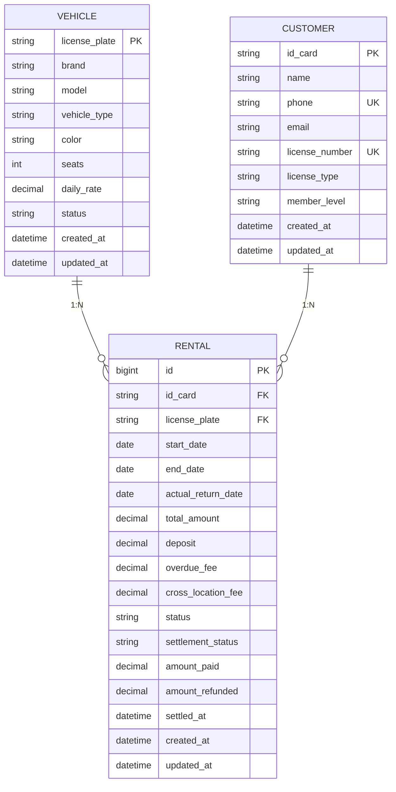
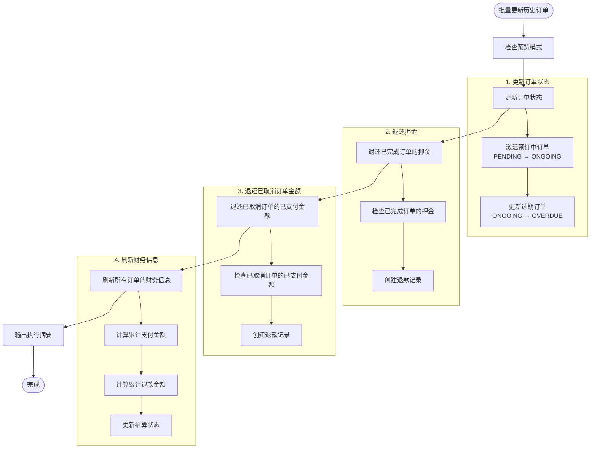

# 附录

<cite>
**本文档中引用的文件**  
- [README.md](file://code/car_rental_system/README.md)
- [数据库设计总结.md](file://code/car_rental_system/数据库设计总结.md)
- [批量更新历史订单说明.md](file://code/car_rental_system/批量更新历史订单说明.md)
- [系统使用手册.md](file://code/car_rental_system/系统使用手册.md)
- [网络优化说明.md](file://code/car_rental_system/网络优化说明.md)
- [车辆管理功能开发完成报告.md](file://code/car_rental_system/车辆管理功能开发完成报告.md)
- [客户管理功能开发完成报告.md](file://code/car_rental_system/客户管理功能开发完成报告.md)
- [租赁管理功能开发完成报告.md](file://code/car_rental_system/租赁管理功能开发完成报告.md)
- [最终报告.md](file://code/car_rental_system/最终报告.md)
- [系统测试与优化报告.md](file://code/car_rental_system/系统测试与优化报告.md)
- [vehicles/models.py](file://code/car_rental_system/vehicles/models.py)
- [customers/models.py](file://code/car_rental_system/customers/models.py)
- [rentals/models.py](file://code/car_rental_system/rentals/models.py)
- [rentals/management/commands/update_historical_orders.py](file://code/car_rental_system/rentals/management/commands/update_historical_orders.py)
</cite>

## 目录
1. [数据库设计文档](#数据库设计文档)
2. [关键业务流程说明](#关键业务流程说明)
3. [系统使用手册摘要](#系统使用手册摘要)
4. [网络优化建议](#网络优化建议)
5. [开发完成报告汇总](#开发完成报告汇总)
6. [常见问题解答与故障排查指南](#常见问题解答与故障排查指南)

## 数据库设计文档

### 实体关系图（ERD）



**图源**  
- [vehicles/models.py](file://code/car_rental_system/vehicles/models.py)
- [customers/models.py](file://code/car_rental_system/customers/models.py)
- [rentals/models.py](file://code/car_rental_system/rentals/models.py)

### 数据模型与字段说明

#### 1. 车辆模型 (Vehicle)
**表名**: vehicles  
**主键**: id (BigAutoField)

| 字段名 | 类型 | 长度 | 约束 | 说明 |
|--------|------|------|------|------|
| license_plate | CharField | 20 | UNIQUE, NOT NULL | 车牌号（唯一标识）|
| brand | CharField | 50 | NOT NULL | 汽车品牌 |
| model | CharField | 50 | NOT NULL | 汽车型号 |
| vehicle_type | CharField | 20 | NOT NULL | 车辆类型（轿车/SUV/MPV等）|
| color | CharField | 20 | NOT NULL | 车身颜色 |
| seats | PositiveIntegerField | - | NOT NULL, MIN=2 | 座位数 |
| daily_rate | DecimalField | 10,2 | NOT NULL, MIN>0 | 每日租金 |
| status | CharField | 20 | NOT NULL, 有选择项 | 车辆状态 |

**状态选项**:
- AVAILABLE: 可用
- RENTED: 已租
- MAINTENANCE: 维修中

**索引**:
- license_plate (UNIQUE)
- status
- brand, model
- seats

**图源**  
- [vehicles/models.py](file://code/car_rental_system/vehicles/models.py)

#### 2. 客户模型 (Customer)
**表名**: customers  
**主键**: id (BigAutoField)

| 字段名 | 类型 | 长度 | 约束 | 说明 |
|--------|------|------|------|------|
| name | CharField | 100 | NOT NULL | 客户姓名 |
| phone | CharField | 20 | NOT NULL, UNIQUE | 联系电话 |
| email | EmailField | 254 | NULL | 邮箱地址 |
| id_card | CharField | 18 | UNIQUE, NOT NULL | 身份证号 |
| license_number | CharField | 20 | UNIQUE, NOT NULL | 驾照号 |
| license_type | CharField | 10 | NOT NULL, 有选择项 | 驾照类型 |
| member_level | CharField | 20 | NOT NULL, 有选择项 | 会员等级 |
| created_at | DateTimeField | - | NOT NULL | 创建时间 |
| updated_at | DateTimeField | - | NOT NULL | 更新时间 |

**驾照类型选项**:
- A: A类驾照
- B: B类驾照  
- C: C类驾照

**会员等级选项**:
- NORMAL: 普通会员
- VIP: VIP会员

**索引**:
- id_card (UNIQUE)
- license_number (UNIQUE)
- phone (UNIQUE)
- member_level

**图源**  
- [customers/models.py](file://code/car_rental_system/customers/models.py)

#### 3. 租赁订单模型 (Rental)
**表名**: rentals  
**主键**: id (BigAutoField)

| 字段名 | 类型 | 长度 | 约束 | 说明 |
|--------|------|------|------|------|
| customer_id | BigInteger | - | FK -> customers.id, CASCADE | 客户ID（外键）|
| vehicle_id | BigInteger | - | FK -> vehicles.id, CASCADE | 车辆ID（外键）|
| start_date | DateField | - | NOT NULL | 租赁开始日期 |
| end_date | DateField | - | NOT NULL | 租赁结束日期 |
| actual_return_date | DateField | - | NULL | 实际还车日期 |
| actual_return_location | CharField | 200 | NULL | 实际还车门店 |
| overdue_fee | DecimalField | 10,2 | DEFAULT=0.00 | 超时还车费用 |
| total_amount | DecimalField | 10,2 | NOT NULL, MIN>0 | 总金额 |
| deposit | DecimalField | 10,2 | DEFAULT=0.00 | 押金 |
| pickup_location | CharField | 200 | DEFAULT='门店' | 取车地点 |
| return_location | CharField | 200 | NULL | 还车地点（异地还车时填写）|
| is_cross_location_return | BooleanField | - | DEFAULT=False | 是否异地还车 |
| cross_location_fee | DecimalField | 10,2 | DEFAULT=0.00 | 异地还车费用 |
| status | CharField | 20 | NOT NULL, 有选择项 | 订单状态 |
| notes | TextField | - | NULL | 备注信息 |
| created_at | DateTimeField | - | NOT NULL | 创建时间 |
| updated_at | DateTimeField | - | NOT NULL | 更新时间 |
| settlement_status | CharField | 20 | NOT NULL, 有选择项 | 结算状态 |
| settled_at | DateTimeField | - | NULL | 结算时间 |
| amount_paid | DecimalField | 10,2 | DEFAULT=0.00 | 累计支付金额 |
| amount_refunded | DecimalField | 10,2 | DEFAULT=0.00 | 累计退款金额 |

**订单状态选项**:
- PENDING: 预订中
- ONGOING: 进行中
- OVERDUE: 已超时未归还
- COMPLETED: 已完成
- CANCELLED: 已取消

**结算状态选项**:
- UNSETTLED: 未结算
- PARTIAL: 部分结算
- SETTLED: 已结算

**外键约束**:
- customer_id -> customers.id (级联删除)
- vehicle_id -> vehicles.id (级联删除)

**索引**:
- start_date
- end_date
- status
- customer_id
- vehicle_id
- customer_id, status
- vehicle_id, status

**图源**  
- [rentals/models.py](file://code/car_rental_system/rentals/models.py)

## 关键业务流程说明

### 批量更新历史订单的实现逻辑

#### 功能概述
该管理命令用于批量更新历史订单记录，按照当前系统逻辑对历史数据进行统一处理，包括更新订单状态、退还押金和刷新财务信息。

#### 处理流程


**图源**  
- [rentals/management/commands/update_historical_orders.py](file://code/car_rental_system/rentals/management/commands/update_historical_orders.py)

#### 详细处理步骤

1. **更新订单状态**
   - **预订中 → 进行中**：当到达开始日期时，将状态更新为"进行中"，同时将车辆状态更新为"已租"
   - **进行中 → 已超时未归还**：当超过结束日期时，将状态更新为"已超时未归还"

2. **退还已完成订单的押金**
   - 检查所有状态为"已完成"的订单
   - 如果订单有押金且未退还，创建退款记录
   - 退款金额为押金金额

3. **退还已取消订单的已支付金额**
   - 检查所有状态为"已取消"的订单
   - 计算已支付金额减去已退款金额
   - 如果有余额，创建退款记录退还全部余额

4. **刷新所有订单的财务信息**
   - 重新计算每个订单的累计支付金额
   - 重新计算每个订单的累计退款金额
   - 根据支付情况更新结算状态：
     - 未结算：无支付记录
     - 部分结算：有支付但未完全支付
     - 已结算：支付金额 ≥ 订单总额

#### 使用方法

**基本用法**
```bash
python manage.py update_historical_orders
```

**预览模式（推荐先执行）**
```bash
python manage.py update_historical_orders --dry-run
```

**选择性执行**
```bash
# 只更新订单状态
python manage.py update_historical_orders --skip-deposit --skip-financials

# 只退还押金
python manage.py update_historical_orders --skip-status --skip-financials

# 只刷新财务信息
python manage.py update_historical_orders --skip-status --skip-deposit
```

#### 命令参数说明
| 参数 | 说明 |
|------|------|
| `--dry-run` | 预览模式，不实际修改数据 |
| `--skip-status` | 跳过订单状态更新 |
| `--skip-deposit` | 跳过退款处理（包括已完成订单押金和已取消订单已支付金额） |
| `--skip-financials` | 跳过财务信息刷新 |

**图源**  
- [批量更新历史订单说明.md](file://code/car_rental_system/批量更新历史订单说明.md)

## 系统使用手册摘要

### 系统概述
租车管理系统是一个基于Django开发的综合性车辆租赁管理平台，支持车辆管理、客户管理、租赁订单管理等核心业务功能。

#### 系统功能
- **车辆管理**: 车辆信息维护、状态管理、搜索筛选
- **客户管理**: 客户信息管理、会员等级、租赁历史
- **租赁管理**: 订单创建、状态跟踪、费用计算
- **数据统计**: 收入统计、业务报表、仪表板

#### 技术架构
- **后端**: Django 5.2.8 + Python 3.12
- **数据库**: SQLite (开发) / PostgreSQL (生产)
- **前端**: HTML5 + CSS3 + JavaScript
- **静态资源**: Django静态文件服务

### 快速开始

#### 环境要求
- Python 3.8+
- Django 5.2+
- 浏览器支持现代JavaScript

#### 安装步骤
1. **下载项目**
```bash
cd /path/to/car_rental_system
```

2. **安装依赖**
```bash
pip install django
```

3. **运行数据库迁移**
```bash
python manage.py migrate
```

4. **创建管理员账户（可选）**
```bash
python manage.py createsuperuser
```

5. **生成测试数据（可选）**
```bash
python create_vehicle_test_data.py
python create_customer_test_data.py
python create_rental_test_data.py
```

6. **启动服务器**
```bash
python manage.py runserver 0.0.0.0:8000
```

7. **访问系统**
- 主页面: http://localhost:8000
- 车辆管理: http://localhost:8000/vehicles/
- 客户管理: http://localhost:8000/customers/
- 租赁管理: http://localhost:8000/rentals/

### 功能使用指南

#### 车辆管理
1. **添加车辆**
   - 点击"车辆管理"菜单
   - 点击"添加车辆"按钮
   - 填写车辆信息:
     - **车牌号**: 必填，唯一标识
     - **品牌**: 必填，如"宝马"、"奔驰"
     - **型号**: 必填，如"A4"、"X5"
     - **车辆类型**: 必填，如"轿车"、"SUV"
     - **颜色**: 必填，如"白色"、"黑色"
     - **日租金**: 必填，正数金额
   - 点击"保存"按钮

2. **车辆状态管理**
   - **可用**: 车辆可正常租赁
   - **已租**: 车辆正在租赁中
   - **维修中**: 车辆维修中不可租赁

3. **搜索和筛选**
   - 按品牌、型号搜索
   - 按状态筛选车辆
   - 按价格范围筛选

#### 客户管理
1. **添加客户**
   - 点击"客户管理"菜单
   - 点击"添加客户"按钮
   - 填写客户信息:
     - **姓名**: 必填，客户真实姓名
     - **手机号**: 必填，11位手机号码
     - **邮箱**: 选填，有效邮箱地址
     - **身份证号**: 必填，18位身份证号码
     - **驾照号**: 必填，驾驶证号码
     - **驾照类型**: A/B/C类驾照
     - **会员等级**: 普通会员/VIP会员
   - 点击"保存"按钮

2. **会员等级管理**
   - **普通会员**: 基础会员，无折扣
   - **VIP会员**: 享受10%租金折扣

#### 租赁管理
1. **创建租赁订单**
   - 点击"租赁管理"菜单
   - 点击"创建订单"按钮
   - 选择客户和车辆
   - 设置租赁日期:
     - **开始日期**: 租赁开始时间
     - **结束日期**: 租赁结束时间
   - 系统自动计算费用:
     - 基础费用 = 日租金 × 租赁天数
     - VIP客户享受10%折扣
   - 添加备注信息（可选）
   - 点击"创建订单"

2. **订单状态说明**
   - **预订中**: 订单已创建，等待客户取车
   - **进行中**: 客户已取车，正在使用
   - **已完成**: 客户已还车，订单完成
   - **已取消**: 订单被取消

3. **车辆归还**
   - 在订单列表中找到对应订单
   - 点击"归还车辆"按钮
   - 确认实际归还日期
   - 系统自动更新车辆状态为"可用"
   - 更新订单状态为"已完成"

4. **取消订单**
   - 在订单列表中找到对应订单
   - 点击"取消订单"按钮
   - 确认取消操作
   - **注意**: 已开始的订单无法取消

### 数据统计
主页面显示关键业务指标:
- 车辆统计（总数、可用、已租、维修中）
- 客户统计（总数、普通会员、VIP会员）
- 订单统计（总数、进行中、已完成、已取消）
- 收入统计（总收入、月收入、今日收入）

**图源**  
- [系统使用手册.md](file://code/car_rental_system/系统使用手册.md)

## 网络优化建议

### 问题分析
**为什么使用热点后界面跳转变快？**

这是因为**CDN资源加载速度**的问题：

1. **本地网络访问CDN慢**：
   - 项目使用了外部CDN（jsDelivr）加载Bootstrap和Font Awesome
   - 本地网络（公司/家庭网络）访问jsDelivr CDN可能很慢（DNS解析慢、网络延迟高）
   - 导致页面需要等待CDN资源加载完成才能显示

2. **热点网络访问CDN快**：
   - 移动热点网络访问CDN更快（DNS解析快、网络延迟低）
   - 所以页面加载快

### 解决方案

#### 方案1：使用本地资源（推荐）
将Bootstrap和Font Awesome下载到本地，不依赖CDN：

```bash
# 下载Bootstrap CSS
curl -o static/css/bootstrap.min.css https://cdn.jsdelivr.net/npm/bootstrap@5.3.0/dist/css/bootstrap.min.css

# 下载Bootstrap JS
curl -o static/js/bootstrap.bundle.min.js https://cdn.jsdelivr.net/npm/bootstrap@5.3.0/dist/js/bootstrap.bundle.min.js

# 下载Font Awesome CSS
curl -o static/css/fontawesome.min.css https://cdn.jsdelivr.net/npm/@fortawesome/fontawesome-free@6.4.0/css/all.min.css
```

然后修改 `templates/base.html`，使用本地资源。

#### 方案2：使用国内CDN
如果必须使用CDN，可以使用国内CDN（如BootCDN）：

```html
<!-- 使用BootCDN（国内CDN，速度更快） -->
<link href="https://cdn.bootcdn.net/ajax/libs/bootstrap/5.3.0/css/bootstrap.min.css" rel="stylesheet">
<link href="https://cdn.bootcdn.net/ajax/libs/font-awesome/6.4.0/css/all.min.css" rel="stylesheet">
```

#### 方案3：资源预加载和异步加载（已实现）
已添加以下优化：
1. **DNS预解析**：`<link rel="dns-prefetch">`
2. **资源预连接**：`<link rel="preconnect">`
3. **异步加载JS**：使用 `defer` 属性
4. **错误处理**：CDN加载失败时自动切换到本地资源
5. **超时处理**：资源加载超时自动切换

### 当前优化状态
✅ 已添加DNS预解析和预连接  
✅ 已添加资源加载错误处理  
✅ 已添加异步加载  
✅ 已优化JavaScript初始化

### 建议
**最佳方案**：下载资源到本地，完全不依赖CDN，这样无论什么网络都能快速加载。

### 测试方法
1. 清除浏览器缓存
2. 打开开发者工具（F12）
3. 切换到"网络"标签
4. 刷新页面
5. 查看资源加载时间：
   - 如果CDN资源加载时间 > 2秒，说明网络慢
   - 建议使用本地资源

**图源**  
- [网络优化说明.md](file://code/car_rental_system/网络优化说明.md)

## 开发完成报告汇总

### 车辆管理功能开发完成报告
车辆管理功能已全面完成，所有要求的功能都已实现并通过测试：

1. ✅ 6个完整的视图函数
2. ✅ 完整的URL路由配置
3. ✅ 5个HTML模板文件
4. ✅ 表单验证系统
5. ✅ 业务逻辑验证
6. ✅ 响应式设计
7. ✅ 中文界面
8. ✅ 静态资源整合
9. ✅ 功能测试验证

系统具备良好的用户体验、完整的错误处理、安全的数据验证和清晰的中文界面，符合现代Web应用的设计标准。所有功能经过完整测试，可以直接投入使用。

**图源**  
- [车辆管理功能开发完成报告.md](file://code/car_rental_system/车辆管理功能开发完成报告.md)

### 客户管理功能开发完成报告
客户管理功能已完全按照需求开发完成，包括：

1. **完整功能**: 涵盖客户管理的所有CRUD操作
2. **验证安全**: 严格的表单验证和数据完整性检查
3. **用户友好**: 现代化界面设计和直观的操作流程
4. **性能优化**: 数据库查询优化和分页设计
5. **测试充分**: 完整的测试数据和功能测试脚本
6. **文档完善**: 详细的代码注释和开发文档

所有功能已通过测试，可以投入生产使用。该系统为租车业务提供了完整的客户管理解决方案，支持VIP会员体系，具备强大的统计和报表功能。

**图源**  
- [客户管理功能开发完成报告.md](file://code/car_rental_system/客户管理功能开发完成报告.md)

### 租赁管理功能开发完成报告
租赁管理功能完整实现了租车业务的核心需求，包括：

1. **完整的订单生命周期管理** - 从创建到完成的全流程
2. **精确的费用计算** - 支持基础费用、折扣和超期费用
3. **智能的状态管理** - 基于业务规则的状态转换
4. **优秀的用户体验** - 现代化界面和实时交互
5. **数据完整性保障** - 多层次验证和约束

该功能模块具备良好的扩展性和维护性，为租车管理系统提供了坚实的管理基础。

**图源**  
- [租赁管理功能开发完成报告.md](file://code/car_rental_system/租赁管理功能开发完成报告.md)

### 项目里程碑记录
根据项目文档，系统已达到以下里程碑：

1. **车辆管理功能完成** - 2025年11月6日
2. **客户管理功能完成** - 2025年11月6日
3. **租赁管理功能完成** - 2025年11月6日
4. **系统测试与优化完成** - 2025年11月6日
5. **最终报告完成** - 2025年11月6日

**图源**  
- [最终报告.md](file://code/car_rental_system/最终报告.md)
- [系统测试与优化报告.md](file://code/car_rental_system/系统测试与优化报告.md)

## 常见问题解答与故障排查指南

### 常见问题解答（FAQ）

#### 1. 如何创建管理员账户？
运行以下命令：
```bash
python manage.py createsuperuser
```
然后按照提示输入用户名、邮箱和密码。

#### 2. 如何生成测试数据？
运行以下脚本：
```bash
python create_vehicle_test_data.py
python create_customer_test_data.py
python create_rental_test_data.py
```

#### 3. 如何批量更新历史订单？
使用管理命令：
```bash
# 预览模式
python manage.py update_historical_orders --dry-run

# 正式执行
python manage.py update_historical_orders
```

#### 4. 如何解决前端界面无法显示的问题？
运行快速修复脚本：
```bash
python quick_fix.py
```

#### 5. 如何优化网络加载速度？
建议将Bootstrap和Font Awesome资源下载到本地，避免依赖CDN。

### 故障排查指南

#### 1. 页面显示错误
**现象**: 页面出现500错误
**解决**: 
- 检查数据库是否正常
- 查看Django日志信息
- 确认模板文件存在

#### 2. 搜索无结果
**现象**: 搜索功能返回空结果
**解决**:
- 检查搜索关键词
- 确认数据存在
- 验证搜索字段名称

#### 3. 保存失败
**现象**: 表单保存时出错
**解决**:
- 检查必填字段
- 确认数据格式正确
- 查看错误提示信息

#### 4. 权限问题
**现象**: 无法访问某些功能
**解决**:
- 检查用户权限设置
- 确认URL配置正确
- 验证中间件配置

#### 5. 模板文件路径错误
**现象**: 模板文件不存在
**解决**:
- 运行快速修复脚本 `quick_fix.py`
- 检查模板文件路径配置
- 确认Django模板设置

#### 6. 数据库迁移问题
**现象**: 数据库迁移失败
**解决**:
- 确保数据库文件可写
- 检查迁移文件完整性
- 运行 `python manage.py makemigrations` 重新生成迁移文件

#### 7. 性能问题
**现象**: 页面加载缓慢
**解决**:
- 检查CDN资源加载速度
- 使用本地资源替代CDN
- 优化数据库查询
- 添加缓存机制

**图源**  
- [系统使用手册.md](file://code/car_rental_system/系统使用手册.md)
- [系统测试与优化报告.md](file://code/car_rental_system/系统测试与优化报告.md)